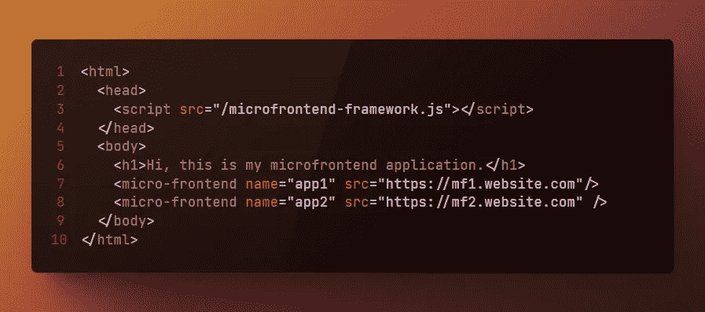
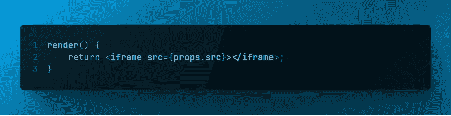

# 微前端及其优势

> 原文：<https://betterprogramming.pub/micro-frontends-and-their-benefits-674cce350ecc>

## 让前端应用变得可管理和独立

来自 [Unsplash](https://unsplash.com/photos/wxWulfjN-G0) 的背景图片。由作者使用来自[多像素](https://www.manypixels.co/gallery)的免费图片编辑

# 动机

如果你关注前端社区有一段时间了，你会注意到很多人关注术语**、【微前端】**。越来越多的解决方案试图支持这种架构方法。它是将一个前端应用程序分割成独立的“微前端应用程序”，这些应用程序可以协同工作。

为什么这么做？

因为这可以帮助您使大型项目更易于管理，并且在从遗留软件解决方案过渡时有所帮助。
在本文中，我想更详细地向您解释什么是微前端，以及它们如何为您带来益处。

# 什么是微前端？

微前端架构是前端软件开发中一种新的架构设计方法。在这种方法中，整个前端应用程序被分割成单独的微前端应用程序，它们一起工作。顾名思义，这个概念的灵感来源于微服务的架构概念。

据[Micro-Frontend.org](https://micro-frontends.org/):

> “微前端背后的想法是将一个网站或网络应用程序视为由独立团队拥有的功能组合。每个团队都有自己关心和擅长的**不同的业务领域**或**任务**。一个团队是**跨职能**并开发其功能**端到端**，从数据库到用户界面。

一些好处是:

*   架构可能变得更容易管理。
*   开发团队可以在一个前端上协作和独立工作。
*   这种方法有助于从旧的应用程序迁移到新的应用程序。
*   独立部署是可能的。
*   明确合同。
*   更容易添加、更改或删除任何代码。
*   更容易测试。

目前，还没有一种明确的方法来实现这种方法。此外，没有框架或库作为首选策略。因此，根据您的需求和限制，有多种方法可以实现它。

## 简洁的外观

使用[https://chalk.ist/](https://chalk.ist/)生成

这里你可以看到一个使用 HTML 标记的例子，展示了这些微前端是如何集成的。布局可以根据您的要求而有所不同。无论它们是被用作导航标题，并排使用，还是像本例中那样，简单地一个放在另一个上面。微前端是框架中用于表示示例实现的定制组件。

微前端组件是做什么的？它只是呈现一个 iframe。

使用[https://chalk.ist/](https://chalk.ist/)生成

# 微前端的 iframe 集成

iframe HTML 元素在微前端的上下文中非常有用，因为它们提供了非常可靠的沙箱行为。
然而，也有一些问题需要考虑:

*   CSS 在 iframe 中是完全独立的。
*   浏览器的后退按钮在保留内部 iframes 的导航状态方面不起作用。
*   对于 iframes 之间的通信，必须查看 CORS 设置，可能需要使用 [postMessage](https://developer.mozilla.org/en-US/docs/Web/API/Window/postMessage) 。
*   需要管理跨子域、iframes 的整个认证。
*   iframes 将需要加载它们各自的脚本等。SSR 可能会满足这个速度限制。

## 无 iframes 嵌入

现在，当谈到包含没有 iframes 的微前端时，也有两种方法:

*   通过标签将它们直接内联到页面的 HTML 中。
*   把他们放在暗影王国。

内联和影子 DOM 方法在 CSS 方面有很大的不同。CSS 将完全封装在影子 DOM 中。在内联的情况下，所有 CSS 将在整个页面中共享。

*注意*——使用 Angular、React 或 Vue 等框架构建的应用程序可能很难完全存在于一个文档中，或者只存在于影子 DOM 中。对于这些，我们可能希望坚持使用 iframes。

微前端服务器将服务于整个 HTML 页面。这下麻烦了！我们不能将`html`、`head`或`body` 标签插入到应用程序中而不破坏东西。

这可以通过使用*模板*标签作为包装器来解决，其中微前端内容由服务器提供。现代浏览器可以解析一个模板标签，而不需要执行它。
在这样做的时候，它们删除了无效的内容，比如`<html>`、`<head>`和`<body>`标签，同时保留了它们的内部内容。所以`<head>`中的`<script>`和`<link>`标签以及`<body>`的内容都被保留了下来。这正是插入应用程序所需要的。

# 如何实现微前端

微前端架构有不同的方式，但以下是主要步骤:

1.  **在您的应用中定义**微前端应用。
2.  **微前端的组成**。
3.  **路由**前端。
4.  **前端之间的通信**

## 1.定义微前端

如何定义你的微前端很重要。你的应用基于逻辑或业务的划分是关键。
您可以使用逻辑责任，如一个团队开发的产品的产品简介或建议视图。在业务方面，您可以基于整个领域逻辑来划分职责。例如市场或新闻页面。

## 2.**微前端的组成**

有几种方法可以组成微前端:

*   **1。在客户机**上:所有的应用程序在初始构建时被组合和捆绑。
*   **2。在服务器**上:加载一个前端容器，所有微前端根据服务器的请求加载。
*   **3。在边缘**:CDN 集合视图。CDN 提供商允许您使用 [Edge Side Includes](https://en.wikipedia.org/wiki/Edge_Side_Includes) (ESI)。

## 3.微前端的路由

路由将取决于您选择的组合类型。
使用服务器端组合，路由通过服务器发生。
使用边缘端组合，CDN 通过定义的包含来组装前端。在客户端组合中，微前端是根据应用程序内部的状态加载的。

## 4.微前端之间的通信

就像路由一样，微前端之间的通信层高度依赖于您选择的组合类型。
目标是向其他微前端发送有关用户交互的消息。
为了确保不同的团队是松散耦合的，并从独立部署中获益，通信需要在前端不知道彼此的层上进行。

1.  **事件总线和事件发射器** —一种方法是使用带有事件总线的共享组件，并将其注入所有微前端。
    另一种方法是使用[定制事件](https://developer.mozilla.org/en-US/docs/Web/Events/Creating_and_triggering_events)。
    这非常灵活，因为有效负载包括事件的标识符和自定义对象。因为这些事件是通过一个公共窗口发送的，所以我们所有的微前端都可以访问它。
2.  **使用 web 存储** —如果我们所有的微前端都在同一个子域内，我们可以通过 cookies、会话和本地存储来存储和访问数据。
3.  **查询字符串** —作为 URL 一部分的查询字符串可用于在微前端中传递和访问数据。这个效率很低。

## 流行的框架

下面是一些创建微前端的流行框架:

1.  [单温泉](https://single-spa.js.org/)
2.  [FrintJS](https://frint.js.org/)
3.  [模块联盟](https://webpack.js.org/concepts/module-federation/)
4.  [位](https://bit.dev/)
5.  [皮拉尔](https://github.com/smapiot/piral)

# 摘要

在本文中，我试图向您展示什么是微前端，以及实现这种架构方法的好处。
然而，微服务也适用同样的规则。

检查您的需求和限制，以及组织的含义是否会对您有益。那么微前端可以是独立和个体前端的有益方法。