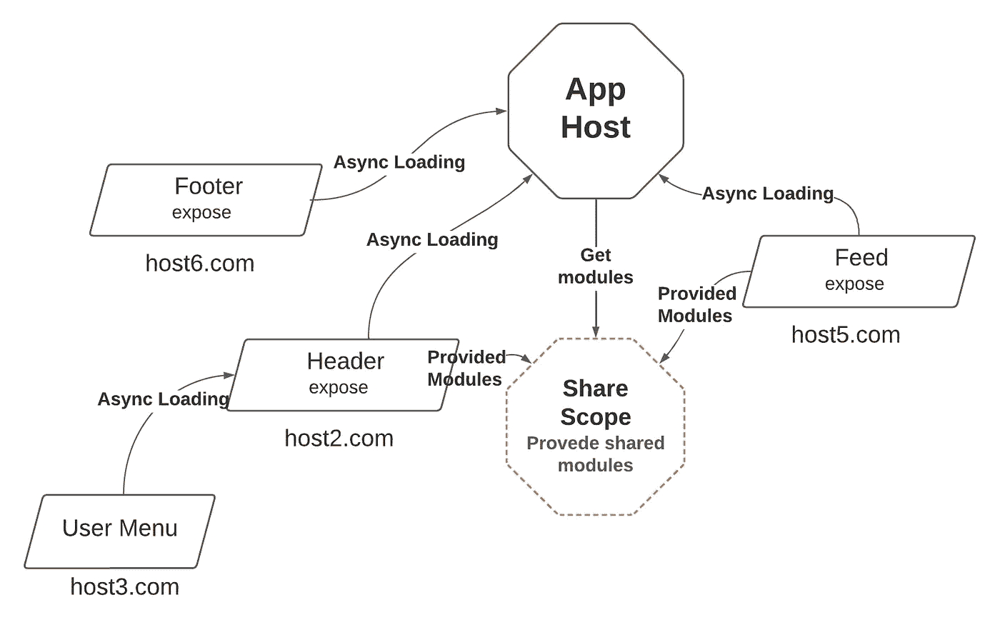
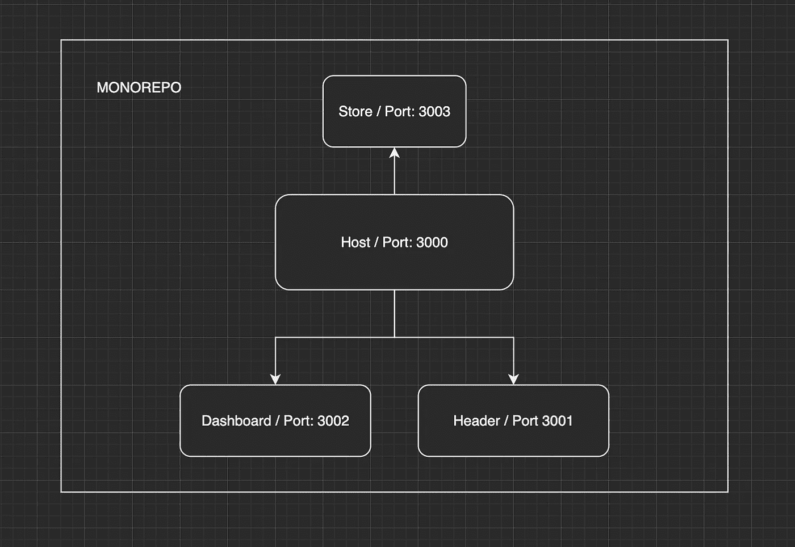
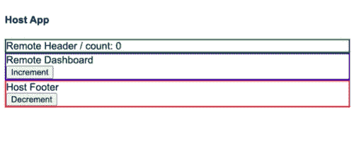

# Monorepo 上的微前端具有远程状态管理功能

> 原文：<https://betterprogramming.pub/micro-frontends-on-monorepo-with-remote-state-management-c8b7c24bc411>

## 创建独立前端项目的指南


感谢图片来自[unsplash.com](https://unsplash.com/)的 [charlesdeluvio](https://unsplash.com/@charlesdeluvio)

几乎每三个企业公司中就有一个需要花费大量精力来开发和支持的大型整体应用程序。许多团队和前端在开发过程中造成许多问题和混乱。连续第二年，代码结构化架构模式——微前端——越来越受欢迎。

在本文中，我们将看到微前端的所有方面，如结构、远程状态管理和模块联合插件的使用。

# 为什么？

*   对于新开发人员来说，非常沉重的可读代码和困难的入口点
*   团队同步和他们之间在同一个项目中的混乱
*   CI/CD 和测试的漫长部署过程
*   团队之间职责划分混乱

# 什么是微前端？

微前端是独立的迷你服务，运行在不同的主机上，组合成一个系统，并通过网络进行通信。每个服务都有自己的主机地址。这种方法给予开发团队自主权。这就像不同的组件被浏览器中组合成一个应用程序的几个服务独立分开。

一个独立的组件比一个整体项目更容易理解。几乎和微服务一样，但是前端有一个通用的`event-loop`，一个通用的`DOM`，`events`，一个全局的`window`对象。

# 模块联盟

这是 Webpack 5 中的功能插件，由 [Zack Jackson](https://twitter.com/ScriptedAlchemy) 和 [Marais Rossouw](https://twitter.com/slightlycode) 在 [Tobias Koppers](https://twitter.com/wsokra?lang=en) 的协助下创建。该插件允许你从主机异步连接共享微前端。模块加载直接发生在运行时。负载可以是静态的或动态的。模块联合可以共享公共依赖关系。例如，已加载的 React 将不会从其他`webpack`应用程序中再次加载。

模块可以独立地部署在不同的主机上，如果一个共享模块已经被修改，就没有必要重新构建主应用程序。通过这个特性，每个微前端可以是一个独立的部署库。

# 术语

主机:这是用户，运行时第一个初始化的包
远程:包，用于导入到主机模块
暴露:可用于导入的输出模块
共享:所有应用程序的通用模块

模块联合的思想是`remotes`有输出`exposes`，微前端使用那些`remotes`条目。在它们之间，共享范围内的模块的公共交换。



Share 作用域提供了不加载某些模块两次的能力。当在 DOM 中打开浏览器时，一个主脚本与`webpack`捆绑导入。这意味着如果放置了一些带有外部组件类名的样式，那么这些样式将会因为公共 DOM 而被应用。

# 应用

我们将在 monorepo 中构建应用程序，它将有一个外部存储作为微前端应用程序、仪表板和标题。他们都将被`host`应用消费掉。



`host`将使用`remote`配置来消耗`store`、`dashboard`和`header`。那些将使用`expose`配置的远程组件是“可消费的”

# 设置

现在我们的任务是将所有微前端整合到一个存储库中。让我们运行`mkdir micro-frontends-demo`并在文件夹内运行`npm init -y`。在`micro-frontends-demo`中创建另一个文件夹`apps`，然后添加到`package.json`中:

mono 包. json

为每个微前端创建四个微前端:`host, header, dashboard` 和`store`在`app`文件夹内，并使用`npx create-mf-app`。对于这些问题，选择以下答案:

1.  选择您的应用程序的名称:`host`、`header`、`dashboard`、`store`(每次运行`npx create-mf-app`时)
2.  项目类型:`Application`
3.  端口号:`3000`、`3001`、`3002`、`3003`
4.  框架:`react`
5.  语言:`javascript`
6.  CSS: `CSS`

最后，您的文件夹结构应该如下所示:

文件夹结构

一旦你得到了一切，我们必须安装所有的软件包，只要我们有 monorepo。你不需要在所有应用中单独安装它们。除了`host`之外，每个微前端将具有几乎相同的结构。只有`App.jsx`会导入我们的远程模块。所以，遥控器将会是:`dashboard`、`header`和`store`。

每个`index.js`都有`import(“./App”);`，异步加载应用程序需要等待`webpack`来获取组件。每个`micro-frontend`都将拥有与`webpack.config.js`几乎相同的配置。我们的每个微前端将位于以下端口:

```
host: 3000 
header: 3001 
dashboard: 3002
store: 3003
```

现在让我们为`webpack.config.js`中的`ModuleFederationPlugin`添加额外的配置。代码如下:

网络包`ModuleFederationPlugin configs for each micro-forntend`

`ModuleFederationPlugin`声明微前端:
`name`是我们微前端的区分。这对`remotes`很重要，因为我们将在主机`container`中使用这些名称。
`filename`编译后的文件类似于`webpack`的输出。
`exposes`可用于其他微前端消费者的组件列表。

`remotes`这是我们在主机上使用的联邦模块。它允许我们使用`import(“header/Header”))` shared:用于在加载组件之间共享模块。

# 成分

是时候设置我们的组件了。让我们转到`apps/header/src`并创建`Header.jsx`，然后在那里添加一段简单的代码:

页眉

在`Header`中，我们将从`store.count`中获取数据。现在让我们转到`apps/dashboard/src`，创建`Dashboard.jsx`，并添加以下内容:

仪表盘

`dashboard`将使用来自`props`的`dispatch`来更新`header`中的`count`。记住，它们都将在不同的港口推出。
`host`应用程序将包含以下内容:

主机应用程序

我们从模块联合插件配置中使用的那些导入，如下所示:

```
import { useStore, StoreProvider } from "store/store";
import RemoteHeader from "header/Header";
import RemoteDashboard from "dashboard/Dashboard";
```

重要的是保持准确的命名，例如:`header/Header`，因为从`src`中暴露头部组件。`App`仅用于演示微前端已经启动:

`ModuleFederationPlugin configs`

`ErrorBoundary`有可能在[的官方文件中找到](https://reactjs.org/docs/error-boundaries.html)的反应。造型部分由你决定。我只是用边框组件突出显示了它。

如您所见，为了便于说明，我们在`header`、`dashboard`中添加了我们的组件。虽然`host`必须消耗所有这些，但在此之前，让我们创建最后一个微前端:一个外部`store`。转到`apps/store/src`并创建`store.jsx`，在那里添加我们的上下文配置:

外部存储配置

我们在`3003`端口运行商店，并在`host`中使用微前端。动作和存储结果委托给`Header`和`Dashboard`。现在让我们在`host`上把所有东西绑在一起。

# 一起跑

是时候一起运行所有四个微前端了。打开`[http://localhost:3003](http://localhost:3003/)`，可以看到有`Name: store`。同样适用于`Header`和`Dashboard`。如何检查曝光模块？

点击`[http://localhost:3002/remoteEntry.js](http://localhost:3002/remoteEntry.js)`按钮，你就会得到清单。还记得`ModuleFederationPlugin`中 config 的部分吗？

```
filename: "remoteEntry.js",
```

`Host`应用程序使用那些遥控器抓取那些组件:

```
remotes: {
  header: 'header@http://localhost:3001/remoteEntry.js',
  dashboard: 'dashboard@http://localhost:3002/remoteEntry.js',
  store: 'store@http://localhost:3003/remoteEntry.js',
}
```

现在，如果您运行从`3000`到`3003`的所有端口，您将看到类似这样的内容(当然，这取决于样式)。



来自微前端的远程存储

通过点击“增量”或“减量”，您将从`localhost:3003`中改变外部存储，该模块已经被异步加载。比如说，在 Dashboard 中，只有当您重新加载页面时，代码更改才会交付给`host`，因为您需要再次加载导入。这就是了。

为了节省时间，我在 monorepo 的每个项目中都使用了`npx`和`create-mf-app`。您可以单独创建每个项目，使用不同的 React 版本，并且只共享需要通用的模块。

# 结论

当然，设置需要一些时间，并且很容易在命名或配置文件中出错。但重要的是要明白，我们创建的每个组件都已经成为一个独立的前端项目。

# 资源

*   GitHub 库:[https://github.com/antonkalik/mfm-boilerplate/tree/main](https://github.com/antonkalik/mfm-boilerplate/tree/main)
*   模块联盟插件:[https://webpack.js.org/concepts/module-federation](https://webpack.js.org/concepts/module-federation/)
*   创建模块联盟应用:[https://github.com/jherr/create-mf-app](https://github.com/jherr/create-mf-app)

```
**Want to Connect?**I will be glad to be in touch through my [Twitter](https://twitter.com/idedycom).It's always a pleasure to receive any suggestions and comments related to the topic. Feel free to ask any questions.
```