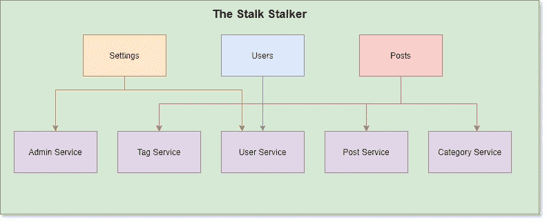
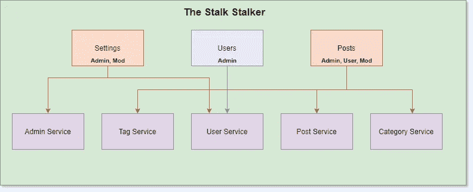
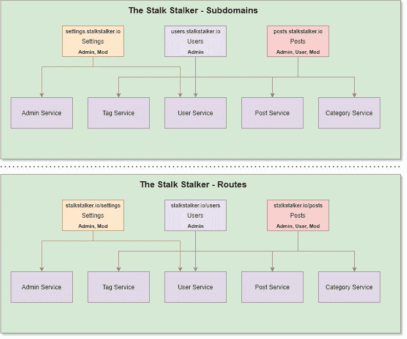

# 微前端、基于角色的应用程序和您

> 原文：<https://betterprogramming.pub/micro-frontends-role-based-applications-and-you-5d6cd8d796eb>

## 将一个安全的、高度可迭代的用户界面整合到你的下一个应用中

paweczerwi ski 在 [Unsplash](https://unsplash.com?utm_source=medium&utm_medium=referral) 上拍摄的照片。

微服务很棒——单责任、特定领域的 API，可以独立迭代。一个主要的 web 应用程序可以由几十到几百甚至几千个这样的小家伙组成。

它们可以独立扩展，让应用团队能够用[最合适的语言](https://medium.com/better-programming/how-to-choose-the-best-programming-language-for-your-new-project-d72b2e586aac)编写代码来完成工作，并在出现故障时给你留下一个小的爆炸半径(这意味着如果一个微服务出现故障，整个应用都不会中断)。

所有的大人物也在这么做。优步有[~ 2200 个微服务](https://eng.uber.com/microservice-architecture/)，网飞有[700 个左右](https://medium.com/refraction-tech-everything/how-netflix-works-the-hugely-simplified-complex-stuff-that-happens-every-time-you-hit-play-3a40c9be254b/)，亚马逊……嗯，亚马逊有很多。

但是，您知道可以将同样的基本原理应用到前端吗？*微*不一定只适用于后端 API。

# 什么是微前端？

微前端遵循与微服务相同的概念，并提供相同的优势。他们把你的大 UI 块分割成小的、孤立的、可独立迭代的块。

*简单的微前端架构*

在最初的构建之后，你的 UI 很有可能比你的后端迭代得更频繁。不管是大是小，你都会经历更多的循环，尽你所能让用户体验最好。

你应该的！

所以把你的前端分成一口大小的块不是很有意义吗？是啊！

现在，我不希望你认为用微前端构建你的应用程序会使用户体验感觉脱节。这不是目标。那是一个反目标。您希望您的应用程序在快速迭代小功能的同时继续保持凝聚力。

如果你正在考虑进入[连续交付](https://medium.com/better-programming/are-you-really-ready-for-ci-cd-9a8bf6d01b8a)，我强烈建议你也考虑进入微前端。交付小的、增量的更新正是这种架构所要做的，有了微前端，您就能让自己做到这一点。

# 基于角色的应用程序

如果你决定进入微前端，恭喜你！你也向自己敞开了一种模式，这种模式将在未来为你省去许多麻烦:*基于角色的应用*。

你会问，什么是基于角色的应用程序？

基于角色的应用程序是由微前端和具有特定安全限制的 API 组成的系统。

我们举个例子。

你是芹菜爱好者论坛的创建者，跟踪者。论坛的架构图如下所示:

在您的论坛中，您有拥有不同权限集的用户。每组定义的权限被称为一个*角色*。你在《跟踪狂》中有四个角色:

*   用户—查看和创建帖子。
*   版主—查看、编辑、创建和删除帖子。
*   管理员—查看、编辑、创建和删除帖子，并管理版主。
*   被禁——什么都没有。

登录您的应用程序的每个人都与一个角色相关联。在你的三个微前端中，你对谁能做什么有明确的界限。因此，您在每个服务上设置了一个限制，将范围限制到特定的角色。

任何具有适当角色的人都可以访问应用程序的这一部分。更重要的是，任何没有允许角色的*都被明确拒绝访问微前端。*

如果你的 API 是公共的，[它完全应该是](https://medium.com/better-programming/you-should-open-up-that-api-youve-been-working-on-b0313a4df9bc)，这些权限也必须在 API 上执行。

# 保护微前端

有许多不同的方法可以增加 web 应用程序和支持 API 的安全性。对于基于角色的应用程序，您必须在授权中包含角色。无论是单独的标题还是幕后查找，您都必须验证用户有权限做他们想做的事情。

在您的微前端中，您需要在任何内容呈现之前验证用户具有与该应用程序相关的角色。这个应用程序很小而且很集中，所以在源代码中用[硬编码允许的角色](https://medium.com/better-programming/new-project-just-hardcode-it-bac72e1a231e)是完全可以的。流程可以简单到登录>查找用户角色>用户拥有角色？>未授权/正常。

该 API 将做一些类似的事情，除了它不应该被绑定到一个登录事件。当进行任何 API 调用时，用户将已经登录。因此，一定要在授权令牌中包含用户的标识信息。类似于 [OAuth 2.0](https://oauth.net/2/) 的东西通过 [JWT (JSON Web Token)](https://jwt.io/) 提供了唯一标识用户所必需的上下文。

向 API 请求添加一个`Role`头将允许您轻松地向应用程序添加安全性测试。今天构建应用程序时，全面彻底的安全测试是必须的。恶意用户会试图利用您的系统，您需要确信您已经正确设置了微前端和 API。

我在[我的 GitHub repo](https://github.com/allenheltondev/postman-security-test-generator/) 中提供了一个 [Postman](https://www.postman.com/) 集合和环境，它将自动测试你的 API 是否有安全漏洞。用这个来帮助确保你有合适的微前端和 [API 设计](https://medium.com/better-programming/api-first-development-build-consistent-meaningful-apis-with-postman-db7d1e9e8b5c)来支持你的应用。

# 访问微前端

提供对你的微前端的访问，真的没有对错之分。我收回那句话。肯定有错误的方式。

让用户访问微前端的两种最常见的方式是通过子域和路由。

这两种模式在互联网上随处可见，如何实现完全取决于您。

如果你热衷于建立 DNS 路由表，子域名可能是你的新朋友。如果你像躲避瘟疫一样避开 DNS 路由，那么路由将是你的选择。无论您选择哪种方法，为您的用户提供无缝体验都是您的主要目标。

# 微观结论

您已经在为您的 API 构建微服务了。继续构建你的单片前端是没有意义的。

分解它，独立迭代，推动小的、增量的变化。你不会因为拼错了一个标签就想重新部署整个前端吧？

将安全性直接构建到您的应用中。定义具有一组已知权限的角色。封锁它。

你作为软件开发人员、经理、产品负责人、质量保证分析师、商业分析师、科技作家等的目标。就是为你的客户制作最好的软件。通过减少停机时间和提高安全性来提供最佳体验。

软件业正以极快的速度发展，而且不会很快放缓。人们对敏捷性、用户体验和安全性的期望达到了前所未有的高度，如果你简单地打破这些期望，你就能跟上。