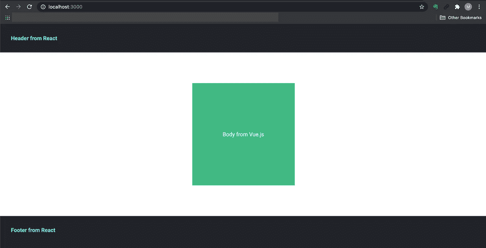
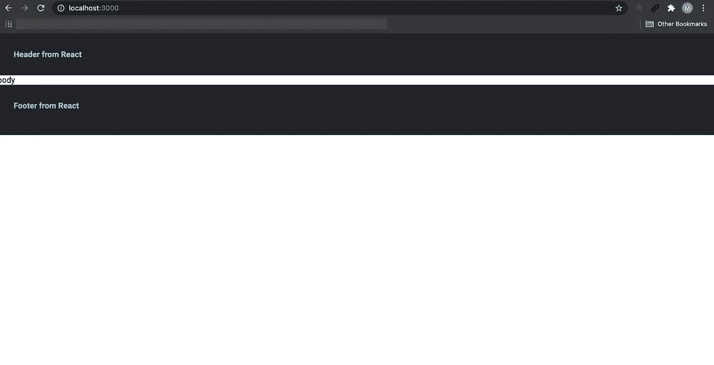

# 使用单 SPA 和模块联合的微前端

> 原文：<https://betterprogramming.pub/micro-frontends-using-single-spa-and-module-federation-81ec27d03aee>

## 让我们一起用微前端构建一个应用程序


作者图片

在本文中，我将带您了解如何在 Webpack 中实现具有单 spa 和模块联合的微前端应用程序。

# 示例存储库

以下是 GitHub 的最终代码:

[](https://github.com/manakuro/micro-frontends-single-spa-module-federation) [## mana kuro/微前端-单 spa-模块-联盟

### 使用单 spa 和模块联合的微前端应用程序-manakuro/微前端-单 spa-模块-联合

github.com](https://github.com/manakuro/micro-frontends-single-spa-module-federation) 

# 内容

*   [微前端](#f212)
*   法国温泉
*   [web pack 中的模块联盟](#a437)
*   [应用概述](#dc4b)

# 微前端

微前端从 2016 年开始出现在前端开发中。简而言之，微前端的想法是将 monolith 应用程序分解成更小的部分，使其更容易维护。

微前端允许您:

*   独立部署
*   在一个地方使用多个 UI 框架(React、Vue.js 和 Angular)
*   从大型代码库中分离出一部分 UI 组件

还有一些缺点，如初始设置的复杂性和由重复代码引起的性能问题，但是单 spa 和模块联合可以解决这些问题

# 单温泉

[single-spa](https://single-spa.js.org/docs/getting-started-overview) 是一个框架，可以让你快速搭建一个微前端 app。

通过抽象整个应用程序的生命周期，single-spa 允许您在同一个页面上使用多个 UI 框架。

它还能够:

*   独立部署
*   执行延迟加载
*   引入新框架，无需对现有应用程序进行任何修改

使用 single-spa，您有两种选择来选择共享依赖关系的生态系统:

*   [导入地图](https://github.com/WICG/import-maps)
*   Webpack 中的模块联合

导入映射的思想是将 JavaScript 导入语句的 URL 映射到库。例如，如果将`moment`导入到代码中，

```
import moment from "moment";
```

您必须向浏览器提供以下地图:

```
<script type="importmap">
{
  "imports": {
    "moment": "/node_modules/moment/src/moment.js"
  }
}
</script>
```

这可以控制导入获取哪些 URL。

有了这个新功能和 webpack externals，可以排除一些库，它将在应用程序中生成没有重复模块的捆绑包。

但是我们不会在我们的应用程序中使用它。相反，我们将利用 Webpack 5 中的新技术。

# Webpack 中的模块联合

[模块联合](https://webpack.js.org/concepts/module-federation/)是在 Webpack 5 中引入的。它的主要目的是在应用程序之间共享代码和库。

通过模块联合，任何 JavaScript 代码——比如业务逻辑或库，以及状态管理代码——都可以在应用程序之间共享。它可以让多个微前端应用程序一起工作，就像你开发一个整体应用程序一样。

您可能想知道微前端和模块联合之间的区别。它们实际上覆盖了很多相同的领域。但是还是有区别的。

微前端的唯一目的是在应用之间共享 UI，而不是 JavaScript 逻辑。因此，捆绑的代码可以包含重复的代码。

模块联合的目的是在应用程序之间共享 JavaScript 代码，而不是 UI。因此，共享代码可以在应用程序中使用。

它们实际上是互补的。因此，通过微前端应用中的模块联合，您可以避免重复的代码，并在整个应用中提供共享的 UI 组件。

# 应用程序概述

到目前为止，我们已经介绍了微前端和模块联合的基本概念。

接下来，我们将通过实现一个简单的演示应用程序来了解它们是如何协同工作的。



演示应用程序

让我们来看一下该应用程序的组成概述:

*   一个处理所有微前端应用程序的家庭应用程序。
*   一个导航应用程序，显示 React 制作的页眉和页脚 UI。
*   一个 body app，展示 Vue.js 做的页面的 body 元素。

# 设置根 package.json

在实现微前端 app 之前，我们在根目录下创建一个 package.json。这三个应用程序作为 monorepo 包含在一个 repo 中，因此我们将使用 [yarn workspaces](https://classic.yarnpkg.com/en/docs/workspaces/) 在整个应用程序中共享一些包。

在根目录下创建一个`package.json`，像这样:

```
{
  "name": "micro-frontend",
  "version": "1.0.0",
  "private": true,
  "workspaces": [
    "packages/*"
  ],
  "scripts": {
    "start": "concurrently \"wsrun --parallel start\""
  },
  "devDependencies": {
    "concurrently": "^5.3.0",
    "wsrun": "^5.2.4",
    "@types/node": "^14.14.17",
    "@typescript-eslint/eslint-plugin": "^4.11.1",
    "@typescript-eslint/parser": "^4.11.1",
    "babel-eslint": "^10.1.0",
    "eslint": "7.16.0",
    "eslint-config-prettier": "^7.1.0",
    "eslint-config-react-app": "^6.0.0",
    "eslint-formatter-friendly": "^7.0.0",
    "eslint-plugin-babel": "^5.3.1",
    "eslint-plugin-flowtype": "5.2.0",
    "eslint-plugin-import": "2.22.1",
    "eslint-plugin-jsx-a11y": "6.4.1",
    "eslint-plugin-prettier": "^3.3.0",
    "eslint-plugin-react": "7.22.0",
    "eslint-plugin-react-hooks": "4.2.0",
    "prettier": "^2.2.1",
    "typescript": "4.1.3",
    "single-spa": "^5.8.3",
    "webpack": "^5.72.0",
    "webpack-cli": "^4.9.2",
    "webpack-dev-server": "^4.8.1",
    "html-webpack-plugin": "^5.5.0"
  }
}
```

然后，安装依赖项。

```
yarn
```

# 一款家庭应用

接下来，我们创建一个 home 应用程序来协调每个微前端应用程序。home 处理呈现 HTML 页面和注册应用程序的 JavaScript 的任务。

让我们来看看家庭结构:

```
├── packages
│   └── home
│       ├── package.json
│       ├── public
│       │   └── index.html
│       ├── src
│       │   └── index.ts
│       ├── tsconfig.json
│       └── webpack.config.js
```

然后，我们逐步创建这些文件。

首先，创建一个`package.json`:

```
{
  "name": "home",
  "scripts": {
    "start": "webpack serve --port 3000",
    "build": "webpack --mode=production"
  },
  "version": "1.0.0",
  "private": true,
  "devDependencies": {
    "@babel/core": "^7.8.6",
    "@babel/preset-typescript": "^7.12.7",
    "babel-loader": "^8.2.2"
  }
}
```

又创造了一个`webpack.config.js`:

```
const HtmlWebpackPlugin = require('html-webpack-plugin')
const ModuleFederationPlugin = require('webpack/lib/container/ModuleFederationPlugin')
const path = require('path')
const outputPath = path.resolve(__dirname, 'dist')

module.exports = {
  entry: './src/index',
  cache: false,

  mode: 'development',
  devtool: 'source-map',

  optimization: {
    minimize: false,
  },

  output: {
    publicPath: 'http://localhost:3000/',
  },

  resolve: {
    extensions: ['.jsx', '.js', '.json', '.ts', '.tsx'],
  },

  devServer: {
    static: {
      directory: outputPath,
    },
  },

  module: {
    rules: [
      {
        test: /\.tsx?$/,
        loader: require.resolve('babel-loader'),
        options: {
          presets: [require.resolve('@babel/preset-typescript')],
        },
      },
    ],
  },

  plugins: [
    new ModuleFederationPlugin({
      name: 'home',
      library: { type: 'var', name: 'home' },
      filename: 'remoteEntry.js',
      remotes: {},
      exposes: {},
      shared: [],
    }),
    new HtmlWebpackPlugin({
      template: './public/index.html',
    }),
  ],
}
```

这是 TypeScipt 的基本配置，但是您可以在 plugins 部分找到导入的模块联邦。

为了理解它是如何工作的，我们将讨论三个基本概念。

## 遥控器

`remotes`字段使用联邦微前端应用程序的名称来消费代码。在这种情况下，主页应用程序将使用导航应用程序和正文应用程序，因此我们需要在`remotes`字段中指定它们的名称，如下所示:

```
remotes: {
  navigation: 'navigation',
  body: 'body',
},
```

当实现一个导航和主体应用程序时，我们将进入更多的细节。

## 暴露

`exposes`字段用于将文件导出到其他应用程序。密钥应该是在其他应用程序中使用的导出名称。例如，如果您从代码中导出组件`Button`,那么可以这样写:

```
exposes: {
  Button: './src/Button',
},
```

## 共享的

这个`shared`是支持导出文件的所有共享依赖项的列表。例如，如果您导出 Vue.js 组件，您必须在共享部分列出`vue`,就像这样:

```
shared: ['vue'],
```

这将防止应用程序包含重复的库，并将在应用程序之间共享单个实例，即使 webpack 编译器是完全独立的。

接下来，我们将创建`public/index.html`:

```
<!DOCTYPE html>
<html lang="en">
<head>
    <link rel="stylesheet" href="https://cdn.rawgit.com/filipelinhares/ress/master/dist/ress.min.css" />
    <link
      rel="stylesheet"
      href="https://fonts.googleapis.com/css?family=Oswald:300,400,500,600,700|Roboto:400,700&display=swap"
    />
  <style>
    html, body {
      scroll-behavior: smooth;
      width: 100%;
      height: 100%;
    }

    body {
      font-family: 'Roboto';
    }

    table {
      border-collapse: collapse;
      border-spacing: 0;
    }

    ul {
      list-style-type: none;
    }

    main > * > * {
      height: 100%;
    }
  </style>
</head>
<body>
<div style="height: 100%; display: flex; flex-direction: column;">
</div>
</body>
</html>
```

并创建一个`src/index.ts`:

```
import { start } from 'single-spa'

start()
```

该文件将用于注册家庭应用中使用的微前端应用。现在，我们只是执行`start`函数来提升应用程序。

# 导航应用程序

现在我们已经设置了 home 应用程序，让我们实现导航应用程序。

导航应用程序的结构如下:

```
├── packages
│   ├── home
│   │   ├── package.json
│   │   ├── public
│   │   │   └── index.html
│   │   ├── src
│   │   │   └── index.ts
│   │   ├── tsconfig.json
│   │   └── webpack.config.js
**│   └── navigation
│       ├── package.json
│       ├── src
│       │   ├── Footer.tsx
│       │   ├── Header.tsx
│       │   └── index.ts
│       ├── tsconfig.json
│       ├── webpack.config.js**
```

我们将把`Footer`和`Header`组件导出到 home 应用程序。

为此，我们首先创建这些文件。创建一个`navigation/package.json`:

```
{
  "name": "navigation",
  "scripts": {
    "start": "webpack serve --port 3001",
    "build": "webpack --mode=production"
  },
  "version": "1.0.0",
  "private": true,
  "devDependencies": {
    "@types/react": "^17.0.0",
    "@types/react-dom": "^17.0.0",
    "@babel/core": "^7.8.6",
    "@babel/preset-react": "^7.12.10",
    "@babel/preset-typescript": "^7.12.7",
    "babel-loader": "^8.2.2",
    "single-spa-react": "^3.2.0"
  },
  "dependencies": {
    "react": "^17.0.1",
    "react-dom": "^17.0.1"
  }
}
```

React 将制作一个导航应用程序，因此安装依赖项并创建一个`navigation/webpack.config.js`:

```
const ModuleFederationPlugin = require('webpack/lib/container/ModuleFederationPlugin')
const path = require('path')
const outputPath = path.resolve(__dirname, 'dist')

module.exports = {
  entry: './src/index',
  cache: false,

  mode: 'development',
  devtool: 'source-map',

  optimization: {
    minimize: false,
  },

  output: {
    publicPath: 'http://localhost:3001/',
  },

  resolve: {
    extensions: ['.jsx', '.js', '.json', '.ts', '.tsx'],
  },

  devServer: {
    static: {
      directory: outputPath,
    },
  },

  module: {
    rules: [
      {
        test: /\.tsx?$/,
        loader: require.resolve('babel-loader'),
        options: {
          presets: [
            require.resolve('@babel/preset-react'),
            require.resolve('@babel/preset-typescript'),
          ],
        },
      },
    ],
  },

  plugins: [
    new ModuleFederationPlugin({
      name: 'navigation',
      library: { type: 'var', name: 'navigation' },
      filename: 'remoteEntry.js',
      remotes: {},
      exposes: {
        './Header': './src/Header',
        './Footer': './src/Footer',
      },
      shared: ['react', 'react-dom', 'single-spa-react'],
    }),
  ],
}
```

检查`publicPath`和`ModuleFederationPlugin`。

`publicPath`是将在主页应用程序中使用的远程 URL 的基本名称。在这种情况下，将在`[http://localshot:3001](http://localshot:3001.)` [提供导航应用。](http://localshot:3001.)

`exposes`字段由两部分组成，`Header`和`Footer`。这会将它们导出到 home 应用程序。

如前所述，我们必须在`shared`部分列出共享库。在这种情况下，我们需要写`react`、`react-dom`和`single-spa-react`。

接下来，创建一个`src/Header.tsx`和`src/Footer.tsx`:

```
import React from 'react'
import ReactDOM from 'react-dom'
import singleSpaReact from 'single-spa-react'

const Header: React.VFC = () => {
  return (
    <header
      style={{
        width: '100%',
        background: '#20232a',
        color: '#61dafb',
        padding: '2rem',
        fontWeight: 'bold',
      }}
    >
      Header from React
    </header>
  )
}

const lifecycles = singleSpaReact({
  React,
  ReactDOM,
  rootComponent: Header,
})

export const bootstrap = lifecycles.bootstrap
export const mount = lifecycles.mount
export const unmount = lifecycles.unmount
```

```
import React from 'react'
import ReactDOM from 'react-dom'
import singleSpaReact from 'single-spa-react'

const Footer: React.VFC = () => {
  return (
    <footer
      style={{
        width: '100%',
        background: '#20232a',
        color: '#61dafb',
        padding: '2rem',
        minHeight: '100px',
        fontWeight: 'bold',
      }}
    >
      Footer from React
    </footer>
  )
}

const lifecycles = singleSpaReact({
  React,
  ReactDOM,
  rootComponent: Footer,
})

export const bootstrap = lifecycles.bootstrap
export const mount = lifecycles.mount
export const unmount = lifecycles.unmount
```

# 注册导航应用程序

现在我们准备开始导出导航应用程序。

接下来，我们在 home 应用中注册它。要注册微前端应用程序，需要以下步骤:

*   包括脚本标签
*   远程列表
*   添加注册
*   包括一个容器`div`

让我们来完成这些步骤。

## 包括脚本标签

首先，要使用导航应用程序的代码，我们必须将它包含在 HTML 文件中。

转到`home/public/index.html`并包含脚本标签。

```
<!DOCTYPE html>
<html lang="en">
<head>
+     <script src="http://localhost:3001/remoteEntry.js"></script>
</head>
```

如前所述，某导航 app 的`publicPath`为`http://localhost:3001`，文件名为`remoteEntry.js`。

## 远程列表

接下来，转到`home/webpack.config.js`并指定遥控器部分:

```
remotes: {
+   'home-nav': 'navigation',
},
```

`navigation`是`navigation/webpack.config.js`中配置的名称:

```
plugins: [
  new ModuleFederationPlugin({
+   name: 'navigation',
    library: { type: 'var', name: 'navigation' },
    filename: 'remoteEntry.js',
    remotes: {},
    exposes: {
      './Header: './src/Header',
      './Footer': './src/Footer',
    },
    shared: ['react', 'react-dom', 'single-spa-react'],
  }),
],
```

`home-nav`是 home 应用程序中使用的名称。

您可以通过将密钥更改为您想要的名称来更改导入的名称。

## 添加注册

接下来，我们在`home/src/index.ts`中注册导航 app:

```
import { registerApplication, start } from 'single-spa'

registerApplication(
  'header',
  // @ts-ignore
  () => import('home-nav/Header'),
  (location) => location.pathname.startsWith('/'),
)

registerApplication(
  'footer',
  // @ts-ignore
  () => import('home-nav/Footer'),
  (location) => location.pathname.startsWith('/'),
)

start()
```

`registerApplication`需要三样东西:

*   应用程序名称
*   加载应用程序代码的函数
*   确定应用程序何时活动或不活动的功能

如上所述，导入函数指定了`remotes`键的名称。

```
() => import('home-nav/Header'),
```

## 包括一个容器 div

最后，我们编写一个用于包含`Header`和`Footer`组件的`div`容器。

转到`home/public/index.html`并添加它们:

```
<body>
<div style="height: 100%; display: flex; flex-direction: column;">
  <div id="single-spa-application:header"></div>
  <main>
    body
  </main>
  <div id="single-spa-application:footer"></div>
</div>
</body>
```

默认情况下，没有选项，single-spa 将查找`single-spa-application:{app name}`并呈现下面的 HTML。

在这种情况下，我们已经将`Header`和`Footer`注册为`header`和`footer`，因此它将找到`single-spa-application:header`和`single-spa-application:footer`的 id。

让我们试试这个。

在此之前，请确保安装依赖项:

```
yarn
```

并在根目录下启动服务器:

```
yarn start
```

因此，导航到 [http://localhost:3000](http://localhost:3000,) ，您将发现两个 React 组件成功呈现。



看起来效果不错。

# 身体应用程序

接下来，我们将创建一个 body 应用程序。Vue.js 将制作一个 body 应用程序，但实现过程与导航应用程序几乎相同。

让我们快点做它。

body app 的结构是:

```
├── packages
│   ├── body
│   │   ├── package.json
│   │   ├── src
│   │   │   ├── App.vue
│   │   │   ├── app.js
│   │   │   └── index.js
│   │   ├── tsconfig.json
│   │   └── webpack.config.js
```

创建一个`body/package.json`:

```
{
  "name": "body",
  "scripts": {
    "start": "webpack serve --port 3002",
    "build": "webpack --mode=production"
  },
  "version": "1.0.0",
  "private": true,
  "devDependencies": {
    "vue-loader": "16.0.0-beta.7",
    "@babel/core": "^7.8.6",
    "@babel/preset-env": "^7.10.3",
    "@vue/compiler-sfc": "^3.0.0-rc.10",
    "babel-loader": "^8.2.2",
    "css-loader": "^3.5.3",
    "postcss-loader": "^4.1.0",
    "style-loader": "2.0.0",
    "node-sass": "^5.0.0",
    "vue-style-loader": "^4.1.2",
    "sass-loader": "^10.1.0"
  },
  "dependencies": {
    "autoprefixer": "^10.1.0",
    "postcss": "^8.2.1",
    "vue": "^3.0.0",
    "single-spa-vue": "^2.1.0"
  }
}
```

并创建一个`body/webpack.config.js`:

```
const ModuleFederationPlugin = require('webpack/lib/container/ModuleFederationPlugin')
const path = require('path')
const outputPath = path.resolve(__dirname, 'dist')
const { VueLoaderPlugin } = require('vue-loader')

module.exports = {
  entry: './src/index',
  cache: false,

  mode: 'development',
  devtool: 'source-map',

  optimization: {
    minimize: false,
  },

  output: {
    publicPath: 'http://localhost:3002/',
  },

  resolve: {
    extensions: ['.jsx', '.js', '.json', '.ts', '.tsx', '.vue'],
  },

  devServer: {
    static: {
      directory: outputPath,
    },
  },

  module: {
    rules: [
      {
        test: /\.s[ac]ss$/i,
        use: [
          'vue-style-loader',
          'style-loader',
          'css-loader',
          'postcss-loader',
          'sass-loader',
        ],
      },
      {
        test: /\.vue$/,
        loader: 'vue-loader',
      },
      {
        test: /\.js$/,
        loader: 'babel-loader',
      },
      {
        test: /\.tsx?$/,
        loader: 'ts-loader',
        options: {
          appendTsSuffixTo: [/\.vue$/],
        },
        exclude: /node_modules/,
      },
    ],
  },

  plugins: [
    new VueLoaderPlugin(),
    new ModuleFederationPlugin({
      name: 'body',
      library: { type: 'var', name: 'body' },
      filename: 'remoteEntry.js',
      remotes: {},
      exposes: {
        Body: './src/app',
      },
      shared: ['vue', 'single-spa', 'single-spa-vue'],
    }),
  ],
}
```

创建一个`body/src/App.vue`和`body/src/app.js`:

```
<template>
  <div class="body">
    <div class="inner">
      Body from Vue.js
    </div>
  </div>
</template>

<style scoped lang="scss">
  .body {
    height: 100%;
    display: flex;
    justify-content: center;
    align-items: center;
  }

  .inner {
    width: 300px;
    height: 300px;
    display: flex;
    justify-content: center;
    align-items: center;
    background: #42b983;
    color: #ffffff;
  }
</style>
```

```
import singleSpaVue from 'single-spa-vue'
import { h, createApp } from 'vue'
import App from './App.vue'

const lifecycles = singleSpaVue({
  createApp,
  appOptions: {
    render() {
      return h(App, {
        props: {
          // single-spa props are available on the "this" object. Forward them to your component as needed.
          // https://single-spa.js.org/docs/building-applications#lifecyle-props
          name: this.name,
          mountParcel: this.mountParcel,
          singleSpa: this.singleSpa,
        },
      })
    },
  },
})

export const bootstrap = lifecycles.bootstrap
export const mount = lifecycles.mount
export const unmount = lifecycles.unmount
```

# 注册身体应用程序

接下来，我们将在 home 应用程序中注册身体，就像我们之前为导航所做的那样。

转到`home/public/index.html`并添加一个脚本标签:

```
<head>
    <script src="http://localhost:3001/remoteEntry.js"></script>
+   <script src="http://localhost:3002/remoteEntry.js"></script>
</head>
```

然后去`home/webpack.config.js`添加`home-body`:

```
remotes: {
  'home-nav': 'navigation',
+ 'home-body': 'body',
},
```

然后，转到`home/src/index.ts`进行注册:

```
import { registerApplication, start } from 'single-spa'

registerApplication(
  'header',
  // @ts-ignore
  () => import('home-nav/Header'),
  (location) => location.pathname.startsWith('/'),
)

registerApplication(
  'footer',
  // @ts-ignore
  () => import('home-nav/Footer'),
  (location) => location.pathname.startsWith('/'),
)

registerApplication(
  'body',
  // @ts-ignore
  () => import('home-body/Body'),
  (location) => location.pathname.startsWith('/'),
)

start()
```

最后，在`home/public/index.html`中添加一个`div`容器:

```
<body>
<div style="height: 100%; display: flex; flex-direction: column;">
  <div id="single-spa-application:header"></div>
  <main style="display: flex; flex: 1;">
    <div id="single-spa-application:body" style="width: 100%"></div>
  </main>
  <div id="single-spa-application:footer"></div>
</div>
</body>
```

让我们来测试一下。

运行安装依赖项:

```
yarn
```

并在根目录下启动服务器:

```
yarn start
```

导航到 [http://localhost:3000](http://localhost:3000,) :


太好了——您可以看到 Vue 组件被成功渲染。

# 结论

在本文中，我们介绍了如何使用 Webpack 中的单个 SPA 和模块联合来实现微前端应用程序。

微前端在灵活性、可扩展性和可维护性方面有利于团队开发，尤其是大型团队，因为它为您提供了独立部署、混合框架的使用和关注点的分离。

虽然也有不好的一面，比如配置复杂，学习成本高，但是我认为上面说的优点大于缺点。

我希望这篇文章能让你对微前端感兴趣！

[](https://github.com/manakuro/micro-frontends-single-spa-module-federation) [## mana kuro/微前端-单 spa-模块-联盟

### 使用单 spa 和模块联合的微前端应用程序—manakuro/微前端—单 spa—模块联合

github.com](https://github.com/manakuro/micro-frontends-single-spa-module-federation)