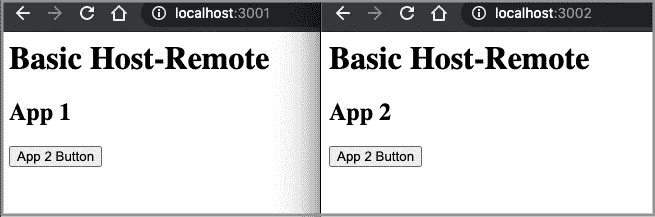
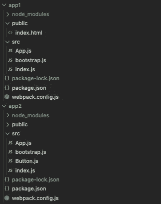
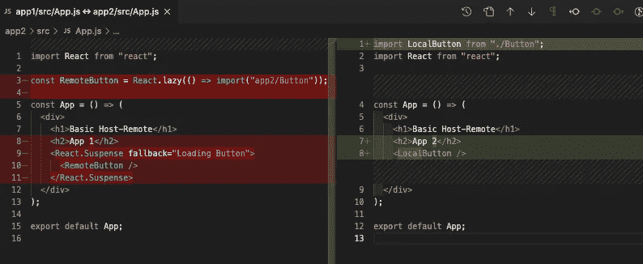
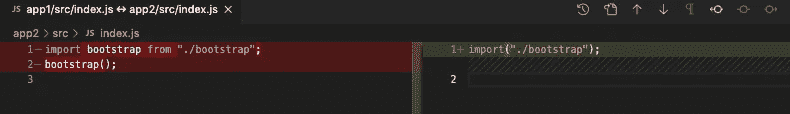
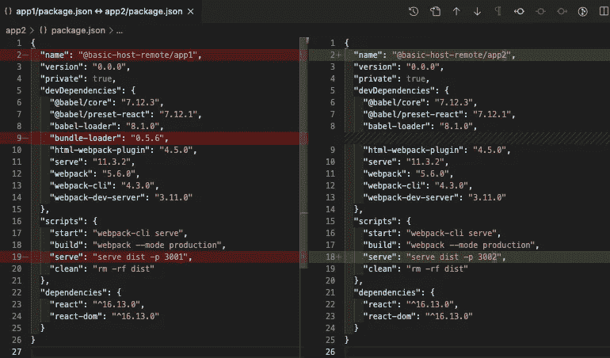
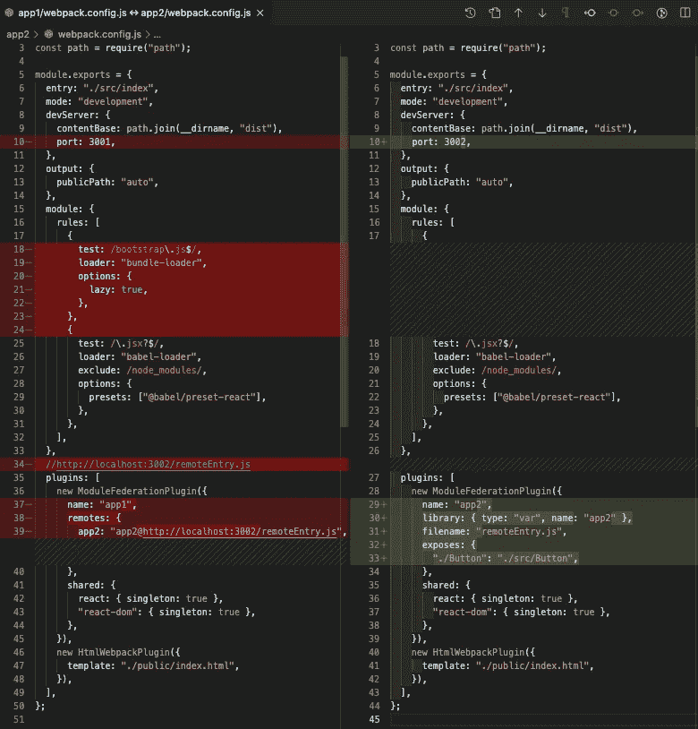
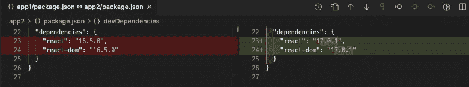
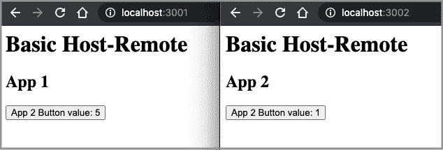

# 使用 Webpack 5 模块联合的微前端

> 原文：<https://betterprogramming.pub/micro-frontends-using-webpack-5-module-federation-3b97ffb22a0d>

## 针对微前端的 Webpack 5 模块联合的深入指南


图片来源:作者

Webpack 是一个成熟的静态模块捆绑器，适用于现代 JavaScript 应用程序。它在 GitHub 上有超过 57k 颗星，每周从 [npm](https://medium.com/better-programming/the-step-by-step-guide-to-understanding-and-adopting-npm-7-914504f7090f) 注册表下载超过 1300 万次。它于 2020 年 10 月 10 日发布了第 5 版，带来了多项变化:

*   通过持久缓存提高构建性能。
*   通过更好的算法和默认值改进了长期缓存。
*   通过更好的树抖动和代码生成改进了包的大小。

最重要的是，Webpack 5 有一个新特性，[模块联合](https://webpack.js.org/concepts/module-federation/)，它允许多个 Webpack 构建一起工作。一个应用程序可以在客户机和服务器上动态运行来自另一个包或构建的代码。这是[微前端](https://medium.com/better-programming/10-decision-points-for-micro-frontends-approach-4ebb4b59f40)的基础。

每个 webpack 构建都可以是一个主机，主机是加载其他构建的容器。它也可以作为一个远程，这是一个微前端加载。每个应用程序都可以是一个远程主机，也可以是系统中任何其他联合模块的消费者。双向主机，甚至全向主机，都可以通过 webpack 配置轻松设置。

此外，模块联合不需要加载主入口点或另一个完整的应用程序。它只需要加载所需的代码，即几千字节的代码**。**这种方法适用于任何 JavaScript 代码，无需共享实用程序和组件的冗余包。

# 模块联合示例

Webpack 以其复杂性和陡峭的学习曲线而闻名。这是[官网](https://webpack.js.org/concepts/module-federation/)在说模块联邦。

这一页并不长，但我们花了一些时间来理解这些概念。

幸运的是，webpack 还提供了很多例子，比如[模块联合范例库](https://github.com/module-federation/module-federation-examples)，它展示了如何使用模块联合。我们将仔细看看[基本单向示例](https://github.com/module-federation/module-federation-examples/blob/master/basic-host-remote/README.md)来理解概念和关键插件`ModuleFederationPlugin`。Webpack 应用插件来配置功能。

这些示例可以通过以下命令安装:

```
git clone https://github.com/module-federation/module-federation-examples.git
```

有 20 多个例子，涵盖了用 React、Angular 和 Vue 编写的应用程序。

基本单向示例位于`module-federation-examples/basic-host-remote`。此示例显示了加载远程组件的基本宿主应用程序。

*   `app1`是一个主机应用程序，它从远程应用程序`app2`加载`Button`组件。
*   `app2`是一个远程独立应用程序，它公开了`Button`组件。



# 模块文件夹

局部模块是普通模块，是当前版本的一部分。远程模块是不属于当前构建的模块，它在运行时从所谓的容器中加载。

在这个简单的例子中，`app1`是一个普通模块，`app2`是一个远程模块。以下是文件夹结构。



`app1`和`app2`几乎相同，除了`app2`有`src/Button.js`。该文件将在`app2`中作为本地按钮使用，并在`app1`中作为远程按钮加载。

# 模块代码

我们将逐一检查`app1`和`app2`中的模块代码。

## src/App.js

`src/App.js`是呈现两个标题和一个按钮的 React 代码。



左侧(`app1`)动态加载第 3 行的 remote 按钮，该按钮在第 9–11 行的`<Suspense>`中包装。

右侧(`app2`)静态加载第 1 行的本地按钮，放在第 8 行。

## src/boots . js

这是`src/bootstrap.js`，与`app1`和`app2`相同。

第 5 行将`App`呈现给 id 为`root`的元素。

## src/index.js

这是`src/index.js`，它调用`bootstrap`。



左侧(`app1`)静态导入第 1 行的代码，并在第 2 行执行。

右侧(`app2`)动态导入`bootstrap`代码。

两种方式的工作原理相似；它们[异步加载初始块](https://webpack.js.org/concepts/module-federation/#troubleshooting)中的共享模块。

在`app2`中使用[动态导入](https://medium.com/better-programming/dynamic-import-code-splitting-lazy-loading-and-error-boundaries-fff57e63f6c4)方式更容易。

为了使`app1`中的方法起作用，它需要三个步骤:

1.  配置`webpack.config.js`中的规则，以便在需要包时请求块。

3.进行`bootstrap()`调用，它将一直等到块可用。

## src/Button.js

`src/Button.js`仅存在于`app2`中，由`app1`和`app2`共同使用。

## public/index.html

这是`public/index.html`，对于`app1`和`app2`是一样的。

## src/package.json

这是`src/package.json`，它为模块配置包。



左侧(`app1` ) `devDependencies`包括第 9 行的`bundle-loader`。

左侧(`app1`)在端口 3001 运行生产构建(第 19 行)。

右侧(`app2`)在端口 3002 运行生产构建(第 18 行)。

双方都将 React 版本设置为`^16.13.0`。

## src/webpack.config.js

这是`src/webpack.config.js`，包含模块联合的关键配置。



双方在第 6 行将`entry`定义为`./src/index`。

左侧(`app1`)在端口 3001 启动 dev 服务器(第 10 行)。

右侧(`app2`)在端口 3002 启动 dev 服务器(第 10 行)。

左侧(`app1`)为`bootstrap.js` 配置`bundle-loader`规则(第 17-23 行)。`app2`不需要这个。

左侧(`app1`)配置如何加载远程组件(第 34–49 行)。关键插件是`ModuleFederationPlugin`，它将以下设置定义为主机 app:

*   `name`:定义容器名`app1`。
*   `remotes`:定义`app2@http://localhost:3002/remoteEntry.js`上的远程 app`app2`。
*   `shared`:定义模块在共享范围内如何共享。这里的模块是`react`和`react-dom`。仅允许共享模块的单一版本(`{ singleton: false }`)。

右侧(`app2`)配置如何暴露远程组件(第 27–44 行)。关键插件是`ModuleFederationPlugin`，它将以下设置定义为远程应用:

*   `name`:定义了容器名`app2`。
*   `library.type`:定义库类型，`var`。可用选项有`var`、`module`、`assign`、`this`、`window`、`self`、`global`、`commonjs`、`commonjs2`、`commonjs-module`、`amd`、`amd-require`、`umd`、`umd2`、`jsonp`、`system`。
*   `library.name`:定义了库名`app2`。
*   `filename`:使用`output.path`目录内的相对路径定义暴露的文件名`remoteEntry.js`。
*   `exposes`:定义要暴露的模块。`app2`从`./src/Button`曝光`./Button`。
*   `shared`:定义模块在共享范围内如何共享。这里的模块是`react`和`react-dom`。只允许共享模块的单一版本(`{ singleton: false }`)。

以下是`SharedConfig`的界面:

# 运行基本单向示例

我们已经检查了所有的文件。让我们运行它。

*   第一步:在`module-federation-examples/basic-host-remote/app2`目录下，执行`npm start`。在`http://localhost:3002`处验证其是否开启。
*   第二步:在`module-federation-examples/basic-host-remote/app1`目录下，执行`npm start`。在`http://localhost:3001`处验证其是否开启。

你可能想知道为什么我们先开始`app2`。是因为`app1`依赖于`app2`。

如果我们先开始`app1`呢？

我们将在`http://localhost:3001.`上看到以下错误

```
Uncaught (in promise) TypeError: react__WEBPACK_IMPORTED_MODULE_0___default(...).lazy is not a function
    at eval (App.js:8)
    at Module../src/App.js (node_modules_babel-loader_lib_index_js_ruleSet_1_rules_1_src_bootstrap_js.js:22)
    at __webpack_require__ (main.js:514)
    at eval (bootstrap.js?./node_modules/babel-loader/lib/index.js??ruleSet[1].rules[1]:6)
    at Module../node_modules/babel-loader/lib/index.js??ruleSet[1].rules[1]!./src/bootstrap.js (node_modules_babel-loader_lib_index_js_ruleSet_1_rules_1_src_bootstrap_js.js:36)
    at __webpack_require__ (main.js:514)
    at eval (bootstrap.js:3)
```

嗯，它还是可以修复的。在`app2`开始后，我们需要刷新`http://localhost:3001`。这是双向模块的工作方式:启动两个应用程序，然后访问网页。

正如所料，基本单向示例显示了加载远程组件的基本宿主应用程序。

# 基本示例变化

对于基本示例，`app1`和`app2`都使用 React `^16.13.0`。我们将`app1`改为使用 React `16.5.0`，它不支持延迟加载。`app2`改为反应`17.0.1`。这些变化是在`src/package.json`中做出的。



React `16.5.0`也不支持钩子。为了更有趣，我们还在`src/Button.js`中加了一个钩子。

虽然`app1`的 React `16.5.0`不支持延迟加载和钩子，但它能正确显示`app2`的钩子按钮。单击该按钮时，该值会增加。这两个应用程序独立工作。



因为`app1`使用了来自`app2`的编译代码，所以这个例子是可行的。但是，控制台上有一个警告:

```
Unsatisfied version 17.0.1 of shared singleton module react-dom (required =16.5.0)
```

如果我们在`src/webpack.config.js`中改变两个应用的`shared`设置会怎么样？

```
shared: {
  react: { singleton: false },
  "react-dom": { singleton: false },
}
```

重启两个应用程序，`app1`在`http://localhost:3001`崩溃:

```
Uncaught (in promise) TypeError: react__WEBPACK_IMPORTED_MODULE_0___default(...).lazy is not a function
    at eval (App.js:8)
    at Module../src/App.js (node_modules_babel-loader_lib_index_js_ruleSet_1_rules_1_src_bootstrap_js.js:22)
    at __webpack_require__ (main.js:514)
    at eval (bootstrap.js?./node_modules/babel-loader/lib/index.js??ruleSet[1].rules[1]:6)
    at Module../node_modules/babel-loader/lib/index.js??ruleSet[1].rules[1]!./src/bootstrap.js (node_modules_babel-loader_lib_index_js_ruleSet_1_rules_1_src_bootstrap_js.js:36)
    at __webpack_require__ (main.js:514)
    at eval (bootstrap.js:3)
```

如果我们把`app1`改成使用 React `16.6.0`，支持延迟加载，会怎么样？

重启`app1`，不抛出懒加载错误。相反，它在钩子调用时抛出一个错误:

```
Uncaught Error: Invalid hook call. Hooks can only be called inside of the body of a function component. This could happen for one of the following reasons:
1\. You might have mismatching versions of React and the renderer (such as React DOM)
2\. You might be breaking the Rules of Hooks
3\. You might have more than one copy of React in the same app
See [https://reactjs.org/link/invalid-hook-call](https://reactjs.org/link/invalid-hook-call) for tips about how to debug and fix this problem.
    at resolveDispatcher (react.development.js:1476)
    at useState (react.development.js:1507)
    at Button (Button.js:10)
    at updateFunctionComponent (react-dom.development.js:13644)
    at mountLazyComponent (react-dom.development.js:13903)
    at beginWork (react-dom.development.js:14475)
    at performUnitOfWork (react-dom.development.js:17014)
    at workLoop (react-dom.development.js:17054)
    at HTMLUnknownElement.callCallback (react-dom.development.js:149)
    at Object.invokeGuardedCallbackDev (react-dom.development.js:199)
```

如果我们把`app1`换成支持钩子的 React `16.8.0`会怎么样？

重启`app1`，抛出同样的错误。

如果我们把`app1`改成使用 React `17.0.1`会怎么样？

重启`app1`，无错误无警告。

当`package.json`或`webpack.config.js`被修改时，建议重启应用程序。保持两个应用程序设置同步也是一个好主意。

# 结论

凭借 Webpack 5 的强大功能和便利性，模块联合为微前端提供了一种有前途的方法。

我们对 Webpack 5 的模块联盟感到兴奋。你呢？

感谢阅读。我希望这有所帮助。你可以在这里看到我的其他媒体出版物。