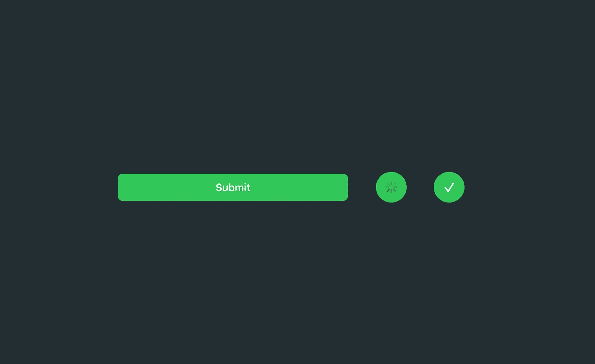
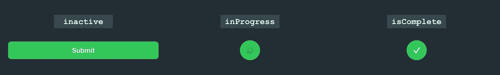
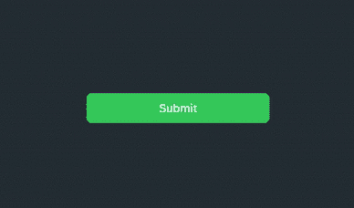

# SwiftUI 中的微交互:异步按钮

> 原文：<https://betterprogramming.pub/micro-interactions-async-button-279a37c4f41e>

## 关于为你的应用程序创建异步按钮微交互的 SwiftUI 教程

作者照片。

欢迎回来！本周的文章涵盖了我为自己的应用程序制作的各种 SwiftUI 微交互。这些交互带来的好处确实有助于让你的应用感觉更好，更容易使用。

今天的微交互教程是关于为异步任务创建一个自定义按钮，比如下载、发送或加载数据。

# 创建异步按钮

在开始编程之前，我们先来解释一下`AsyncButton`的不同状态:

*   `inactive` —用户尚未启动异步任务。
*   `inProgress` —主动处理异步任务。
*   `isComplete` —异步任务完成。

在每个状态期间，`AsyncButton`将显示不同的`View`来描述异步任务:

# 入门指南

下面是我们的`AsyncButton`的模板，它包含了上述状态的属性。我们将重点关注不同状态的视图编程。如果你对`init`函数如何工作或者`@ViewBuilder`是什么感到好奇，那么我鼓励你去看看 [Majid Jabrayilov](https://twitter.com/mecid) 关于[swift ui](https://swiftwithmajid.com/2019/12/18/the-power-of-viewbuilder-in-swiftui/)中属性包装器`[@ViewBuilder](https://swiftwithmajid.com/2019/12/18/the-power-of-viewbuilder-in-swiftui/)`的力量的文章。

# 编程不同的视图状态

在`label:`闭包内，我们将利用`VStack`对所有不同的状态视图进行分组。我专门选择了一个`VStack`来制作`AsyncButton`状态变化的动画。如果我们将堆栈的对齐方式设置为`.center`，那么新的视图将从按钮的中心开始显示，看起来就像按钮在调整自己的大小。

随着按钮状态的改变，我们返回不同的视图，如`ProgressView`、`Image`和`content`，这些视图是在实例化时提供的。

# 更新按钮状态

当用户点击`AsyncButton`时，我们希望确保我们做了两件事:

*   调用开发人员在实例化过程中传递的动作闭包。
*   通过更新`inProgress`属性来更新`AsyncButton`的状态。

# 添加样式

下面，我给`AsyncButton`添加了一些样式，但我鼓励你尝试并修改它以适应你的应用的主题或风格:

# 使用异步按钮

这个例子展示了如何使用我们完整的`AsyncButton`创建一个基本的提交按钮:

感谢阅读！