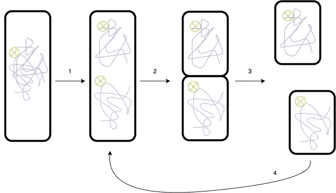

# 微服务:控制过渡

> 原文：<https://betterprogramming.pub/micro-services-keep-the-transition-under-control-f3c3d565940a>

## 从整块业务转向微观服务往往是人们所期望的，但许多人放弃了。你如何保证这种转变不被困难淹没？

罗斯·斯奈登在 [Unsplash](https://unsplash.com?utm_source=medium&utm_medium=referral) 上的照片

由于意大利面条式的代码不再可维护，一些团队已经开始将他们的整体分割成微服务。

其他团队选择开始一个新的项目，因为这是避免陷入整体陷阱的最佳方式。

在这两种情况下，他们都深受其害，看不到微服务架构的好处。

我们会找出原因的。

[Towfiqu barbhuiya](https://unsplash.com/@towfiqu999999?utm_source=medium&utm_medium=referral) 在 [Unsplash](https://unsplash.com?utm_source=medium&utm_medium=referral) 上拍照

## 微服务增加了所有级别的复杂性

它引入了中间序列化/反序列化和数据复制，维护起来有些繁琐。

必须为集成选择每对交互模块之间的向后兼容性和测试策略。

服务应该可以独立部署，有自己的版本和发布周期。

为了进行调试，有必要能够跟踪多个服务。

但他们还不是最差的。

## 拆分应用程序很困难

好的拆分不仅仅是技术上的拆分。它依赖于产品，所以没有神奇的公式。

很多时候，界限是模糊的。微服务并不都是一样的大小。有大的也有小的。

当分割太小时，我们在各个层面都要付出很高的代价，而回头是艰难的。我们正在寻找一个相关的和持久的分裂。

让我们来看看在向面向服务的架构过渡的过程中最常见的障碍。

兰迪·雷伯恩在 [Unsplash](https://unsplash.com?utm_source=medium&utm_medium=referral) 上拍摄的照片

## 要避免的陷阱

*   被小边缘部分分开。这不是很吸引人:痛苦多于有用
*   对所有服务进行同步发布/部署。这意味着开发周期总是相互关联的，因此很慢。
*   过度设计基础设施。过度复杂会拖团队的后腿。
*   从没有这方面的经验开始。决策会更加困难。

## 不需要微服务

正如我们已经看到的，它不是“免费的”。要建立和维护这个系统，你需要知识和人员。

它是大型产品和大型组织的大规模解决方案。

谢天谢地，这不是唯一的选择。最好选择适合您的产品和组织的替代方案。

照片由[上的](https://unsplash.com/@burst?utm_source=medium&utm_medium=referral)爆裂[未爆裂](https://unsplash.com?utm_source=medium&utm_medium=referral)

## 替代方案:宏观服务

带有“a”的宏服务与微服务具有相同的属性，但更大。

宏服务的优点是最小化微服务的一些困难，如依赖、分离堆栈跟踪等。

这使得逐步走向面向服务的架构成为可能。宏观服务的规模和数量将取决于您的需求和人员配备。

很好，但是你如何从一个整体到宏观服务？

## 二进制除法

这是一个简单的迭代和增量策略。事情是这样的:

1.  将代码分成大小大致相等的两部分。如有必要，复制代码。
2.  为每个部件制作不同的容器，以获得两个宏服务。
3.  调整基础设施和组织
4.  一旦稳定，重复其中一个宏服务。

目标是将新的架构部署到生产中，以验证一个部门。它允许调整解决方案(路由、依赖、测试、日志、部署、版本等)。)再做新的划分。

# 外卖食品

通过调整技术和组织方面来实现逐步转型是至关重要的。

不要低估面向服务架构的复杂性。成功的最佳方式是整合了解该主题的人员。