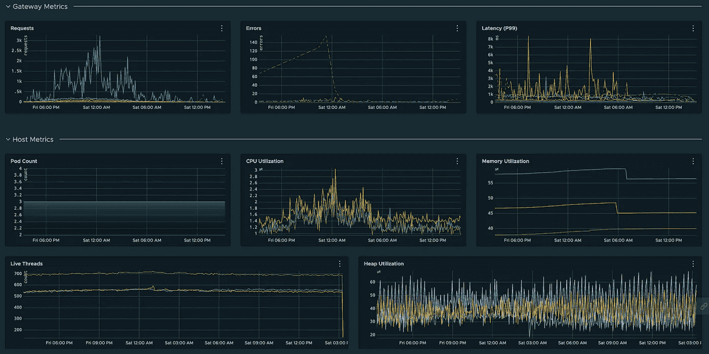

# 微服务可观察性—指标

> 原文：<https://betterprogramming.pub/microservice-observability-metrics-bd9be270bc62>

## 密切关注让你对软件充满信心的信号


在我之前的[文章](https://medium.com/@theawesomenayak/microservice-observability-logging-2be535385616)中，我谈到了日志的重要性以及结构化和非结构化日志之间的区别。日志很容易集成到您的应用程序中，并且能够以字符串的形式表示任何类型的数据。

另一方面，度量是数据的数字表示。这些通常用于计算或测量一个值，并在一段时间内进行汇总。指标让我们深入了解系统的历史和当前状态。因为它们只是数字，所以也可以用来进行统计分析和预测系统的未来行为。指标还用于触发警报，并通知您系统行为中的问题。

# 日志与指标

## 格式

日志表示为字符串。它们可以是简单的文本、JSON 有效负载或键值对(就像我们在结构化日志中讨论的那样)。

指标用数字表示。他们测量一些东西(如 CPU 使用率、错误数量等。)并且本质上是数字。

## 解决

日志包含高分辨率数据。这包括关于事件的完整信息，可用于关联事件通过系统的流程(或路径)。如果出现错误，日志包含异常的整个堆栈跟踪，这允许我们查看和调试来自下游系统的问题。简而言之，日志可以告诉你*在某个时间系统中发生了什么*。

指标包含低分辨率数据。这可能包括参数计数(如请求、错误等。)和资源的度量(如 CPU 和内存利用率)。简而言之，指标可以给你*在某个时间系统中发生的事情的数量*。

## 费用

存储日志的成本很高。日志的存储开销也会随着时间的推移而增加，并且与流量的增加成正比。

度量具有恒定的存储开销。度量的存储和检索成本不会随着流量的增加而增加太多。然而，它依赖于我们用每个指标发出的变量的数量。

# 基数

指标由两条关键信息确定:

*   公制名称
*   称为标记或标签的一组键值对

这些值的排列提供了度量的基数。例如，如果我们正在测量一个有三台主机的系统的 CPU 利用率，该指标的基数值为 3，可以有以下三个值:

```
(name=pod.cpu.utilization, host=A)
(name=pod.cpu.utilization, host=B)
(name=pod.cpu.utilization, host=C)
```

类似地，如果我们在度量中引入另一个标记来确定主机的 AWS 区域(比如，`us-west-1`和`us-west-2`)，我们现在将得到一个基数为 6 的度量。

# 度量的类型

## 黄金信号

黄金信号是监控系统整体状态和识别问题的有效方法。

*   可用性:从客户端的角度衡量的系统状态(例如，总请求中的错误百分比)。
*   运行状况:使用定期 pings 来测量系统的状态。
*   请求速率:传入系统请求的速率。
*   饱和度:系统的空闲或负载程度(例如队列深度或可用内存)。
*   利用率:系统有多忙(例如 CPU 负载或内存使用)。这是用百分比表示的。
*   错误率:系统中产生错误的比率。
*   延迟:系统的响应时间，通常以第 95 或 99 百分位来衡量。

## 资源度量

默认情况下，基础设施提供商(AWS CloudWatch 或 Kubernetes metrics)几乎总是提供资源指标，并用于监控基础设施的健康状况。

*   CPU/内存利用率:系统核心资源的使用情况。
*   主机计数:运行您的系统的主机 pod 的数量(用于检测由于 pod 崩溃导致的可用性问题)。
*   活动线程:服务中产生的线程(用于检测多线程中的问题)。
*   堆使用:堆内存使用统计(可以帮助调试内存泄漏)。

## 业务指标

业务指标可用于监控与服务中核心 API 或功能的细粒度交互。

*   请求速率:对 API 的请求速率。
*   错误率:API 抛出错误的比率。
*   延迟:API 处理请求所花费的时间。

# 仪表板和警报

由于指标存储在时间序列数据库中，因此针对它们运行查询来测量系统状态会更加高效和可靠。

这些查询可用于构建表示系统历史状态的仪表板。



包含一些重要指标的波前仪表盘

它们还可用于在系统出现问题时触发警报(例如，观察到的错误数量增加或 CPU 利用率突然激增)。

由于它们的数字性质，我们还可以创建复杂的数学查询(例如过去 Y 分钟内的 X%错误)来监控系统健康状况。

# 结论

在本文中，我们看到了指标和日志之间的区别，以及指标如何帮助我们更有效地监控系统的健康状况。使用 Wavefront 和 Grafana 等监控软件，指标还可用于创建仪表板和警报。

然而，处理指标的最大挑战是决定基数的正确数量，使指标有用，同时控制成本。有必要协调使用度量和日志来准确地检测和调试问题。

这是我的微服务可观察性系列的第二部分。如果你还没有看过[第一集](https://medium.com/@theawesomenayak/microservice-observability-logging-2be535385616)的话，就来看看吧。我会在下一篇文章上线时添加链接。敬请期待！