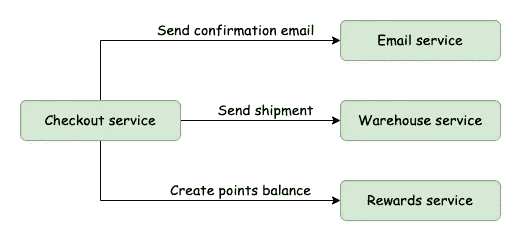
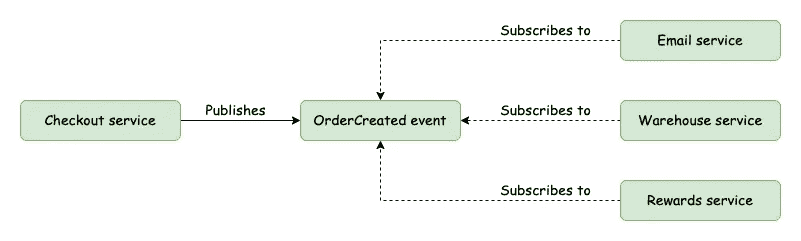
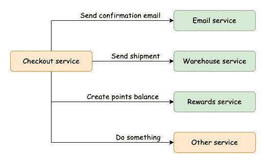
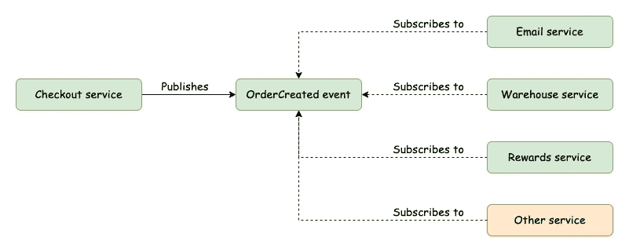

# 微服务编排与编排

> 原文：<https://betterprogramming.pub/microservice-orchestration-vs-choreography-5595b602fe3b>

## 事件驱动架构如何帮助您的应用解耦

尼哈尔·德米尔西在 [Unsplash](https://unsplash.com?utm_source=medium&utm_medium=referral) 上的照片

微服务现在风靡一时。

它们允许你把你的应用程序分割成具有清晰领域边界的小块。微服务是相互分离的，允许它们相互独立地被改变和部署，这为在每个微服务上工作的团队提供了更大的自主权。

它们还提供了更简单的方法来扩展应用程序中经常使用的部分，而不必扩展整个整体。

很容易看出微服务的吸引力。然而，微服务也带来了很多复杂性，从数据一致性到通信到日志记录到服务发现。

我今天想要解决的是微服务之间的通信挑战。

# 两种合作模式

当微服务需要互相对话时，你会怎么做？理想情况下，所有通信都应该是异步的。此外，微服务之间的任何交互都不应该将它们紧密地耦合在一起。否则，您将失去独立变更和部署的好处。

我们可以接触到两种主要的协作模式:**编排**(请求/响应)或**编排**(事件驱动)。

有了编排——或者说请求/响应模式——一个中心服务告诉一切该做什么。它向其他下游服务发出请求，以确保所有正确的事情发生，下游服务对这些请求做出响应。

对于编排(或事件驱动架构)，第一个服务只是发出一个事件。各种服务可以订阅这些事件通道，当它们看到发出的特定事件时，它们可以按照自己喜欢的方式做出响应。

# 一个例子:电子商务结账

让我们考虑一个例子来更好地理解这两个范例。

假设我们有一个电子商务网站。当顾客完成结账流程时，需要做一些事情:

*   我们需要向客户发送一封电子邮件，确认他们的订单。
*   我们需要将订单发送到我们的仓库，这样我们就可以开始装运了。
*   如果客户注册了我们的奖励计划，我们需要为他们创建一个新的积分余额。

需要注意的是，一旦下了订单，接下来的三项任务不一定需要按照任何特定的顺序进行。它们只是需要发生。

我们的结账服务将处理与顾客的最初互动。我们的三个下游服务是电子邮件服务、仓库服务和奖励服务。我们的电子邮件服务将处理发送电子邮件，我们的仓库服务将处理履行订单，我们的奖励服务将处理创建新的积分余额。

那么，编排和编排的流程会是什么样的呢？

# 管弦乐编曲

带有业务流程的结账流程

通过一个协调的流程，结帐服务将充当我们的中心服务。当客户提交订单时，结账服务将向电子邮件服务、仓库服务和奖励服务发出三个 API 请求。结帐服务将告诉电子邮件服务发送电子邮件，仓库服务开始准备货物，奖励服务创建新的积分余额。

从这个意义上说，结账服务就像一个管弦乐队的指挥，告诉所有的演奏者该做什么，什么时候做。

# 舞蹈编排

采用编排的结账流程

对于编排的或事件驱动的架构，业务流程是相同的，但是我们的服务处理它的方式略有不同。当顾客提交订单时，结帐服务将发出一个事件。这甚至会被称为类似“OrderCreated”的东西，并且会包括订单细节。

我们的三个下游服务(电子邮件、仓库和奖励)将订阅一个事件通道并监听事件。当发出“OrderCreated”事件时，我们的三个服务将看到该事件，并通过发送电子邮件、准备货物和创建新的积分余额做出相应的响应。

从这个意义上说，我们的服务就像芭蕾舞中的舞者，每个人都随着音乐独立地跳着自己的角色。

# 编排的缺点

你发现这里的不同了吗？很微妙但很重要。主要的区别是编排，或者说事件驱动架构，在我们的应用需要改变的时候为我们提供了更多的灵活性。

例如，如果以后我们创建了第四个服务，并且在下订单时也需要做一些事情，该怎么办？在编排模型中，为了更改我们的应用程序，我们需要修改我们的 checkout 服务，向这个新服务发出第四个 API 请求。

通过编排添加第四个服务

或者，如果我们现有的三个服务中的一个的 API 端点发生了变化，该怎么办？也许我们不需要调用原始端点，而是需要它调用不同的端点？或者我们可能需要它向服务发出两个 API 请求，而不是一个？

在一个编排好的模型中，这种变化将再次要求我们修改结帐服务。

我们无意中将我们的微服务结合在一起！

# 编舞的好处

现在，回想一下精心设计的建筑。结帐服务只是发出一个事件，所有下游服务只是对事件做出响应。

那么，需要在组合中添加第四种服务吗？没问题，让它订阅事件就行了。

使用编排添加第四个服务

需要更改现有服务对事件的响应方式？没问题。我们能够改变下游服务的行为，而不会影响任何其他服务，如结帐服务。

编排允许我们有更大的灵活性，并帮助我们保持服务的解耦。