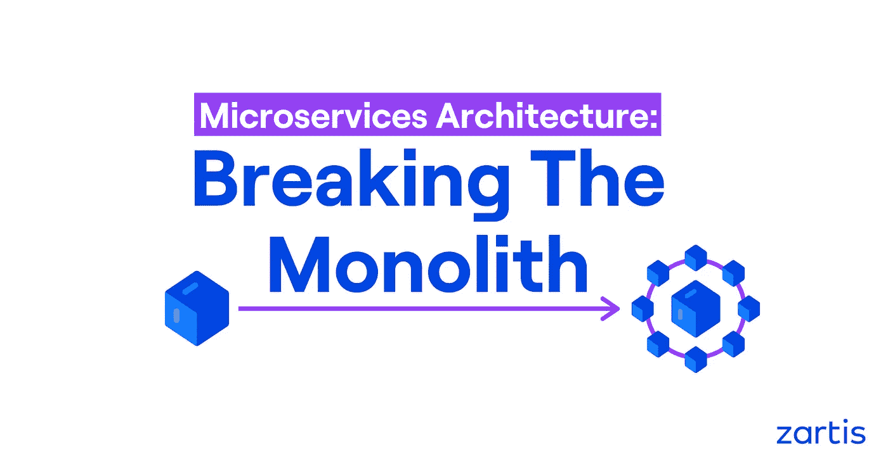
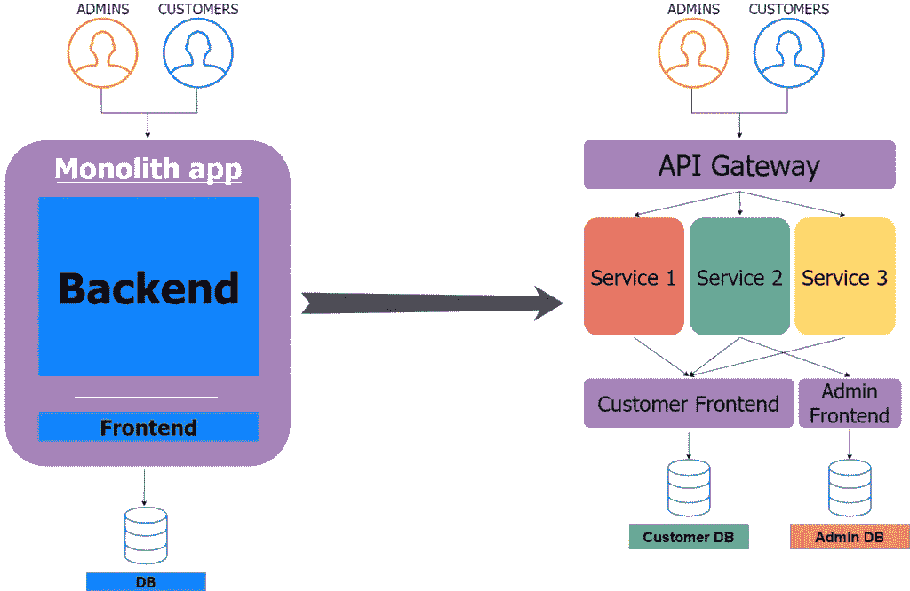
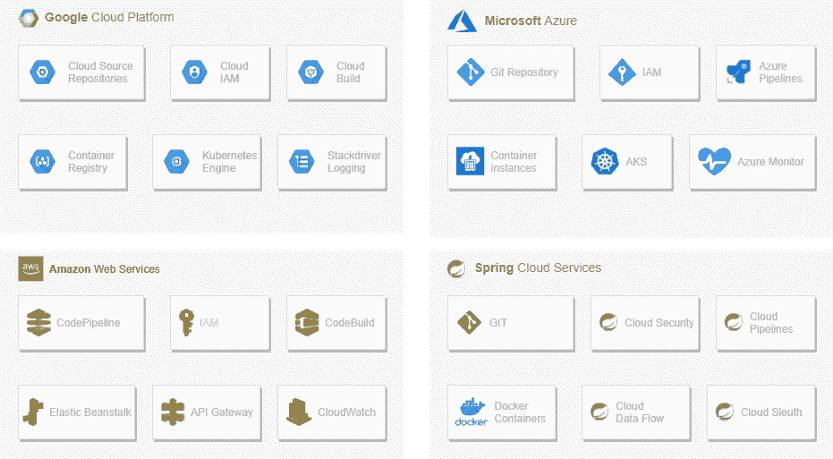
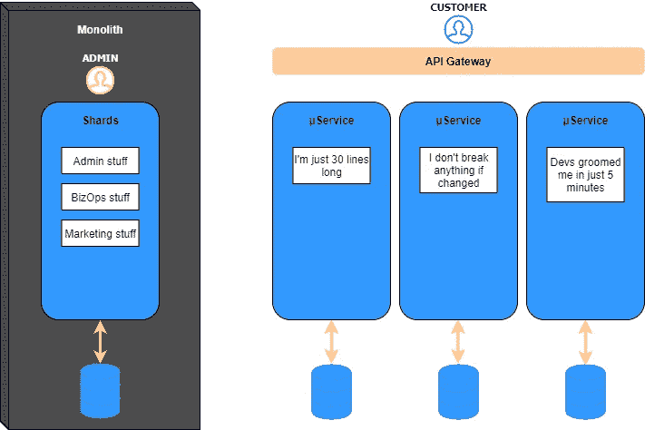
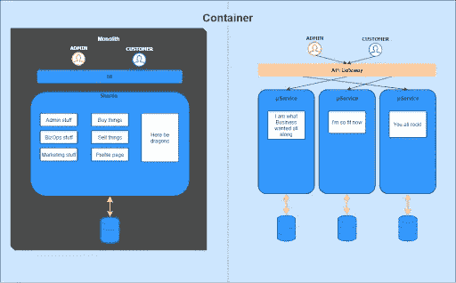

# 微服务架构:打破垄断

> 原文：<https://betterprogramming.pub/microservices-architecture-breaking-the-monolith-dbcabc9ceee8>

## 如何通过三个步骤迁移到微服务架构

本文总结了由 [Zartis](https://zartis.com) 的高级软件工程师 [Daniel Gutiérrez Saavedra](https://www.linkedin.com/in/danielgutsaa/) 主持的网络研讨会“打破垄断”。你可以观看完整的网上研讨会，其中还包括一个问答环节，[点击这里](https://youtu.be/Cb4DKzcyb6k)。

您正在使用单体系统和遗留应用程序吗？您是否正在寻找使您的架构现代化并转向微服务的方法？

本文将介绍如何将一个单一的应用程序分解成组成模块化系统的更小的部分。

# 为什么选择微服务

[微服务](https://microservices.io/)是用面向业务的 API 开发的，封装了核心业务能力。松散耦合的原则有助于消除或最小化服务及其消费者之间的依赖性。

其中包括:

*   可攀登的
*   易控制的
*   可交付的
*   灵活的

如果我们还将 DevOps 的思维模式加入到等式中，其中我们有非常小的代码部分可以进行自测并以小块的形式部署，那么优势就变得不容忽视。

# 微服务的挑战

这里必须承认，微服务架构确实带来了一些挑战。还有一些额外的复杂性，因为系统中会有许多移动部件，测试微服务[会变得复杂。](https://www.zartis.com/testing-microservices/)

以下是您需要考虑的一些主要挑战:

*   额外的复杂性。
*   如果你的软件不经常改变，它可能不会修复任何东西。
*   购买新产品需要额外的费用。
*   一旦进入云，您就可以执行额外的活动，如日志记录、额外的安全考虑等。您的团队需要训练自己来利用这些工具。

# 打破巨石

将系统迁移到微服务架构的一个有效方法是从识别核心服务开始，然后重构和分离它们。让我们更深入地了解一下如何进行这些更改，并回顾一下将应用程序存储在云上的最佳选择。

# 步骤 1:识别核心服务

通过识别关键服务来开始迁移会很有用，这些服务可能会为您的企业带来更多收入，或者是您的客户群使用最多的服务。这些服务将最难从整体中分离出来。

你的服务的重要性只由你自己决定。但是，当你转向微服务时，你应该做的第一件事就是识别它们。当需要切东西的时候，横着切更容易。请分层次考虑，您已经有了业务层、表示层、数据层等。垂直切片意味着试图分割功能，这个特性覆盖了应用程序中所有的层，这会导致样板文件和重复的业务逻辑。

举个例子，让我们以领域驱动设计(DDD)为例。在面向微服务的系统中，我们的领域可能非常大，可以覆盖许多微服务，这些微服务可以作为子域。所以当谈到系统设计时，这是一种非常相似的思维方式，并且它与 DDD、BDD 等完全兼容。

# 步骤 2:解耦和重构

我们已经看到了如何拆分一切，但是在我们这样做之后，我们如何将服务从一切中分离出来，并将它们重构为一堆微服务呢？

首先要知道——沟通越少，关系越好。从单个角度来看，创建大量易于测试的服务很容易，也很诱人，但是作为一个整体，你的系统会变得非常复杂和混乱。如果出现问题，这使得事情很难跟踪，因为你有这种巨大的纠结，可能很难确定问题的根源在哪里。

另一个重要的考虑是将事件输入队列。很多次，我们被告知，我们不能将这些分解成单独的服务，因为对于接下来的步骤中发生的事件，这个东西必须完全同步。通常，这不是真的。多亏了今天存在的排队系统和主题消息传递系统，有很多方法可以破坏同步。的确，您添加了一个额外的层，这可能会带来一些延迟问题，但最终，能够打破所有的同步性可能会最终改善您的体验。

# 步骤 API 和云

现在我们已经完成了所有的切片工作，并且解耦了我们的代码，那么我们应该把这些东西放在哪里呢？

云。

今天，我们有大量的解决方案，这些只是云为我们提供的一小部分:

举几个最常见的例子，我们有谷歌云(GCP)、微软 Azure 和 AWS 作为三个主要竞争者，但还有更多提供商。这些解决方案通常提供开箱即用的微服务架构，在这种架构中，您只需绘制一些线条并进行一些小培训，就可以让事情正常运行。

如果您需要内部部署的解决方案，那么您有一些解决方案，因为您不希望将您的服务放在云中。例如，使用 Spring 云服务，您可以使用自己的服务器，完美地模仿公共云结构。

## 使用云解决方案迁移到微服务需要多少成本？

继续在云上创建微服务很容易，但如果你没有一个清晰的计划，也很容易失去对项目预算的跟踪。如果你想估算一下你在云服务上的花费，有几种方法可以估算一下。

使用大多数云服务提供的详细计算器可以给你一个很好的估计，但为此，你需要对一些事情有一个非常清晰的看法:你的客户群是什么，交易量有多大，数据和代码的量，等等。如果您拥有所有这些参数，您就可以很好地估计您在云中的成本。遗憾的是，对于像 Spring Cloud services 这样的本地提供商来说，情况并非如此，他们承担了拥有本地服务器的不同成本。

# 常见迁移策略

让我们来看看目前存在的最典型的迁移策略，这可以帮助您更清楚地了解您可能想要采取的途径。

## 扼杀者模式

如果您的应用程序非常大，实现这种迁移的一种方法可能是扼杀者模式。通过这种模式，您可以将最关键的服务提取到您的微服务架构中。

在下面的例子中，我们决定将应用程序的所有客户端提取到微服务中，而将管理端留在 monolith 上，这完全没问题。他们大量地增强了他们的代码，而且他们可以在不停止开发的情况下做到这一点。但是这不应该是应用程序的最终状态。理想情况下，一切都应该在图像的右侧结束。如您所见，这里有 DBF，这是每服务一个数据库。这不是必须的要求，但确实有帮助。

## 平行发育

进行迁移的另一种方法是使用并行开发方法。这更适合于较小的项目或者开发不是很先进的项目。这样，您可以并行开发整体架构和微服务架构。

这种方法的主要缺陷是，它通常会加倍维护和代码复制，但最终所有内容都将出现在屏幕的右侧。如果你希望安全起见，这种方法会有很大帮助。

# 关于迁移到微服务的最终想法

重要的是，当我们处于迁移过程中时，不要超越我们自己；我们应该尝试并行地执行变更，或者提前进行设计。

假设您正在进行并行迁移，并且您决定在开发的同时进行迁移。如果出现新的功能或特性，您需要复制这些代码，并做两次。如果您试图提前计划迁移，同时引入对主应用程序的更改，将很难避免复杂性。

重点关注您如何让当前系统以您今天迁移的方式工作，以及它在明天或未来几天应该如何工作。

感谢阅读！

# 其他相关条款

[测试微服务](https://www.zartis.com/testing-microservices/)