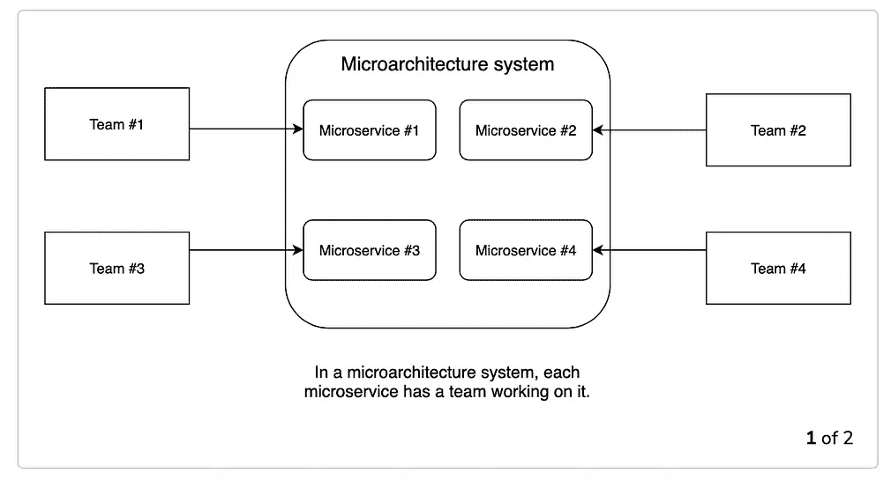
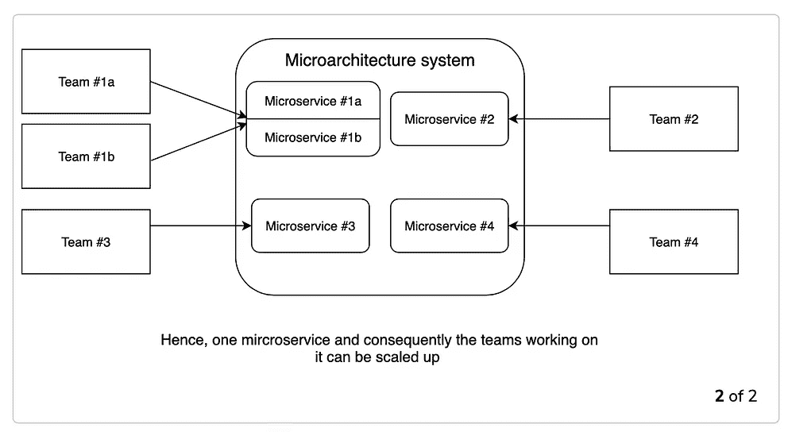
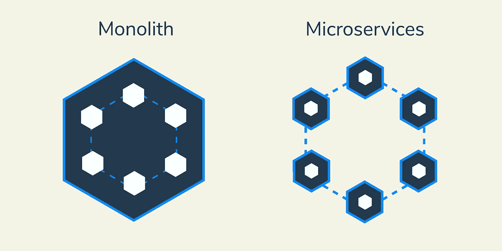
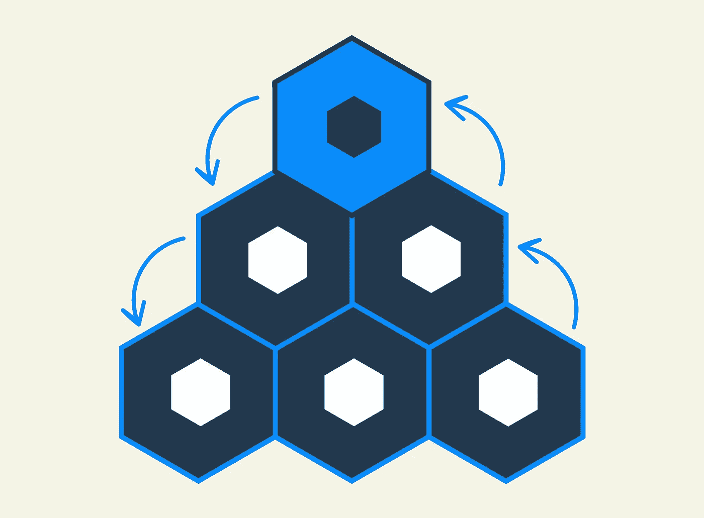
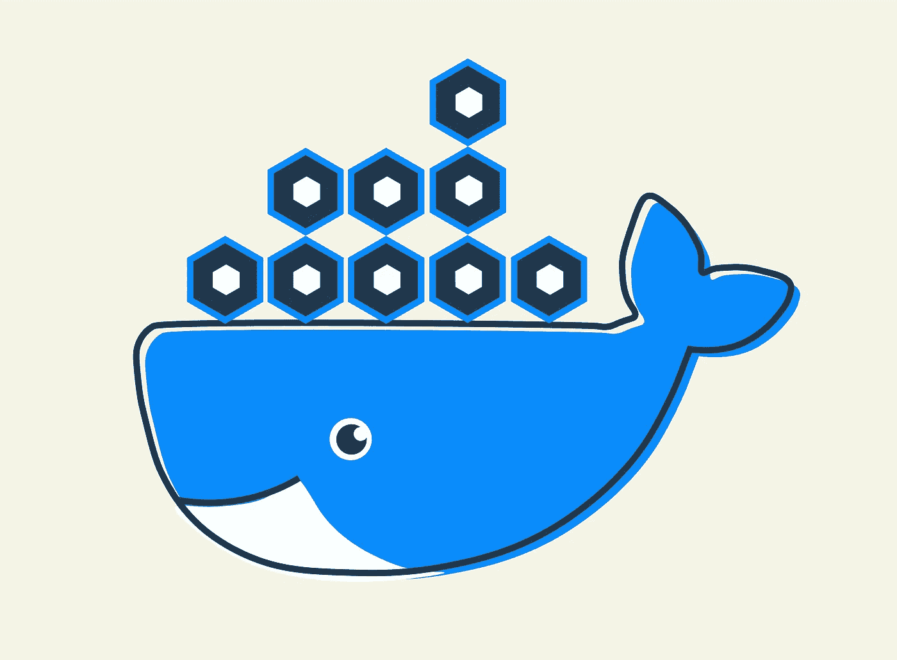
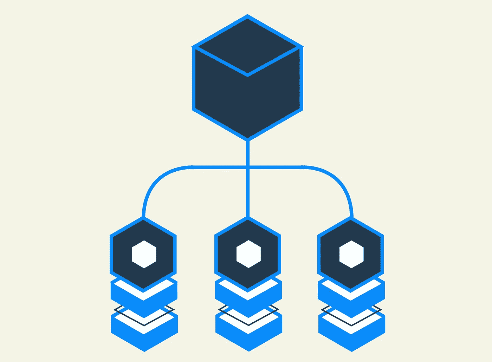
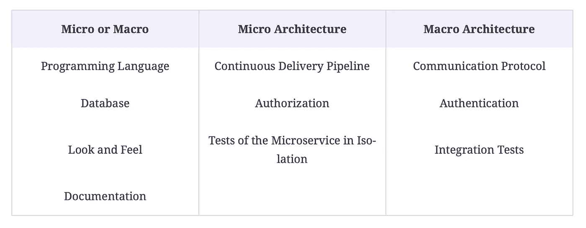
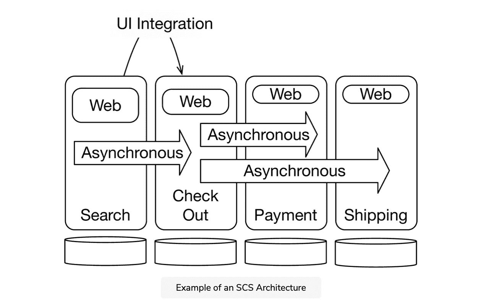
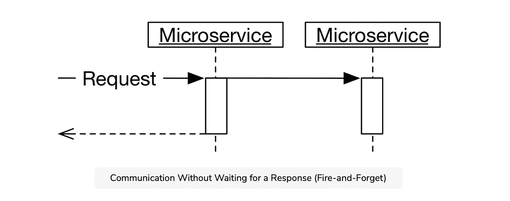
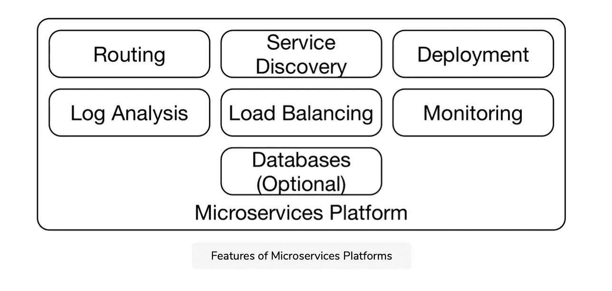

# 微服务架构入门指南

> 原文：<https://betterprogramming.pub/microservices-architecture-tutorial-all-you-need-to-get-started-f059d2e1aeb3>

## 构建和部署您的首个微服务

莎伦·麦卡琴在 [Unsplash](https://unsplash.com/s/photos/micro?utm_source=unsplash&utm_medium=referral&utm_content=creditCopyText) 上的照片

微服务架构是当今讨论最多的软件架构趋势之一。它永远改变了企业应用程序的构建方式。与过去缓慢、复杂的单一方法不同，各地的开发人员和公司都在转向微服务架构，以简化和扩展他们的结构。甚至像亚马逊、网飞、Spotify 和优步这样的公司也完成了转型。

无论您是想开始使用微服务，还是对围绕微服务的争论感到好奇，您都找对了地方。今天，我将带您了解您需要了解的关于微服务的一切，从真实世界的例子到架构模式等等。我们将涵盖以下内容:

*   什么是微服务架构？
*   优点和缺点
*   微服务和 Docker
*   技术栈和架构模式
*   资源指南

我们开始吧！

# 什么是微服务架构？

微服务这个术语没有统一的定义。微服务最简单的定义，也称为微服务架构，是一种使用松散耦合的服务来构建应用程序的架构风格。这些集合或模块可以独立开发、部署和维护。

它们比传统的复杂、单一的应用程序运行得更快、更可靠。使用微服务架构，任何规模的组织都可以发展适合其能力的技术堆栈。

使用微服务有许多实实在在的好处，我们将在后面讨论，但对于公司是否应该从整体架构转向微服务架构仍有一些争议。让我们看看两者之间的区别，以帮助我们理解这场辩论。

# 整体服务与微服务

整体架构是构建和部署应用程序的传统方式。这种结构基于一个单一的、不可分割的单元的概念，包括服务器端、客户端和数据库。所有方面都作为一个单元和代码库进行统一和管理。这意味着任何更新都必须对同一个代码库进行，因此整个堆栈都必须改变。随着整体应用程序的扩展，它们会变得非常复杂，因此总体开发时间通常会更长。

另一方面，微服务架构将该单元分解为许多独立的单元，作为独立的服务。这意味着每个服务都有自己的逻辑和代码库。它们通过 API(应用程序编程接口)相互通信。

那么，应该选择哪种架构呢？我们来分解一下。

## 选择整体架构

*   如果你的公司是一个小团队。通过这种方式，您不必处理部署微服务架构的复杂性。
*   **如果你想要更快的发射。**整体式架构启动时间更短。这个系统将需要更多的时间来更新您的系统，但初始启动会更快。

## 选择微服务架构

*   **如果你想开发一个更具伸缩性的应用。**扩展微服务架构要容易得多。可以轻松快速地添加新功能和模块。
*   如果你的公司规模较大或计划发展。使用微服务非常适合计划发展的公司，因为微服务架构更具可扩展性，也更易于定制。

# 微服务的优点和缺点

微服务架构可能是您公司更好的选择，这有几个原因。让我们讨论一下最显著的好处，然后检查一些缺点。

## 利益

*   **提高可扩展性和工作效率。大型团队经常不得不在复杂的项目上合作。有了微服务，项目可以分成更小的独立单元。这意味着团队可以在领域逻辑方面独立行动，这最小化了协调和努力。最重要的是，负责每个微服务的团队可以根据自己的需求做出自己的技术决策。**

例如，只要接口功能正常，每个单元或容器的内部结构并不重要。所以任何编程语言都可以用来写一个微服务，所以负责的团队可以为队友选择最好的语言。

*   **与传统系统集成良好。**整体系统很难维护。许多遗留系统结构不良，测试不佳，或者依赖于过时的技术。幸运的是，微服务可以与遗留系统一起改进代码并替换系统的旧部分。集成很容易，可以解决许多使单一系统成为过去的问题。
*   **可持续发展。**微服务架构创建了长期可维护的系统，因为各种部件都是可替换的。这意味着微服务可以很容易地被重写，而不会危及整个系统。只要微服务之间的依赖关系得到适当的管理，就可以很容易地进行更改以优化团队需求和性能。
*   **跨职能。**微服务最适合分布式团队。如果你有遍布世界各地的团队或者各种部门，微服务给予你必要的自由和灵活性来自主工作。可以快速做出与其他服务集成的技术决策。跨功能从未如此简单。

## 缺点

*   **部署需要更多的努力。**微服务系统的操作通常需要更多的努力，因为有更多的可部署单元必须被部署和监控。必须对接口进行更改，以便仍然可以独立部署单个微服务。
*   **测试必须是独立的。**由于所有微服务必须一起测试，一个微服务可能会阻塞测试阶段并阻止其他微服务的部署。有更多的接口需要测试，测试必须独立于接口的两端。
*   **难改多微服。**影响多个微服务的变更可能更难实施。在微服务系统中，变化需要几个协调的部署。

# 微服务和 Docker

Docker 和微服务几乎是同义词。微服务必须是可单独部署、可扩展的独立单元。但是如果你为你的应用创建多个微服务呢？Docker 是部署微服务的轻量级解决方案。微服务可以打包到 Docker 映像中，并隔离为 Docker 容器，这样，您就可以构建独立于您的主机环境的应用程序。

Docker 容器共享 Docker 主机上的操作系统内核，而不是拥有自己完整的虚拟机。容器中的进程出现在运行 Docker 容器的操作系统的进程表中。

要将 Docker 用于微服务，您需要通过名为`Dockerfile`的文件创建 Docker 映像。docker 文件很容易编写，因此推出软件也很容易。看一个 Java 微服务的 docker 文件的例子:

> 来自 openjdk:11.0.2-jre-slim
> 
> 复制 target/customer.jar。
> 
> CMD/usr/bin/Java-xmx 400m-xms 400m-jar customer . jar
> 
> 曝光 8080

*想了解更多关于 Docker 的知识？查看 Educative 关于* [*Docker 和 Kubernetes*](https://www.educative.io/courses/practical-guide-to-kubernetes) *基础知识的课程。*

典型的微服务系统包含多个 Docker 容器。协调多个 Docker 容器的系统需要虚拟网络的配置。为了进行通信，容器必须能够找到彼此。Docker 组合环境可以通过链接联系另一个服务器，提供服务发现系统。

继续学习。

*学习微服务架构，无需浏览视频或文档。Educative 基于文本的课程易于浏览，并以实时编码环境为特色，使学习快速高效。*

[***微服务原理与概念介绍***](https://www.educative.io/courses/introduction-microservice-principles-concepts)

# 技术栈和架构模式

理解微架构如何工作是一回事，实际构建和实现它是另一回事。这就是为什么我们希望将重点放在整个微服务系统的各种可用技术上。让我们通过一些不同的技术栈、模式和设计来创建一个可执行的微服务架构。

## 微观和宏观架构决策

建议将您的架构分为微观和宏观架构。微架构涉及为每个微服务做出的所有决策。宏观架构包括适用于所有微服务的全局决策。

将微观和宏观架构的概念扩展到技术决策是可能的。技术决策可以在宏观或微观架构的框架内做出。例如，看看要在数据库的微观和宏观层面做出的技术决策:

*   **微:**每个微服务都可以有自己的数据库实例。如果数据库是在微架构中定义的，那么一个数据库的崩溃只会导致一个微服务的崩溃。这使得应用程序更加健壮。
*   **宏:**数据库也可以定义为宏架构的一部分。多个微服务不得共享一个数据库模式。

## 独立系统

独立系统(SCS)是一种微服务架构，它指定了宏架构的元素。这意味着它们不能代表整个系统。因为 SCS 是自包含的，所以它提供了实现一部分域逻辑所需的一切，比如日志数据和 UI。SCS 还有一个可选的 API。

例如，用于微服务支付的 SCS 会将与该支付相关的信息存储为有界上下文。它还将实现 UI 来显示支付历史，并且关于客户的数据将从其他 SCS 复制。

请将这些视为最佳实践的集合。SCS 提供了基于既定模式的精确规则，为如何构建微服务架构提供了参考点。所有这些规则都确保一个 SCS 实现一个域，所以一个添加的特性只改变一个 SCS。

我们可以将 SCS 视为微服务架构，因为它可以独立部署，并将系统划分为独立的 web 应用程序。事实上，一个 SCS 甚至可以拆分成几个微服务。它们与微服务的区别主要体现在三个方面:比微服务大，注重松耦合，必须有 UI。

*您可以在这里* *了解更多 SCSs* [*。*](http://scs-architecture.org/)

## 前端集成

微服务也可以与 web 前端集成。将前端分成不同的模块有助于解决将它视为一个整体所带来的一些问题。模块化前端由可单独部署的微服务组成。这可以给你的前端带来很多好处。

比如一个模块化的前端可以有独立的域逻辑，一个域的改变只需要修改一个微服务就可以实现。要把分开的前端组合起来，就必须把它们集成起来，所以需要一个集成系统。

这可以通过链接来实现，其中一个前端显示另一个前端读取和处理的链接。这也可以通过重定向来实现，例如，OAuth2 如何处理前端集成。重定向将数据传输与前端集成结合起来。

但是，当前端应该作为一个整体部署时，也有一些例外。例如，本地移动应用程序应该是整体部署，或者如果一个团队负责前端开发，那么前端应该作为整体部署。

## 异步微服务

同步微服务向其他微服务发出请求，同时处理请求并等待结果。异步通信协议发送消息，接收方对消息做出反应，但没有直接的响应。如果微服务在处理时不向其他微服务发出请求，或者发出请求但不等待结果，则该微服务可以被定义为异步。

异步微服务为同步微服务提供了几个显著的优势，并解决了分布式系统的许多挑战。处理微服务请求所需的逻辑不依赖于结果，使它们更加独立。

类似地，如果一个通信伙伴发生故障，也不会使整个系统崩溃，从而为您的系统提供整体弹性。最重要的是，处理和交付几乎总是有保证的。

异步微服务技术的一些常见示例有 Kafka(一种常用于消息传递的 MOM)、REST 和 Atom 数据格式(用于附加基础设施)。

## 微服务平台

微服务平台，如 PaaS 和 Docker scheduler，支持你的微服务的运行和通信。这些技术支持微服务之间的通信，用于部署、日志分析和监控。

例如，这些平台支持 HTTP 和 REST，支持负载平衡和服务发现。微服务的实现需要有限的运营支持，因此可以快速部署并支持多个微服务。

微服务平台代表了常见问题的简化和解决方案。一些著名的平台是 Kubernetes 和 Docker——这对微服务运营非常重要。PaaS 和 Cloud Foundry 也很有用，但没有那么受欢迎。

值得注意的是，迁移到这些平台需要改变应用程序的操作和安装，这使得微服务平台的使用成为一个重要而及时的步骤。这是微服务平台的主要弊端。

# 包扎

现在，您已经了解了微服务架构必须提供什么以及有哪些变化，您已经准备好开始一些实践学习了。看看我们下面的资源列表，了解更多关于微服务的信息。

## 资源

*   [微服务指南:](https://martinfowler.com/microservices/)一系列文章探讨了与微服务相关的各种主题。
*   [微服务时代的监控艺术:](https://thenewstack.io/qa-james-turnbull-art-monitoring-age-microservices/)一个有用的 Q & A，作者是《监控艺术》一书的作者，该书涵盖了监控策略。
*   [打造微服务:](https://www.amazon.com/Building-Microservices-Designing-Fine-Grained-Systems/dp/1491950358/ref=sr_1_1?ie=UTF8&keywords=building+microservices&qid=1493016861&sr=8-1):奥莱利关于微服务的书。
*   [GitHub 的微服务初学者指南:](https://github.com/PacktPublishing/A-Beginner-s-Guide-to-a-Microservices-Architecture)方便初学者导航的代码库。
*   [AWS 介绍微服务:](https://aws.amazon.com/microservices/)亚马逊的文档和微服务概念的定义。

## 微服务架构:权威在线课程

想找一个真正可以信赖的在线课程？我们已经为您准备了一个由两部分组成的、您必须知道的微服务系列，作者是该领域的专家之一 Eberhard Wolff，他是 Java Champions 社区的创始成员。

从微服务的基本原理开始，了解部署和实施所需的所有基础。

[**微服务原则和概念介绍**](https://www.educative.io/courses/introduction-microservice-principles-concepts) 使用真实世界的示例和迁移策略，带您了解这一激动人心的趋势的所有利弊。

然后，您可以继续学习 [**微服务架构:实际实现**](https://www.educative.io/courses/microservice-architecture-practical-implementation) ，这是了解现实世界实现的本质细节的最佳课程之一。

本课程将带您了解真实世界的“配方”和技术堆栈。您将了解部署的来龙去脉，并最终成为一名微服务专家！

这两个课程都是基于埃伯哈德关于同一主题的高评价的书，所以你知道你得到了一流的指导。获得更好的装备来应对这一增长趋势！

*快乐学习！*