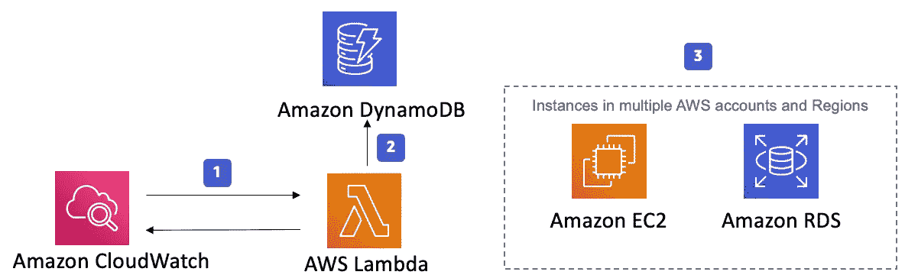
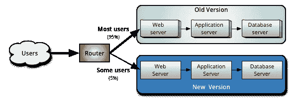
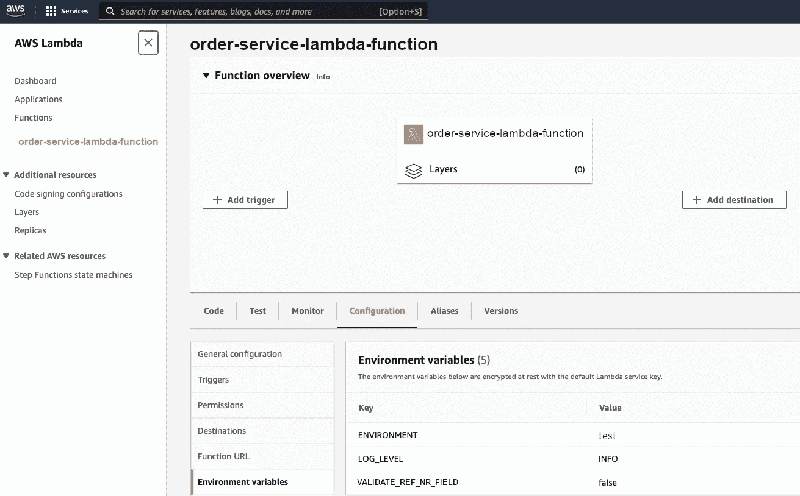
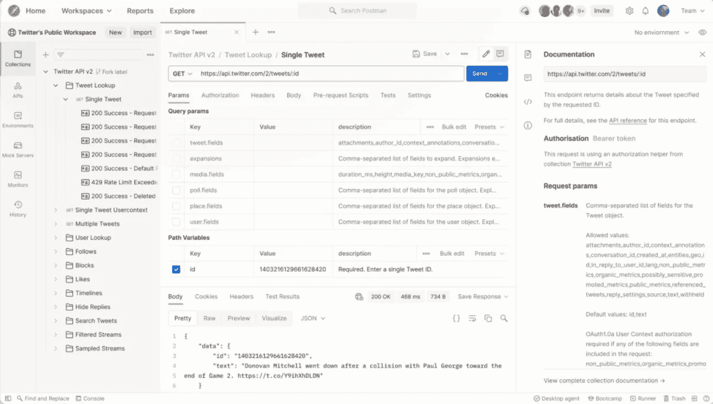
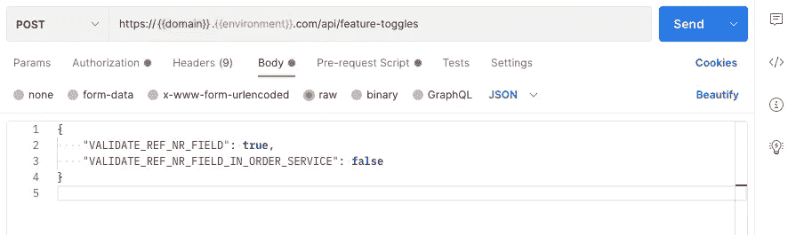

# 消除错误:如何验证微服务架构中的字段

> 原文：<https://betterprogramming.pub/microservices-cloud-architecture-9d15be866ce6>

## 探索现代软件开发的实践模式，如特性切换和金丝雀发布


简·坎迪在 [Unsplash](https://unsplash.com?utm_source=medium&utm_medium=referral) 上拍摄的照片

如果你已经做了几天的 web 开发，很可能你听说过云计算和微服务。

与构建为单个大型单元的整体应用不同，在微服务架构中，我们将一个大型应用分解为一组独立的小部分，我们可以单独部署和扩展。

在本文中，我将展示一个在微服务云架构中实现和测试新功能的案例研究，并揭示一些现代软件开发的基石，如[功能切换](https://aws.amazon.com/blogs/mt/using-aws-appconfig-feature-flags/)和[金丝雀部署](https://semaphoreci.com/blog/what-is-canary-deployment)(或版本)，它们被脸书等大型科技公司使用，也由 AWS 支持[。](https://docs.aws.amazon.com/apigateway/latest/developerguide/canary-release.html)

但是不要担心，尽管这个问题可能很棘手，我会为你简化事情。

事不宜迟，我们开始吧。

在上次的计划会议中，我们在当前的 sprint backlog 中添加了一个关于表单逻辑变化的任务。在接下来的几个月里，我们 B2B 平台 GreenEnergy 的用户在创建新订单时必须填写一个特定的字段。该字段以前是可选的。

我们最初在一个单片 Java 应用程序中实现了表单字段的验证逻辑——它代表了我们的 REST API——并将其托管在 AWS EC2 实例上。但我们最近为微服务家族增加了一项新服务，并将其部署为 AWS Lambda。



EC2 实例、AWS Lambda、DynamoDB 和 CloudWatch ( [图像信用](https://aws.amazon.com/solutions/implementations/instance-scheduler/))

由于 canary 的发布，并不是我们所有的客户都在使用这个新生的 Lambda，这意味着我们必须保持这种重复的验证，直到我们在未来删除它。

如果你对金丝雀释放是什么和它做什么感到好奇，这里有一个简短的定义给你:

> “Canary release 是一种降低在生产中引入新软件版本的风险的技术，它通过在将更改推广到整个基础架构并提供给所有人之前，缓慢地将更改推广到一小部分用户来实现。”— [达尼洛·佐藤](https://martinfowler.com/bliki/CanaryRelease.html)



金丝雀发布([图片来源](https://martinfowler.com/bliki/CanaryRelease.html))

# 1.添加验证方法

因此，为了根据这个新的需求调整源代码，我从我们以前的大型“微服务”开始

在这里，我在一个`Validator`类中实现了一个新方法`isValidRefNumber()`，在这里我添加了一个检查字段值的正则表达式:

FieldsValuesValidator.java

# 2.添加新的错误代码

我注意到需要通过添加与我的领域相关的新错误代码`INVALID_REF_NUMBER`来更新一个共享核心项目:

# 3.添加新功能开关

> “功能切换(通常也称为功能标志)是一种强大的技术，允许团队在不更改代码的情况下修改系统行为。”皮特·霍奇森

因为我们已经计划了将来激活这个验证，所以我需要添加一个特性开关，并用`*.yml`文件中的`false`初始化它:

FeatureToggles.java

应用程序. yml

并且仅在 Toggle 为`true`时调用验证逻辑:

[检查功能切换运行验证逻辑](https://gist.github.com/rakia/4a5e49b1d395d60c6045a69ad3df2e63#file-check-feature-toggle-java)

# 4.更新订单服务

订单服务被部署(正如我已经提到的)为 AWS Lambda。所以我需要在我的`configuration.py`文件中给它添加一个环境变量:

[configuration.py](https://gist.github.com/rakia/600314666216df60ffbed234ecfb3aa5#file-configuration-py)

并且为了将这个变量自动添加到 AWS 上的 Lambda 配置中，我需要将它添加到[terra form](https://www.terraform.io/)文件中:

[vars.tf](https://gist.github.com/rakia/b5d2ae56faa18902b53d7103f212f550#file-vars-tf)

[λTF](https://gist.github.com/rakia/8813fdccad80f239abb683c71f8e8570#file-lambda-tf)

然后我可以在我的`ValidateRefNr`脚本中使用这个环境变量，并根据它的值运行适当的逻辑:

[validate_ref_nr.py](https://gist.github.com/rakia/d5396021555ffbae3261d46b75896605#file-validate_ref_nr-py)

# 5.构建、配置项、光盘

在实现了一些单元测试并检查了它们之后，我现在已经准备好进行主分支上的[提交和推送。](https://levelup.gitconnected.com/git-workflow-devops-69e5a9071be1)

这意味着在几分钟内，我的代码将在我们不同的环境中可用，包括`live`环境，因为我们已经采用了连续交付(CD)方法。一旦我们的持续集成(CI)工具 [Jenkins](https://www.jenkins.io/) 的构建成功完成，一切都将上线。

但是当然，我在`*.yml`文件中初始化我的特性开关`VALIDATE_REF_NR_FIELD`的值`false`会阻止我的验证被执行。

应用程序. yml

如果我查看 AWS 控制台上的`order-service` Lambda，并检查它的`Configuration`选项卡，我还会看到我新添加的用`false`初始化的环境变量:



AWS 控制台上 Lambda 顺序的配置变量(图片由作者提供)

# 6.测试场景/质量保证

## 测试场景 1

虽然我已经在我的本地主机上执行了一些测试，但是我需要在测试环境上重复这个过程。

我已经准备了一些`JSON`格式的测试数据，我将用 [Postman](https://www.postman.com/) 作为我的创建订单请求的有效载荷直接发送给 REST API，然后手动检查响应。由于第三方应用程序与我们的 API 的集成，我们的部分最终用户还没有使用我们的前端应用程序，而是通过这种方式与我们的系统进行通信。



邮递员(图片[信用](https://www.postman.com/)

在此之前，我必须调用 POST 请求，该请求允许我更改两个特性切换的值:

*   `VALIDATE_REF_NR_FIELD`(上面我自己加的旗):应该是`true`。
*   `VALIDATE_REF_NR_FIELD_IN_ORDER_SERVICE`:为了在 REST API 中运行验证逻辑，应该是`false`。



作者截图

我还需要调整适当的 MongoDB 集合中字段`REF_NR`的定义，使其成为必需的。

## 测试场景 2

对于我的第二个测试场景，为了检查 Python Lambda 中的逻辑，我需要将开关`VALIDATE_REF_NR_FIELD_IN_ORDER_SERVICE`设置为`true`，将配置参数`VALIDATE_REF_NR_FIELD`设置为`true`。

## 测试场景 3

在我的最后一个测试场景中，我必须调用前端应用程序，并验证在订单中`REF_NR`的标签旁边有`*`(因为它成为必需的)，并且当用户没有为该字段提供值或提供无效值时，用户会收到适当的错误消息/代码。

# 最后的想法

微服务云架构无可争议地受到了极大的关注和使用。他们想出了许多方法和范例来解决问题和实现各种目标。选择合适的解决方案基本上取决于您项目的需求、受众的规模/性质以及您的云提供商提供的服务。

canary releases 和 feature flags 等模式和实践可以帮助您实现连续交付，并避免阻碍用户体验。然而，它们可能不太适合你的情况。它们会产生混乱的代码，给你的项目带来额外的复杂性。

在加入这股潮流之前，花些时间去熟悉它。

感谢阅读！

```
**Want to Connect?**I write about engineering, technology, and leadership for a community of smart, curious people. [Join my free email newsletter for exclusive access](https://rakiabensassi.substack.com/).
```