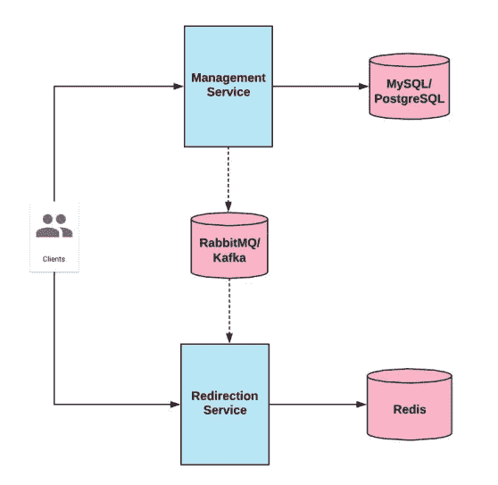
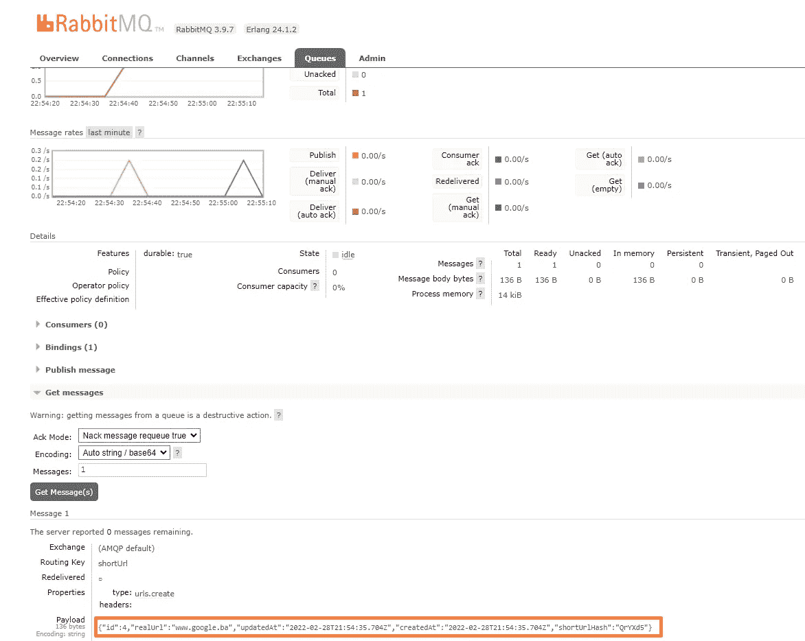

# 使用微服务架构开发一个简单的 URL 缩短器

> 原文：<https://betterprogramming.pub/microservices-for-beginners-developing-simple-url-shortener-2e6fab5c473e>

## node . js+MySQL+rabbit MQ+Redis+Docker


Akshar Dave 拍摄的照片🌻 on [Unsplash](https://unsplash.com?utm_source=medium&utm_medium=referral)

听说过微服务但从未真正了解过？还是没有机会用这种架构开发应用？很可能你从来不需要它。仅仅因为某样东西很受欢迎，很多大公司都在使用它，并不意味着你也应该这样做。

然而，你应该熟悉这种方法，这样有一天你会发现自己处于一种适合使用它的情况。
在本文中，我们将使用微服务架构创建一个简单的 URL 缩短器。

我们的任务是:

您需要创建一个应用程序来缩短 URL。TinyURL (http://tinyurl.com/)就是这种应用程序的一个例子。该应用程序将由两个服务组成。第一个服务是管理服务，另一个服务是重定向服务。RabbitMQ/Kafka 将用于在服务之间传递消息



架构图

# 管理服务:

管理服务有一个用于创建和删除 URL 的 RESTful API。您应该创建两条路线:

**创作路线**

*   该路由应该创建一个基于真实 URL 的短 URL。
*   短 URL 必须是唯一的。
*   短 URL 哈希标识必须位于 URI 路径中。例如:[http://localhost:8080/uayc 3 soddp](http://localhost:8080/uAYC3sOddP)

**请求示例**

```
{
  "realURL": "https://www.example.com/test"
}
```

**响应示例**

```
{
  "id": 3,
  "realURL": "https://www.example.com/test",
  "shortURL": "http://localhost:8080/gfjhgESta"
}
```

**删除路径:**

*   使用 id 删除短 URL。

管理服务应该将 MySQL/PostgreSQL 用于持久层。创建或删除短 URL 后，必须将信息发送到 RabbitMQ/Kafka

# 重定向服务

该服务将根据短 URL 的哈希部分找到真实的 URL，用户将被重定向到真实的 URL。重定向通过 RabbitMQ/ Kafka 接受关于短 URL 的信息。

在管理服务上创建短 URL 的情况下，信息将存储在重定向服务上的 Redis 中，而在删除短 URL 的情况下，信息将从重定向服务上的 Redis 中删除。重定向服务有一个 RESTful API 路由。

**重定向路线**

*   该路由应该为现有的短 URL 返回 302 HTTP 代码。
*   对于不存在的短 URL，路由应该返回 404 HTTP 代码。

## 限速器

对重定向服务实施速率限制，该服务允许在 120 秒内对特定 URL 发出 10 次重定向请求。

**重定向路线**

*   到达阈值后，路由应该返回 429 HTTP 代码。

# 我们开始吧

我假设您已经安装并准备好了 Docker。

首先，我们将创建一个新项目，并在其中创建三个文件夹:`Management-Service`、`Redirection-Service`和`Database-Service`。

我们需要启动 MySQL 数据库，因此进入数据库服务并使用以下内容创建 Dockerfile:

`FROM`将从 [DockerHub](https://hub.docker.com/_/mysql) 中提取 MySQL 8 服务器映像，ENV 将设置环境变量。
`COPY`将从`/db-dump`里面复制一切`/docker-entrypoint-initdb.d`

> 第一次启动容器时，将创建一个具有指定名称的新数据库，并使用提供的配置变量进行初始化。此外，它将执行在`*/docker-entrypoint-initdb.d*`中找到的扩展名为`*.sh*`、`*.sql*`和`*.sql.gz*`的文件。

`EXPOSE` 通知 Docker 容器在运行时监听指定的网络端口。

现在我们已经安装好了 MySQL，但是我们还没有数据库。我们只需要一个表来存储 URL。让我们在`db-dump`文件夹中创建文件`setup.sql`:

```
CREATE TABLE urls (
  id   INT PRIMARY KEY AUTO_INCREMENT NOT NULL,
  realUrl    VARCHAR(40)                    NULL,
  createdAt TIMESTAMP NULL,
  updatedAt TIMESTAMP NULL
)
```

现在让我们在根项目文件夹中创建`docker-compose.yml`文件。在这里，我们将配置所有的服务和容器。然后，用一个简单的命令`docker-compose up`，从您的 YAML 文件创建并启动所有服务。

*   `***db***` 代表服务的名称。你想怎么叫都行。
*   `***build***` 会取我们数据库服务的 Dockerfile 所在文件夹的路径。
*   `***command***` 将为正在执行的容器*提供默认值。*在本例中，我们使用的是`[mysql_native_password](https://hub.docker.com/_/mysql)` [](https://hub.docker.com/_/mysql)插件，因此我们可以使用传统的用户名/密码组合登录 MySQL，而不是像 unix socket、PAM 等这样的东西。
*   `***container_name***` 只是一个我们可以用来代替容器 ID 的别名。
*   `***volumes***` 是持久保存 Docker 容器生成和使用的数据的首选机制。每次我们销毁集装箱，我们的数据库内的一切也将被删除。我们希望在本地主机上持久化数据。有 3 种类型的卷:
*   绑定装载(主机卷)—主机上的文件或目录被装载到容器中。
*   命名卷—命名卷完全由 Docker 管理。您只需指定卷的名称，后跟要保留的文件夹的路径，而不是文件的路径。Docker 将在主机上自动创建一个新目录，该目录将包含由 path 指定的容器目录的内容。在我们的例子中，Docker 将创建一个命名的卷`mysql-data`，它将存储来自容器`/var/lib/mysql`的所有内容。卷的内容存在于给定容器的生命周期之外，因此，例如，我们可以对另一个容器使用相同的数据库。
*   匿名卷—几乎与命名卷相同，但很难引用它们，因为它们的名称是一些随机哈希值。

我强烈建议多读一点关于书的内容。

`**ports**` 表示它会将主机的 3306 端口映射到容器的 3306 端口，这是一个标准的 MySQL 端口。

## 我们可以在终端内部运行`docker-compose up -d`

我们第一次启动容器时会慢一点，因为 Docker 需要获取配置的图像。yml 文件。`-d`用于分离模式，以便您可以继续使用您的终端。您可以使用`docker ps`检查所有正在运行的 Docker 容器。

让我们进入我们的容器。可以用`docker exec -it mysqldb /bin/bash`。

`docker exec`命令在运行容器中运行新命令。
我们为*交互*指定标志`-i`，这意味着它将保持 STDIN 打开，即使没有连接，这是我们需要的，如果我们想键入任何命令，`-t`分配一个伪 TTY，伪终端，连接用户的“终端”与 STDIN 和 STDOUT。

然后我们指定容器的 ID/名称和命令来运行`/bin/bash`(用于终端)。您可以通过运行
`mysql -u root -p`，提供密码`123456`和`SHOW DATABASES;`来确保数据库已经创建。你可以用类似于`INSERT INTO (realUrl) VALUES ('https://google.com')`的东西填充数据库。

我们第二次运行容器时，它不会执行位于`docker-entrypoint-initdb.d`中的启动脚本，因为它会识别已经创建的数据库(由于这个卷不会被破坏)。
有时您可能想用不同的名称或密码重新创建数据库。为此，我们需要销毁卷`docker volume rm <volume_name>`，以便启动脚本可以再次运行并创建一个新卷。

重要提示:如果您正在对 docker 文件进行更改，请确保随后使用`docker-compose build --no-cache`,以便反映这些更改。

## 包括 RabbitMQ

将 [RabbitMQ](https://hub.docker.com/_/rabbitmq) 拉入`docker-compose.yml`档；

`5672`用于 RabbitMQ，`15672`用于 RabbitMQ web 界面。运行`docker-compose up`后，您可以检查`localhost:15672`并使用默认凭证`username:guest password:guest`登录 RabbitMQ 界面。

## 接下来，我们将创建一个管理服务

将目录更改为`/Management-Service`，创建`/src`文件夹和`Dockerfile`。

将目录更改为`/src`，创建`package.json`并安装这些依赖项`npm install amqplib body-parser cors dotenv express hashids mysql2 nodemon sequelize`。

你应该在`package.json`的脚本标签中添加`"start":"nodemon -L index.js`，这样我们就可以使用`npm start`用`nodemon`启动项目。Nodemon 是一个工具，通过在检测到目录中的文件更改时自动重新启动节点应用程序，来帮助开发基于 node.js 的应用程序。现在把这个粘贴到`Dockerfile`里面:

这将提取最新的 Node.js 映像，将`package.json`复制到容器中，安装依赖项，然后我们将`/node_modules`移到`/src`文件夹之外。

你可能想知道我们为什么要移动`node_modules`。原因是因为我们希望能够在我们的主机上更改代码，并看到更改立即反映在容器中。

这就是为什么我们要将 mount 从`/src`绑定到`docker-compose.yml`内部的`/nodeapp/src`。绑定挂载意味着 Docker 容器可以访问和引用主机的文件系统。

如果我们通过容器改变`/src`文件夹中的文件，也会影响主机的文件系统。

如果我们不移动`/node_modules`，就会发生这种情况:

1.  我们将代码从`/src`复制到容器的`/src`。
2.  创建容器运行`npm install`和`/node_modules`依赖关系。
3.  因为我们将主机的`/src`绑定到容器的`/src`，这将覆盖包括`/node_modules`在内的所有内容。这意味着我们的容器依赖于位于我们主机上的`/node_modules`，命令`RUN npm install`没有太大意义。当有人试图克隆我们的存储库时，他的电脑上不会有`/node_modules`，因为他从未使用过`npm install`，所以它只会复制`/src`而没有依赖关系。

现在我们需要指定`docker-compose.yml`内部管理服务的配置和需要的技术。

让我们创建`/services/MQService.js`，我们将在这里创建用于连接 RabbitMQ 和向队列发布消息的函数。

代码是不言自明的，我们提供了连接到 RabbitMQ 服务器的设置，`channel.assertQueue(QUEUE)`将创建一个名为`'shortUrl'`的队列(如果它还不存在的话)。
`publishToQueue`接受我们想要发送的消息，并输入我们想要的任何字符串。我们将使用它来区分创建和删除 URL 的消息。

在`/src`内创建`index.js`，内容如下:

首先，我们正在导入必要的库。`Express.js`用于基本路由和中间件，`bodyParser`用于使用 POST 请求处理表单数据，`dotenv`用于将环境变量加载到`process.env` (docker-compose.yml 将能够传递环境变量)，`Sequelize`是 orm，`cors`用于处理 CORS 请求，`Hashids`用于生成小的唯一散列。我们将有两条路线:
- POST '/' -创建 URL
- DELETE '/:id' -删除 URL

`createUrl`首先在数据库中创建条目，然后我们根据新创建记录的 id 创建一个散列，我们将 Url 对象发布到队列中，并将其作为响应返回给用户。

让我们测试我们的路线。使用参数`realUrl`执行 POST 请求。

```
POST / HTTP/1.1Host: localhost:8081Content-Type: application/x-www-form-urlencodedrealUrl=www.google.ba
```

如果请求成功，您将看到在 RabbitMQ GUI 中创建的`shortURL`队列。转到 Queues->Get messages，您应该会看到您的 Url 对象。



# 重定向服务

让我们创建与管理服务相同的结构。`Dockerfile`也要一样。

将目录更改为`/src`，创建`package.json`并安装这些依赖关系`npm i amqplib body-parser cors dotenv express nodemon redis`。

确保在`package.json`内添加`"start":"nodemon -L index.js`。为了能够为这个微服务构建一个容器，让我们在`docker-compose-yml`文件中添加服务。

如任务描述中所述，我们将不得不在 Redis 中存储 URL，所以这也是我们添加`redis-store`的原因。我们需要使用来自 RabbitMQ 的消息，所以让我们创建`MQService.js`,但是这一次我们不需要向队列发布任何东西，我们只需要使用来自队列的消息并将它们存储在 Redis 中。

`consumeQueue`将把消息传递给我们的回调函数，回调函数将在`index.js`中定义。

让我们创造一个`index.js`:

现在我们几乎准备好了，但是如果您克隆这个 repo 并启动容器，其中一个服务将会失败。

原因是我们的`Management-Service`和`Redirection-Service`没有等待 RabbitMQ/MySQL，所以他们会在这些服务准备好之前尝试连接。

在`docker-compose.yml`中，我们有`depends_on`属性，但是它只等待另一个容器启动，而不等待它正在运行的进程启动。要解决这个问题，我们只能重启失败的容器或者直接在 JS 文件中使用一些解决方案。

```
 // Try to connect to rabbitmq until successful
 let conn = null;
 do {
     try {
         conn = await amqp.connect(rabbitSettings);
     } catch (e) {}
 } while (conn === null)
```

第三种选择是使用一个简单的脚本[来等待容器准备好。](https://docs.docker.com/compose/startup-order/)

发送 POST 请求时，一定要使用 JSON 或`form-urlencoded`。您可能需要添加额外的中间件来处理表单数据请求体。

源代码可以在这个 [GitHub 仓库](https://github.com/OstojicI/microservices-url-shortener)中找到。