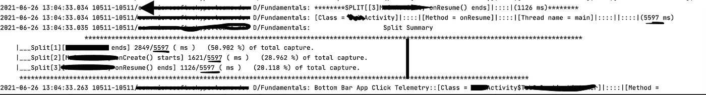

# 认识微软片段——一个用于测量代码执行时间的 Android 库

> 原文：<https://betterprogramming.pub/microsoft-snippet-a-new-open-source-library-for-measuring-code-execution-duration-for-android-30e8bf21457c>

## 提高应用程序的性能


安德里克·朗菲尔德在 [Unsplash](https://unsplash.com/s/photos/time?utm_source=unsplash&utm_medium=referral&utm_content=creditCopyText) 上拍摄的照片

当我们编写 Android 应用程序时，我们必须考虑性能。性能改进的先决条件是测量。所以我试着探索我们已经有的选择。以下是我的要求，

1.  一个可以给出一段代码的执行持续时间的工具，这段代码的范围从多个方法到多个文件。
2.  一个可以剥离样板代码的工具，我们必须编写样板代码来进行测量和记录。
3.  一旦您添加了所有的代码来进行度量，由于显而易见的原因，您不能将代码签入到您的存储库中。这会使代码库变脏。

我找到了几个解决方案:

1.  **Hugo** —这是一个由 Jake Wharton 编写的小库，它可以测量执行一个由库注释的方法所花费的时间。但是有一个限制，你只能测量方法。如果我的用例从一个方法的中间开始，在一个不同的方法中结束，可能在同一个或不同的类文件中。基于用例的度量在这里是不可能的。
2.  **Android profiler** —这并不代表用户将要经历的实际执行时间，这会降低整个应用程序的速度。此外，问题是，当 android studio 和模拟器已经在运行时，它需要大量的工作，并且会降低系统的速度。它会发出大量我的用例不需要的数据。
3.  **TimeLogger 类**——Android 提供了一个 TimeLogger 类，它具有我一直在寻找的某种功能，但并不完全，它也被弃用了。所以我放弃了这个想法。
4.  **自行测量** —需要添加大量代码来记录开始时间和结束时间，然后我们还必须删除这些代码。这将使代码库变得肮脏，并让审查者感到愤怒。

所以最终我想到了建造一个可以:

1.  减少进行测量所需的样板代码，并登录到控制台。
2.  在不影响代码质量的情况下交付生产。
3.  用度量来标记用例，并用收集的数据来构建可以检测回归的门。[ gates 是一种框架，它将历史数据考虑在内，这些数据随着时间的推移分布在不同的提交中，并试图检测回归。当我们有锁定时钟频率的根设备时，它们工作得最好。]
4.  在测量的开始和结束标记之间深入探讨。
5.  有人可以扩展功能并以他们想要的方式使用收集的数据，而不仅仅是登录 logcat。

经过 3 周的头脑风暴和编码**片段**诞生了。

> 它提供了一个干净的 API 来解决我们的问题。你可以在这里找到它。它不仅测量执行时间，还记录所有周围的执行上下文，如类、方法、行、线程等，而我们不需要做任何额外的事情。

[](https://github.com/microsoft/snippet-timekeeper) [## GitHub-Microsoft/snippet-timer:一个测量代码执行时间的 android 库。不需要…

### 一个测量代码执行时间的 android 库。无需删除测量代码，自动变为无效…

github.com](https://github.com/microsoft/snippet-timekeeper) 

要将代码片段添加到您的项目中，请将以下代码添加到应用程序级别`build.gradle`:

```
allprojects **{** repositories **{** maven **{** url 'https://jitpack.io' **}
    }
}**
```

并且，向您的项目级`build.gradle`添加下面的代码，并用您想要的版本的标签替换 version(v1.0)。您可以在存储库的 release 部分找到 release 标签。

```
dependencies **{** implementation 'com.github.microsoft:snippet-timekeeper:v1.0'
**}**
```

设置起来超级简单。如果您希望您的库只在调试版本中进行测量，那么在`Snippet.install(executionPath)` *中安装一个`MeasuredExecutionPath`的实例。*所有其他构建类型(除非指定)将使用默认的`ReleaseExecutionPath`，即无操作路径。建议尽快这样做，以确保您可以在早期执行中使用 Snippet。

通过上面的设置，您的库代码将不会在发布版本中运行。一切都将在调试和发布版本库成为无操作。

现在到了我们进行测量的部分。

假设你有一个需要测量的序列代码，你可以直接把它作为一个 lambda 传递，如下所示

Snippet.capture 的演示(闭包)

只要这样做，度量就会捕获调用的上下文，并将所有细节打印在 logcat 上。

假设我想测量应用程序的启动时间，直到`onStart()`回调触发——我必须在应用程序类中开始测量，并且必须在活动类中结束测量。通过我们上面讨论的 lambda 方法是不可能的。所以我们有一个叫做`LogToken`的东西来处理这个问题(稍后会详细介绍)。

我们可以标记测量，标记需要是唯一的。

1.  只要用标签开始测量，
2.  从代码库中任何位置找到标签，并结束测量。

让我们看看实际情况。我们从第 12 行开始测量。然后我们将找到标签并结束测量。

在应用程序类中开始基于标签的测量

结束活动类中基于标签的测量

注意:如果您正在思考如果在热启动情况下没有发生测量`Snippet.startCapture(tag)`调用会发生什么，并且当活动启动时它调用`Snippet.find(tag).endCapture()`。会崩溃吗？它会显示垃圾数据吗？

答案是否定的。

Snippet 明白在 Android 中，这些事情可能会发生，即使在正确的用户场景下，`end()`也可以被调用而`start()`不会被调用。这就是为什么它在内部使所有这样的调用无效。它不会做任何事情。

这种基于标记的 API 还可以用来标记您的业务用例，如登录、用户数据同步等，您可以扩展 MeasuredExecutionPath 来将这些数据记录到文件或数据库中，并可以从中构建性能门来检测回归。如果一个新的代码将被添加到那个路径中，你会知道的。请检查 repo 并查看如何扩展 ExecutionPath。

# 日志令牌

当我们有时进行度量时，代码并不像在处理回调函数时那样是连续的，在回调函数中我们有嵌套的回调函数。我们不能把所有东西都当作 lambda 来传递。

因此，当您调用`Snippet.startCapture()`时，它会返回一个表示测量值的日志令牌。当您想要结束测量时，可以在其上调用`endCapture`方法。

API 也在内部处理日志标记。`LogToken`很有用，因为在多线程的情况下，标签不会工作，因为每个标签都与一个日志标记相关联。如果您正在启动 n 个并行操作，您需要使用单独的日志标记来跟踪每个操作。这时，您需要直接使用日志标记。

下面的例子并不完美，但足以展示 API 是如何工作的。

```
override fun loadNewsFeed() {
   ** val token = Snippet.startCapture()**
    disposables.add(repository.getNewsFeedSingle()
        .compose(schedulerProvider.ioToMainSingleScheduler())

        .doOnSubscribe **{** liveNewsFeed.*value* = NewsFeedActivityViewModel.Response(*LOADING*,null) **}** .doOnError **{** liveNewsFeed.*value* = NewsFeedActivityViewModel.Response(*ERROR*, null) **}** .map **{** feedListFromRepo **->** mapNewsFeedToUIState(feedListFromRepo) **}** .subscribe **{** listOfFeeds, throwable **->** if (listOfFeeds != null) {
                liveNewsFeed.*value* = NewsFeedActivityViewModel.Response(*SUCCESS*, listOfFeeds)
               ** token.endCapture();**
            }
            if (throwable != null) {
                Timber.e("Not able to load feeds. Possible Cause: $throwable")
            }
        **}**)
}
```

# 执行路径

如果您需要在 Snippet 的基础上进行定制工作，您可以扩展该功能。它在存储库自述文件中用一个示例进行了详细演示。

# 分裂

有时，我们还需要深入了解在`start()`和`end()`捕获之间发生了什么。

因为该代码片段具有可以测量捕获中的小部分的分割。只需获得日志令牌并在其上调用`addSplit()`。它将测量从上次调用`addSplit()`到现在所经过的时间。

使用`endCapture()`结束计算后，它还会显示一个分割汇总，以显示测量值的鸟瞰图，如下所示。



拆分摘要。

Snippet 中还有其他的特性，但是我们会在其他的帖子中讨论。