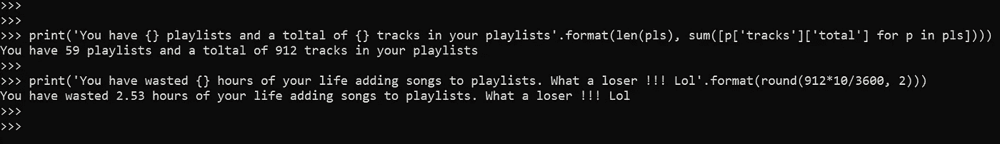
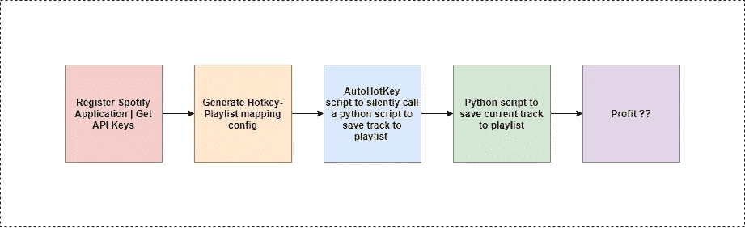
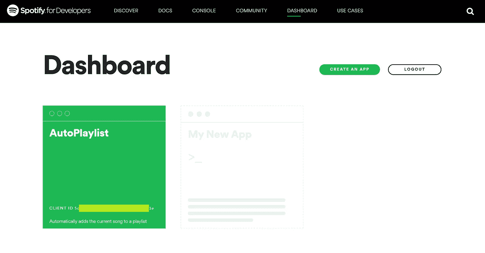
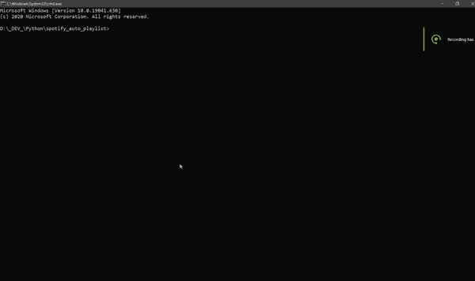

# 午夜黑客 4:自动化 Spotify

> 原文：<https://betterprogramming.pub/midnight-hack-episode-4-automating-spotify-mapping-spotify-functions-to-keyboard-shortcuts-3ea5302bb2cb>

## 将 Spotify 功能映射到键盘快捷键

图片来源:作者 via [Spotify](https://www.spotify.com/in/) 和[黑客 Hack Security——pix abay 上的免费图片](https://pixabay.com/illustrations/hacker-hack-security-cyber-4685929/)

# TLDR；

如果你不想通读整篇文章，这里是我们正在建设的。我们正在建立一个自动化管道，根据按下的快捷键，自动将当前播放的 Spotify 曲目保存到用户播放列表中。执行是独立于设备的，这意味着您可以在手机上播放曲目，在电脑上按下 Alt+1，您可以将曲目添加到播放列表 1，或者使用 Alt+2，您可以将其添加到播放列表 2。

执行也是一个后台进程，所以它不会影响您的活动工作窗口或您在计算机上正在做的任何工作。

好了，我们开始吧。

我为什么需要这个？我做了一些基础工作。当你在工作时，为了切换到 Spotify，点击歌曲上的三个点，找到我想添加到的播放列表，并将其保存到一个播放列表，这花了我大约 13 秒。让我们把它四舍五入到十秒钟，因为我是一只树懒。

对于我的播放列表中所有的 912 首歌曲，总共有 2.53 个小时我可以用来思考我在做什么。

此外，切换应用程序来完成这项任务有点不方便。所以让我们来自动化这个。我们是这样做的:

开发流程

# 1.获取 Spotify API 密钥

转到[https://developer.spotify.com/dashboard/applications](https://developer.spotify.com/dashboard/applications)并创建一个新应用程序。保存`client_id`和`client_secret`。

转到“编辑设置”并添加一个重定向网址，如[https://example.com/callback](https://example.com/callback)。这将用于 OAuth 和生成用户令牌。

因为我们只需要生成一次用户令牌，所以不需要一个活动的服务器来捕获重定向的 URL。我们可以复制重定向的 URL 并创建一个用户令牌。下一步会有更多的介绍。

屏幕上显示程序运行的图片

# 2.生成热键-播放列表映射配置

现在我们有了`client_id`和`client_secret`，我们可以得到一个用户令牌、一个用户播放列表列表和播放列表 id。我使用了一个名为 [spotipy](https://spotipy.readthedocs.io/en/2.16.1/) ***的 Spotify Python 库。***

我创建了一个小脚本来验证用户，列出用户播放列表，并提示用户选择他们想要将热键映射到的播放列表。我用过 Alt+num，但是可以是你想要的任何东西。

同样的要点如下:

该脚本生成一个配置文件`playlist_mapping.config` **，**，用于在保存曲目时查找热键播放列表。

下面是该脚本实际运行的样子:

# 3.自动热键脚本

为了监控热键触发器，我们需要一个输入监控服务。自动热键是一个非常好的工具。一旦自动热键脚本运行，它会监控热键并触发 AHK 脚本中指定的适当操作。另外，你也可以在启动时添加 AHK 脚本，这样你就不必每次启动电脑时都运行 AHK 脚本。

有多种方法可以做到这一点，但我使用了`Run` 命令，它运行特定目录中的可执行文件或程序。

以下是 cmd 格式:

<hotkey>:【运行】，<command_to_execute>，</command_to_execute></hotkey>

这是我的剧本:

`!`代表 *Alt* 。所以，当我按 Alt+1 时，AHK 脚本触发了`D:\_DEV_\Python\spotify_auto_playlist`目录中的`python3w spotify_api.py 1` 命令。

注意，我用的是`python3w` 而不是`python3`。`python3w`在后台运行脚本。

保存脚本后，右键单击并运行服务。

# 4.将当前曲目保存到播放列表的 Python 脚本

这个脚本从 AHK 脚本接收一个位置参数，用来标识热键。通过 Spotify API 使用我们在第一步中生成的热键-播放列表查找配置和当前曲目 ID，我们可以将当前曲目添加到用户之前定义的任何播放列表中。

剧本是这样的:

就是这样。

# 这是实际使用的产品

在左侧，我们有应用程序日志，它显示按下的热键和关于哪个曲目被保存到哪个播放列表的信息。在右边，我们有 Spotify 桌面播放器。

这里展示的应用日志和 Spotify 播放器只是为了演示。这首歌可以在你的手机上播放，如果你按 Alt+1，它会将当前播放的曲目保存到用户在第一个槽中定义的播放列表中。

Spotify 播放列表自动化演示的屏幕截图

如果您有任何建议或意见，请写在下面。