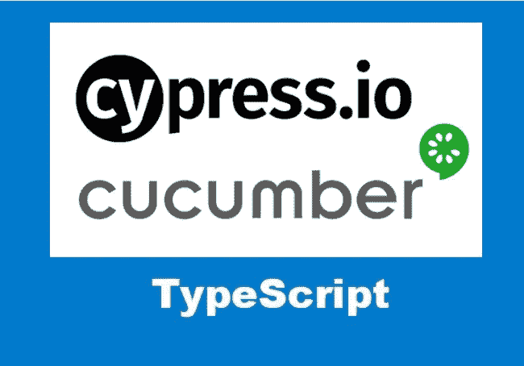

# 迁移 Cypress Cucumber 项目以使用 TypeScript

> 原文：<https://betterprogramming.pub/migrate-a-cypress-cucumber-project-to-use-typescript-407c612d2f34>

## 将 Cypress Cucumber 项目从 JavaScript 迁移到 TypeScript 的分步指南



大约两年前，我开始了我的第一个柏树和黄瓜项目。当时，Cypress 版没有内置对 TypeScript 的支持。该项目是用 JavaScript 而不是 TypeScript 编码的。那是一个昂贵的决定。随着项目的增长，更多的测试被添加，更多的开发人员在项目上工作。没有编译时类型检查，代码质量会迅速下降。

最近，我们成功地将项目迁移到了 TypeScript。我很高兴地发现 Cypress 版本 8 对 TypeScript 有很好的支持。(Cypress 实际上从 4.4.0 版本开始支持 TypeScript)。

迁移并不难，但我确实学到了一些技巧。在本文中，我将分享我在迁移练习中所学到的东西。

# 概观

迁移过程包括以下四个步骤:

*   安装程序类型脚本
*   更新 Cypress Cucumber 预处理器配置以支持 TypeScript
*   为自定义命令添加类型定义文件，并将 Cypress `command.js`转换为 TypeScript
*   将 js 文件更改为 ts 文件

完成以上步骤并不是故事的结束。为了充分利用 TypeScript 的优势，我们需要在编写命令和测试时牢记类型。

让我们一步一步来。我们还将讨论如何“用类型思考”

# 安装程序类型脚本

首先，我们需要将 TypeScript 安装到项目中:

```
npm install --save-dev typescript
```

下一步是添加具有以下设置的`tsconfig.json`文件:

从 Cypress 4 . 4 . 0 版开始，它就附带了 TypeScript 类型。在上面的配置中，`"types"`将告诉 TypeScript 编译器包含来自 Cypress 的类型定义。

# 更新 Cypress Cucumber 处理器配置以支持 TypeScript

在这个项目中，我们使用 Cypress 和[cumber](https://cucumber.io/)，一个行为驱动开发(BDD)工具。它允许我们用[小黄瓜](https://cucumber.io/docs/gherkin/)语法编写更多可读的测试。

为了整合它们，安装了一个 cypress 插件`[cypress-cucumber-processor](https://github.com/TheBrainFamily/cypress-cucumber-preprocessor)`。该插件提供了将特征文件转换为 Cypress 测试的支持。

在迁移之前，这个插件与 Cypress 连接在一起，作为一个文件预处理程序。

```
const cucumber = require('cypress-cucumber-preprocessor').defaultmodule.exports = (on, config) => {
   on('file:preprocessor', cucumber())
}
```

要迁移到 TypeScript，我们需要在`cypress/plugins/index.js`文件中做一些更改:

上述更改允许预处理器将 cucumber 特征文件转换为 TypeScript。默认的 Cypress 预处理器是 [webpack 预处理器](https://github.com/cypress-io/cypress/tree/master/npm/webpack-preprocessor)。我们在这里选择使用 [browserify 预处理器](https://github.com/cypress-io/cypress-browserify-preprocessor)，因为我发现它比 webpack 更容易配置。

# 添加自定义命令类型定义文件

我们需要为自定义命令添加类型定义文件。定义文件可以在`*support/index.d.ts*` *添加。然后，我们可以在文件中声明自定义命令。*

```
declare namespace Cypress {
   interface Chainable<Subject> {
      validateUser(userName: string): Chainable<boolean>;
      // Other commands
   }
}
```

请注意，我们向全局`Chainable` 接口添加了自定义命令。该命令也返回一个`Chainable` 对象。`Chainable` 对 Cypress 就像对 JavaScript 的承诺。

如果您在`*support/commands.js*`已经有了命令，将其重命名为`*support/commands.ts.*` 您可能需要更新参数的类型并返回命令的类型。

```
Cypress.Commands.add(
  "validateUser",
  (userName: string): Cypress.Chainable<boolean> => {
    ....
  }
);;
```

# 将 JavaScript 测试文件更改为 TypeScript 文件

这一步只是将文件扩展名从 js 重命名为 ts。

由于我们项目中有大量的测试文件，我写了一个批处理文件在`integration` 文件夹中进行递归重命名。该脚本的要点如下:

```
for f in integration/**/*.js
do
  mv "$f" "${f%.js}.ts"
done
```

# 类型思维

TypeScript 是关于类型的。类型脚本的主要[好处是类型安全](https://medium.com/p/fef5ff939c98)。在迁移过程中，最耗时的部分是在启用 TypeScript 后纠正到处出现的错误。这些错误在 JavaScript 中是检测不到的，它们会导致不正确或误报的测试行为。修复它们是对移民的直接回报。

迁移到 TypeScript 并不意味着我们自动获得好处。如果我们仍然像以前一样编写测试，旧的问题仍然会存在。一个常见的错误是到处使用`any` 。使用`any`可能会给你一个快速修复，但是它隐藏了编译时的潜在错误。

另一个简单的“使用类型”的例子是为测试环境定义类型。在我们的项目中，我们有三个测试环境:`dev`、`test` 和`uat`。环境变量是硬编码的，分布在许多测试文件中。

我们可以使用下面的`union`类型:

```
export type Environment: 'dev' | 'test' | 'uat';
// apply the type to function
export function setServiceEnv(env: Environment) {...}
```

使用简单的`Environment` 类型，任何无效的参数用法都会在编译时被捕获。我们在 VSCode 中也获得了很好的智能感知支持。

正确使用强类型需要一些练习。但是一旦你得到了，你就会爱上它，再也不想回到以前的生活方式了！

要了解更多关于打字稿类型的技巧，你可能想阅读[这篇文章](https://medium.com/p/5aa39bda8049)。

# 摘要

我们 cypress 项目的 TypeScript 迁移是成功的。类型检查不仅提高了代码质量，还使编码更容易，因为开发人员可以利用 VS 代码中的自动完成功能。

如果您仍然在用 JavaScript 编写 Cypress 测试，那么是时候转向 TypeScript 了！