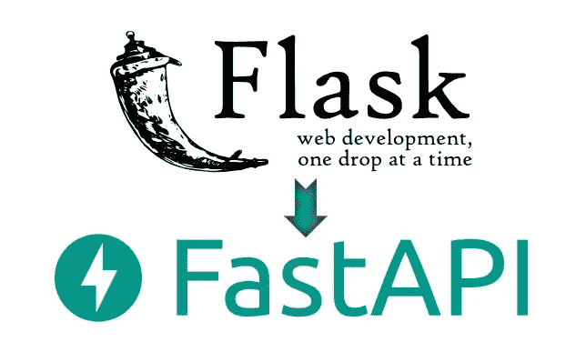
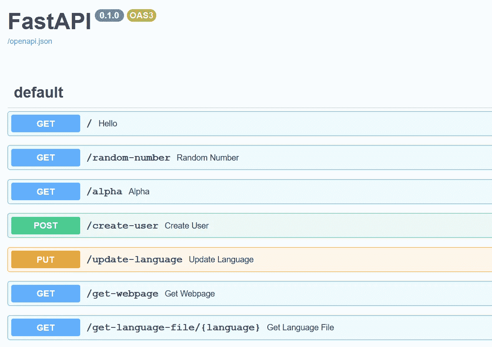
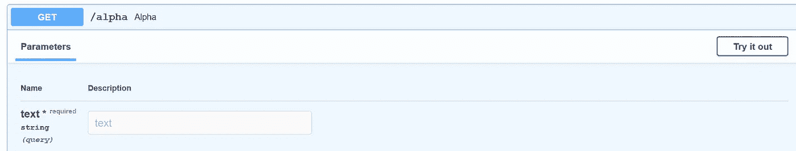
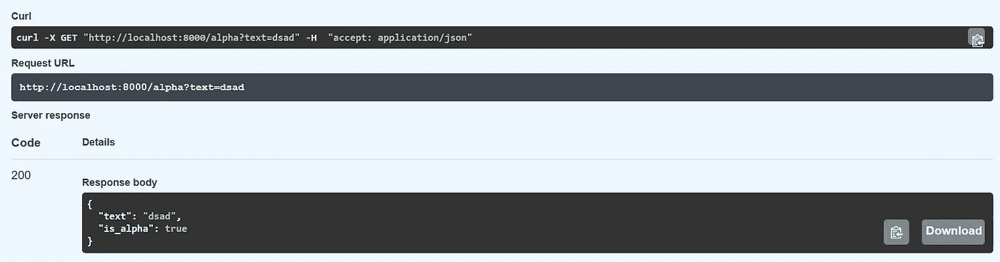
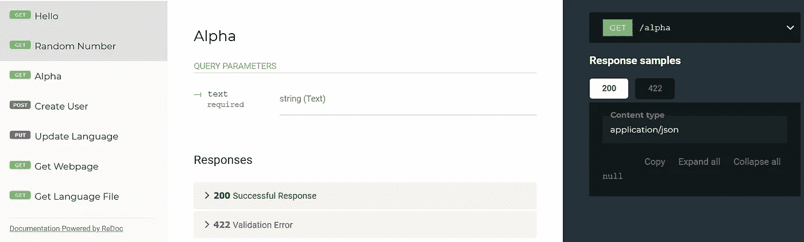

# 顺利地从 Flask 迁移到 FastAPI

> 原文：<https://betterprogramming.pub/migrate-from-flask-to-fastapi-smoothly-cc4c6c255397>

## 转换您的 Flask 服务器以获得更好的性能和可维护性



图片由作者提供。

通过阅读这篇文章，你将了解到`FastAPI`背后的基本概念，以及从`Flask`过渡到`FastAPI`的步骤。并列比较将提供给你的参考。在本教程结束时，您应该能够将您的`Flask`服务器完全迁移到`FastAPI`服务器中。基于[官方文档](https://fastapi.tiangolo.com/)，`FastAPI`框架为:

> “…一个现代、快速(高性能)的 web 框架，用于基于标准 Python 类型提示使用 Python 3.6+构建 API。”

众所周知，`Flask`是一个微 web 框架，是 100% `WSGI` (Web 服务器网关接口)。向前看，`ASGI` (异步服务器网关接口)是`WSGI`的精神继承者，因为`ASGI`能够通过支持`HTTP/2`和`WebSockets`在 IO 绑定的上下文中实现高吞吐量，而这是`WSGI`无法处理的。

随着技术的进步，一款名为`Uvicorn`的快如闪电的`ASGI`服务器诞生了。但是，`Uvicorn`只是一个 web 服务器，没有任何路由能力。然后，`Starlette`出现了，它在`Uvicorn`、`Daphne`或`Hypercorn`等`ASGI`服务器上提供了一个完整的`ASGI`工具包。如果你要找一个直接的比较，`Starlette`是一个`ASGI` web 框架，而`Flask`是一个`WSGI` web 框架。

`FastAPI`框架充分利用了`Starlette`背后的功能和`Flask`的编程风格，使其成为一个类似烧瓶的`ASGI` web 框架。此外，它还包含以下特性，这些特性使它成为创建 RESTful API 的理想 web 框架:

*   数据验证:使用在运行时强制类型提示的`Pydantic`。当数据无效时，它还提供用户友好的错误。
*   文档:支持带有 JSON 模式的自动数据模型文档。带有`Swagger UI`或`ReDoc`。

通过使用`FastAPI`而不是`Flask`，您的 web 服务器将拥有随时可用的数据验证和数据模型文档，即使您在任一框架中花费的编码时间大致相同。因此，它有助于改进您团队中的开发过程。

让我们继续下一部分，开始安装必要的模块。

# 1.设置

强烈建议您在继续安装之前创建一个虚拟环境。如果你打算测试 FastAPI，你只需要安装`FastAPI`和`Uvicorn`。其余的包是可选的，只有在您打算按照本教程学习时才是必需的。

## FastAPI

通过`pip install`，安装非常简单。

```
pip install fastapi
```

## 紫玉米

为`FastAPI`推荐的`ASGI`服务器是`Uvicorn`。运行以下命令进行安装:

```
pip install uvicorn
```

## Jinja2(可选)

如果您打算通过模板提供网页，您可以使用任何带有`FastAPI`的模板引擎。为了简单起见，让我们安装`Jinja2`，它与 Flask 使用的模板引擎相同。

```
pip install jinja2
```

## Aiofiles(可选)

如果你需要为用户提供静态文件，你也需要安装`aiofiles`。

```
pip install aiofiles
```

## Python-multipart(可选)

默认情况下，`FastAPI`将输入请求标准化为 JSON。如果你需要接收表单域，你必须安装`python-multipart`。

```
pip install python-multipart
```

## 烧瓶(可选)

本教程将展示一个`Flask`服务器及其使用`FastAPI`的等效功能。安装 Flask，当且仅当您打算进行并排比较以供参考时。否则，您可以安全地忽略这个模块，转而运行`FastAPI`服务器。

```
pip install flask
```

让我们进入下一部分，并开始实施

# 2.比较

在本节中，将提供代码以及对`Flask`服务器和`FastAPI`服务器的解释。两台服务器将具有相同的 API 和功能。

## 进口(烧瓶)

进口申报对`Flask`来说非常简单，因为所有东西都打包在烧瓶包装下。`random`模块将在稍后的一个 API 中用于生成随机数。

```
from flask import Flask, request, jsonify, render_template, send_from_directoryimport random
```

## 导入(FastAPI)

另一方面，对于`FastAPI`，进口报表被分类到不同的包中。下面的代码片段包括对表单域输入的支持，以及对返回不同类型响应的支持。此外，它还可以通过模板引擎提供静态文件和 HTML 文件。

如果您正在寻找一个最简单的导入语句，它应该是这样的

```
from fastapi import FastAPIfrom pydantic import BaseModel
import random   # needed for generating a random number for an API
import uvicorn  # optional if you run it directly from terminal
```

## 初始化(烧瓶)

`Flask`中的初始化代码简单如下。`Flask`将为您处理静态文件和模板引擎。

```
app = Flask(__name__)
```

## 初始化(FastAPI)

除了标准的初始化之外，您还需要挂载用于服务静态文件的路径。同样，您必须通过模板引擎声明一个用于呈现的变量。大多数初始化代码围绕着基于`Pydantic`语法创建数据模型类。

## 你好世界(烧瓶)

让我们看看下面的代码片段，它创建了一个向用户返回字符串的路由。

```
@app.route('/')
def hello():
    return "Hello World!"
```

## 你好世界(FastAPI)

`FastAPI`的“Hello World”功能等效如下。默认情况下，它将返回 JSON 作为响应。因此，您需要将`response_class`改为`PlainTextResponse`来返回一个字符串。

`async`不是必需的，但是它使得处理异步代码更加容易。建议定义它，除非您正在处理不支持异步的代码。

```
@app.get("/", response_class=PlainTextResponse)
async def hello():
    return "Hello World!"
```

## 随机数(烧瓶)

假设您有一个 API，它返回一个随机生成的数字。在`Flask`服务器中，您的代码应该如下所示。

```
@app.route('/random-number')
def random_number():
    return str(random.randrange(100))
```

## 随机数(FastAPI)

对于`FastAPI`服务器，您可以轻松修改如下:

```
@app.get('/random-number', response_class=PlainTextResponse)
async def random_number():
    return str(random.randrange(100))
```

## 检查伊萨法(烧瓶)

接下来，我们将测试一个 API，它接受一个名为`text`的查询参数并返回 JSON 作为结果。在 Flask 中，该方法是通过 route decorator 设置的。在这种情况下，我们将其设置为仅接受`GET`请求。

```
@app.route('/alpha', methods=['GET'])
def alpha():
    text = request.args.get('text', '') result = {'text': text, 'is_alpha' : text.isalpha()} return jsonify(result)
```

## 检查`isAlpha` (FastAPI)

HTTP 方法从一开始就和装饰器一起定义。用`FastAPI`术语来说，这叫做操作。对于`GET`操作，你需要称之为`app.get`。对于具有相同功能的多个 HTTP 方法，您必须将逻辑封装在一个函数中，并在每个操作中独立调用它。

查询参数需要与类型提示一起指定。`text: str`表示需要的字符串查询参数，称为`text`。您可以为其分配默认值`text = ‘text’`，使其成为可选参数。

```
@app.get('/alpha')
async def alpha(text: str):
    result = {'text': text, 'is_alpha' : text.isalpha()}return result
```

## 创建新用户(烧瓶)

大多数情况下，您会收到一个向数据库添加新数据的`POST`请求。让我们看看下面的例子，它接受两个表单字段并返回一个 JSON 结果。

## 创建新用户(FastAPI)

`POST`操作通过`app.post`装饰器处理。当您声明输入参数时，您需要指定`Form(…)`，因为默认实现是基于 JSON 或查询参数的。

## 更新语言(烧瓶)

到目前为止，我们已经讨论了查询参数和表单字段。让我们看看另一个例子，它将基于 JSON 输入更新一个名为`language`的变量。对于更新现有数据，建议使用`PUT`方法。下面的代码片段将展示如何通过条件语句来实现，而不是直接指定`PUT`方法。

## 更新语言(FastAPI)

同样，`PUT`操作通过`app.put`装饰器调用。在初始化过程中，我们声明了下面的类

```
class Item(BaseModel):
    language = 'english'
```

我们将把它作为类型提示传递给`item`输入参数。它将在后台被正确解析。您可以简单地使用`variable_name.attribute_name`语法进行调用。这种情况下是`item.language`。

```
@app.put('/update-language', response_class=PlainTextResponse)
async def update_language(item: Item):
    language = item.languagereturn "Successfully updated language to %s" % (language)
```

## HTML 网页(烧瓶)

在 Flask 中提供 HTML 网页相对简单，因为它使用了`Jinja2`模板引擎。你需要做的就是在一个名为 templates 的文件夹中声明 HTML 文件。如果您提供静态文件，您需要将它包含在一个名为 static 的文件夹中。

下面的例子将使用`index.html`渲染一个网页。变量可以作为输入参数传递，如下所示:

```
@app.route('/get-webpage', methods=['GET'])
def get_webpage():
    return render_template('index.html', message="Contact Us")
```

## HTML 网页(FastAPI)

在初始化过程中，我们安装了一个名为`static`的文件夹，用于存放静态文件

```
app.mount("/static", StaticFiles(directory="static"), name="static")
```

此外，我们还为`Jinja2Templates`创建了一个变量。它将用于呈现 HTML 模板。

```
templates = Jinja2Templates(directory="templates")
```

您需要将`response_class`改为`HTMLResponse`，以便提供 HTML 网页。如果不使用模板引擎，可以将结果作为字符串返回。

需要返回一个模板和你自定义参数。

```
@app.get('/get-webpage', response_class=HTMLResponse)
async def get_webpage(request: Request):
    return templates.TemplateResponse("index.html", {"request": request, "message": "Contact Us"})
```

## 文件响应(烧瓶)

向用户返回文件的推荐方式是通过内置的`send_from_directory()`函数，尤其是路径或文件来自用户的输入。它接受两个主要输入:

*   文件所在的路径
*   文件的名称

此外，您可以指定额外的参数，如`as_attachment`，它将修改`Content-Disposition`头，将其指定为附件。

您可以使用下面的语法`<type:variable_name>`指定 path 参数。这种情况下就是`<string:language>`。

```
@app.route('/get-language-file/<string:language>', methods=['GET'])
def get_language_file(language):
    return send_from_directory('./static/language', language + '.json', as_attachment=True)
```

## 文件响应(FastAPI)

根据您的要求和需要,`FastAPI`带有相当多的`Response`类型。要返回文件，您可以选择使用`FileResponse`或`StreamingResponse`。在本教程中，我将展示`FileResponse`。它接受以下输入。

*   `path`:要流式传输的文件的文件路径。
*   `headers`:要包含的任何自定义标题，作为字典。
*   `media_type`:给出媒体类型的字符串。如果未设置，文件名或路径将用于推断媒体类型。
*   `filename`:如果设置，这将包括在响应`Content-Disposition`中。

让我们看看下面的代码片段，以便更好地了解它是如何工作的。

## 主要(烧瓶)

在 Flask 中，您可以按如下方式指定主函数:

```
if __name__ == '__main__':
    app.run('0.0.0.0',port=8000)
```

然后，在终端中通过以下命令运行该文件:

```
python myapp.py
```

## Main (FastAPI)

对于`FastAPI`，需要导入`uvicorn`

```
import uvicorn
```

并指定主函数如下(`myapp`指文件名，`app`指为`FastAPI`实例声明的变量名):

```
if __name__ == '__main__':
    uvicorn.run('myapp:app', host='0.0.0.0', port=8000)
```

然后，您可以从终端正常运行它:

```
python myapp.py
```

但是，推荐的方法是从终端直接通过`uvicorn`运行它，而不需要调用 main 函数。

```
uvicorn myapp:app
```

您可以指定其他参数，例如:

*   `reload`:启用自动重装，当你对文件进行修改时，自动重装会刷新服务器。对地方发展极其有用。
*   `port`:服务器的端口号。默认是`8000`。

下面的例子将使用`5000`作为端口号。

```
uvicorn myapp:app --reload --port 5000
```

## Flask 服务器

查看下面的[要点](https://gist.github.com/wfng92/42269866a47298e7409b04f4b200bfac)以获得`Flask`服务器的完整代码。

## FastAPI 服务器

以下[要点](https://gist.github.com/wfng92/d278a3df8e9dd5f5c32c32386dd09b57)包含使用`FastAPI`的相同功能的完整代码。

# 3.证明文件

一旦你运行了`FastAPI`服务器，你将可以访问另外两条记录文件的路径。

## 交互文档(Swagger UI)

第一个是`Swagger UI`提供的交互文档。如果您在端口`8000`上运行服务器，您可以通过以下 URL 访问它

```
[http://localhost:8000/docs](http://localhost:8000/docs)
```

您应该会看到以下网页:



作者提供的截图。

它是一个交互式文档，您可以在其中单独测试 API。当你点击`/alpha`路线时，你应该会看到下面的界面。



作者提供的截图。

单击“试用”按钮，并在文本字段中输入一个字符串。接下来，单击“执行”按钮，您应该会得到以下结果:



作者提供的截图。

## 雷多克

此外，`FastAPI`还附带了由`ReDoc`提供的替代文档。您可以通过以下 URL 访问它:

```
[http://localhost:8000/redoc](http://localhost:8000/redoc)
```

您应该会看到以下文档。



作者提供的截图。

# 4.结论

让我们回顾一下今天所学的内容。

我们首先简要介绍了背景，并解释了`FastAPI`背后的核心概念。然后，我们继续安装运行`Flask`和`FastAPI`所需的模块。

安装完成后，我们测试了用不同的 HTTP 方法、输入请求和输出响应实现几个 API。结果，我们看到了不同之处，并学会了做出必要的修改，将我们的代码从 Flask 转移到`FastAPI`的等效功能中。

到目前为止，您应该对基于您的用例将您的`Flask`服务器迁移到`FastAPI`服务器有了基本的了解。

# 参考

1.  [uvicon Github 页面](https://github.com/encode/uvicorn)
2.  [uv icon 文档](https://www.uvicorn.org/)
3.  [FastAPI Github 页面](https://github.com/tiangolo/fastapi)
4.  [FastAPI 文档](https://fastapi.tiangolo.com/)