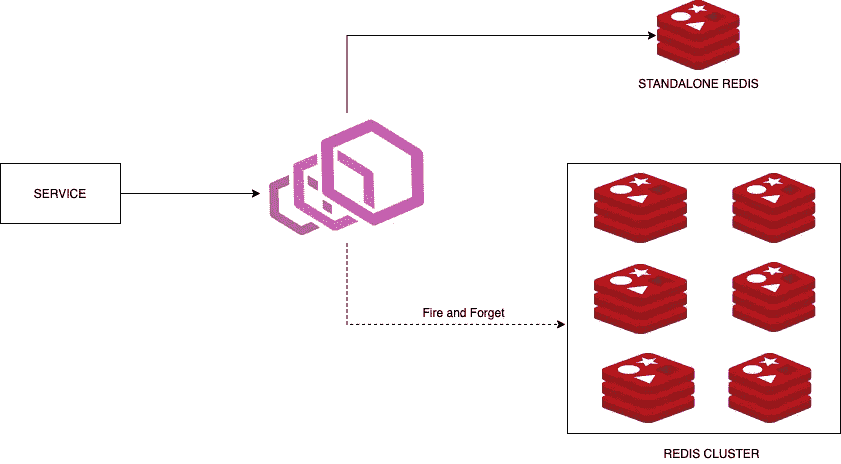
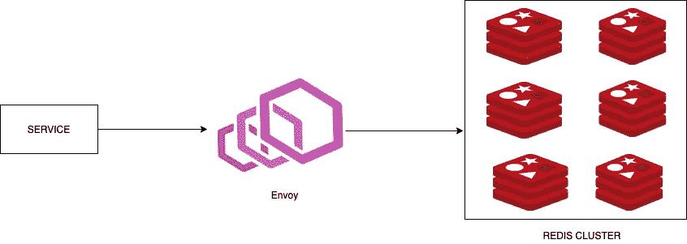
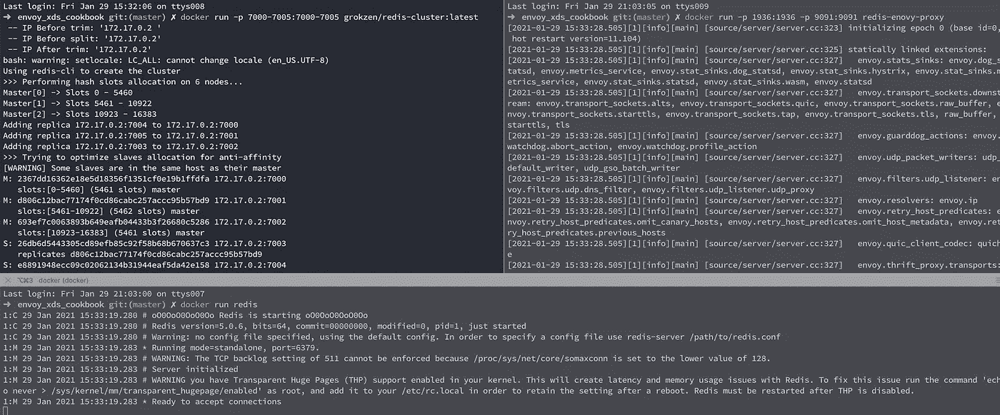
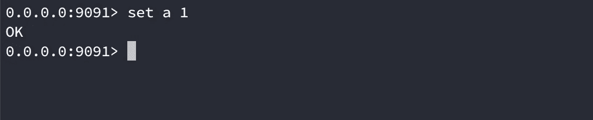
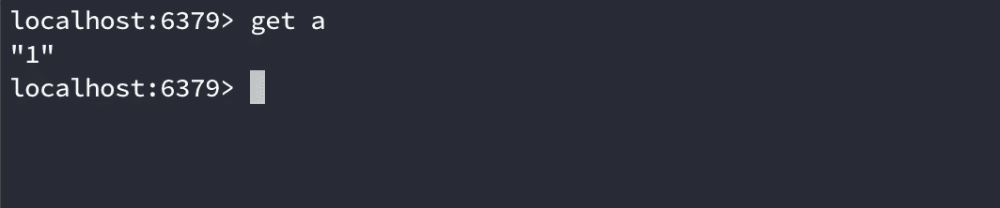
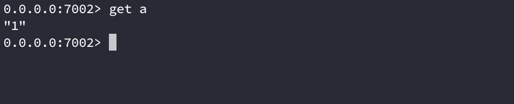
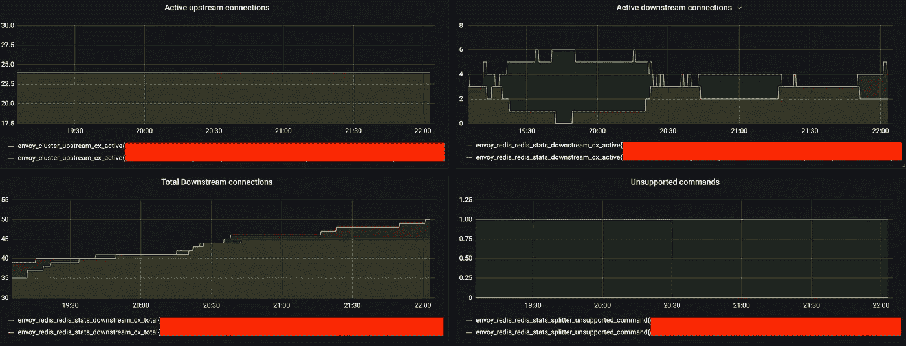

# 将数据从独立 Redis 迁移到 Redis 集群

> 原文：<https://betterprogramming.pub/migrate-from-standalone-redis-to-redis-cluster-f45b219330a3>

## 告别停机时间


照片由[萨法尔·萨法罗夫](https://unsplash.com/@codestorm?utm_source=medium&utm_medium=referral)在 [Unsplash](https://unsplash.com?utm_source=medium&utm_medium=referral) 拍摄

出于各种原因，您可能希望从独立的 [Redis](https://redis.io/) 迁移到 Redis 集群。一旦决定要迁移，并设置了 Redis 集群，下一个问题就是如何迁移现有数据。有多种方法可以做到这一点。

## 更新代码

这将涉及从 Redis 客户机迁移到 Redis 集群客户机，并确保所有的更改都是向后兼容的。实现这一点的一种方法是设置一个开关，既写入 Redis 又写入 Redis 集群，同时只从独立的 Redis 读取数据。一旦 Redis 集群中不存在的所有密钥的 TTL 过期，我们最终可以弃用独立的 Redis。

## 使用特使

[特使](https://www.envoyproxy.io/docs/envoy/latest/#)自带一堆网络过滤器，`redis_proxy`是其中之一。在这种方法中，Envoy 将处理从独立 Redis 到 Redis 集群的镜像请求，完全不需要修改代码。您所需要做的就是更新您的 Redis 主机配置，以指向 Envoy 而不是独立的 Redis。

# 设置

这是设置的样子。您的服务将与 Envoy 进行交互，Envoy 负责将请求路由和镜像到集群。



迁移期间

一旦我们迁移了所有的数据，独立的 Redis 将被弃用。



迁移后

# 1.设置 Redis 和 Redis 集群

我们将使用以下 Docker 图像:

```
redis -> [https://hub.docker.com/_/redis](https://hub.docker.com/_/redis)
redis cluster -> [https://github.com/Grokzen/docker-redis-cluster](https://hub.docker.com/r/grokzen/redis-cluster/)
```

您可以使用以下命令运行它们:

```
docker run -p 6379:6379 redis
docker run -p 7000-7005:7000-7005 grokzen/redis-cluster:latest
```

Redis 集群设置有三个主要集群和三个辅助集群。

现在我们已经在本地启动了 Redis 和 Redis 集群，我们可以开始处理特使部分了。

# 2.迁移的特使设置

我们将使用以下 Docker 图像:

```
envoy -> [https://hub.docker.com/r/envoyproxy/envoy](https://hub.docker.com/r/envoyproxy/envoy) {v1.17.0}
```

特使配置

## 让我们看一下特使配置

在过滤器链内部，我们使用 Envoy 提供的`envoy.filters.network.redis_proxy`。

`stat_prefix`:定义发布指标时使用的前缀。在文档中可以找到发出的所有指标的列表[。](https://www.envoyproxy.io/docs/envoy/latest/configuration/listeners/network_filters/redis_proxy_filter#config-network-filters-redis-proxy-stats)

`settings`:连接池的网络设置。

`op_timeout`:每次操作超时。当管道的第一个命令被写入后端连接时，计时器启动。

`enable_redirection`:在[移动和重定向错误](https://redis.io/topics/cluster-spec#redirection-and-resharding)的情况下，对指定目标重试命令。如果你不把这个设置为`true`，你的写操作可能会从`(error) MOVED 8333 172.17.0.2:7001`开始失败。

`prefix_routes`:让您能够根据请求前缀将请求路由到不同的集群(上游)。

`catch_all_route`:因为我们不想将路由映射到特定的集群，所以使用了`catch_all_route`，它会将所有请求转发到一个集群。

`request_mirror_policy`:顾名思义，这是用于镜像请求的。请注意，您可以从独立镜像到集群，也可以从集群镜像到集群。

`cluster`:要镜像到的集群的名称。

`exclude_read_commands` : `True`仅镜像写命令。

`clusters`:不要将其与 Redis 集群混淆。Envoy 中的集群是请求被路由的上游。它可以是服务、独立 Redis、Redis 集群等。

`name`:集群的名称。

`connect_timeout`:集群中主机的新网络连接超时。

`cluster_type`:集群的类型。让特使知道这是一个 Redis 集群。

`load_assignment`:集群的每个成员都是用这个配置指定的。可以把它看作服务(集群)的不同实例。

`endpoints`:负载平衡的端点列表。

`lb_endpoints`:端点组。

`endpoint`:上游主机标识符。

Dockerfile 文件

使用以下命令构建 Docker 文件并运行映像:

```
docker build -t redis-envoy-proxy .docker run -p 1936:1936 -p 9091:9091 redis-envoy-proxy
```

现在整个设置完成了。我们已经运行了 Envoy、Redis 和 Redis 集群的实例。通过 Envoy 的每个新写入也应该复制到 Redis 集群。

让我们验证当前的设置。访问`[http://localhost:1936/clusters](http://localhost:1936/clusters)`(管理门户)查找在 Envoy 上注册的所有集群。您应该找到两个上游，standalone_redis 和 redis_cluster。

当前的实现是“一劳永逸”，这意味着 Envoy 在从主集群返回响应之前不会等待影子集群的响应。



运行所有 Docker 容器



通过特使设置值



检查独立 Redis 中的值



检查 Redis 集群成员中的值

注意:确保在特使之前运行 Redis 和 Redis 集群。

# 3.迁移完成后的特使设置

一旦 Redis 集群中不存在的所有密钥的 TTL 过期，我们可以考虑放弃独立的 Redis，因为所有新的密钥都将存在于 Redis 集群中。

迁移后的特使配置

新配置的以下内容发生了变化:

*   所有请求现在都被路由到 Redis 集群。
*   请求镜像被禁用。
*   独立 Redis 不再是 upstream 的一部分。

现在停止前面的容器，重新构建映像，并再次运行容器。

随意停止独立的 Redis 容器。

访问`[http://localhost:1936/clusters](http://localhost:1936/clusters)`找到所有在 Envoy 上注册的集群。您应该只找到一个上游 redis_cluster。

现在我们已经完成了没有独立 Redis 的最终设置。

# 统计数字

访问`[http://localhost:1936/stats/prometheus](http://localhost:1936/stats/prometheus)`,了解 Envoy 发布的所有指标。您可以在 Grafana 上绘制它们，如图所示。



样本指标

差不多就是这样！感谢您的阅读，我希望您喜欢这篇文章。