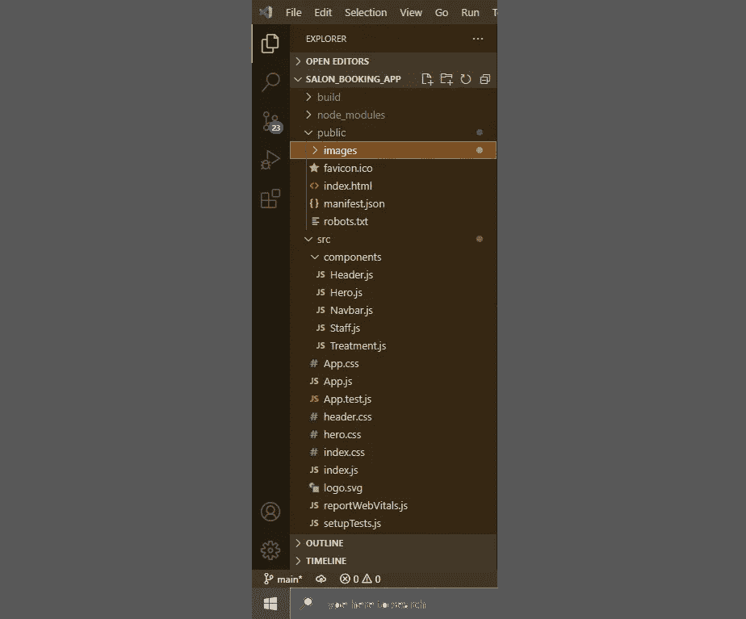
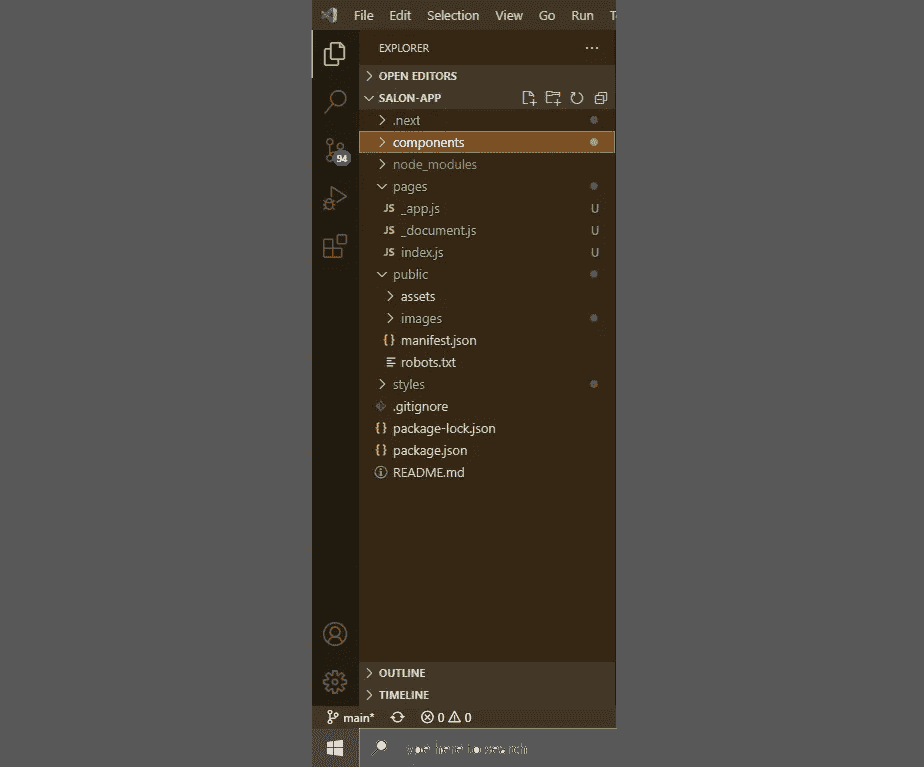

# 将 Create-React-App 迁移到 NextJS

> 原文：<https://betterprogramming.pub/migrating-a-complete-creat-react-app-to-nextjs-ba6edd8e64f1>

## 并且知道这两个框架之间的细微差别


图片来自 [ijsto](https://github.com/ijsto/reactnextjssnippets)

我最近开始为一个沙龙开发一个 web 应用程序，其中包括一个预订系统。我想以这样一种方式设计它，用户可以很容易地通过应用程序导航，所以我想有一个主页，这将是应用程序的起点，将有关于沙龙的所有信息，然后有另一个页面将处理预订系统。

我开始用 CRA 编写完整的主页，并很快意识到我必须将它移到 Next.js。不幸的是，我无法找到关于我的确切问题的帮助，因为我必须更改我的大部分功能，以便它们在 Next 上工作。下面的文章是如何将完整的 CRA 迁移到 Next.js 的分步指南，以及在整篇文章中帮助我的一些资源。

## 关于创建-反应-应用

React 是一个库，用于通过构建可重用的组件来创建交互式用户界面。Create-react-app 是在 react 中构建单页面应用程序最快捷、最简单的方法。它设置了您的开发环境，因此您可以花更少的时间来考虑细节，花更多的时间来创建一个漂亮的界面。

## 关于 NextJS

Next.js 是一个 React 框架，让你更容易构建高效的 web 应用。它使您能够从单页应用程序转移到内容丰富的应用程序，您可以通过简化创建路线的过程来导航。它还通过利用按需呈现而不是构建时呈现的概念来提高应用程序的性能。

## 目标

将一个完整的 SPA 及其所有组件和样式迁移到 Next.js。

## 先决条件

这篇文章是关于 Next.js 的，它是一个 React 框架。你应该了解 web 开发，React.js 库和 Next.js 的部分知识是必要的。

本文假设您已经创建了 React 应用程序，或者已经完成了单页应用程序，或者已经构建了必要的组件和样式，现在您需要做的就是将项目转换到 Next.js。

## 关于项目

我们将把一个单页 React 应用程序及其组件和样式转移到 Next.js。这将需要我们改变文件结构。

# 目录

*   创建-反应-应用程序项目文件结构
*   安装 NextJS
*   配置您的应用程序
*   NextJS 项目文件结构

# 创建 React 应用程序文件结构

创建 React 应用程序包含三个主要文件夹:

1.  节点模块文件夹。该文件夹是在编译过程中运行“create-react-app”命令时创建的。
2.  公共文件夹。这个文件夹包含 index.html 文件，这是应用程序的入口点。公用文件夹中的图像文件夹是可选的。一些开发人员建议最好将您的图像放在将要使用的[组件旁边。](https://bobbyhadz.com/blog/react-where-to-put-images)
3.  最后一个文件夹是 src 文件夹。该文件夹将包含您为应用程序构建的组件、css 文件以及 App.js 文件和 index.js 文件。此外，您的 src 文件将包含 package.json 文件，这对您的项目非常重要。



CRA 文件结构

# 安装 NextJS

## 步骤 1 —卸载 React 脚本

我们将从删除 react 脚本开始。转到您的终端添加这个命令，这将卸载 react-script 依赖项。

```
npm uninstall react-scripts
```

## 步骤 2 —安装下一个软件包

```
npm install next
```

当下一个包安装完成后，检查主项目目录中的`.next`文件夹。如果没有，你可以自己添加(我使用了 create-next-app 教程中的一个`.next`文件夹。只需复制并粘贴到主文件夹中)。

## 步骤 3 —将 package.json 文件中的脚本更改为后续脚本

您的脚本应该是这样的:

```
"scripts": {
   "start": "react-scripts start",
   "build": "react-scripts build",
   "test": "react-scripts test",
   "eject": "react-scripts eject"
}
```

对此:

```
"scripts": {
   "dev": "next dev",
   "build": "next build",
   "start": "next start"
}
```

您的依赖项应该如下所示:

```
"dependencies": {
   "@testing-library/jest-dom": "^5.16.4",
   "@testing-library/react": "^13.3.0",
   "@testing-library/user-event": "^13.5.0",
   "next": "^12.2.0"
   "react": "^18.2.0",
   "react-dom": "^18.2.0",
   "web-vitals": "^2.1.4"
}
```

# 配置您的应用程序

现在您已经拥有了 next 使用项目的所有依赖项和脚本，下一步是为 Next 设置文件结构。Next.js 的工作方式与 React 不同。其中 React 应用程序的入口点是 index.html 文件，Next 没有任何 index.html 文件。

在本节中，您需要做的第一件事是在主应用程序文件夹中创建一个“pages”文件夹。

## 编译输出

NextJS 中 index.html 文件的对等物是`[*_*document.js](https://nextjs.org/docs/advanced-features/custom-document)`文件。

> 自定义`*Document*`可以更新用于呈现[页面](https://nextjs.org/docs/basic-features/pages)的`*<html>*`和`*<body>*`标签。这个文件只在服务器上呈现，所以像`*onClick*`这样的事件处理程序不能在`*_document*`中使用。

## 步骤 1 —创建`_document.js` 文件

在你的“pages”文件夹中，新建一个文件，命名为`_document.js` *。*您的文件应该是这样的:

_document.js 文件的结构

然后覆盖默认的`Document`，将`index.html` 文件头段中的所有内容粘贴到`_document.js` 文件头段中。这将是一个很好的地方你的谷歌字体链接和你的字体真棒链接，如果你有任何，最终产品将如下所示:

Edited _document.js 文件覆盖默认设置

关于如何在你的项目中加入`<Title>`和`<Head>`标签的更多信息，请访问这篇文章。

## 步骤 2-创建 _app.js 文件

> 所有页面之间的任何共享布局都应该移动到一个[自定义](https://nextjs.org/docs/advanced-features/custom-app)T5。

pages 文件夹是放置`[_app.js](https://nextjs.org/docs/advanced-features/custom-app)` 文件的地方。如果您想要将 meta 标签或组件(例如导航栏和页脚)应用于所有页面，请将它们放在该文件中。

我们首先从 next/head 导入 Head 组件

```
import Head from 'next/head';
```

将您的 meta 标签放在`<Head>`标签中:

```
<Head>
  <meta charset="utf-8" />
  <meta name="author" content="Moleseng" />
  <meta name="viewport" content="width=device-width, initial-scale=1" />
</Head>
```

最终，您的`_app`组件将看起来像这样:

Final _app.js 文件结构

## 步骤 3 —组件和页面

现在我们已经到了这个过程中最有趣的部分；设置我们在 React 应用程序中制作的组件，以便我们可以在下一个应用程序中渲染它们。NextJS 没有把它的组件放在 src 文件夹中，相反，它有两个主要的文件夹，即；`components`文件夹和`pages`文件夹。

> 在 Next.js 中，**页面**是从`*pages*`目录下的`*.js*`、`*.jsx*`、`*.ts*`或`*.tsx*`文件中导出的 [React 组件](https://reactjs.org/docs/components-and-props.html)。每个页面都根据其文件名与一个路径相关联。

点击了解更多关于这个[的信息。](https://nextjs.org/docs/basic-features/pages)

因此，在我们的 pages 文件夹中，我们将创建一个`index.js`文件。`index.js`将包含主页，这将是用户打开 web 应用时看到的第一个页面。在这里，您可以 Li“页面”文件夹的其余部分将包含您已提供给用户访问的所有其他页面。它看起来会像这样:

```
export default function HomePage() {
  return (
    <div>
      Hello, this is HomePage!
    </div>
  )
}
```

如果你想让标题与众不同，你还可以添加一个`<title>`标签。这是你可以在应用程序的每个页面上做的事情，也是我非常喜欢 NextJS 的一个很酷的地方:

Next.js 中 index.js 文件的结构

您将在主项目目录中创建的下一个文件夹是 components 文件夹。这个文件夹将包含组成应用程序不同部分的所有可重用组件，就像你在 React 应用程序中一样，只是这次它不在`src`文件夹中。可以将这些组件导入到您希望在其中使用它们的任何其他组件或页面中。

## 式样

Next.js 允许你像 React 一样将样式导入到你的应用中，但是它需要这些文件是 CSS 模块。你可以在这里阅读更多相关信息[。](https://nextjs.org/docs/basic-features/built-in-css-support)

您将首先在您的主项目目录中创建`styles`文件夹。接下来，从最初的 React 项目中取出所有的样式文件，并将它们移动到`styles`文件夹中。下一步是重命名文件，例如，如果你的导航栏有样式，它将从`navbar.css`变为`navbar.module.css`。将样式导入到组件中并使用它，如下所示:

```
import styles from '../styles/about.module.css';export default function Navbar(){
   return (
      <>
       <h1 className={styles.heading}>This is the Navbar</h1>
      </>
   )
}
```

正如你在上面看到的，要使用样式，你必须首先使用变量名导入它，当在你的标签中使用它时，使用以变量名开始的点符号，然后从你的`module.css`文件中定位样式属性。

## 形象

Next.js 使用 public 文件夹存储应用程序中的所有图像和图像文件的图像组件。这是为了优化图像。

要使用此组件，首先将其导入到您将在其中使用它的组件中:

```
import Image from 'next/image';
```

接下来，您将希望在组件中使用该图像，最终产品将如下所示:

在 Next.js 组件中导入和使用样式

正如您在上面看到的，图像组件的`width`和`height`属性没有接收`px`字符串来调整大小，而是取精确值。这是您必须从最初的 React 应用程序中改变的，并对值进行调整以获得正确的大小。[在这里](https://nextjs.org/docs/api-reference/next/image)你可以获得更多关于图像组件及其属性的信息。

# Next.js 项目文件结构

在完成我们上面所做的所有更改后，您的项目目录应该如下所示:



Next.js 项目文件结构

现在，您可以向您的应用程序添加更多页面，通过添加到您的项目中，您的用户可以被定向到这些页面。你可以在这里阅读更多相关信息[。](https://nextjs.org/docs/api-reference/next/link)

您现在应该有一个正在运行的应用程序，您可以通过在终端上运行以下命令来查看它是否能在您的本地主机上运行:

```
npm run dev
```

# 结论

正如您在上面看到的，将一个完整的 CRA 迁移到 Next.js 并不困难。只要记住以下几点:

*   Next.js 的`index.html`等价物是`_document.js`文件。
*   Next.js 不使用`src`文件夹。您的组件文件夹将位于您的主项目目录中。
*   Next.js 使用模块来进行样式应用，并且您的样式是使用变量名导入的，该变量名将用于访问您的元素的样式属性。
*   Next.js 使用 Image 组件按需优化呈现图像文件，而不是在构建时呈现。
*   Next.js 项目的主项目目录文件结构比 CRA 项目文件更简洁。

我希望这篇文章对你有帮助！感谢阅读！

```
**Want to Connect?**If you have any questions or suggestions, please reach out to me on [LinkedIn](https://www.linkedin.com/in/moleseng-mokgosi-ab506b11b/).
```