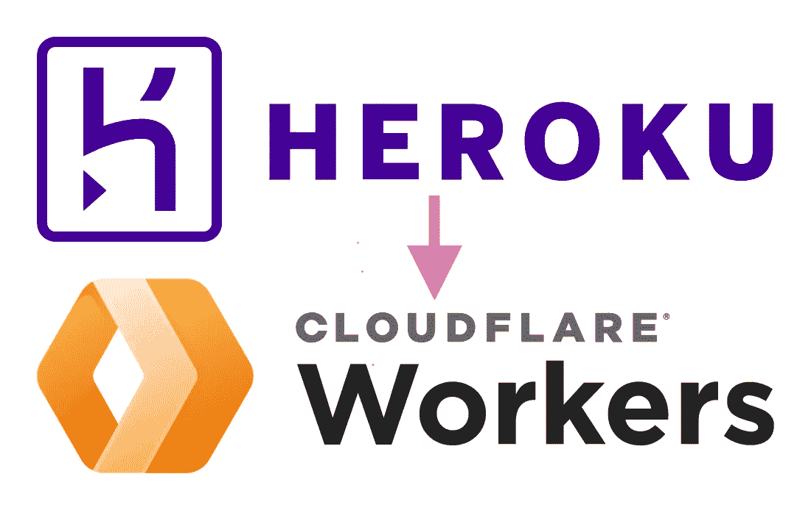

# 将 Node.js 应用程序从 Heroku 迁移到 Cloudflare Workers

> 原文：<https://betterprogramming.pub/migrating-a-node-js-app-to-cloudflare-workers-from-heroku-62c679552af>

## 为 Cloudflare 工作人员重新设计 Node.js/MongoDB 应用程序，以及我在开始时没有意识到的事情



> **第 1 部分:将 Node.js 应用从 Heroku**
> 迁移到 Cloudflare Workers 第 2 部分:[使用 Upstash 的 Cloudflare Workers 内存数据库](/in-memory-database-for-cloudflare-workers-b9c61810ef37)
> 第 3 部分:在 Cloudflare Workers 中使用 Cloudflare KV 数据存储(进行中)
> 第 4 部分:Cloudflare Workers 的调试和日志管理(进行中)

注意: [Cloudflare Workers](https://www.cloudflare.com/products/workers/) 绝对不是 Heroku 的直接替代品。如果我们希望对 Node.js 应用程序进行最小的调整，[谷歌云应用程序引擎](https://cloud.google.com/appengine)可能是更好的选择。

# 介绍

很长一段时间以来，Heroku 一直是我托管我的兼职项目的默认选择，因为它方便易用。可悲的是，Heroku 将很快停止其免费产品计划。这篇文章是为了记录我将我的一个副业项目- [中稀有](https://medium-rare.vercel.app/) (MR)迁移到 [Cloudflare Workers](https://www.cloudflare.com/products/workers/) 的经历👷🏻。

> [中稀](https://medium-rare.vercel.app/) (MR)是一款 web app，在中稀平台上索引和分发中文文章。目前它只支持中文。我的动机来自于这样一个事实，即 Medium 只主要支持英文文章，而非英文文章的发行几乎没有。

MR 后端相当简单。它只有 3 个端点。它正在连接一个 MongoDB。

```
1\. GET /articles
2\. GET /writers
3\. POST /articles/read
```

我们以`GET /articles`为例。

# 重新设计应用程序

有两个方面——路由和数据库连接，需要进行调整以使我们的应用适合 Cloudflare 工作人员。

## **1。路由**

上面是用 Express.js 编写的演示`GET /articles` API。如果我们想在 CF Workers 中实现类似的东西，下面是它的样子:

使用原生 CF Workers [fetch event](https://developers.cloudflare.com/workers/runtime-apis/fetch-event/) 运行时 API 似乎对开发者并不友好。幸运的是，有一些路由库支持 CF Workers，例如 [itty-router](https://www.npmjs.com/package/itty-router) 和 [Hono](https://honojs.dev/) 。我发现自己倾向于 Hono，这是它的样子:

噪音。有家的感觉！

## **2。数据库连接**

当我们使用 CF Workers 时，我们不能用驱动程序直接连接到我们的 MongoDB。相反， [CF Workers 的策略是支持可以通过 HTTP](https://blog.cloudflare.com/workers-adds-support-for-two-modern-data-platforms-mongodb-atlas-and-prisma/) 连接的数据库，MongoDB 现在提供了数据 API，让您[通过标准 HTTPS 请求来读取或写入数据](https://www.mongodb.com/docs/atlas/api/data-api/)！

> 顺便说一下，我创建了[mongo-http . js](https://github.com/patrick-kw-chiu/mongo-http.js)——一个关于 [Mongodb Atlas 数据 API](https://www.mongodb.com/docs/atlas/api/data-api/) 的瘦包装器，它提供了与 [Mongodb Node.js 驱动](https://www.npmjs.com/package/mongodb)类似的 API。

回到我们最初的数据库查询，它可能看起来像这样:

当我们使用 MongoDB 数据 API 时，应该是这样的:

# 我不知道的事情

**1。环境变量是** [**沿着上下文/请求**](https://developers.cloudflare.com/workers/runtime-apis/fetch-event/#parameters) **传递，而不是从上面数据库连接部分的** `**process.env**` **—** 中获取，我们使用`MONGODB_URL`和`MONGODB_API_KEY`向 MongoDB 数据 API 发出 HTTPS 请求。如果使用本机[获取事件](https://developers.cloudflare.com/workers/runtime-apis/fetch-event/)运行时 API，它将在参数中

在 Hono 中，`env`在`context`参数中

**2。** `**wrangler.toml**` **中环境变量的更新需要** `**wrangler publish**` **才能生效—** 我原本以为`wrangler dev`是从`wrangler.toml`中抓取环境变量。看起来它是从云中的实际 CF 工作者那里获取的。这也导致了第三点。

**3。** `**wrangler dev**` **也在使用你的请求配额——**原来，如果我们想要完全本地化发展，我们应该使用[的迷你照明弹](https://github.com/cloudflare/miniflare)。这也导致了#4(最后一个)。

**4。如果您有** `**wrangler publish**` **多个环境，那么对“本地”服务器的每个 API 调用都将使用来自每个环境的 1 个请求——例如，如果您有`wrangler publish`个环境`api-dev`、`api-staging`和`api-production`，并且您用`wrangler dev`启动了一个“本地”服务器。然后你向“本地”服务器发出一个请求，它将用完 3 个请求配额。**

# 收场白

有几件事我还没有涉及到——调试和日志记录。总之调试体验很棒，因为 CF Workers 的 Devtools 在用浏览器的 Devtools。对于日志，CF Workers 有一个[日志流仪表板](https://developers.cloudflare.com/workers/learning/logging-workers/#view-logs-from-the-dashboard)用于实时日志，而我们需要“自带日志服务”来保存日志。

总的来说，在 CF Workers 上开发是一个很棒的开发者体验。当我把更多的副业项目迁移给 CF 工作者时，我期待着探索更多！