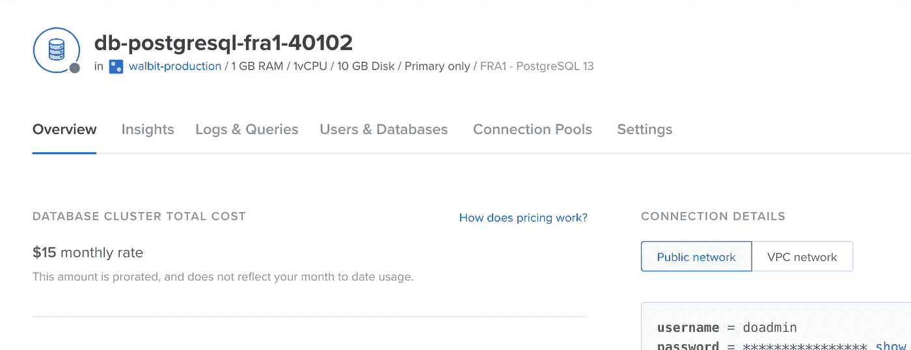
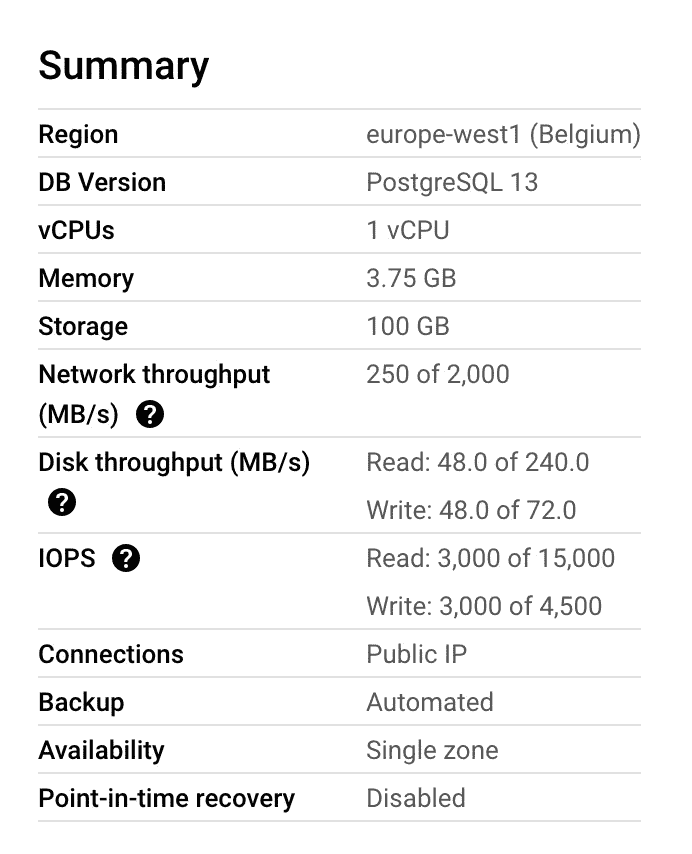
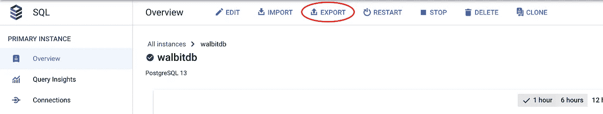

# 将 PostgreSQL 数据库从谷歌云迁移到数字海洋

> 原文：<https://betterprogramming.pub/migrating-a-postgresql-database-from-google-cloud-to-digitalocean-a4fd31f911c9>

## 以及我们为什么做出这样的转变


照片由[塔图姆·伯根](https://unsplash.com/@tatumelisabethphoto?utm_source=medium&utm_medium=referral)在 [Unsplash](https://unsplash.com?utm_source=medium&utm_medium=referral) 上拍摄

在 [walbit](https://walbit.io/) ，我们在 Google Cloud 中开始了我们的应用程序，我们用 Google Cloud Run、Google Storage、Google Compute Engine 建立了我们的架构，用 Cloud SQL 建立了我们的数据库，特别是用托管 PostgreSQL 13 实例。我们对谷歌的服务不太满意，决定改用 DigitalOcean，本指南将一步一步介绍我们如何将生产数据库迁移到 DO。请注意，此过程的停机时间大约为 10 分钟，为了防止数据丢失，我们在迁移过程中关闭了服务。

> 在撰写本文时，我们的工程团队由 3 名全栈开发人员组成，对 DevOps 知之甚少。因此，我们依靠这些文档(或云平台的文档)来启动和运行我们的应用程序。如果你在 DevOps 方面有更多的经验，或者有足够的资源雇佣这样的人，你可能不需要这篇文章。



数字海洋数据库概览屏幕——作者截图

让我们从我们想从 GCP 转到 DO 的一些原因开始:

# 为什么？

## **GCP 的最小设置成本太高**

在我们旅程的开始，我们没有很多用户，也没有很大的预算。我们也不希望创建一个小型计算引擎并自己管理数据库，因为托管数据库在维护、可扩展性和正常运行时间方面有很多优势。因此，我们在 GCP 使用了最小的、有意义的设置，我们将随着用户群和流量的增长而扩大规模。不仅如此，我们的沙盒环境还需要第二个数据库，即使是最小的设置对我们来说也太昂贵了。作为参考，在 2022 年初，当我们进行流量很少的封闭测试时，下面的设置每月花费大约 60 美元。



我们在 GCP 的数据库规范—作者截图

## GCP 的计费结构不适合我们

有了谷歌云平台，除非你是一个相对较大的客户(过去 3 个月每月向 GCP 支付 2500 美元)，否则你必须屈服于一种叫做“自动支付”的支付设置。谷歌会在每个账单周期(月)开始时向你收费，也会在你的余额达到某个“阈值”时向你的卡收费。这个门槛对我们来说显然是 200 美元，我们并没有真正定期检查 GCP 的账单状态/屏幕。好几次我们达到门槛，谷歌就从我们的信用卡里扣钱。最糟糕的部分来了:**一旦你的付款被拒绝，谷歌就会屏蔽你的服务。在潜在用户通常会看到您的登录页面的页面上，您会看到一条难看的错误消息，指出与此服务相关的计费帐户有问题。我们在 GCP 的账户上使用了一张虚拟卡，只有在我们准备付款时才会打开余额，以便对我们的余额有更多的控制权，但显然，这对谷歌不起作用。当然，在这些事件发生后，我们立即打开了相关卡的余额并重试了支付，服务再次启动并运行，但那几分钟足以让我们在客户面前丢脸，让我们发疯。**

我们就此与 GCP 的计费支持部门进行了交谈，他们只能建议我们“关注我们的使用情况”，我们不想这样做，所以我们来了🤷‍♀️(我们以前和数字海洋合作过，在你的付款被拒绝后的几周内，在你的服务被关闭前，他们会优雅地警告你)

## 数字海洋文档对初学者更友好

如上所述，我们的团队包括 3 个全栈开发人员，没有开发运维向导🧙‍♀️，因此我们需要一些指导来导航云提供商和设置我们的架构。除了谷歌试图为 GCP 建立一个社区和创建内容，DigitalOcean 自己的文档和博客帖子一直都非常有用且易于使用。也许对于这一点来说，DO 没有 GCP 那么多不同的服务也是有帮助的，所以更容易使用我们得到的服务。

# **如何？**

现在，我们将一步一步地介绍如何在 10 分钟内将我们在 Google 云平台上运行的数据库迁移到 DigitalOcean，并像以前一样继续使用我们的服务。在继续之前，您需要以下内容:

*   GCP 上正在运行的托管 PostgreSQL 数据库
*   一个数字海洋帐户和一个团队帐户来创建我们的实例

我们的迁移流程将遵循以下步骤:

1.  **在 DO 中创建新数据库**
2.  **停止在 GCP 的服务**
3.  **把我们的 DB 甩在 GCP**
4.  **在 DO** 中将转储恢复到我们的新 DB 中
5.  **更改我们服务中的连接参数，以使用新的数据库**
6.  **重启我们的服务**

在我们继续之前，你有必要确定在哪里改变你的连接参数(API 设置，GCP 的秘密管理器，`.env`文件等)，因为第 5 步会影响服务的停机时间。在我们的例子中，我们将替换 Secret Manager 中的一个连接字符串和一些已经运行了一些后台任务的计算引擎中的几个`.env`文件。

## 1.在数字海洋中创建 PostgreSQL 数据库实例

您可以在此遵循 [DigitalOcean 关于创建 PSQL 数据库集群的指南。但总结起来，很简单:](https://docs.digitalocean.com/products/databases/postgresql/how-to/create/)

*   从右上角的“创建”下拉菜单中选择“数据库”
*   选择 PostgreSQL 作为引擎及其版本，并为您的数据库选择您想要的规范。该计划根据规格从每月 15 美元开始，您可以随时增加大小，请谨慎选择！

我们将使用 PSQL 13，因为它是我们在 GCP 使用的版本，开始时使用 15 美元的集群，以后会根据我们的需要进行升级。请注意，您应该注意磁盘大小，并确保您要迁移的数据将适合新的集群。

根据您所需的配置，浏览 DigitalOcean 提供的“入门”步骤。对于`Restrict inbound connections`步骤，我们暂时不会添加任何资源，因为我们的后端 API 仍在 GCP 云上运行，我们需要它来访问 DO 中的数据库。当我们稍后迁移我们的所有架构时，我们可以更新这个设置，只允许真正需要访问我们的 DB [的各方，以确保它的安全](https://docs.digitalocean.com/products/databases/postgresql/how-to/secure/)。

最后，DO 将为您提供一个连接字符串，或者直接命令`Migrate an existing database`。DigitalOcean 将自动为我们的系统创建一个默认数据库(defaultdb)和默认管理员用户(doadmin ),所提供的连接设置使用这些数据库和用户信息。我们想更新这些，我们可以在 DO 中托管数据库页面下的`Users & Databases`选项卡中完成。之后，当您返回到 overview 选项卡时，您可以为您的新用户或 DB 名称获得更新的连接字符串或配置。

## **2。停止服务**

在这一步，我们将暂时禁用我们的服务，以避免任何数据丢失，因为在我们获取转储并将其导入新数据库之前，我们不希望将任何数据写入数据库，以避免数据丢失。所以我们选择让应用程序暂时不可用。

在我们的例子中，我们将[间接地禁用我们的云运行实例](https://cloud.google.com/run/docs/managing/services)，并停止我们当前在计算引擎实例中运行的 celery workers。一旦新的数据库有了所有的数据，并且连接字符串被更新，我们将立即启用它们。因此，从这一点开始，我们急于尽快完成这些步骤，以最大限度地减少应用程序的停机时间🙌

## 3.导出 GCP 数据库



GCP SQL，数据库概览屏幕上的导出按钮—作者截图

为此，您需要启动并运行云存储，我们已经为我们的 [walbit](https://walbit.io) 网站和 statics 准备了几个存储桶。我们将使用我们现有的一个存储桶来导出 SQL 文件，但是您也可以按照本教程为这个[创建一个新的存储桶。几分钟后，Google 将在您选择的存储桶中为您的数据库创建一个导出文件。将其下载到您的计算机上，以便您可以在下一步中运行命令来恢复数据库。](https://cloud.google.com/storage/docs/creating-buckets)

或者，您可以使用 [CloudSQL Auth Proxy](https://cloud.google.com/sql/docs/postgres/sql-proxy) 连接到您的数据库，并运行`pg_dump`命令来创建您的数据库的转储。我们选择使用 Google 已经提供的`Export data to Cloud Storage`选项，因为它更简单。

## **4。在 DO** 中将转储恢复到我们的新 DB 中

在上一步中，您必须下载一个 SQL 文件作为数据库的转储，现在我们将使用它将数据库配置和数据恢复到我们在 DigitalOcean 中新创建的数据库中。在以下命令中使用您自己的参数进行更改，并运行它来实现这一点:

```
PGPASSWORD=[psql-password] psql -U [psql-username] -h [psql-host] -p [psql-port] -d [database] --set=sslmode=require -f [path-to-sql-dump]
```

数字海洋界面会为您提供`password`、`username`、`host`、`port`和`database`变量。检查数据库的`Overview`选项卡，您应该在右上角的`Connection Details`下看到它。确保选择了`Public Network`选项，并且正在检查`Connection parameters`。

当上面的命令完成运行时，您的新数据库是您以前的数据库的精确副本(可能除了大小之外),并且可以使用了。

## **5。更改我们服务中的连接参数，以使用新的数据库**

现在，我们将使用 DO 中的新连接字符串来切换应用程序中使用的数据库。在 DB 的 overview 选项卡中的 connection details 下，我们可以获得并复制整个连接字符串。我们的(Django)应用程序使用连接字符串，这对我们来说已经足够好了，但请确保检查您是否必须调整应用程序代码中的任何其他设置或变量。

在我们的例子中，为了完成这一步，我们用新的连接字符串更新了我们的`.env`文件中的`DATABASE_URL`配置(对于一些后台任务的单个工人)和 GCP 的`Secret Manager`(对于我们在云上运行的 API)，一切都很好！

## **6。重启我们的服务**

现在新的数据库已经启动并运行，我们更新了连接参数以指向我们的新数据库，我们可以简单地重启我们的服务并使我们的应用程序再次正常工作。

对于我们的例子，整个操作和停机时间大约需要 10 分钟，但它本来可以更短，因为我们必须在其间使用一些标志和变量。不过，我们的数据库相对较小，所以转储和恢复操作各需要几分钟。在充满更多数据的数据库中，这可能需要更长的时间。

## 好处:优化和保护您的数据库

在本教程中，我们做了一些基础工作，将现有的数据库从一个云提供商转移到另一个云提供商，但是根据您的应用程序的需求，可能还需要做更多的工作来获得一个功能良好的数据库。确保检查以下要点和文档，以便充分利用托管 DO 数据库。

*   检查性能并确认您的数据库大小正确
*   为您的数据库设置[连接池](https://docs.digitalocean.com/products/databases/postgresql/how-to/manage-connection-pools/)
*   [保护您的数据库集群](https://docs.digitalocean.com/products/databases/postgresql/how-to/secure/)

本指南介绍了如何将现有的托管 PostgreSQL 数据库从 Google 云平台迁移到 DigitalOcean。我们在不涉及任何底层配置的情况下做到了这一点，并把优化和调整留到了以后。

如果您认为本指南中的某些内容可以以更好的方式完成，如果我们可以最大限度地减少或消除这一过程中的停机时间，或者如果您有任何其他补充，请随时在下面留下评论。