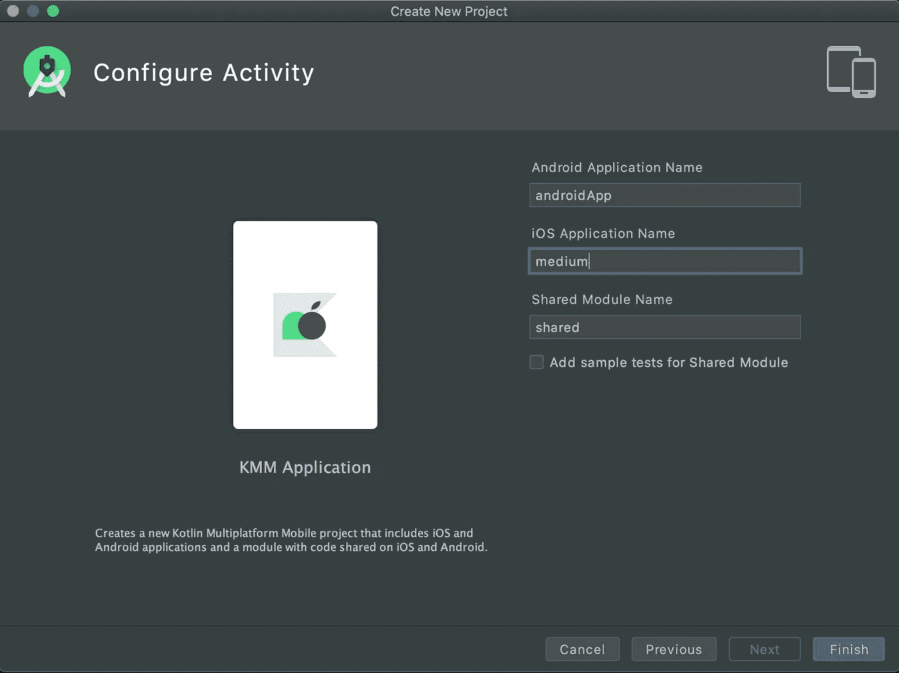
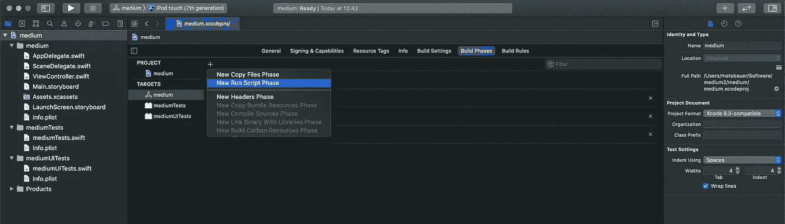
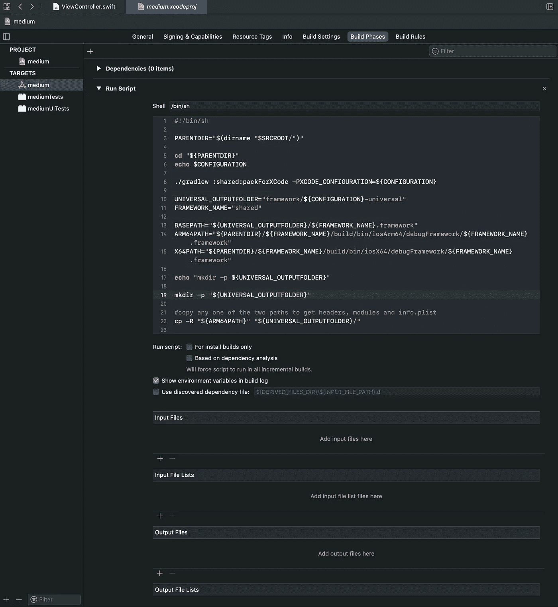
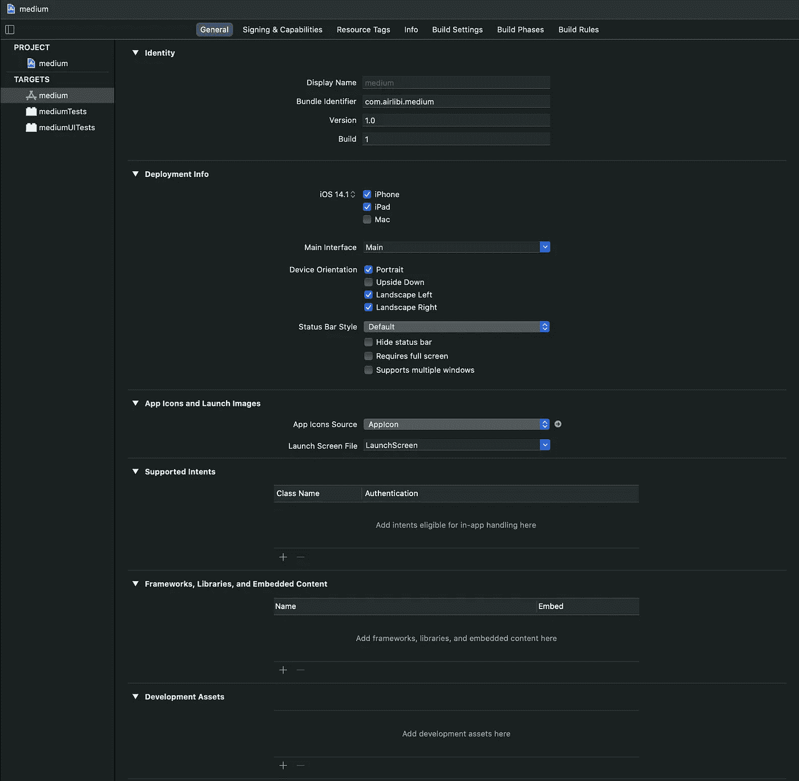
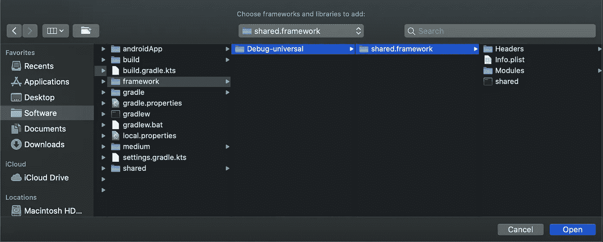
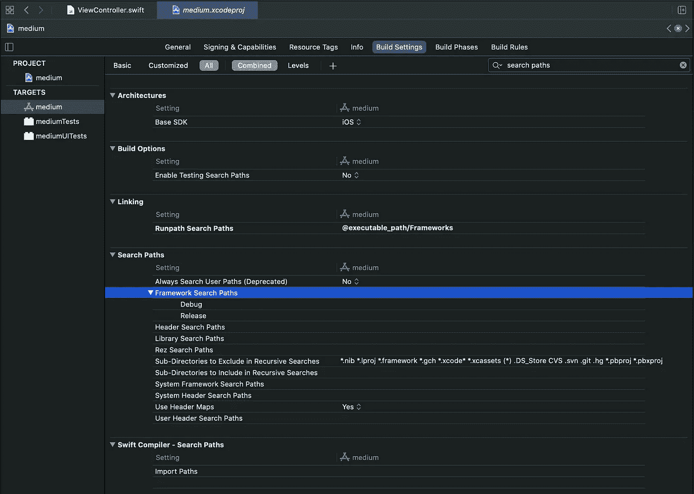
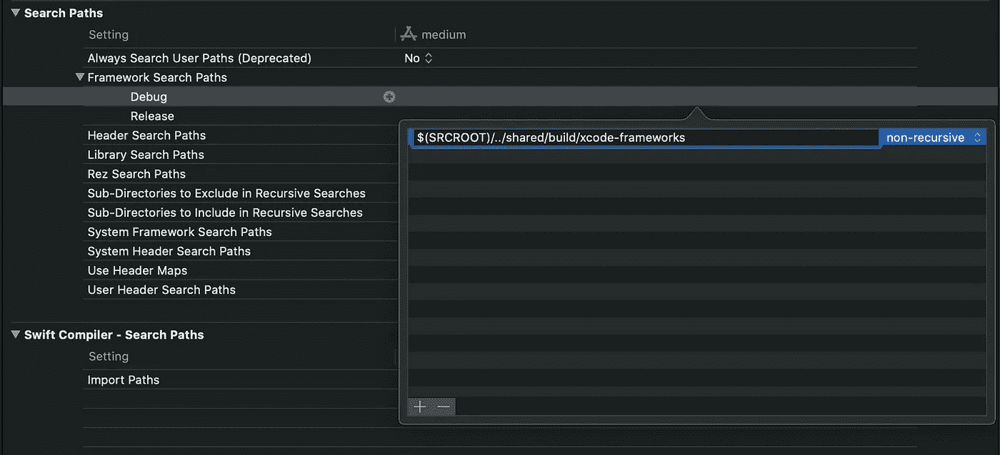

# 将现有 Xcode 项目迁移到新的 Kotlin 多平台移动应用程序

> 原文：<https://betterprogramming.pub/migrating-an-existing-xcode-project-to-a-new-kotlin-multiplatform-mobile-app-b71d07f23b7a>

## 借助 Kotlin 多平台更进一步


由[像素](https://www.pexels.com/de-de/foto/haus-verwischen-innen-fenster-4246091/?utm_content=attributionCopyText&utm_medium=referral&utm_source=pexels)上的[赖爷子图像](https://www.pexels.com/de-de/@ketut-subiyanto?utm_content=attributionCopyText&utm_medium=referral&utm_source=pexels)

从头开始手动设置 Kotlin 多平台移动(KMM)项目可能会很繁琐。我们想将名为`medium`的 Xcode 项目迁移到一个新的 KMM 应用程序中。

# 入门指南

对于这个例子，我们将使用一个扭曲的空白 KMM 项目。如果你不知道如何创建一个 KMM 项目，先看看我以前的一篇文章。转折:在这一次的创建过程中，我们将把 iOS 应用程序命名为与 Xcode 项目完全相同的名称。这样做消除了在 Gradle 和属性文件中改变路径和代码项目变量的需要。



为我们的 KMM 项目更改 iOS 应用程序名称

我们创建的 KMM 项目现在包含三个组件:

*   一款安卓应用
*   共同代码(科特林语)
*   一款 iOS 应用

下一步，我们希望用现有的应用替换标准的 KMM iOS 应用。我们正在使用的现有应用程序名为`medium`，可以是新创建的空白项目，也可以是你最新的杰作。在这个演示中，`medium`是一个新创建的项目。

# 更换 iOS 应用程序

首先，我们在 Finder 中进入 KMM 应用程序的目录。你可以看到三个主文件夹:`androidApp`、`shared`和`medium`。查看文件夹`medium`，我们看到一个典型的 Xcode 项目布局，包含`.xcodeproj`文件以及所有的源文件和测试文件。

**操作:**删除`medium`文件夹中的所有内容，并将现有应用程序的所有文件夹放入其中。从现在开始，我们将从这里打开 iOS 应用程序。

# 将我们的 iOS 应用程序与 KMM 共享的组件相链接

为了让我们的 iOS 应用程序与共享的 KMM 组件一起工作，需要做两件事:

*   KMM 项目需要为我们的 iOS 应用程序建立。
*   iOS 应用程序需要找到并引用构建的共享文件。

## 1.为 Xcode 构建 KMM 项目

在代码项目中，转到根项目并打开构建阶段。通过单击+，创建一个新的运行脚本阶段。



运行脚本允许您在构建项目时运行任何 shell 脚本。这个脚本使我们能够在没有 Android Studio 或在终端中运行 Gradle 的情况下构建 iOS 的 KMM 应用程序。

在 Shell 脚本字段中，粘贴:

```
#!/bin/shPARENTDIR="$(dirname "$SRCROOT/")"**cd** "${PARENTDIR}"./gradlew :shared:packForXCode - PXCODE_CONFIGURATION=${CONFIGURATION}UNIVERSAL_OUTPUTFOLDER="${APPNAME}/framework/${CONFIGURATION}-universal"FRAMEWORK_NAME="shared"BASEPATH="${UNIVERSAL_OUTPUTFOLDER}/${FRAMEWORK_NAME}.framework"ARM64PATH="${PARENTDIR}/${FRAMEWORK_NAME}/build/bin/iosArm64/debugFramework/${FRAMEWORK_NAME}.framework"X64PATH="${PARENTDIR}/${FRAMEWORK_NAME}/build/bin/iosX64/debugFramework/${FRAMEWORK_NAME}.framework" mkdir -p "${UNIVERSAL_OUTPUTFOLDER}" #copy headers, modules & info.plist of ARM64/X64 build into our framework
cp -R "${ARM64PATH}" "${UNIVERSAL_OUTPUTFOLDER}/"**if** [ ! -d "$ARM64PATH" ]; **then
echo** "error: Please on an iOS Device to create ARM64 build files"
**fi****if** [ ! -d "$X64PATH" ]; **then
echo** "error: Please run on a Simulator to create X64 build files"
**fi**ARM64PATHAPPEND="${ARM64PATH}/${FRAMEWORK_NAME}"
X64PATHAPPEND="${X64PATH}/${FRAMEWORK_NAME}"FULLPATH="${PARENTDIR}/${BASEPATH}"lipo -create "${ARM64PATHAPPEND}" "${X64PATHAPPEND}" -output "${FULLPATH}/shared"
```

稍后我将详细介绍该脚本的功能。主要执行的是行`./gradlew :shared:packForXcode`。这一行代码运行位于共享文件夹中的`build.gradle.kts`中的打包代理。代码块如下所示:

```
val packForXcode by tasks.creating(Sync::class) **{** group = "build"
    val mode = System.getenv("CONFIGURATION") ?: "DEBUG"
    val sdkName = System.getenv("SDK_NAME") ?: "iphonesimulator"
    val targetName = "ios" + if (sdkName.startsWith("iphoneos")) "Arm64" else "X64"
    val framework = kotlin.targets.getByName<KotlinNativeTarget>(targetName).binaries.getFramework(mode)
    inputs.property("mode", mode)
    dependsOn(framework.linkTask)
    val targetDir = File(buildDir, "xcode-frameworks")
    from(**{** framework.outputDirectory **}**)
    into(targetDir)
**}** tasks.getByName("build").dependsOn(packForXcode)
```

除了提到它区分了 iOS Arm64 和 x64 的版本之外，我不会进一步深入这个(标准)脚本。这种差异让我们可以在真实的 iPhone(使用 ARM CPU)和模拟器上使用 KMM 组件。你可以在这里阅读更多关于 CPU 架构[的内容。](https://docs.elementscompiler.com/Platforms/Cocoa/CpuArchitectures/)

**重要提示:**将运行脚本移动到构建阶段的顶部！



将运行脚本移动到列表顶部

运行脚本有两个过程。首先:它为给定的 CPU (ARM 或 x64)创建构建框架。第二:它将两个构建框架合并成一个可以同时处理 ARM 和 x64 CPUs 的单一框架；姑且称之为我们的*通用框架。*

下一步有点乱，但是创建了正确的设置，并且只需要做一次。所以仔细阅读！

1.  在任何模拟器上运行项目。构建将失败，说:`Command PhraseScriptExecution failed with a nonzero exit code.`这是完美的！我们现在有了模拟器框架(在`shared`>`build`>`bin`>`iosX64`>`debugFramework`)。
2.  在你的 iPhone 上运行这个项目。构建会成功，但是你的应用会在运行时崩溃，说:`Library not loaded: shared.framework.`这又是完美的。我们现在既有 iPhone 框架(在`shared`>`build`>`bin`>`iosArm64`>`debugFramework`)又有创建的通用框架(在`framework` > `Debug-universal`)。错误来自于没有将通用框架链接到我们的项目。

所以让我们开始导入框架吧！

## 2.正在导入我们的 ***通用*** 'shared.framework '

你可能读过一些 KMM 的教程，在那里你应该从构建文件夹中导入共享框架。但是我们为模拟器和 iPhone 创建了我们的通用框架，所以忘了它吧！你会在`framework` > `Debug-universal` > `shared.framework`中找到我们的模拟器和 iPhone 兼容的框架。这个目录现在必须链接到我们的 Xcode 项目。

在 Xcode 中，返回“通用”标签。在这里，您可以看到框架、库和嵌入式内容部分。



**动作:**这里，我们包括来自`framework`目录的`shared.framework`:



将框架导入 Xcode

您的项目现在可以访问已加入的`shared.framework`。但是在`build`目录中还有另一个我们也需要的框架文件。

## 3.还有一件事！

在运行我们的项目之前，我们必须向框架搜索路径添加一个特定的路径。这个搜索路径对于项目找到 Xcode 框架`shared.framework`是必不可少的。转到构建设置并搜索搜索路径部分。

这为您提供了框架搜索路径的下拉选项。



**操作:**双击右边相应的字段，点击弹出窗口中的加号，将短语`$(SCROOT)/../.shared/build/xcode-frameworks` 粘贴到调试和发布中。



一旦完成，我们就可以在任何地方运行这个项目了，不管是在你的 iPhone 上还是模拟器上。

**注意:**如果我们在 iPhone 或模拟器上运行，只有相邻的共享构建文件夹会被重新运行。这简化了构建过程，而不是总是运行两种构建类型。

恭喜你！

# 调试部分

```
Building for iOS Simulator, but the linked and embedded framework 'shared.framework' was built for iOS.
```

当我们摆弄构建文件时，有时会发生这种情况。要解决这个问题，从 General 选项卡(框架、库和嵌入内容)中删除`shared.framework`，再次构建 iOS 模拟器，然后像步骤 2 中一样重新添加`shared.framework`。

```
The operation couldn’t be completed. Unable to locate a Java Runtime.
```

这是因为缺少 Java 运行时安装。要解决这个问题，请尝试安装 Java JDK8。如果错误仍然存在，重新启动计算机会有所帮助。

*如果您遇到任何其他错误，请随时 ping 我或发表评论，以便我们可以分享解决方案。*