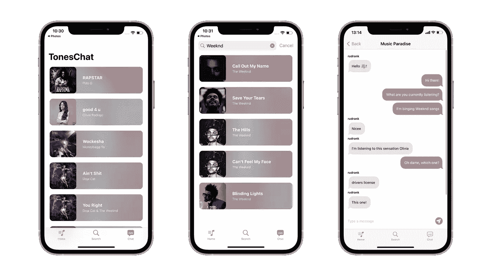
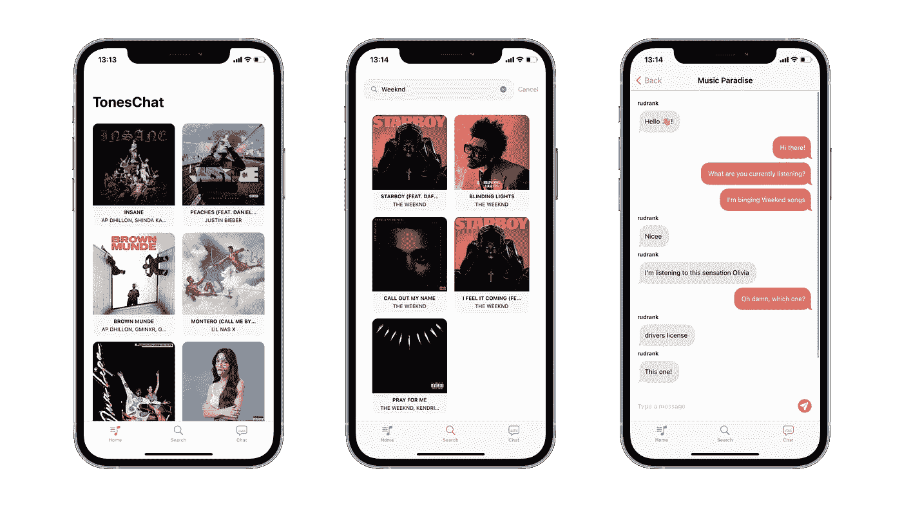
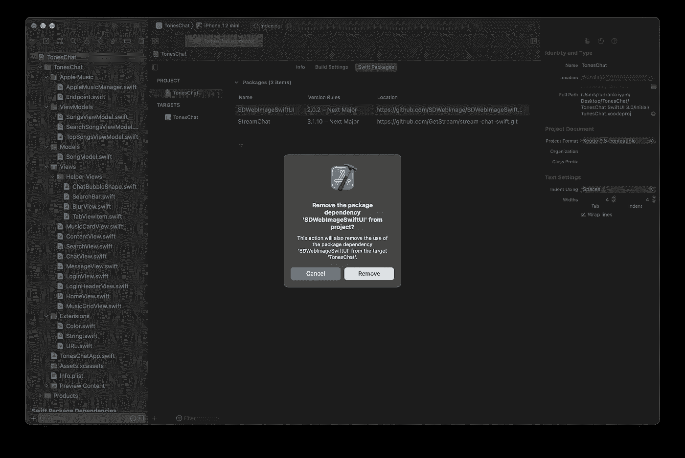
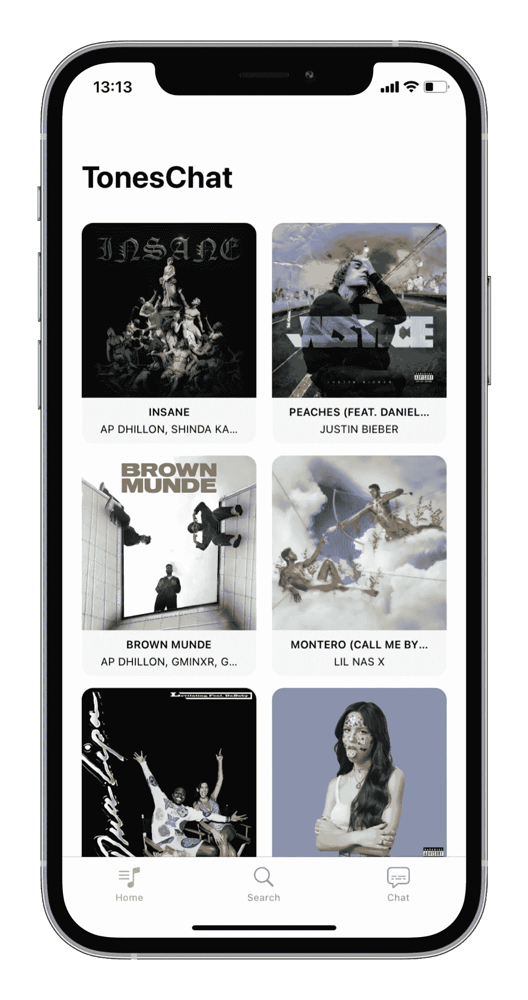
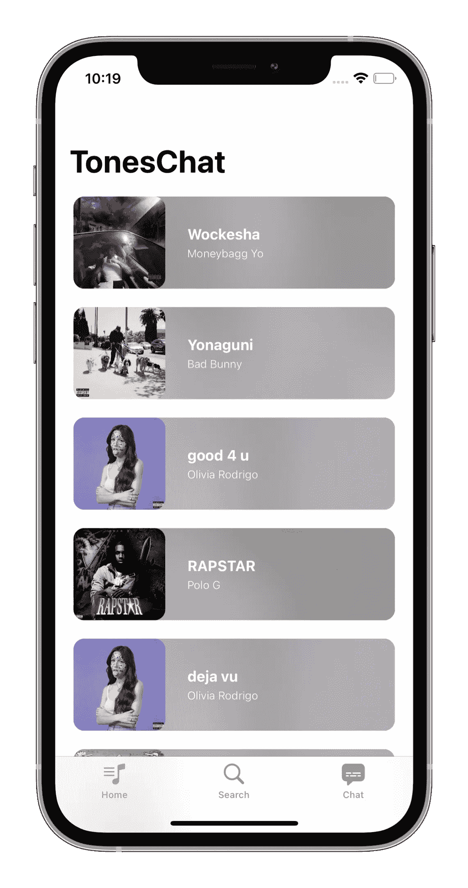
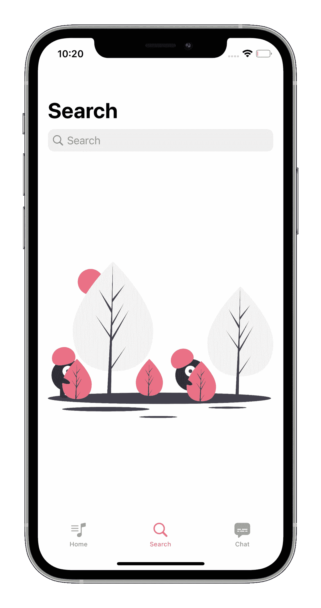
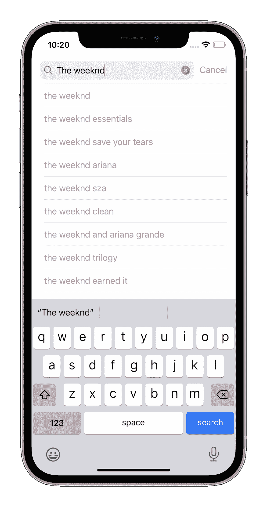
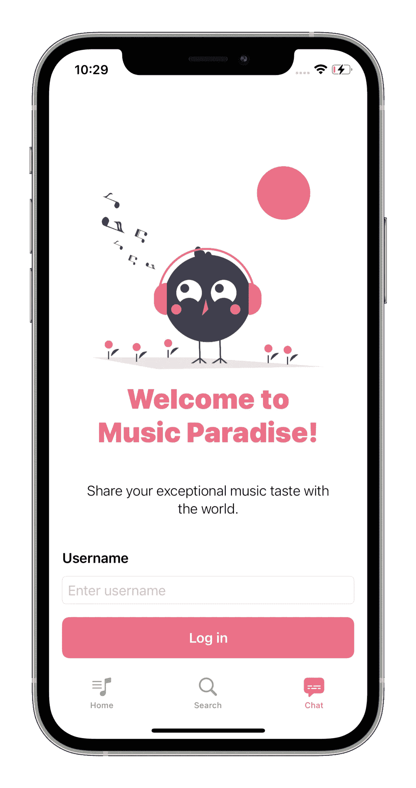

# 从 SwiftUI 2.0 迁移到 SwiftUI 3.0

> 原文：<https://betterprogramming.pub/migrating-from-swiftui-2-0-to-swiftui-3-0-d9eec418a251>

## 使用新的 iOS 15 SwiftUI 功能为我们的应用做好准备



WWDC 2021 几周前结束了。它再次在网上举行，充满了功能丰富的内容。SwiftUI 上的每个会话都传达了团队带给我们惊喜的要点，我们喜欢所宣布的改进和丰富功能。今年，苹果专注于支持更深入地采用我们的应用程序框架。

我们将从我们在[创建的同一个项目开始，使用 SwiftUI](https://getstream.io/blog/music-chat-ios-swiftui/) 构建一个音乐聊天 iOS 应用程序，同时开发 SwiftUI Release 3 的新功能。然后，我们将了解 SwiftUI 团队如何通过将自定义代码集成到框架本身来帮助我们删除自定义代码。

> *注意——你需要一个* ***付费*** *开发者账号，并且在你的设备上安装了 Apple Music 才能跟随这篇文章。还有，本文要求****Xcode 13.0+****和****iOS 15.0+***

# TonesChat

在“使用 SwiftUI 构建一个音乐聊天 iOS 应用程序”中，我们创建了一个音乐聊天应用程序，您可以在分享和聊天的同时聆听您最喜爱的音乐。示例应用程序广泛使用了 SwiftUI Release 2，为框架缺少的东西提供了自定义视图，比如搜索栏。



我们将从同一个项目开始，添加今年引入的新功能和改进。请下载[启动项目](https://github.com/rudrankriyam/TonesChat)并浏览`Initial`文件夹下的内容。它由助手视图、一些扩展和 API 数据模型组成。

*注意——你需要按照上一篇文章为 Apple Music 添加一个开发者令牌，为 Stream 添加一个 API 密钥。*

在 Xcode 中打开初始项目。首先，从项目导航器中选择项目，并将部署目标提升到 iOS 15。这确保了我们可以在最新的 iOS 版本上开发新的令人兴奋的东西。

运行应用程序以确保其正常工作。现在，让我们开始看看这个框架给我们带来了什么惊喜吧！

# 不对称图像

顾名思义，`AsyncImage`是用来异步下载和显示图片的。之前，我们理想地使用了 [SDWebImageSwiftUI](https://github.com/SDWebImage/SDWebImageSwiftUI) ，但是有了这个版本的 SwiftUI，我们可以安全地移除对主要用例的依赖。

首先，从项目导航器→ Swift 包中删除包。



另外，从`MusicCardView`上拆下`import SDWebImageSwiftUI`。我们将得到一个关于`WebImage`的错误。


我们用`AsyncImage`代替。提供了多个初始值设定项，这是最简单的一个:

`init(url: [URL](https://developer.apple.com/documentation/foundation/url?changes=l_5)?, scale: [CGFloat](https://developer.apple.com/documentation/coregraphics/cgfloat?changes=l_5) = 1) where Content == [Image](https://developer.apple.com/documentation/swiftui/image?changes=l_5)`

查看语法:

我们为视图提供一个 URL，它自动获取并显示带有默认占位符的远程图像。为了对异步图像加载操作的*阶段*有更多的控制，我们使用:

`init(url: [URL](https://developer.apple.com/documentation/foundation/url?changes=l_5)?, scale: [CGFloat](https://developer.apple.com/documentation/coregraphics/cgfloat?changes=l_5) = 1, transaction: [Transaction](https://developer.apple.com/documentation/swiftui/transaction?changes=l_5) = Transaction(), content: @escaping ([AsyncImagePhase](https://developer.apple.com/documentation/swiftui/asyncimagephase?changes=l_5)) -> Content)`

这有助于我们添加一个事务来传递动画，并为加载、成功和失败定义自定义视图。

对于在我们的应用程序中异步加载的作品，我们将使用一个方便的包装器来包装`AsyncImage`:

穿过`ArtworkImage`:

*   我们从将 URL 作为参数的`AsyncImage`开始。以及在阶段之间切换时传递动画的事务。
*   在空阶段的情况下，我们显示一个 `ProgressView()`。
*   在成功的图像的情况下，我们传回图像。
*   如果出现错误，我们用红色背景显示错误描述。
*   我们为`AsyncImagePhase`的一个额外的未知值添加了一个`@unknown default`案例，这个未知值可能会在未来的版本中添加。

在一个新的 SwiftUI 文件中添加上述代码后，转到`MusicCardView`。移除`WebImage(url: url)`和与之相关的修改器。替换为以下内容:

*注意:从 beta 2 开始，列表中的 AsyncImage 有时会过早取消图像下载。*

运行应用程序，看看图像异步加载，一个时髦的动画！



# 可刷新的

在主屏幕上，我们正在显示美国的热门歌曲。假设奥利维亚又推出了一张热门专辑，排行榜上全是她的歌曲。为此，我们需要添加根据更新数据的请求加载内容的功能。

SwiftUI 3.0 增加了一个新功能(过去几年没有的)，支持 iOS 和 iPadOS 上的拉至刷新。它可以很容易地与 refreshable 修饰符一起使用，该修饰符配置一个刷新动作并通过环境传递它。从文档中:

*使用此操作启动修改视图显示的模型数据的更新。在动作中使用一个* `*await*` *表达式。SwiftUI 显示一个刷新指示器，在等待操作期间保持可见。*

`func refreshable(action: @escaping () async -> Void) -> some View`

转到`HomeView`，在`onAppear`下，添加可刷新修改器:

```
.refreshable { viewModel.updateTopSongs()}
```

截至 Xcode 13.0 beta 1，只有`List`使用这个动作。所以，打开`MusicGridView`，改名为`MusicListView`。另外，替换这个:

```
ScrollView(.vertical, showsIndicators: false) { // LazyVGrid}
```

有了这个:

以前，如果不做一些修改，隐藏行分隔符是不可能的。现在，我们有一个专用的修改器。

SwiftUI 还有一个新的修饰符任务，它将一个任务附加到视图的生存期中。它在视图出现时执行特定的任务，在视图消失时取消。

将`onAppear`替换为`HomeView`中的任务:

```
.task { viewModel.updateTopSongs()}
```

现在，运行应用程序并刷新以加载新的排行榜歌曲！

# 材料视图

引用自[swift ui WWDC 2021 的新功能](https://developer.apple.com/wwdc21/10018):

> Apple 的所有平台和应用程序都使用材料来创建真正强调其内容的美丽视觉效果，现在您可以直接在 SwiftUI 中创建它们！

之前，我们在`UIViewRepresentable`中使用了`UIVisualEffectView`来创建一个模糊效果。现在，我们可以直接在背景修改器中使用它们！

我们将更新单独的卡片，将数据显示成一行，并为材质效果使用艺术作品的模糊背景。类似的东西也用在 Apple Music 上。

将`MusicCardView`替换为以下内容:

它使用与前一版本相似的代码，但是现在我们将内容放在一个`HStack`中，而不是一个`VStack`和一个更小的图像中。

创建一个名为MusicRowView.swift 的新 SwiftUI 文件。

这个视图是这样做的:

*   创建另一个填充整行的`ArtworkImage`。我们正在添加一个覆盖层来使图像变暗。
*   添加薄材质的背景。这在背景上创建了一个微妙的模糊效果。这些材料会自动与它们上面的内容混合。

这将为每一行生成一个漂亮的模糊背景。试试吧！



# 搜索

当前使用搜索的方式是创建一个自定义视图，其中有一个`TextField`，带有一个取消按钮。您可以在 SearchBar.swift 中找到它的实现。

由于`TonesChat`的核心功能是从我们世界各地的朋友那里找到精彩的歌曲并进行搜索，因此将搜索功能内置到框架中至关重要。今年，一个新的可搜索修饰符使得在我们的应用中添加搜索变得更加容易。

SwiftUI 会自动在我们应用程序的适当位置添加一个搜索字段。您可以从`SearchView`中移除`SearchBar`，并将可搜索修饰符添加到`NavigationView`。新的实现如下所示:

这是细目分类:

*   我们添加了绑定了`searchText`的可搜索修饰符。它会自动在视图顶部添加一个搜索栏。
*   在提交查询时，我们获取文本并相应地更新歌曲列表。
*   每当用户点击取消按钮时，我们清空歌曲列表以获得默认视图。

只需几行代码，我们就能实现完整的搜索功能——这是一个显著的改进！



我们可以添加搜索建议，让搜索下一首我们要狂听的歌曲变得更加简单。SwiftUI 提供了另一个修饰符:

```
func searchable<S>(text: Binding<String>, placement: SearchFieldPlacement = .automatic, suggestions: () -> S) -> some View where S : View
```

它们为我们提供了可选的参数建议，我们可以在其中列出数据。根据输入的每个字符，我们点击 Apple Music 的提示 API 来获得优化的结果。点击任何建议都会在苹果音乐目录中搜索到那个特定的提示。

用以下代码替换`SearchView`的代码:

事情是这样的-

*   我们有一个`@State`来跟踪所选择的提示。这是为了确保我们不会为选中的提示找到更多的提示。
*   我们创建一个列表并循环搜索提示。当用户选择一个提示时，我们直接显示搜索结果。
*   当用户点击**取消**或**明文**按钮时，我们清空歌曲和`searchHints`数组。
*   对于每个输入的字符，我们获取提示来显示。

通过增加几行代码，我们有了一个全功能的搜索！使用提示寻找新音乐的时间到了！



# 小跟班

这个版本与按钮有很大关系，特别是现在我们在 iOS 上有了标准的边框按钮。就像给元素添加一个`buttonStyle`修饰符一样简单。

新的修饰符是:

*   `buttonStyle`用于纽扣造型
*   `tint`对于特定的颜色外观
*   `controlSize`用于定义一个按钮的标准尺寸
*   `controlProminence`让他们脱颖而出

在`LoginView`中，用以下内容替换**登录**按钮:

新的修饰键使按钮更加标准化:



# 更多变化

有更多的变化无法在帖子中涵盖。推荐你看[swift ui](https://developer.apple.com/videos/play/wwdc2021/10018/)的新功能。

## **自定义刷卡动作**

SwiftUI 今年允许我们定义自定义的滑动动作，像定义任何其他菜单一样定义它。语法类似于`contextMenu`，使用按钮定义动作。

例如，我们想要标记我们喜欢的几首喜爱的歌曲。我们可以在`MusicGridView`中添加以下代码来定义一个自定义动作:


这里有几个更合你胃口的:

*   **渲染 markdown:** 直接内嵌 markdown 格式的文本变得更加强大。
*   **新表单**:一个新的修改器，防止使用`interactiveDismissDisabled(_:)`交互解散表单。此外，还有一个新的环境值消除，您可以使用它来消除屏幕。
*   **徽章:**您可以创建一个在列表行和标签栏中显示的徽章。例如，未读消息的数量。使用`badge(_:)`实现该功能。
*   **可访问性变化:**许多新的可访问性变化使得在您的 SwiftUI 应用中支持可访问性变得毫不费力。你可以观看[swift ui Accessibility:Beyond the basics](https://developer.apple.com/wwdc21/10119)来提供一个非凡的可访问性体验。

# 结论

有这么多的变化，在我们的应用程序中实现这些变化并为我们的用户提供流畅的体验将是令人兴奋的一年。

SwiftUI 从 2019 年到 iOS 13 已经走过了很长的路，但我们还有很长的路要走。例如，我们仍然需要 UIKit 支持来构建自定义屏幕和复杂的应用程序。

但是 SwiftUI 确实是未来！

我希望你喜欢这个教程。如果你觉得它有帮助，让我知道！