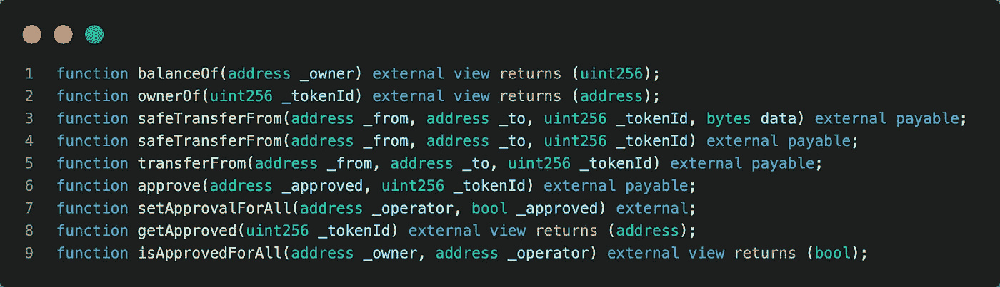
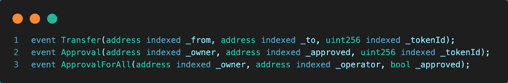
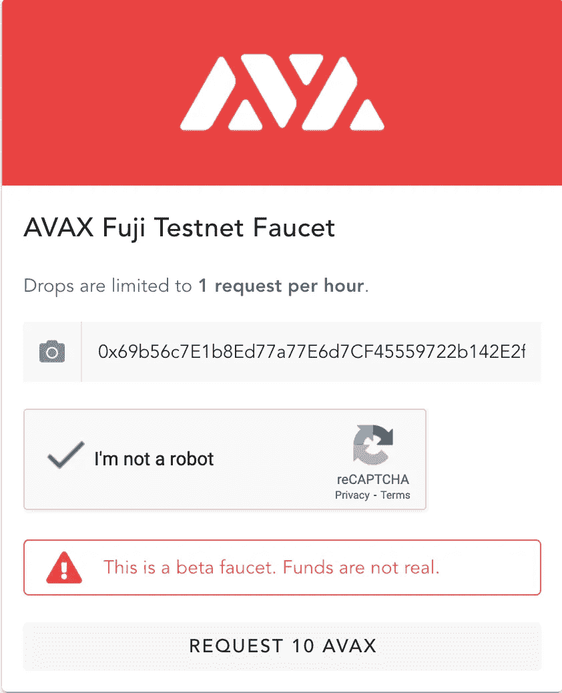
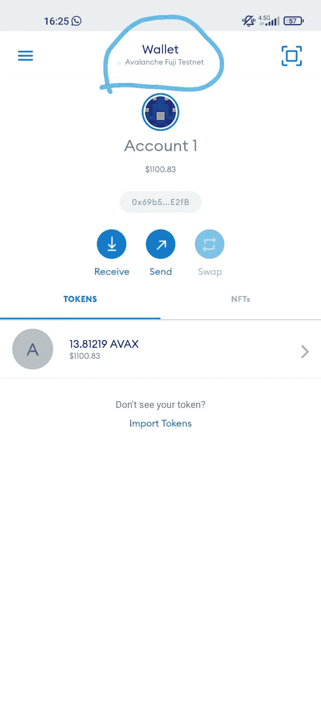
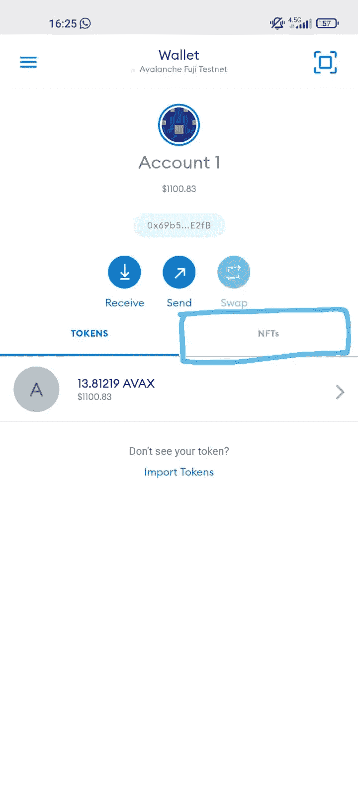
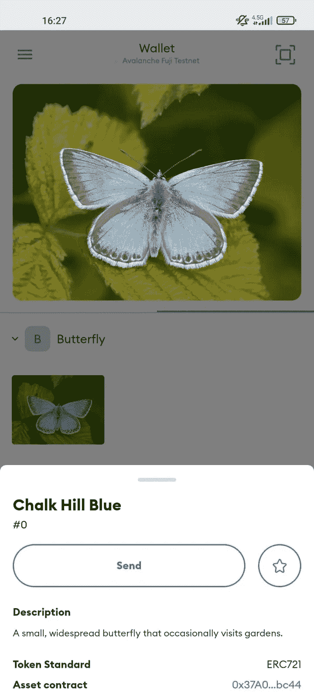

# 在 Avalanche FUJI 测试网络上使用 Solidity 和 HardHat 打造自己的 NFT

> 原文：<https://betterprogramming.pub/mint-your-own-nft-using-solidity-and-hardhat-on-avalanche-fuji-test-network-71a56ef88bd3>

## 在 Avalanche Fuji 上部署我们的智能合约


照片由[米拉德·法库里安](https://unsplash.com/@fakurian?utm_source=unsplash&utm_medium=referral&utm_content=creditCopyText)在 [Unsplash](https://unsplash.com/s/photos/mint-nft?utm_source=unsplash&utm_medium=referral&utm_content=creditCopyText) 拍摄

在本文中，您将学习如何创建自己的 NFT (ERC-721 标准)，并将其部署在 Avalanche FUJI C-chain testnet 上。

# 目录

*   什么是 NFT？
*   什么是 ERC-721 令牌？
*   ERC-721 标准
*   创建 ERC-721 令牌合同
*   部署合同
*   在雪崩富士测试网上铸造 NFT
*   将 NFT 添加到元掩码钱包

# 什么是 NFT？

NFTs 代表不可替代令牌，是类似于 [CryptoKitties](https://www.cryptokitties.co/) 的数字收藏品的加密等价物。出于安全原因，它们通常由以太坊顶部的智能合约监管。它们使用不同的加密货币进行买卖，并在不同的交易所进行交易。虽然并非总是如此，但 NFT 通常可以使用与许多加密货币相同的底层代码进行编码。

例如， [CryptoKitties](https://www.cryptokitties.co/) 使用以太坊，而 [RarePepe](https://rarepepes.com/) 基于交易对手。但是所有的 NFT 都与加密货币有许多共同的特征。例如，所有的都有某种形式的有限供应，为了被创造而被“开采”。因为 NFT 承担了密码的许多方面，它们通常在许多与密码相同的交易所进行交易，这使得它们总体上相当容易获得。

# 什么是 ERC-721 令牌？

ERC-721 为 NFT 引入了一个标准，换句话说，这种类型的令牌是唯一的，并且可以具有与来自同一智能合约的另一个令牌不同的值。

所有的 NFT 都有一个名为`tokenId`的`uint256`变量，所以对于任何 ERC-721 合约，这对`contract address, uint256 tokenId`必须是全球唯一的。也就是说，dApp 可以有一个“转换器”，使用`tokenId`作为输入，输出一些很酷的图像，如僵尸、武器、技能或神奇的小猫！

# ERC-721 标准

由 William Entriken、Dieter Shirley、Jacob Evans、Nastassia Sachs 于 2018 年 1 月提出的 ERC-721(以太坊征求意见稿 721)是一种不可替代的令牌标准，实现了智能合约内令牌的 API。

它提供的功能包括将令牌从一个帐户转移到另一个帐户，获取帐户的当前令牌余额，获取特定令牌的所有者，以及网络上可用令牌的总供应量。除此之外，它还具有一些其他功能，如批准一个帐户的令牌数量可以由第三方帐户移动。

如果智能合约实现了以下方法和事件，它可以被称为 ERC-721 不可替换令牌合约，并且一旦部署，它将负责跟踪以太坊上创建的令牌。



ERC-721 方法



ERC-721 事件

# 创建 ERC-721 令牌合同

## 步骤 1:项目设置

好了，我们进入下一步。我们需要进入我们想要工作的目录，并运行以下命令:

```
mkdir butterfly_token
cd butterfly_token
npm install --save-dev hardhat
```

现在，我们应该有一顶安全帽。让我们通过运行下面的命令来启动一个示例项目:

```
npx hardhat init
```

我们将选择创建一个示例项目。接受所有请求。

之后，我们需要安装一些依赖项。我们可以使用以下命令安装这些依赖项:

```
npm install --save-dev @nomiclabs/hardhat-waffle ethereum-waffle chai @nomiclabs/hardhat-ethers ethers @openzeppelin/contracts
```

*   我们可以使用这个插件在 Hardhat 中使用 Waffle 来构建智能契约测试，利用两者的优势。
*   `[ethereum-waffle](https://www.npmjs.com/package/ethereum-waffle)`测试智能合约的最先进框架。
*   `[chai](https://www.npmjs.com/package/chai)` Chai 是一个*断言库*，类似于 Node 的内置`assert`。它给了你许多可以针对代码运行的断言，从而使测试变得更加容易。
*   `[@nomiclabs/hardhat-ethers](https://www.npmjs.com/package/@nomiclabs/hardhat-ethers)`这个插件给 Hardhat 带来了以太坊库`ethers.js`，可以让你以一种简单的方式与以太坊区块链互动。
*   `[ethers](https://www.npmjs.com/package/ethers)`完整的以太坊钱包实现和 JavaScript(和 TypeScript)实用程序。
*   `[@openzeppelin/contracts](https://www.npmjs.com/package/@openzeppelin/contracts)`用于保护智能合约开发的库。建立在社区审查代码的坚实基础上。

要确保一切正常，请运行:

```
npx hardhat test
```

我们将在控制台中看到通过测试的结果。

## 步骤 2:编写智能合同

接下来，在合同目录下，我们将创建一个名为 ButterflyToken.sol 的文件。我们可以通过继承[openzeplin](https://docs.openzeppelin.com/contracts/4.x/erc20-supply)合同来编写一个 ERC-721 令牌合同。

*   一种更灵活但更昂贵的元数据存储方式。

## _safeMint

这个函数接受一个地址和一个令牌 id 作为参数。我们分别将`msg.sender`和`tokenCounter`作为地址和令牌 id 进行传递。

*   `msg.sender`钱包在调用造币功能吗
*   `tokenCounter`是目前的代币。

一旦被调用，该函数将安全地铸造一个令牌，并将其传送到调用铸造函数的钱包。

## _setTokenURI

我们可以通过这个函数将元数据设置为 token。这些元数据可以是名称、描述，甚至是图像。它接受一个令牌 id 和 uri 作为参数。

我们很快就会讨论如何得到一个`tokenURI`。基本上，它只是一个发回 JSON 对象的 url。

JSON 形式的 NFT 元数据示例

我们可以用下面的命令编写合同:

```
npx hardhat compile
```

编译过程完成后，我们将看到一个名为 artifacts 的新文件夹。在这个文件夹里，我们编译了 ABI 的文件。

## 部署合同

默认情况下，HardHat 有一个示例部署脚本。你可以在`scripts/ folder`下看到那个脚本。现在，我们要写一个这样的脚本。

首先，创建一个名为`deploy_butterfly_token.js`的 JavaScript 文件，并粘贴以下代码

在部署合同之前，我们需要再进行一次配置。

打开`hardhat.config.js`文件，用下面的代码修改它:

在第 2 行，你需要写你自己的私钥。

要获得私钥，您需要在浏览器上安装元掩码扩展。如果您没有元掩码，请查看本[教程](https://myterablock.medium.com/how-to-create-or-import-a-metamask-wallet-a551fc2f5a6b#:~:text=Click%20on%20the%20MetaMask%20extension,or%20create%20a%20new%20one.&text=Click%20on%20%E2%80%9CCreate%20a%20Wallet,%E2%80%9CNo%20Thanks%E2%80%9D%20to%20proceed.)。

您可以按照这些步骤获得您的私钥[。](https://metamask.zendesk.com/hc/en-us/articles/360015289632-How-to-Export-an-Account-Private-Key)

在部署您的合同之前，您需要向您的钱包中添加一些 AVAX。你可以在每个测试网络上免费这样做。对于富士测试网，你可以使用这个网站。

[](https://faucet.avax-test.network/)

粘贴您的钱包地址并请求 10 AVAX。

此后，您可以通过编写以下代码来部署您的合同:

```
npx hardhat run scripts/deploy_butterfly_token.js --network avalanche_fuji
```

部署过程完成后，您将会看到在您的文件系统上创建的`config.js`文件。这是你的令牌地址。如果你想检查你可以使用[雪迹](https://testnet.snowtrace.io/)。复制地址并粘贴到搜索栏。你将得到关于你的合同的信息。

## 在雪崩富士测试网上铸造 NFT

部署过程完成后，现在是铸造 NFT 的时候了。在开始编写代码之前，您需要再添加一个依赖项。复制下面的命令并按回车键。

```
npm install axios
```

我们将用它来上传元数据到 Pinata。

在 scripts/ folder 下创建一个名为`mint_nft.js`的新文件，并将下面的导入添加到这个文件的顶部。

*   `butterflyToken`是我们在 Avalanche 上部署的令牌地址。
*   `uploadImage`这是上传 helper 的文件。我们接下来就来了。
*   `ButterflyToken`是我们作为 JSON 的契约工件文件。

在这之后，我们需要添加几个函数。

该函数的分层调用是:

*   `tokenCounter`是当前令牌计数器`e.g. 0, 1, 2…`
*   指向我们上传的元数据的散列字符串。

*   `getTokenCounter()`读取当前令牌计数器并将其返回。
*   我们使用 ethers.js 与 contract 交互。

```
Replace YOUR_PRIVATE_KEY wtih your private key. It needs to look like 0x5g4sb.....
```

*   这个函数接受一个参数`ipfsUrl`，即元数据文件 URL，并在创建一个新的 NFT 后返回当前的令牌计数器。

在所有过程完成后`mint_nft.js`文件看起来会是这样的:

现在在 scripts/ folder 下创建名为`PinataConnection.js`的新文件，并将这些代码复制粘贴到这个文件中。

`uploadImage`函数有 4 个参数:

*   `file_name`是文件系统`e.g. butterfly.jpg`中我们的 NFT 图像文件名。您需要将您的图像添加到您的顶级项目文件夹。
*   `nft_title`是 NFT 的称号。
*   `nft_desc`是对 NFT 的描述。
*   `tokenId`是当前令牌计数器。

`uploadToPinata`函数采用 5 个参数，并将选择的图像上传到 Pinata。

*   `IPFSHash`是我们上传的图像文件的散列字符串。
*   `nft_title`是 NFT 的国号。
*   `nft_desc`是对 NFT 的描述。
*   `tokenId`是当前的代币计数器。

```
You need to add your Pinata API_KEY and API_SECRET. For get this key and secret follow this steps:1- Create new account on [Pinata](https://app.pinata.cloud/).
2- Login your account.
3- Click profile icon on top right and select API Keys option.
4- Then click Nex Key button.
```

`sendMetadata`函数取 4 个参数生成元数据，上传到 Pinata，返回该元数据的 IPFSHash。

*   `image`是我们的 NFT 图像文件。
*   `name`是文件系统`e.g. butterfly.jpg`中我们的 NFT 映像文件名。您需要将您的图像添加到您的顶级项目文件夹。
*   `nft_title`是 NFT 的称号。
*   `nft_desc`是对 NFT 的描述。
*   `tokenId`是当前令牌计数器。

不要忘记将您的图像添加到项目文件的根目录中。并更新`nft_desc`、`nft_title`变量。在此之后，您可以编写以下命令:

```
npx hardhat run scripts/mint_nft.js --network avalanche_fuji
```

当 mint 过程完成时，您将在控制台上看到以下内容:

```
Image Uploading to Pinata...
QmYFr3b4xSkPRybwhKx7......vysLCKRX7FyCv
Minting NFT...
Contract Address: 0x37A03F828A40f06eE7......E9df73a3Fbc44 Token Counter: 0
```

恭喜你刚刚铸造了你的第一个 NFT！

## 将 NFT 添加到元掩码钱包

在 Avalanche 上看到 Tesnet NFTs 有点棘手。你需要在你的 Android 或 IOS 手机上安装 MetaMask。安装后将您的钱包添加到 MetaMask。您必须添加拥有此 NFT 的帐户。这意味着谁属于`YOUR_PRIVATE_KEY`。

如果你没有的话，在这之后添加雪崩富士测试网到 MetaMask。遵循以下步骤。

```
1\. Click hamburger (≡) menu on top left.
2\. Click Settings.
3\. Select Networks.
4\. Click Add Network button, input below informations and click Add.FUJI Testnet Settings:[​](https://docs.avax.network/build/tutorials/smart-contracts/deploy-a-smart-contract-on-avalanche-using-remix-and-metamask/#fuji-testnet-settings)Network Name: Avalanche FUJI C-Chain
New RPC URL: [https://api.avax-test.network/ext/bc/C/rpc](https://api.avax-test.network/ext/bc/C/rpc)
ChainID: 43113
Symbol: AVAX
Explorer: [https://testnet.snowtrace.io/](https://testnet.snowtrace.io/)
```

之后，通过点击钱包按钮切换网络。



要将 NFT 添加到您的元掩码钱包中，请切换到 NFT 选项卡。



然后单击导入 NFT 按钮，输入合同地址和令牌计数器。等待 30 秒后，您将看到元数据。如果您没有看到长单击 NFT，然后单击刷新元数据。



# 结论

你可以从 [GitHub](https://github.com/Enes-Kayiklik/ButterflyNFT) 获得代码。

这是我们到目前为止学到的和做的:

*   学会了 NFTs 和 ERC-721 代币。
*   创建一个 ERC-721 合同。
*   在雪崩富士山部署了我们的合同。
*   创建一个 NFT 文件并上传到 Pinata。
*   铸造 NFT。
*   将元掩码添加到此 NFT。

## 有用的链接

*   [实例的可靠性](https://solidity-by-example.org/)
*   [坚固性文件](https://docs.soliditylang.org/)
*   [安全帽文档](https://hardhat.org/getting-started/)
*   [ERC-721 文件](https://docs.openzeppelin.com/contracts/3.x/erc721)
*   [隐型丧尸教程](https://cryptozombies.io/)
*   [纳德·达比特——Youtube](https://www.youtube.com/watch?v=nRMo5jjgCr4)
*   [AVAX 水龙头](https://faucet.avax-test.network/)
*   [教程 NFT 元数据](https://medium.com/scrappy-squirrels/tutorial-nft-metadata-ipfs-and-pinata-9ab1948669a3)
*   [什么是 NFT？](https://ethereum.org/tr/developers/docs/standards/tokens/erc-721/#:~:text=What%20is%20ERC%2D721%3F,something%20else%20like%20its%20visual.)