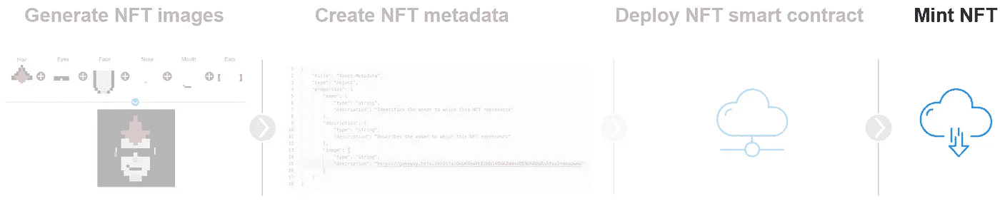
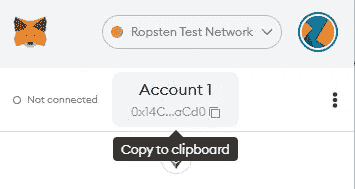
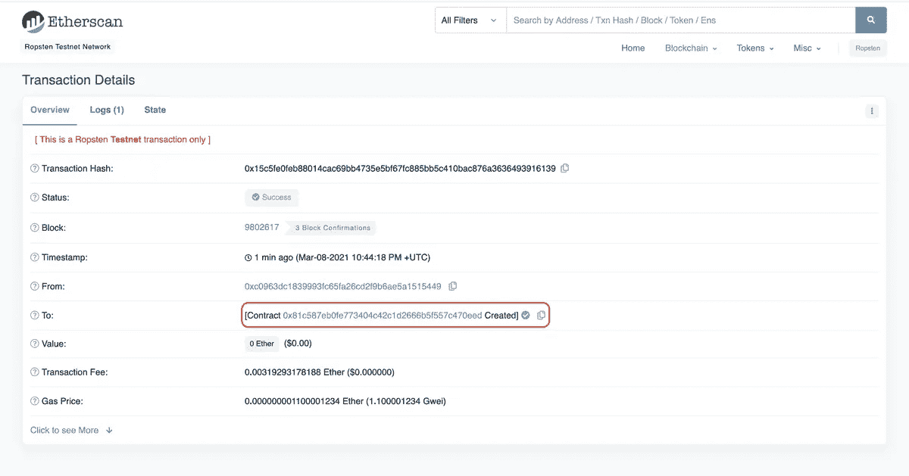
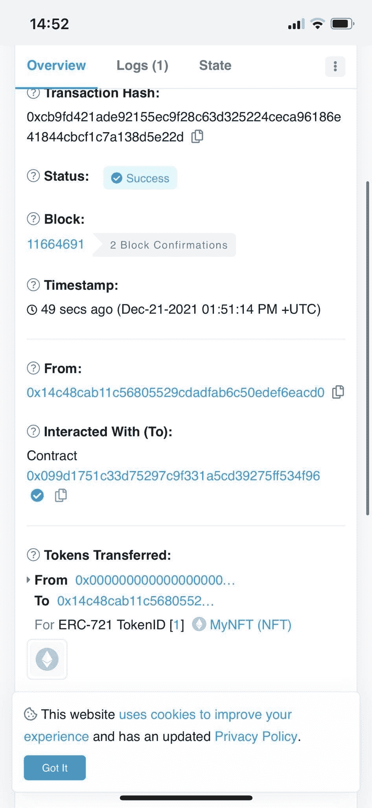
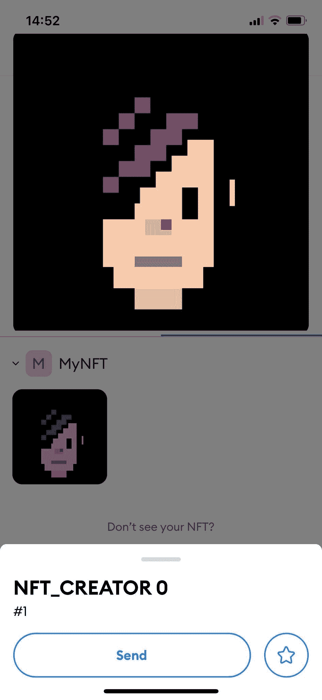

# 用 Web3.js 创建自己的 NFT

> 原文：<https://betterprogramming.pub/mint-your-own-nfts-with-web3-js-f32f7b1cd8cc>

## 创建自己的 NFT 的分步指南


Substrapunk # 13

这是由四部分组成的 NFT 创造者系列的第四部分:

1.  [*用 Python*](/create-your-own-nft-collection-with-python-82af40abf99f) 创建自己的 NFT 收藏
2.  [*创建 NFT 元数据*](/generate-your-nft-metadata-11a878c082b9)
3.  [*部署 NFT 智能合约*](/how-to-deploy-nft-smart-contracts-9271ce5e91c0)
4.  **NFT 铸币**



NFT 创造者系列的第四部分

如果您想单独编写代码，可以在前面的部分中找到必备的代码。

# 什么是铸币？

铸造是指在以太坊区块链上将数字文件转化为 NFT 的过程。该 NFT 存储在分散的数据库中，因此无法编辑、修改或删除。

# 安装 WEB3 库

你将需要炼金术库来与他们的 API 交互。因此，您应该安装它。

*在您的命令行中运行:*

```
chdir [INSERT HERE YOUR NFT PROJECT DIRECTORY]npm install @alch/alchemy-web3
```

# 创建您的铸造脚本

在您的。/scripts 目录包含下面的代码。

该脚本由五个步骤组成:

## 步骤 1:定义变量

铸造过程需要一些变量，比如元掩码键和炼金术 URL。

确保相应地更新您在 NFT 创造者系列的[第 3 部分创建的`.env` **文件**。](/how-to-deploy-nft-smart-contracts-9271ce5e91c0)

小复习:

*   [API_URL](https://docs.alchemy.com/alchemy/introduction/getting-started) :这是你的 alchemy 应用程序的 URL
*   [私有密钥](https://metamask.zendesk.com/hc/en-us/articles/360015289632-How-to-Export-an-Account-Private-Key):你的私有元掩码密钥
*   PUBLIC_KEY:您的公共元掩码密钥



公钥示例

。环境文件

## 第二步:定义我们的 ABI

[ABI](https://docs.alchemyapi.io/alchemy/guides/eth_getlogs#what-are-ab-is) (应用程序二进制接口)是与您在第 3 部分中部署的智能合约进行交互的接口。

简而言之，Hardhat 为我们的智能契约生成了一个 ABI，存储在 MyNFT.json 文件中。

请务必输入您在[第 3 部分](/how-to-deploy-nft-smart-contracts-9271ce5e91c0)中部署的智能合同地址。



在上面的例子中，我们的合同地址是`0x099D1751c33d75297c9f331a5Cd39275ff534f96`。

## 步骤 3:定义铸造函数

您创建了一个名为 mintNFT 的函数，它需要一个参数“tokenURI”。让我们来分解一下:

*   `**Nonce**` 用于跟踪从您的地址发出的交易数量。出于安全目的，这是防止重放攻击所必需的。
*   `from`:交易的发起方/发起方。这是我们的公共地址。
*   `to`:我们希望与之互动的合同地址。
*   `gas`:完成交易所需的预计气体
*   `maxPriorityFeePerGas`:每份天然气的预计投标费用
*   `data`:您要执行的计算，即生成一个 nft

## 第四步:签署交易

您仍然需要在交易上签名才能寄出。

为此，您可以使用 web3.eth 函数。这将为您提供事务散列，以便验证您的事务被有效地挖掘，并且没有被网络丢弃。

## 步骤 5:调用 mintNFT 函数

`mintNFT`函数需要一个`tokenURI`参数，该参数引用存储元数据(图像、属性、名称、描述等)的 JSON 文档。

请按照本教程第二部分[的说明在云中生成&主机元数据。复制链接作为输入参数。](/generate-your-nft-metadata-11a878c082b9)

您的 mint-nft.js 文件现在应该如下所示:

# 调用你的 mint-nft 函数

现在，您可以通过在终端中运行`mint-nft`脚本来创建您的 NFT。

在您的终端中运行:

```
node scripts/mint-nft.js
```

如果您正确地遵循了所有步骤，您应该会收到一张“交易收据”,其中规定了所有使用的参数。

您也可以在 Ropsten Etherscan 上查看您的交易是否成功。



Ropsten etherscan 报告交易成功

为了简单起见，您只创建了一个 nft。

因为您有 99 个想要创建的其他图像，所以您可以创建一个 for 循环来运行`mint-nft`函数 99 次，每次运行一个不同的元数据链接。

for 循环的示例

# 查看您铸造的 NFT

*   通过各自的应用商店将 metamask 扩展下载到您的手机上，并使用您的机密短语登录。
*   将您的网络设置为 Ropsten


[来源](https://static.slab.com/prod/uploads/7adb25ff/posts/images/OzyxsszqiZdQ6AiuRiCQmLh4.gif)

*   按“导入 NFT”并填写以下参数，这些参数可在[以太扫描](https://ropsten.etherscan.io/tx/0xcb9fd421ade92155ec9f28c63d325224ceca96186e41844cbcf1c7a138d5e22d)上找到:
*   地址(智能合同地址，这将因您而异):`0x099d1751c33d75297c9f331a5cd39275ff534f96`
*   ID (TokenID): *1*

刷新元蒙版，你的新铸造的 NFT 应该会出现。



Metamask 展示了新制作的 nft

编程快乐！

# 参考

本教程来源于炼金术团队的后续[帖子](https://ethereum.org/en/developers/tutorials/how-to-write-and-deploy-an-nft/)。炼金术团队功不可没，请务必查看！

[ethereum.org](https://ethereum.org/en/)

[](https://www.alchemy.com/) [## 炼金术-区块链 API 和节点服务|以太坊、多边形、流量、Crypto.org+更多

### 炼金术超节点炼金术超节点是应用最广泛的区块链 API，用于以太坊，多边形，预言，乐观…

www.alchemy.com](https://www.alchemy.com/)