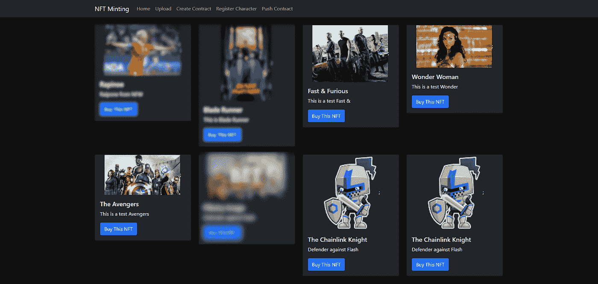

# 使用松露和 Rinkeby 通过 API 制造 NFT

> 原文：<https://betterprogramming.pub/minting-nfts-through-api-using-truffle-rinkeby-a67a0fa62b49>

## 知道铸造是怎么回事吗



这是 NFTs 和 DeFi 的季节。如果你一直生活在岩石下，那么你需要使用以下链接阅读更多关于 NFTs 和 DeFi 的信息。

现在你已经理解了这些术语，让我们来理解非功能性测试是如何制作的。NFT 市场无疑正在从少数铸币商转向内容创作者自己创造非功能性内容的工具和技术。

以下是铸造 NFT 的关键步骤。

1.  你需要图像/艺术作品/剪辑上传到 [IPFS](https://ipfs.io/) 。您可以使用任何允许您上传资产并将其固定的 IPFS 客户端，这将使任何人都可以通过链接访问该资产。我正在为 IPFS 使用 [Pinata](https://www.pinata.cloud/) 云。
2.  你需要在你的钱包里放一些测试乙醚。一旦你安装了 Metamask Google Extension，使用 Rinkeby 水龙头[加载测试 ethers。另外，在你的 Rinkeby testnet 地址上加载一些](https://faucet.rinkeby.io/)[链接](https://faucets.chain.link/rinkeby)。

我在 Patrick Collins 的现有回购协议的基础上构建了这些 API。在 [this GitHub 链接](https://github.com/PatrickAlphaC/dungeons-and-dragons-nft)中查看回购。

上面的例子是关于给 Rinkeby 铸造一个“龙与地下城”的集合。它有以下关键步骤。

第一步:

```
truffle migrate --reset --network rinkeby
```

第二步:

```
truffle exec scripts/fund-contract.js --network rinkeby
```

第三步:

```
truffle exec scripts/generate-character.js --network rinkeby
```

第四步:

```
truffle exec scripts/get-character.js --network rinkeby
```

第五步:

```
truffle exec scripts/set-token-uri.js --network rinkeby
```

步骤 1 和 2 处理设置 Rinkeby 连接，并将与 NFT 创建相关的合同迁移到 Rinkeby Testnet。

步骤 3、4 和 5 包括对迁移的契约执行适当的功能以随机选择字符，并为铸造的 NFT 设置元数据 URI。

请通过上述回购的`README.md`了解其他设置细节。

这个想法是构建一个 NodeJS 应用程序，它将使用上面讨论的步骤。我们可以让用户节点的[子进程](https://nodejs.org/api/child_process.html)在 CLI 上执行 truffle 命令。下面是一个在子流程调用中结束第一步的例子。

执行子进程的示例代码

就像上面的示例一样，我们可以创建代码来执行上面提到的剩余步骤，以完成铸造过程。在执行这些步骤之前，我们需要创建所需的契约，并将其迁移到 Rinkeby testnet。

我们还可以使用 NodeJS 中的文件操作来创建创建 NFT 所需的契约。我们使用 NodeJS fs 库对`template`契约进行动态修改，然后执行 truffle 命令来迁移契约。

下面是创建合同的示例代码:

将`sample.sol`复制到具有所需名称的`contracts`文件夹后，我们根据在 express API 调用中收到的请求，有选择地替换新创建的合同的内容。通过上述过程制作的 NFT 可以在 opensea Rinkeby testnet gallery 上查看。

如上所述，在我们准备铸造之前，我们需要将图像/艺术品固定到 IPFS。

我们可以使用 [Pinata](https://www.pinata.cloud/) 构建 API 来上传和固定图片到 IPFS，还有其他方法。请仔细阅读他们的文档，确定上传和固定图像的 API。

一旦图像成功上传，Pinata APIs 返回 CID，这是上传文件/图像的唯一标识符。

```
[https://ipfs.io/ipfs/xxxxxxxxxxxxxxxxxxxxxxxxxxxxxxxxx?filename=filename.png](https://ipfs.io/ipfs/xxxxxxxxxxxxxxxxxxxxxxxxxxxxxxxxx?filename=filename.png)
```

最终的 URI 看起来和上面的差不多。

“XXX”是唯一 CID 所在的位置。在将 JSON 文件上传到 IPFS 之前，我们需要将图像 URI 嵌入到元数据 JSON 文件中。

请浏览地下城与龙 GitHub repo 中的元数据文件夹，了解更多关于元数据 JSON 文件应该是什么样子的细节。

下面是使用 Pinata 将文件上传到 IPFS 的示例代码:

除此之外，您还可以使用 Opensea API 从 Opensea 中插入 marketplace。下面是从 Opensea 获取 NFT 并在 NFT 画廊展示它们的示例 ReactJS 代码。

下面是从 Opensea 中提取新的 NFT 并显示为 NFT 画廊的代码:

这种方法让我们更好地理解铸造 NFT 的过程。这绝对不是一个生产就绪的代码。为此，我们可能不得不拿出块菌，用 [web3js](https://web3js.readthedocs.io/en/v1.5.2/) 来建造。

铸造快乐！！

*原载于*[*http://dudistan.com*](http://dudistan.com/minting-nfts-through-api-using-truffle-rinkeby/)