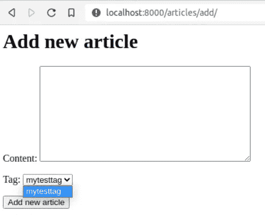

# 我在大多数基于 Django 的项目中发现的 3 个错误

> 原文：<https://betterprogramming.pub/mistakes-that-i-am-still-finding-in-django-based-projects-cc40e2e118b3>

## Django 代码库中应该避免的模式


有些错误是致命的。

我已经足够老了，还记得使用 Django 框架的 1.3 版本。那是 2011 年，我刚刚开始在 Python 生态系统中进行专业的 web 开发。后来框架成熟了(已经 3.2 了)，我也成熟了。在此期间，我大概参与了 50 多个以 Django 为主要框架的项目。这是因为它是一个很好的框架，通过良好的工具、ORM 和一个真正伟大的社区，使开发人员能够更快地交付特性。

尽管如此，我仍然在基于 Django 的代码库中发现一些解决方案，这些解决方案很糟糕或者是不可接受的，尽管事实上我们现在在 Django 网页中已经有了*反模式*。在本文中，我将讨论其中的一些，以帮助开发人员理解我的意思——尤其是年轻的开发人员。

# 项目设置

如果您想跟随代码，这里是如何设置项目。您也可以跳过这一部分，进入下一部分。

运行:

```
django-admin startproject <project_name>  # this will create project for you
cd <project_name>
django-admin startapp articles  # this will setup a basic app for you
```

在您的`articles/models.py`中，添加以下内容:

将`articles`应用程序添加到 Django 设置文件中的`INSTALLED_APPS`中，创建迁移，并应用它们。

在您的`articles/forms.py`中，添加以下内容:

而在你的`articles/views.py`里，这样做:

设置一个简单的 HTML 页面来显示表单，并配置`articles/urls.py`和`ROOT_URLCONF`文件。

我们都准备好了。实验的其余代码将在下面的小节中提供。

# 1.基于模型的固定选择

有时候，你想在 Django 中使用一个定制表单来处理不同的逻辑或 UX。一般来说，你最终会处于一个`ModelForm`不可选择的境地。这就是乐趣的开始。在上面的模型定义中，您可以看到`Article`实例可以通过`ManyToManyField`分配多个标签。我在表单级别上对它进行了简化，只允许每篇文章有一个标签向您展示一些东西。

`AddArticleForm`有一个从`Tag`模型中显式提取的带有定制选项的`ChoiceField`，列表在那里构建。在页面上，它看起来或多或少像这样:



添加新文章表单

我在管理面板中定义了一个新的标签来注册上面的模型。您需要在您的`articles/admin.py`中执行以下操作:

为什么这不好呢？那么，当您现在在管理面板中添加一个新标签时(或者反过来)，表单将看不到它，直到您重新启动开发服务器(或者任何其他服务器，如果这出于某种原因影响到其他环境)。这是为什么呢？这样的代码是在类定义层上执行的，这意味着当我们导入表单`AddArticleForm`时它就会被执行，而那些`choices`将永远存在，直到应用服务器重新加载。

这似乎有点违反直觉，我认为主要原因是开发人员仍然无法完全理解 ORM 和 Python 是如何工作的。另一个原因是开发人员习惯于在`choices`中放一些东西，比如`choices=[("EUR", "EURO"), ("USD", "DOLLAR")]`，在这种情况下这是完全有意义的(因为我们不希望这经常改变)。但是对于存储在数据库级别的实体，情况就不同了。

那么应该怎么做呢？

在表单上使用`__init__`:

这样，您可以始终确保重新加载页面也会重新加载可能的选项。

这种方法还有一个不太明显的问题(从类级别的模型实例构建的选择):它很可能会破坏您的初始项目设置，因为它要求您已经在数据库中有了`Tag`。一个糟糕的开发人员可以不费吹灰之力就阻止新的开发人员加入，而不需要数据库转储。

你会惊讶于我在现有的、严肃的、生产就绪的代码库中发现的这个问题的变体的数量。

# 2.忽略选择相关和预取相关

在这里搭建游乐场，打开一个 Django shell ( `python manage.py shell`)，导入`Article`和`Tag`模型(`from articles.models import Article, Tag`)。此外，在 shell 中执行以下操作:

```
import logging
l = logging.getLogger('django.db.backends')
l.setLevel(logging.DEBUG)
l.addHandler(logging.StreamHandler())
```

这将允许您实时查看数据库查询。

创建一些标签和一些文章。现在这样做:

```
for article in Article.objects.all():
    print(article.content)
```

作为输出，您应该看到类似这样的内容:

```
(0.000) SELECT "articles_article"."id", "articles_article"."content" FROM "articles_article"; args=()
content0
content1
```

所以我们有一个`SELECT`查询，并为每个`Article`实例打印了`content`属性。

现在，如果我们想访问`tags`属性，会发生什么呢？是的，你是对的。我们将对每个`for`循环进行额外的查询:

正如您在这里看到的，我们首先使用`SELECT`从数据库中获取所有的文章。在每个`for`循环的后面，我们有一个额外的查询来查找第一个标签。

让我们稍微修改一下代码:

如您所见，使用`prefetch_related`已经将查询数量减少到两个——第一个`SELECT`获取文章，第二个获取分配给文章的所有标签。

在这个例子中，我只有两篇文章和两个标签，但是现在想象一下，有人正在对数千个条目进行操作。作为一名后端开发人员，您应该尽量减少查询次数。这是一个开销很大的 I/O 操作，会影响应用程序的性能。

有一些工具可以帮助你理解这一部分(例如 [django-silk](https://github.com/jazzband/django-silk) )。

# 3.不知道 update_fields 的用途

很简单。它将只更新列表中指定的模型字段。例如:

```
article.save(update_fields=["content"])
```

这将只更新一个文章实例的`content`字段。

哪里有用？嗯，在 web 开发中，并发写入同一个对象是很正常的。当你总是全力扑救时，这不是一个大问题。最后一个胜出，但这里重要的是两个相同的对象在不同的节点上可以处于完全不同的状态。

假设应用程序的第一个节点从数据库获取对象，然后使用 ORM 将其转换为 Python 对象。然后，它有一些耗时的操作，最后，它将修改后的对象保存到数据库中。在这个耗时的窗口中，第二个节点获取对象并将其加载到 Python 对象中。第二个节点在第一个节点之后稍晚一点进行保存。然后，在第一个节点上所做的更改将被覆盖，这是一个`update_fields`拯救我们的例子(也有不同的技术来处理这一点)。

当第一个和第二个节点对对象做完全不同的事情，并且对不同的属性感兴趣的时候`update_fields`会特别有帮助(但是你需要这样考虑和设计系统)。

当您在代码中的某些地方只更新单个字段时，这一点尤其重要。`status`就是一个很好的例子。如果在此过程中没有更新其他字段，则应该是:

```
instance.save(update_fields=["status"])
```

因为这样的字段通常存储重要的业务逻辑，所以不丢失它更重要。

感谢阅读。