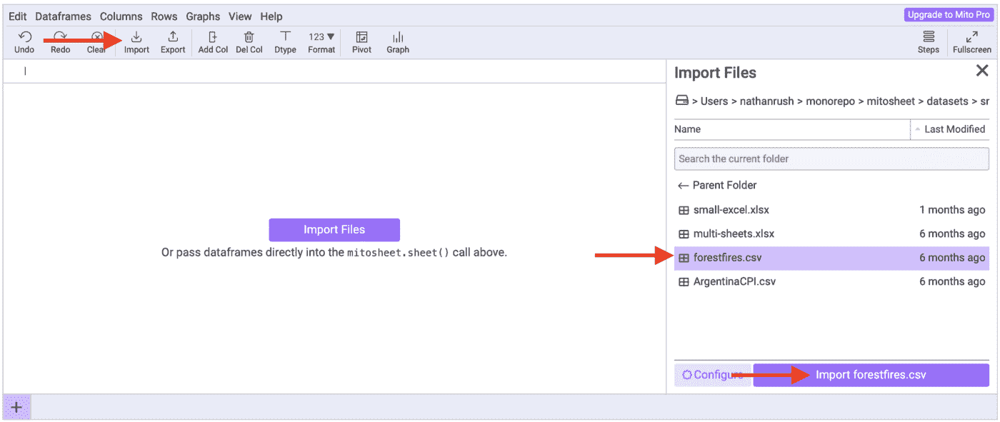
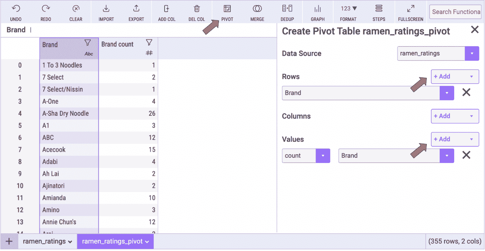
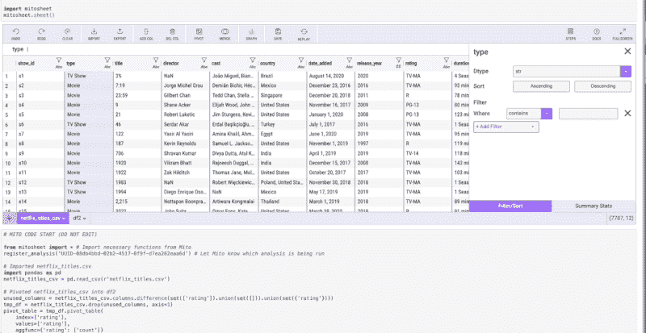

# 米托，Python 对电子表格用户的强大扩展

> 原文：<https://betterprogramming.pub/mito-pythons-powerful-extension-for-spreadsheet-users-7f59b1823002>

## Python 中的电子表格引擎米托变得更加强大！


[埃德·哈迪](https://unsplash.com/@impelling?utm_source=medium&utm_medium=referral)在 [Unsplash](https://unsplash.com?utm_source=medium&utm_medium=referral) 上拍摄的照片

Jupyter (Jupyter 实验室、Jupyter 笔记本和 Jupyter Hub)是 Python 用户的强大环境。它是最常见的笔记本环境，允许用户调用一系列包，这些包允许他们完成数据清理，一直到机器学习。

[米托](http://trymito.io/)是一个 Python 包，允许 Excel 和 Google Sheets 用户通过熟悉的电子表格环境在 Jupyter 中使用 Python。电子表格是最常见的数据分析工具，但它们的缺陷促使越来越多的用户将 Python 添加到他们的工作流中。Python 可以处理电子表格无法处理的数据大小，并允许自动化和可重复性。

通过米托，用户可以在他们的 Python 环境中调用交互式电子表格。他们可以在电子表格中完成他们的任务，这将为所采取的每一步生成等效的 Python。

这是一个简短的演示视频:

来自 https://youtu.be/CEZCw1tfMPo 米托的视频(来源:

米托是一个[开源](https://github.com/mito-ds/monorepo) Python 包，所以要安装米托，运行以下命令:

```
python -m pip install mitoinstaller
python -m mitoinstaller install
```

然后在您的笔记本中运行这些命令来打开 Mitosheet

```
import mitosheet
mitosheet.sheet()
```

你可以在这里找到完整的安装说明[。](https://docs.trymito.io/getting-started/installing-mito)

# 导入数据

用户可以访问他们在 Excel 中使用的普通数据集，或者电子表格可以容纳的更大的数据集。



将数据导入米托(图片由作者提供)

当您打开 Mitosheet 时，会出现一个从本地文件导入数据的菜单。您可以选择任何 Excel 或 CSV 文件。您也可以引入 Google Sheets 数据，但这需要在调用 Mitosheet 之前使用几行 Python。

如果您已经在笔记本中使用了一个 DataFrame，您可以将它作为参数传递给 mitosheet.sheet()调用。因此，如果您有一个名为“df”的数据帧，调用将是:

```
mitosheet.sheet(df)
```

# 电子表格功能

米托允许用户像在电子表格中一样分析数据，**并为每一步生成等价的 Python 代码。**

这是米托的数据透视表的样子:



用米托透视数据(图片由作者提供)

米托将为这个数据透视表生成代码，并在下面的代码单元格中提供它。这很重要，因为它允许电子表格用户访问 Python，而不需要记住语法，也不需要经常去 Google 或 Stack Overflow 获取正确的语法。

在下面的 Gif 中，你可以看到在使用米托时生成的代码。这个脚本可能需要 20 分钟来纠正，但在米托只需要一两分钟。



代码由米托自动生成(Gif 由作者提供)

# 新功能

米托还有一个强大的图形化菜单。在这里，用户可以创建 [Plotly](https://plotly.com/graphing-libraries/) 图表，而无需了解任何 Plotly 语法。

图形功能是一个很好的例子，说明了为什么从初级 Python 用户到高级 Python 用户都将米托添加到他们的工作流中。用 Python 绘图需要极其繁琐的语法——有了米托，这一点就没有了。

https://youtu.be/JsXVfuttcEY 与米托的合影(来源:)

电子表格功能和公式在米托也可以使用。就像在电子表格中一样，用户可以添加一列，并使用类似 Excel 的语法来操作和转换他们的数据。

功能如…

*   `IF`
*   `VLOOKUP`
*   `LEFT`
*   `RIGHT`
*   `TRIM`
*   `CONCAT`

…在工作表中还可以使用更多功能，并且还会生成这些功能的 Python。


使用米托的 Excel 公式(图片由作者提供)

米托包含的其他功能有:

*   过滤器
*   分类
*   合并和连接
*   汇总统计数据
*   重复数据删除
*   删除空值
*   更改数据类型
*   导出到 Excel 或 csv
*   更多

# 结论


照片由 [Quino Al](https://unsplash.com/@quinoal?utm_source=medium&utm_medium=referral) 在 [Unsplash](https://unsplash.com?utm_source=medium&utm_medium=referral) 上拍摄

对许多人来说，米托是他们分析的第一步。他们将引入数据，然后使用接口来完成他们的 EDA 或数据清理。因为有生成的代码，他们可以使用笔记本中的代码。他们继续进行一些机器学习或 NLP，但由于任何数据帧都可以传递到 Mitosheet 中，因此您可以在分析的任何时候将数据回调到界面中。

对于高级 Python 用户来说，米托通常用作其分析的可视化图层，用户可以在其中滚动浏览数据并应用快速过滤器。