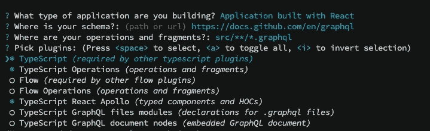
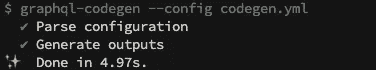

# 混合 Typescript 和 GraphQL 代码生成器

> 原文：<https://betterprogramming.pub/mixing-typescript-and-graphql-code-generator-c34e68b92dd3>

## 自动化您的 GraphQL 类型脚本的类型生成


由[克里斯托弗·高尔](https://unsplash.com/@cgower?utm_source=medium&utm_medium=referral)在 [Unsplash](https://unsplash.com?utm_source=medium&utm_medium=referral) 上拍摄的照片

GraphQL 是一种用于 API 的开源数据查询和操作语言，也是一种用现有数据完成查询的运行时语言。

我们再也不用像休息时那样玩猜谜游戏了。它是强类型的。给定一个查询，在执行之前，工具可以确保该查询在 GraphQL 类型系统中语法正确并且有效。

由于 Typescript 是一种类型化语言，它是 GraphQL 的完美匹配。通过一起使用它们，你可以确保正确的类型在你的 BE 和 FE 中是一致的。

那么为什么我们必须手动定义我们的 Typescript 接口呢？手动工作意味着可能会发生人为错误。带着这个动机`graphql-codegen`诞生了。

> GraphQL 代码生成器是一个 CLI 工具，它可以从 GraphQL 模式中生成类型脚本类型。当我们开发一个 GraphQL 后端时，会有很多情况，我们会发现自己写的东西和 GraphQL 模式已经描述的一样，只是格式不同；例如:解析器签名、MongoDB 模型、角度服务等。
> 
> **graphql-code-generator.com**

总之:这是一个 CLI 工具，它将为我们完成所有繁重的工作。让我们深入研究一下，看看使用`Typescript`、`React`和`Apollo`生成我们的第一个查询是多么容易。

# GraphQL 代码生成器设置

让我们从安装 GraphQL 库开始:

```
yarn add graphqlnpm install — save graphql
```

接下来，我们需要添加`cli`:

```
yarn add -D @graphql-codegen/clinpm install --save-dev @graphql-codegen/cli
```

GraphQL 代码生成器从`codegen.yml`读取所有配置。我们可以使用向导特性来为我们生成它。让我们运行它:

```
yarn graphql-codegen initnpx graphql-codegen init
```

对于这个特殊的例子，我们将选择`Typescript`和`Apollo`。



完成所有设置后，我们只需运行典型的安装命令:

```
npm install / yarn install
```

为了简单起见，我们将使用一个现有的 GraphQL 演示端点。这里有大量 GraphQL 演示端点可用。

设置完成后，我们的`codegen.yml`看起来是这样的:

`schema`参数告诉我们的工具 GraphQL 端点在哪里。对于本文的展示，我们将使用前面显示的端点列表中的`Star Wars`端点。

在这个场景中，我们使用 URL 模式，但是也可以使用一个`.gql`本地文件来指定模式。像这样:

```
schema: 'src/**/*.graphql'
```

或者指定多个模式文件:

```
// multiple patterns
schema:
- 'src/app1/**/*.graphql'
- 'src/app2/**/*.graphql' // ignores files
schema:
- 'src/**/*.graphql'
- '!src/app2/**/*.graphql'
```

`documents`参数告诉我们的 CLI 工具从哪里拉我们的`gql` `fragments/mutations/queries`。

请注意，GraphQL 代码生成器是一个通过插件接受粒度配置的基本工具。注意`codegen.yml`上的`plugins`部分。核心就是这么配置的。

在本文中，我们将重点放在带有`Apollo`和`Typescript`的`react`上，但是它也可以用于任何其他供应商或环境。我们甚至可以用其他编程语言输出代码，比如`Java`、`.Net`和`Kotlin`。

要为我们生成所有类型，我们必须运行以下命令:

```
yarn generate
```

请注意，现在它将失败，因为我们还没有创建任何用于工具解析的`gql`文件。

```
Error: Unable to find any GraphQL type definitions for the following pointers: 'src/**/*.gql'
```

让我们通过创建第一个 GraphQL 查询来解决这个问题。

# 创建我们的第一个 GraphQL 查询

让乐趣开始吧！让我们创建第一个查询，看看会得到什么。在本例中，我们将创建一个分页查询来列出《星球大战》中的所有星球。

你可以在这里访问《星球大战》的 GraphQL 端点[。](https://swapi-graphql.netlify.app)

我们的查询将会是这样的:

```
{
  allPlanets (first:5, after: "YXJyYXljb25uZWN0aW9uOjQ=") {
    planets {
      id,
      name,
      diameter,
      population,
      gravity
    },
    pageInfo {
      endCursor
    }
  }
}
```

让我们基于前面的查询创建`planets.gql`文件:

注意我们是如何声明它是一个带有`query`前缀的查询的。我们使用`$`来声明我们的变量`$after`，并赋予它类型`String`。它是可选的，因此不会像在我们的初始页面中那样使`String!`值为空。

现在，我们终于可以使用以下代码生成我们的第一个 GraphQL 查询了:

```
npm generate / yarn generate
```



成功生成代码

成功！因为我们有一个查询要在`src/queries/planets.gql`上生成，所以这次不会失败。您可以去检查生成的文件`src/generated/graphql.tsx`并开始在您的项目中使用它。

# 微调发电机

我们之前已经用基本配置生成了一个查询。让我们看看如何通过深入配置来改进生成的代码。

这个 CLI 工具附带了一组配置默认值，您可以在这里检查。默认情况下，以下是一些默认值:

```
config:
  withHooks: true
  withComponent: false
  withHOC: false
```

随着`Component`和`HOC`方法被弃用，你将得到推荐的`hook`版本。如果你总是遵循建议，你会没事的。

有一些非常有用的配置值得检查。以下是我的前三条:

## 1.函数式编程

让您生成的代码采用函数式编程风格:

```
config:
  constEnums: true
  immutableTypes: true
```

它将防止您改变查询结果对象，并选择不可变的代码风格。通过使用`readonly`属性修饰符，Typescript 在防止突变方面做得很好。

## 2.前缀

例如，有些团队喜欢给枚举和接口加前缀。这个 CLI 工具有一些相应的配置选项:

```
config:
  typesPrefix: I
  typesSuffix: I
  enumPrefix: false
```

## 3.编程风格

有些团队不喜欢可选字段，或者有特殊的使用方式。该工具允许您微调`optional`字段行为:

```
config:
  avoidOptionals:
  field: true
  inputValue: true
  object: true
  defaultValue: true
```

这里还有更多关于[的内容。](https://graphql-code-generator.com/docs/plugins/typescript-operations)

完成微调配置后，我的最终`codegen.yml`配置如下所示:

# 配置 Apollo 客户端

在能够使用和执行我们生成的查询之前，我们需要安装 Apollo 客户机。

```
yarn add @apollo/client graphqlnpm install @apollo/client graphql
```

> `@apollo/client`:这个软件包几乎包含了安装 Apollo 客户端所需的所有东西。它包括内存缓存、本地状态管理、错误处理和基于 React 的视图层。
> 
> `graphql`:这个包提供了解析 GraphQL 查询的逻辑。
> 
> apollographql.com

注意，我们在`codegen.yml`中使用了`typescript-react-apollo`，它已经生成了特定于 Apollo 的查询。

让我们在 React 应用程序中配置 Apollo 客户端和提供者:

我们现在可以开始使用我们生成的查询了！

# 使用生成的 GraphQL 查询

所有的环境都设置好了，是时候使用我们生成的查询了。使用 Apollo 集成时，生成器将提供自动或手动查询:

```
// trigger automatically when components renders
const { data, loading} = useAllPlanetsQuery(); // triggered manually by calling "getPlanets" method
const [getPlanets, { loading, data }] = useAllPlanetsLazyQuery();
```

根据不同的场景，您将使用其中的一种，它们的数据类型是相同的。让我们看看`PlanetsQuery`的返回类型。

让我们来看看这一切是如何运作的:

看到整件事是多么天衣无缝了吗？由于一切都是生成的，我们不必担心 FE 运行不同步——它已经为我们完成了。我们的后端和前端完全同步。

您可以从生成的文件中提取通用类型，如下所示:

```
import type { Planet } from ‘../generated/graphql’;
```

或者获取确切的查询结果类型，并从查询中提取自定义类型:

```
import type { AllPlanetsQuery } from '../generated/graphql';
```

# 包扎


照片由[马库斯·斯皮斯克](https://unsplash.com/@markusspiske?utm_source=medium&utm_medium=referral)在 [Unsplash](https://unsplash.com?utm_source=medium&utm_medium=referral) 拍摄

在本文中，我们已经看到了一个简单的 GraphQL 查询生成，但是这个工具还可以做更多的事情。你可以使用像`Fragments`、`Mutations`这样的特性——有相当多的插件可供选择。

`Graphql Code Generator`是一个伟大的工具，为我们做所有繁重的工作。根据我们的需求进行配置和定制非常容易。它将减少所需的人工工作量，而人工工作量总是容易出现人为错误。

一个好的实践是让`yarn generate`任务在 CI 中运行，以确保在开发时没有任何东西被破坏。

更多 GrahpQL 内容将很快呈现在您面前！

如果您渴望获得更多的 Typescript 内容，请查看我的关于映射类型有多有趣的文章。：

[](https://medium.com/better-programming/mastering-typescripts-mapped-types-5fa5700385eb) [## 掌握 TypeScript 的映射类型

### 了解如何像专家一样处理 Typescript 映射类型

medium.com](https://medium.com/better-programming/mastering-typescripts-mapped-types-5fa5700385eb)