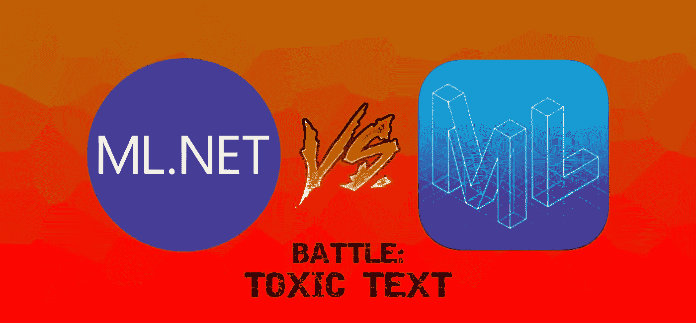
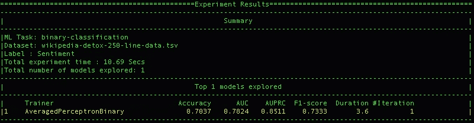
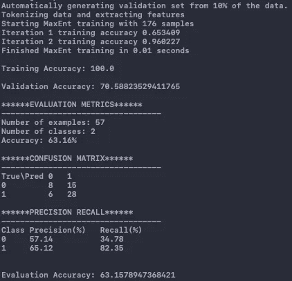
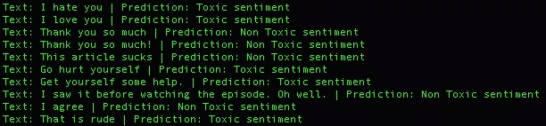
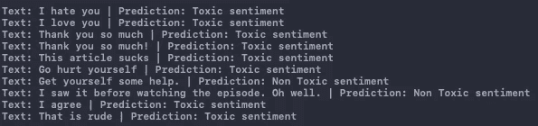

# ML.NET vs .创建 ML:有毒文本

> 原文：<https://betterprogramming.pub/ml-net-vs-create-ml-toxic-text-de1293f3a89c>

## 基于文本的快速低级比较

免责声明:这张图片比实际对比更加强烈

最近，我大肆宣传苹果的新 [Create ML](https://developer.apple.com/documentation/createml/mlimageclassifier) GUI 工具，并给了它一个[快速旋转](https://medium.com/better-programming/shoehorning-swiftui-and-create-ml-part-2-a8932075e09a)。归根结底，输入训练数据并让它给出实际工作模型是多么简单，这给我留下了深刻的印象。

我发现，用操场做一个模型，真的没有那么多工作。但是，我认为新工具是为了让机器学习变得更加容易，即使它看起来是这样。

很明显，这对我很有效。

所以，在处理完图像之后，我的下一个逻辑测试是尝试弄乱文本。

考虑如何测试这一点，我想起了我找到的一个简单的[ML.NET 教程](https://dotnet.microsoft.com/learn/ml-dotnet/get-started-tutorial/intro)，它贯穿了一个简单的二进制分类模型。教程带你经历的[维基百科排毒](https://meta.wikimedia.org/wiki/Research:Detox)用例实际上很棒。

采用苹果自己的[文本分类器模型教程](https://developer.apple.com/documentation/createml/creating_a_text_classifier_model)并把 detox 用例放入其中要简单得多。

突然，我灵光一现，意识到这也提供了一个机会，在另一场真正史诗般的苹果与微软对决中比较和对比这两个框架！

有趣的是，这是一个比较和评价他们在这方面的入门教程的机会。因此，稍作修改后，我创建了自己的测试数据，在两个实现中运行它们，并比较结果。

# 模型自我分析

我比较的第一件事是每个框架告诉我的他们自己的信心水平。模特给自己的自信水平真的很有趣也很好奇。

统计数据总是受欢迎的，但我的怀疑在于我想知道测试数据是否真的值得信赖，以及机器学习假设在人为错误面前有多脆弱。

但是我跑题了。我们要结果！首先，ML.NET CLI:

ML。净准确率:70.37%

然后，通过 Playgrounds 创建 ML(注意:我将训练和测试数据的默认随机拆分保持在 80%):

创建 ML(验证)准确率:70.59%

乍一看，这些数字表明这是一场势均力敌的比赛，苹果略有领先。

不过，这其中有一些变数。首先，这是基于苹果的验证准确性，输出承认是从 10%的数据中自动生成的。

这是不可靠的，因为我已经将 250 行数据分成了训练数据(80%的数据)和测试数据(20%)。如果我要改变随机分割百分比，精确度在技术上也会随之改变。

这不一定是我吹毛求疵。我的选择是基于各个教程中立即向我展示的内容。这意味着，虽然可能有配置 ML.NET 模型的方法，但我选择放弃任何`auto-train`建议。

如果这是任何其他项目，我可能会更仔细地考虑各自的参数和选项，但这本质上是相同用例下初学者教程的比较。考虑这个实验中的另一个“松散控制”。

# 我自己的测试

现在，对我来说真正的考验是基于我自己的输入，这些模型是否真的有效。诚然，数据集有一些非常混乱的评论，我的模型现在经过训练。

写简单的句子不一定能得到我想要的结果(这使得微软选择这个有限的集合作为介绍教程变得很有趣)。

有 10 个语句。在我看来，关键在于:

1.  我讨厌你|有毒。
2.  我爱你|无毒。
3.  太感谢了|无毒。
4.  非常感谢！|无毒(测试标点符号)。
5.  这篇文章很烂|有毒。
6.  去自残|有毒。
7.  给自己找些帮助。|无毒(取自数据集)。
8.  看集之前看到的。哦好吧。|无毒(取自数据集)。
9.  我同意|无毒(摘自数据集)。
10.  这是粗鲁的|有毒的(来自教程的例子，虽然没有预期的结果，所以这是我自己的分类)。

对于 ML 来说。网络:

ML。最终结果:三次失误

并创建 ML:

创建 ML 结果:四次未命中

有趣的是，根据我的计算，ML.NET 少了一个，但可以说，Create ML 有两个“非常感谢”的单词，有和没有“！”。所以实际上，数字的准确性是相似的。

然后，还有未命中的背景。两个模特显然都不喜欢“爱情”。此外，当 ML.NET 说关于这篇文章的评论是无毒的时候，他是个混蛋。

至于“寻求帮助”的说法，没有更多的上下文，实际上可能是任何一种方式。Core ML 对这句话更乐观，但被“谢谢你”和“我同意”这两句话绊倒了，这两句话似乎更容易理解(我可以说，我不知道这个模型在这方面教了什么，但 ML.NET 正确地理解了它们)。

# 获胜者

很难宣布谁是赢家。我们在这里真正陈述的是谁在最基础、入门和教程级别上有更好的框架。

而且，虽然这可能会使结论容易被忽略，但这是一个有效的判断角度。

我得把它给 ML.NET。原因是，最终，在几乎没有背景的基础测试中，它似乎做得更好。

“谢谢”和“同意”在数据集中可能是讽刺性的，反过来，ML 可能会选择这些。但是，那不是他们被陈述的背景，而且 ML.NET 同意没有更多证据证明他们是有毒的。

# 意义

在应用程序中演示如何创建 ML 模型

尽管这是一个真正基础的比较测试，但它能说明很多问题。这些教程可能是好奇的开发人员接触这两种框架的第一步。

当决定在我的项目中使用哪一个时，我想在指导教程结束时确定一个置信度。最终，这将在决定它是否会在我的项目中落地时承担很大的分量。

当然，还有更多因素需要决定，比如 ML.NET 是否对我的模型提供了更好的微调，或者我是否更喜欢在我的原生 iOS 应用程序中使用 Create ML？

举个例子，我快速创建了一个 iOS 应用程序，它使用了测试中的 Create ML 模型。它仅用了 21 行代码(大部分是 SwiftUI)在几分钟内就创建好了(见上面的 gif 以查看它的运行)。

但是，俗话说，第一印象是持久的。

也许这就是苹果使用不同数据集/场景的原因。这也可能是为什么微软建议你尝试一个短语(“这是粗鲁的”)，而不给你一个预期的结果。

总而言之，机器学习已经给我留下了深刻的印象，但我还有很多东西要学。