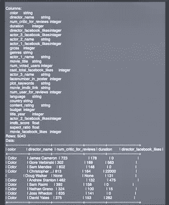
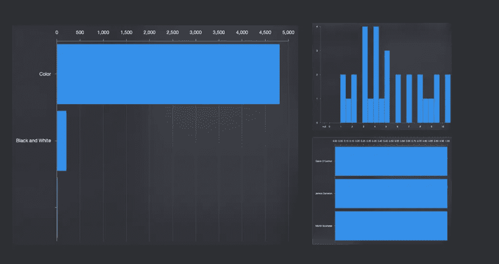

# ml datatable:iOS 开发者的熊猫

> 原文：<https://betterprogramming.pub/mldatatable-the-panda-for-ios-developers-251aa9a09eb1>

## 利用强大的 Create ML 数据结构点燃您心中的数据科学家


埃里克·麦克林在 Unsplash[上的照片](https://unsplash.com?utm_source=medium&utm_medium=referral)

数据处理、处理、清理和整形在机器学习中起着至关重要的作用。Panda 是一个强大的 python 包，是数据科学家用来对数据集执行转换的最受欢迎的库之一。

尽管有一个简单的语法，熊猫需要一个陡峭的学习曲线。更重要的是，因为有大量的功能可用于各种用例，并且需要时间来掌握所有的功能。苹果公司通过 CreateML 旨在弥合机器学习和应用程序开发之间的差距，以允许移动开发者培训和部署设备上机器学习的模型。

Create ML 是一个易于使用的界面，通过使用预先构建的模板和算法来训练不同类型的模型，它的引入在某种程度上改变了游戏规则。随着`MLDataTable`的发布，苹果努力让移动开发者更容易处理数据，提供了一种类似电子表格的数据结构，与 Pandas 相比，学习曲线更容易。

# MLDataTable —在引擎盖下

[MLDataTable](https://developer.apple.com/documentation/createml/mldatatable) 是一个管理表格数据的有用数据结构。它拥有熊猫图书馆的大部分功能，因此成为 iOS 和 macOS 开发者的熊猫。

除了用于解析 JSON 和 CSV 数据集之外，MLDataTable 还用于以下创建 ML 模型模板:

*   [MLRegressor](https://developer.apple.com/documentation/createml/mlregressor)
*   [MLClassifier](https://developer.apple.com/documentation/createml/mlclassifier)
*   [MLTextClassifier](https://developer.apple.com/documentation/createml/mltextclassifier) 和 [MLWordTagger](https://developer.apple.com/documentation/createml/mlwordtagger)
*   [ml 推荐器](https://developer.apple.com/documentation/createml/mlrecommender)

## 我们的目标

在接下来的几节中，我们将探索 MLDataTable 提供的使数据操作变得简单有趣的功能，特别是对于移动开发人员。

# 读取和解析文件

大多数数据集都是 JSON 或 CSV 文件格式。有了 MLDataTable，通过使用 Create ML 将这样的文件解析成表格形式变得快速而简单。首先，您需要在 Xcode 和`import CreateML`中创建一个 macOS 游乐场:

```
import CreateML
import CreateMLUIvar data = try MLDataTable(contentsOf: URL(fileURLWithPath: "path/to/your/file/movie_metadata.csv"))
```

在操场上运行上述代码时，您可以在操场预览中查看表格数据，如下所示:



我们已经使用了来自 Kaggle 的 [IMDB 数据集](https://www.kaggle.com/carolzhangdc/imdb-5000-movie-dataset/kernels)

要获得列名和类型，只需使用 getter 属性`columnNames`和`columnTypes`。

此外，我们可以在`MLDataTable`初始化器中设置我们自己的解析选项。通过`skipRows`、`selectColumns`、`maxRows`等选项，我们可以将数据从文件过滤到我们的表中。

# 字典到数据集

列名和数据值的字典(符合`MLDataValueConvertible`协议)也可以转换成`MLDataTable`。下面的代码创建了一个由三行两列组成的虚拟电影数据集:

```
let movieData: [String: MLDataValueConvertible] = ["Title": ["Titanic", "Shutter Island", "Warriors"],
"Director": ["James Cameron", "Martin Scorsese", "Gavin O'Connor"]]var movieTable = try MLDataTable(dictionary: movieData)
```

# 派生新的数据表

MLDataTable 可以被拆分、合并或转换，以生成一个全新的数据表。

## 拆分和排序表格

以下代码用于将`MLDataTable`分成训练和测试数据集，用于模型训练和评估:

```
let (trainingData, testingData) = data.randomSplit(by: 0.8, seed: 5)
```

MLDataTable 可以按特定列排序，以产生新的 ml datatable:

```
data = data.sort(columnNamed: "director_name")
```

## 合并两个表格

像推荐系统中的数据集经常需要这样。为此，我们可以使用:

*   `func append(contentsOf: MLDataTable)` —在当前`MLDataTable`的末尾添加一个新表格
*   `func join(with: MLDataTable, on columnsNamed: [], type: .inner)` —根据匹配的列合并行。如果 columnNames 设置为空，则假定连接中的所有列。

# CRUD 操作

在数据处理中，执行诸如添加、删除、更新列和数据之类的操作是一个相当常见的用例。为此，MLDataTable 为我们提供了以下函数。

## 添加、删除、重命名列

要向 MLDataTable 添加一列，只需追加由行值组成的`MLDataColumn`。以下代码使用一个新列将电影字典扩展到我们之前创建的 MLDataTable 数据集:

```
var movieTable = try MLDataTable(dictionary: movieData)let genreColumn = MLDataColumn(["Drama", "Thriller", "Drama"])movieTable.addColumn(genreColumn, named: "Genre")
```

要删除一个列，我们只需调用带有列名字符串的`MLDataTable`实例上的`removeColumn`方法。

```
movieTable.removeColumn(named: “Genre”)
```

要将现有列重命名为新名称，只需调用 MLDataTable 实例上的`func renameColumn(named: String, to: String)`函数。

## 删除重复的行，填充缺失的列

虽然 Panda 提供了诸如`fillna()`和`drop_duplicates`之类的函数来填充缺失的列值，并根据某一组条件删除重复的行，但是 MLDataTable 具有以下等效方法:

```
movieTable.dropDuplicates()movieTable.fillMissing(columnNamed: "Title", with: MLDataValue.string("NA"))
```

`dropDuplicates`函数删除重复项并返回一个包含所有重复行的`MLDataTable`。此外，函数`dropMissing`用于删除缺少值的行。

> 要将一列转换成一个新列，我们可以使用 map 函数，该函数允许以线程安全的方式更新所有行。

# 数据可视化和导出

使用 MLDataTable 实例上的`show()`函数，我们可以在我们的操场上以可视化方式查看表格数据，如下所示:



目前，它显示 MLDataTable 的第一列的可视化效果。

最后，可以使用`write`函数将 MLDataTable 导出为 CSV 或 JSON 文件。许多创建 ML 应用程序模板需要 CSV 格式，因此以下函数相当重要:

```
try trainingData.writeCSV(to: URL(fileURLWithPath: "path/file.csv"))
```

# 结论

因此，我们已经探索了 MLDataTable 的不同用例，并看到了对于希望加入机器学习潮流的移动开发人员来说，使用这个令人敬畏的 Create ML 结构是多么容易。

在这篇文章中分享 MLDataTable 的重要性的想法是在我创作另一个[故事](https://towardsdatascience.com/classifying-movie-reviews-with-natural-language-framework-12dfe2fc3308)时产生的。如果时间旅行是可能的，我会重写这段代码，使用 MLDataTable 代替 Pandas 进行数据集导入和导出来创建 ML。

这一次到此为止。我希望你喜欢阅读。