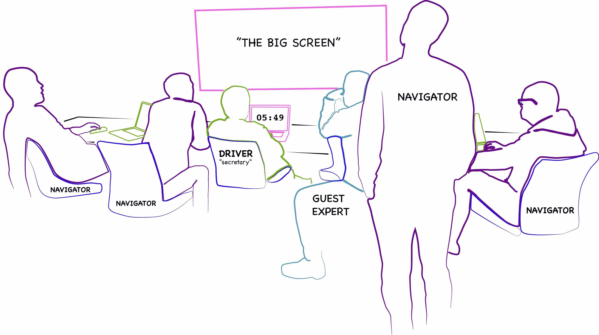

# 暴民编程比你想象的要快

> 原文：<https://betterprogramming.pub/mob-programming-is-quicker-than-you-think-568402c98b2e>

## 异步完成的任何事情都需要重新同步。

Mob 编程是结对编程范例的扩展，在结对编程范例中，不是两个开发人员从事同一项任务，而是三个或更多的开发人员从事同一项任务。这通常包括整个团队一起工作，由一个人控制工作站。

# 有什么好处？

在 2006 年的一项评估个人和团体解决复杂问题的有效性的研究中，确定:

> 我们发现三人组、四人组和五人组的表现优于最优秀的个人，并将这种表现归因于人们共同努力产生和采用正确反应、拒绝错误反应以及有效处理信息的能力。

但是这种质量和性能提高的原因是什么呢？为什么他们能够拒绝错误的回答，仅仅通过在一个群体中就能有效地处理信息？

**首先**，开发的认知负荷由所有积极的参与者分担，因此没有一两个人被委托设计实现。这种认知多样性通常会带来更好的解决方案，因为可以对解决方案中可能出现的错误和陷阱进行更多的考虑。

**其次**，关于解决方案的知识易于分享和理解。事实上，对所有个人的理解是实时发生的，因此团队不需要创建和阅读额外的文档来理解实现。

**第三，**解决挑战所需的技能可以实时获得，因此不需要额外的沟通。不需要安排会议来讨论障碍，不需要创建票证来将任务移交给其他人，也不需要管理人员参与沟通移交。

第四个，个人可以根据需要来来去去处理可能会阻碍任务进展的外部职责。这有助于缓解通常与高度集中的开发需求相关的压力。

**第五**，团队成员可以提前研究即将到来的任务障碍，以便当时间到来时，他们可以有足够的知识来快速克服障碍。

**第六**，团队的新成员可以很容易地参与进来，并立即开始为代码库做贡献，因为他们从一开始就会积极地参与开发。

mob 编程还有几个额外的好处，我们无法在本文中介绍，但是现在应该很明显有很多理由这样组织。

# 设置

团队的所有成员都应该在一个房间里，无论是物理的还是虚拟的。他们之间不应该有任何障碍，比如格子墙或监视器，这样每个人都可以看到对方。房间的前面应该有一个足够大的监视器，每个人都能看到。当对话进入理论或抽象阶段时，额外的白板也很有帮助。

mob 会话包含与结对编程会话相同的角色，其中一个人充当*司机*，另一个人充当*导航员。然而，在暴民中，群体的其他成员仍然是活跃的观察者。*

**司机**控制着管理房间前面屏幕的电脑。他们操作鼠标和键盘，键入导航器建议的所有代码，并在屏幕上移动项目，让每个人都清楚地看到正在发生什么。他们有效地关注正在编写的“当前”代码。

**导航员**是*推理*的主要负责人。他们正在决定下一步做什么，下一个问题是解决什么，如何解决，以及解决它可能需要哪些额外的资源。在这种情况下，让房间里的其他专家提问或指出导航员可能没有预料到的即将到来的挑战是非常方便的。

有时，导航员的角色会转变为一个积极的观察者，如果他们的特定技能集对于推进解决方案是必要的。然而，与结对编程非常相似的是，轮换通常以受控的间隔发生。为了达到最好的结果，在群氓中的所有个体之间定期的角色转换是至关重要的。一般来说，mob 越大，轮换间隔应该越短。长时间的间隔会导致参与者等得太久。

# 我们不会慢一点吗？

与结对编程一样，管理层有时很难看到安排多个开发人员从事同一任务的好处，因为这似乎限制了团队的整体吞吐量。相反，他们希望在团队中划分任务，让团队以异步的方式独立工作。这似乎是完成最多工作的最合理的方式。

但是有一个问题， ***任何异步完成的事情都需要重新同步*。**

将所有不同的独立部分整合在一起所需的时间往往没有被考虑或低估。代码审查、向标签添加评论并阅读它们、变更批准过程、讨论每个人在他们的作品开发中所处位置的会议、当一个人落后而其他人需要完成他们的代码才能继续他们自己的代码时的依赖性阻止程序，等等。这些问题很少被考虑，但实际上会导致更多的时间投入。

当考虑到交流间隙、会议、代码审查、产生的更少的技术债务和文档所减少的时间时，总的吞吐量保持不变。

例如，对于一个执行 mob 编程的团队来说，没有必要召开每日站立会议，因为每个人都在从事相同的任务。

没有必要进行代码审查，因为所有潜在的审查者都参与了开发。

开发人员不需要花时间在标签上评论来跟踪该标签上的障碍或进展，也不需要任何开发人员花时间来阅读那些评论。

不需要通过电子邮件、空闲时间、会议或其他沟通途径与团队中的其他开发人员进行外部沟通。

通过消除大量的沟通差距、会议和代码质量控制，我们实际上改进了开发流程。

# 想休息就休息

当作为一群人工作时，重要的是要记住这种持续的工作环境会对一些人造成精神消耗。许多人只是不喜欢整天和同样的人呆在一个房间里。这是一种可以理解的情况，团队应该对此做出解释。

作为一般规则，暴民必须接受团队中的任何个人都有在任何时候毫无疑问地离开的自主权。事实上，mob 编程让人感觉更加自由，因为成员可以在他们感到不堪重负的任何时候离开。在非围攻型团队中，没有这种远离工作难度的暂停考虑。如果非围攻团队中的某个人被分配了一些工作，并决定暂时离开，那么工作就会停止，不会有进一步的进展。然而，在 mob 编程场景中，工作可以在他们不在的时候继续进行，从而减轻他们的执行压力。结果，Mob 编程消除了许多情绪和倦怠的感觉，尽管这是反直觉的。

# 结论

Mob 编程允许团队之间更有效的交流，从而更快地完成任务。更少的非编码相关的活动，比如会议，或者进展的文档。对任何一个人来说都没有太大的压力。可以从人群中抽出时间来管理外部职责，但工作仍将继续。产生的代码的质量要高得多，并且很少出现未被发现的错误，这些错误会导致以后的时间损失。这里有许多明确的和未明确的好处。唯一真正确定的方法是**尝试一下**。如果它对你不起作用，那么你随时可以回到你做它的方式。但我可以告诉你，在大型企业组织中与许多团队合作后，他们中没有一个人曾想回去。