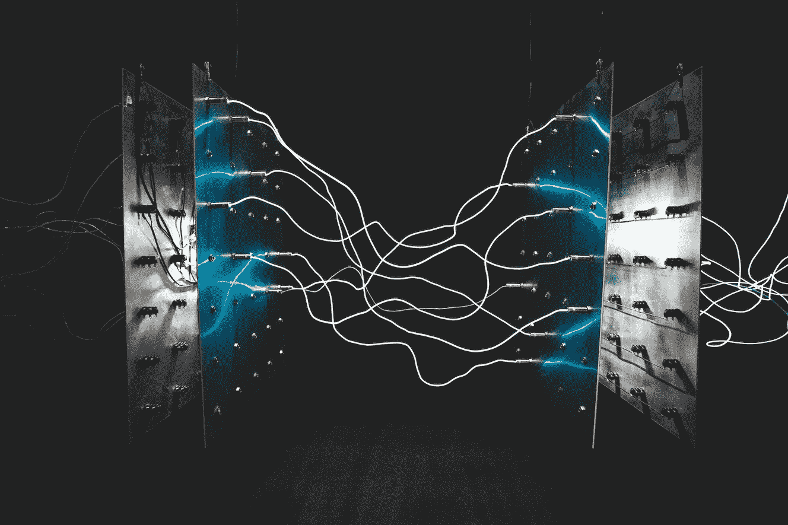
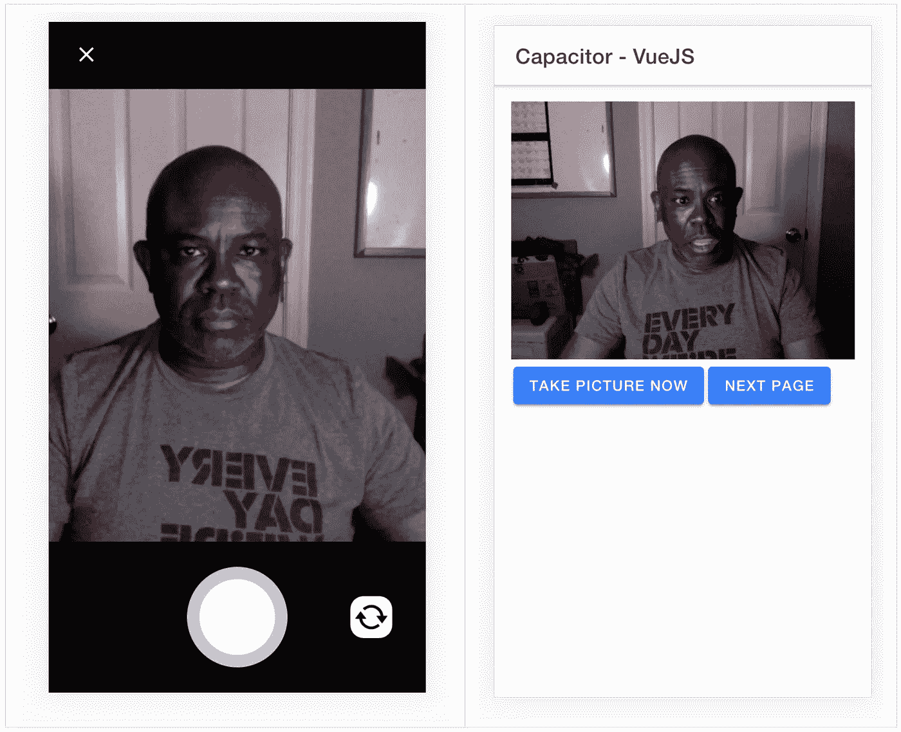

# 使用 Vue.js 和 Ionic Capacitor 插件进行移动开发

> 原文：<https://betterprogramming.pub/mobile-development-w-vuejs-and-ionic-capacitor-plugins-cb86474c01b1>

## 使用 Vue.js 浏览在 Ionic web 和移动应用程序中集成电容器和非电容器/Cordova 插件



照片由 israel palacio 在 Unsplash 上拍摄

# 概观

本示例/教程将使用 [Vue.js](https://vuejs.org/) 在[离子电容](https://capacitor.ionicframework.com/)网络/移动应用中完成以下功能的集成。

*   使用 Vue.js 进行带有离子成分的基本应用。
*   在移动应用和 PWA 中使用[电容器地理定位插件](https://capacitor.ionicframework.com/docs/apis/geolocation)。
*   在移动应用和 PWA 中使用[电容摄像头插件](https://capacitor.ionicframework.com/docs/apis/camera)。
*   在移动应用中使用 [Cordova 条形码扫描仪插件](https://github.com/phonegap/phonegap-plugin-barcodescanner)。

# 电容摄像机插件集成

电容器有一组默认的插件，相机和地理定位就属于这一类。从`@capacitor/core`节点模块访问这些插件。

```
import {  
  Plugins,  
  CameraSource,  
  CameraResultType
} from "@capacitor/core";
const { Camera } = Plugins;
```

现在，调用摄像机上的方法:

```
const image = await Camera.getPhoto({
  quality: 90,            
  allowEditing: true,            
  resultType: CameraResultType.DataUrl,            
  source: CameraSource.Prompt
});
```

对于地理定位:

```
let location = await Geolocation.getCurrentPosition({
  enableHighAccuracy: true,        
  timeout: 30000      
});
```

# 让摄像头在 PWA/网站上工作

*   参见[电容器文件](https://capacitor.ionicframework.com/docs/pwa-elements/)。

安装 PWA 元件:

```
npm install @ionic/pwa-elements
```

然后打开 Vue 项目中的`main.js`文件，并进行以下更改:

然后奇迹发生了。Ionic 现在将使用`pwa-element`来访问网络摄像头，而不是寻找设备的摄像头。



# 添加非电容插件

我正在测试[条形码扫描仪插件](https://github.com/phonegap/phonegap-plugin-barcodescanner)，你需要使用`npm`安装该插件。

```
npm install phonegap-plugin-barcodescanner
```

然后，在源代码中，你可以访问`window`对象的插件。在您的代码中，您还可以检查窗口对象中的 [Cordova](https://cordova.apache.org/) 以确保用户不会试图在浏览器中加载条形码扫描仪。

```
window.cordova.plugins.barcodeScanner.scan(
  function(result) { /* success */ },
  function(error) { /* error */ },
  { /* settings */ }
  );
```

# 项目源代码

*   [GitHub](https://github.com/aaronksaunders/capacitor-vue-ionicv4-app)

# Vue 和 Vue 合成 API 的视频播放列表

# 其他 Ionic Framework Vue.js 示例

*   [https://github.com/aaronksaunders/ionic4-vue-tabs](https://github.com/aaronksaunders/ionic4-vue-tabs)
*   [https://github.com/aaronksaunders/icon-vue](https://github.com/aaronksaunders/icon-vue)
*   [https://github.com/aaronksaunders/ionic-vue-picker-sample](https://github.com/aaronksaunders/ionic-vue-picker-sample)
*   [https://github.com/aaronksaunders/vue-ionic-demo](https://github.com/aaronksaunders/vue-ionic-demo)