# 使用 AWS 设备群的移动测试自动化

> 原文：<https://betterprogramming.pub/mobile-test-automation-using-aws-device-farm-6bcf825fa27d>

## 利用 Java SDK 将 AWS 设备群有效地集成到 CI 管道中。


在我们的移动测试自动化之旅中，我们大多数人都会考虑迁移到云平台。其优势听起来很有希望:设备种类繁多，无需维护，伸缩灵活。现实稍微复杂一些，我们必须在向这些供应商购买计划之前了解我们的确切需求。虽然在某些情况下，在内部建立设备实验室可能是一种有效的解决方案，但云提供商是一种令人兴奋的有用工具，可以将任何移动测试自动化提升到一个新的水平。

在本文中，我们描述了如何利用 AWS Device Farm 的公共云，以便我们可以轻松地集成到 CI 管道中。对于这个例子，我们使用 Java、Cucumber 和 Appium，但是这些概念也适用于其他技术。

# 服务器端执行模型

当执行测试时，AWS(至少在他们的公共云中)使用一种我称之为*服务器端执行*的方法。这意味着测试代码完全在他们的基础设施上运行。另一种选择是像 Browserstack 或 Saucelabs 这样的提供商所使用的，测试代码在用户的机器上运行，称为*客户端执行，*，并通过 web 服务与云服务交互。一般来说，客户端执行更容易实现；如果您已经知道如何在本地执行测试，那么您需要做的配置更改是最小的。

AWS 的方法有点棘手，因为它需要几个额外的步骤，即打包和上传运行测试所需的所有东西到他们的服务器上。这带来了一些挑战和陷阱，我将在本文中介绍。

# 通过 web 控制台执行测试

在 AWS 设备群上开始运行测试的最简单方法是通过他们的 web 控制台。如果您需要经常这样做，这将是一个乏味的过程(我们稍后将讨论如何使用他们的 API)，但是浏览 web 控制台是我们熟悉这个过程中不同步骤的一个很好的方式。

首先，让我们登录 AWS 并打开设备场控制面板:

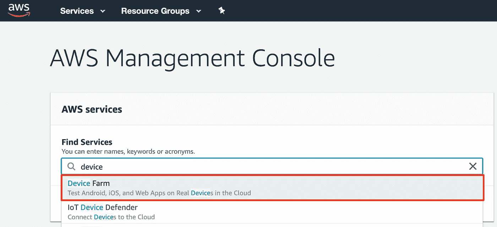

然后我们创建一个新项目:

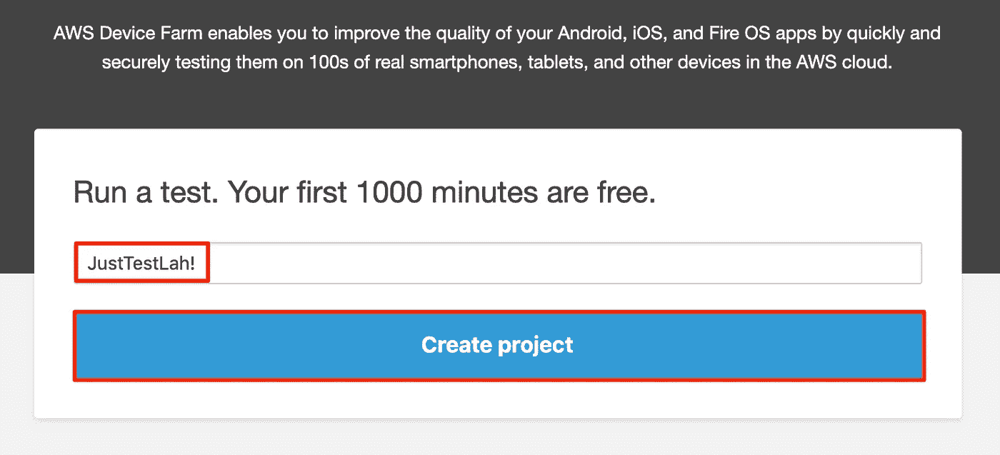

创建我们的第一次运行:


由于我们正在测试一个原生 Android 应用程序(StackOverflow)，我们的第一步是上传它的 [APK 文件](https://apkpure.com/stackoverflow/apps.ali.stackoverflow/download):

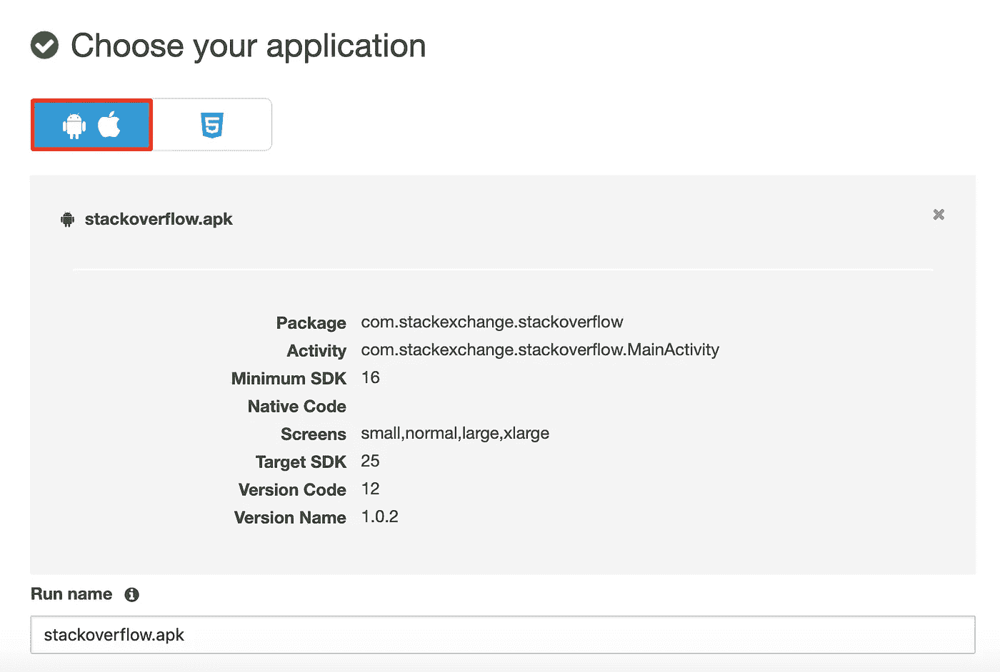

接下来，我们需要选择测试的类型。我们使用 *Appium Java JUnit* :

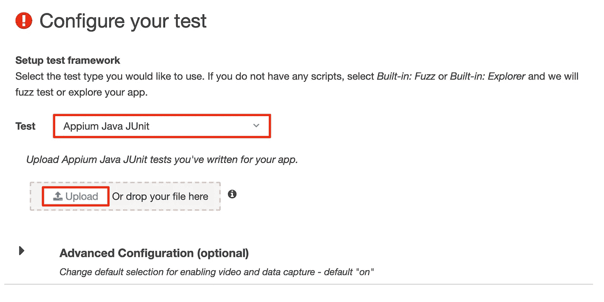

使用 Maven，我们可以按照文档中的步骤创建一个 zip 文件形式的测试包。不要被只支持 Java 8 的说法所迷惑。我们将在后面处理这个问题(当然用 Java 12 代替)。

在这个演示中，我们使用了 [JustTestLah！](https://github.com/martinschneider/justtestlah)使用 Java、Cucumber 和 Appium 测试框架(声明:我是作者😉).

您可以从这个链接上传测试包[，或者使用 Maven 自己构建演示(zip 文件将在`justtestlah-demos/target`中生成):](https://mega.nz/#!WVhwHKrY!3_lMWkLEXg8RKweqhokG2iLpvRALZizsriir_sydWFQ)

一旦你将 zip 上传到 AWS，你将被询问是使用*标准环境*还是创建 [*自定义环境*](https://docs.aws.amazon.com/devicefarm/latest/developerguide/custom-test-environments.html) *，*我们选择后者。测试规范是一个 YAML 文件，列出了在测试执行的各个阶段要执行的一组 shell 命令。这让我们对在 AWS 上执行测试的方式有了一些控制。

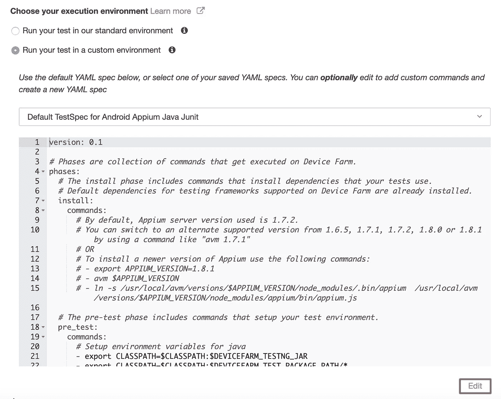

现在，用以下内容替换默认规范:

我将在本文的后面解释这个配置的细节，现在，让我们保存它并继续设备选择:

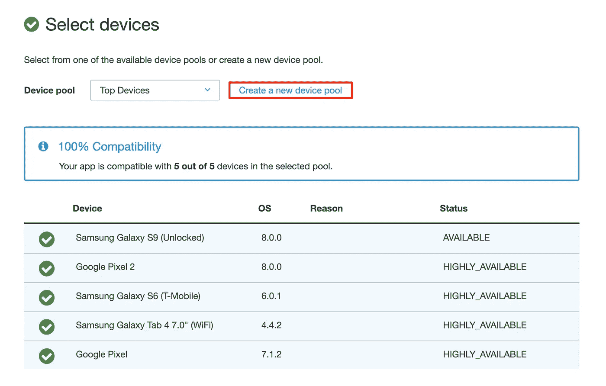

AWS 使用一个称为设备池的概念。每个测试执行将在池中的所有设备上运行所有的测试。我们只需要一台设备，因此我们用一个 Google Pixel 创建了一个新的设备池:

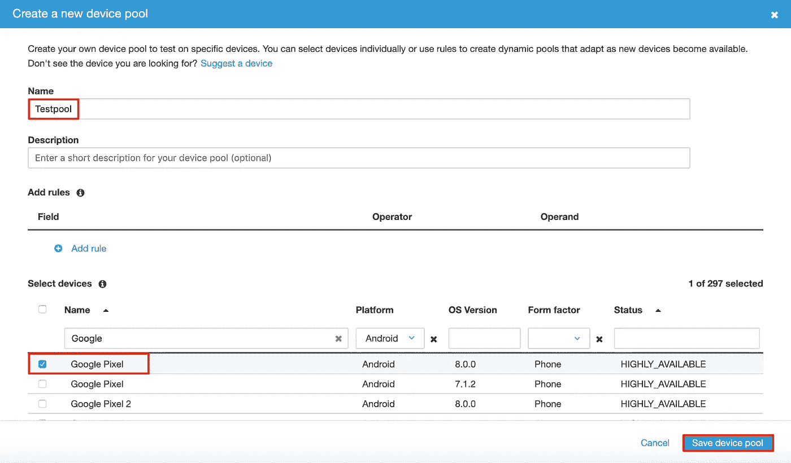

接下来，有一个步骤叫做*指定设备状态*，我们现在跳过它(保留默认值)。在最后一页，我们可以回顾这次跑步。让我们缩短超时时间，以免在出现问题时耗尽宝贵的设备时间:

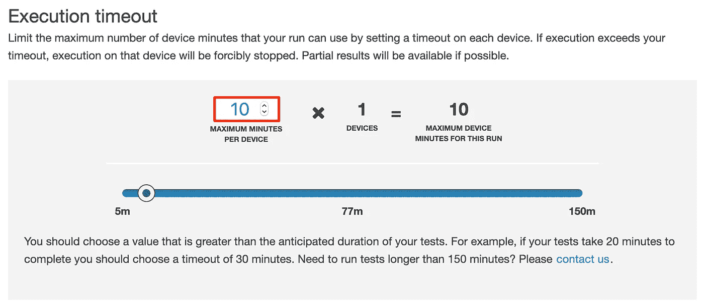

最后，我们可以触发测试执行:

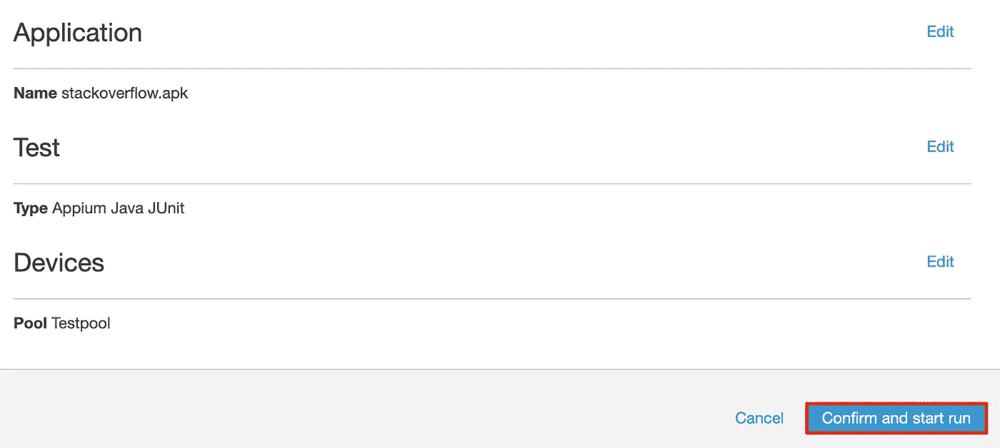

你可以在仪表板上看到跑步。点击它并选择我们的测试设备(Google Pixel)以查看设备的实时日志和实时流(设置需要几分钟时间):

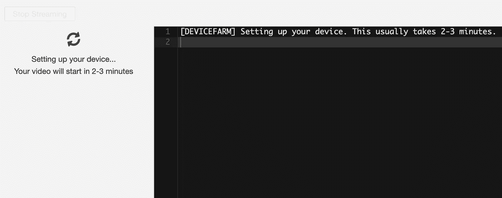

这是我们正在测试的场景:

如果一切顺利，您将在测试结果页面上收到一条成功消息:

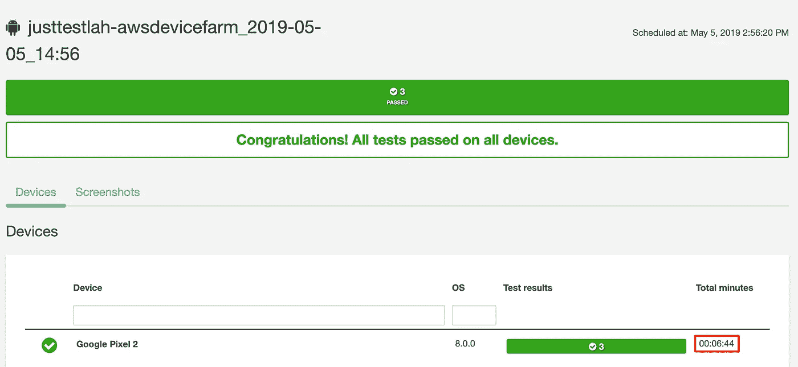

旁注:记录测试执行的持续时间。在计划您的测试执行时，您需要考虑设置和拆除设备的相当大的开销(以及来自执行测试规范和初始化 WebDriver 的更多开销)。由于这种开销，AWS 通常更适合在单次执行中运行大型测试套件，而不是在多次运行中运行小型测试套件。在某种程度上，这适用于所有的云解决方案，但是这种开销对于不同的供应商是不同的，因此是一个重要的选择标准。

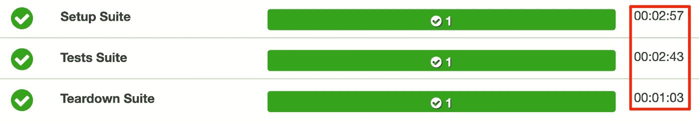

# 接下来呢？

恭喜你！您成功地在 AWS 设备场上执行了第一次 Appium 测试。让我们来看看一些挑战，看看使用一个定制的测试规范是如何让我们的生活变得更容易的。然后，我们将展示如何使用他们的 API 来自动化安排测试的过程。

1.  **每次更改后重新上传测试包**

您可以重复使用先前上传到 AWS 设备场的测试包。如果有变化，您只需要重新打包并上传它们。这在理论上听起来没问题，但是，因为这些包包含了运行测试所必需的*一切*，不仅包括框架或其依赖关系的变化，还包括测试、测试数据或测试配置的变化。更改单个参数(例如，指定运行哪些测试)总是需要一个新的测试包。

假设您的测试套件包含 100 个测试，您希望将它们分布在 10 个设备上，以减少总的执行时间。AWS 和大多数其他云提供商不支持开箱即用。

在 Device Farm 上解决这个问题的简单方法是为每个测试子集创建 10 个测试包，每个测试包被配置为执行 10 个不同的测试。然而，这需要打包和上传多个大的、几乎相同的 zip 文件。现在假设下一次您想要将您的测试分布在 20 个设备上，或者您想要执行一组稍微不同的测试。您总是需要重新创建和上传新的测试包。

这就是我们在引入定制环境之前第一次使用 Device Farm 的方式，这相当痛苦。不断构建和上传 100 多 MB 的 zip 文件会使 CI 管道变得更加麻烦。

## 救援的定制环境

如果您再看一下上面的定制环境规范，您会看到我们如何利用这个特性来消除这个限制。 [base64 编码信息](http://www.utilities-online.info/base64/?save=f42c054b-5e0f-458e-9be9-2767aa9b7b27-base64)包括我们的测试配置。这允许我们通过上传一个相对较小的 YAML 文件(测试规范)来定制测试运行，而不是重新创建大得多的测试包。我们在创建测试规范的过程中对配置进行编码。当它被执行时，我们把它解码成一个文件，然后作为参数传递给执行。

对于少数几个参数来说，这可能是多余的，但是对于一组更大的配置值来说，base64 编码的字符串被证明是一种非常健壮和优雅的方式(它也使我们免去了在 YAML 中转义特殊字符的麻烦)。

[JustTestLah！](https://github.com/martinschneider/justtestlah)使用 Cucumber，因此，例如，我们可以通过传递单独的 Cucumber 标记来运行不同的场景:

或者

对于每一次运行，测试包可以是相同的，只有测试规范发生了变化。

## 进一步的改进

我们可以进一步采用这种方法，完全消除对测试包的需求。相反，我们配置定制环境，从外部来源获取必要的代码和配置，并完全在 AWS 实例上构建它。

这允许我们将测试代码与框架代码分开。后者应该相当稳定，只有测试本身会更频繁地变化(我们在测试规范执行期间获取它们)。如果没有对测试规范的巧妙使用，这样的场景将很难实现。

**2。控制执行环境**

如果您在您的基础设施上执行测试，您可以完全控制您所使用的工具及其版本。有了 AWS Device Farm，就没那么简单了。

默认环境仍然使用 Java 8(比当前的 JDK 12 版本落后四个主要版本)。其他库可能有类似的问题，但是对于 Java，有一个简单的修复方法，可以通过在环境配置中添加几行代码来下载和安装:

但是，这是一种变通方法，而不是解决方案。从执行开始起，您就为设备的分钟数付费，从长远来看，测试规范中任何额外的、耗时的步骤都会增加。

# 通过 API 执行测试

现在我们已经完成了手动创建测试执行的步骤，让我们看看如何使用*优秀的* AWS Java SDK(也有其他编程语言的 SDK)来自动化这个过程。

为此，您需要[创建一个能够访问设备群](https://docs.aws.amazon.com/devicefarm/latest/developerguide/setting-up.html)的 AWS 用户，并且[生成一个访问密钥和一个秘密密钥](https://docs.aws.amazon.com/general/latest/gr/aws-sec-cred-types.html#access-keys-and-secret-access-keys)。我建议也设置 [AWS CLI](https://aws.amazon.com/cli/) ，并通过调用以下命令进行配置:

这将要求您提供之前生成的访问密钥和秘密密钥。作为区域，设置`us-west-2`。您的密钥将存储在您的用户家中(在`~/.aws/credentials`下), SDK 中使用的默认凭证提供者将从那里获取它们。注意[让它们尽可能远离你的源代码](https://github.com/awslabs/git-secrets)。

完成后，让我们来看看一些 JAVA 代码。完整的源代码可以在 [GitHub](https://github.com/martinschneider/justtestlah) 上找到。对于这个演示，我们从 JUnit runner 类内部调用 AWS(有趣的部分在`run`方法内部)。请注意，我们使用一个称为设备过滤器的概念来确定要使用的测试设备，而不是设备池。

现在，即使测试在 AWS 的基础设施上运行，我们也可以将它们包装在本地 JUnit 执行中(有一些限制)，并以与本地 Appium 测试相同的方式执行它们，或者使用云提供商在客户端执行。

如果你拉 [JustTestLah！](https://github.com/martinschneider/justtestlah)并通过调用`mvn install -DskipTests=true`将其安装到您的本地 Maven 存储库中。您可以通过调用以下命令来触发我们之前通过 web 控制台安排的相同测试:

您需要在`stackoverflow_aws.properties`中设置的唯一值是您的设备农场项目的 ARN (Amazon 资源名称)。使用 AWS CLI 可以很容易地找到这一点:

请注意，到`justtestlah.properties`的路径必须是绝对的(请随意贡献给 [JustTestLah！](https://github.com/martinschneider/justtestlah)改善这一点)。您可以在`justtestlah-demos/demos`下找到演示配置。使用一个符号链接`ln -s justtestlah-demos/demos /demos`所有的命令都如图所示工作。或者，根据需要修改路径。

通过在属性文件中指定现有应用程序包或测试包的 ARN，您可以轻松跳过上传新的应用程序包或测试包:

```
cloudprovider=aws
aws.projectArn=xxx
aws.appPackageArn=yyy
aws.testPackageArn=zzz
```

如果您想在 Browserstack 上运行相同的测试，您只需传递一个不同的配置(在`stackoverflow_browserstack.properties`中设置您的 Browserstack 电子邮件和访问密钥):

对于本地执行(确保 Appium 正在运行，并且您至少有一部连接的 Android 手机或运行模拟器)，您可以调用:

如您所见，使用这种技术，执行测试的云提供商只不过是一个配置值。您可以在本地执行、AWS 设备场和 Browserstack 之间无缝切换。封装的下一个层次将是跨多个平台维护不同的设备，并让框架处理所有其他事情，即，为每个测试选择能够提供所请求的设备(并且能够最快完成)的云提供商。

如果你对这种设置有任何经验或者想尝试一下[，请给我写信](mailto:mart.schneider@gmail.com)。

# 配置

除了设备过滤器，您还可以为 AWS 测试执行定义一些额外的配置(这些是我们在 web 控制台上的*指定设备状态*期间跳过的设置):

# Maven 集成

对于集成 AWS Device Farm 的稍微不同的方式(但使用相同的 Java SDK)，您可以看看我的 [Maven 插件](https://github.com/martinschneider/aws-devicefarm-maven-plugin)。它提供了每个步骤的目标(上传应用程序包、上传测试包、计划运行等)。)允许您将它们分开。例如，您可以在每次有新版本时上传一个新的应用程序包，并在每次测试代码发生变化时上传一个新的测试包。然后，测试执行本身可以独立于这两者，只需重用最新的(或任何特定的)应用程序和测试包。

# Jenkins 插件

AWS Device Farm 也有一个 [Jenkins 插件，但是它没有本文描述的解决方案灵活。](https://docs.aws.amazon.com/devicefarm/latest/developerguide/continuous-integration-jenkins-plugin.html)

# 摘要

在这篇文章中，我们展示了一个 PoC 风格的演示，展示了如何在 AWS Device Farm 上运行测试，其方式与在本地或在 Browserstack 等客户端执行平台上运行测试几乎相同。让您的测试在 AWS Device Farm 上运行，特别是以有效的方式将它们集成到构建过程中，这并不是一个简单的过程(除了最基本的需求之外)，我希望这些例子可以帮助面临类似挑战的其他人。

一旦事情开始运行，AWS 就是一个可靠的移动自动化云提供商，因此坚持下去并根据您的需求定制东西是值得的。

如果您有任何问题或意见，请随时[联系我](mailto:mart.schneider@gmail.com)。