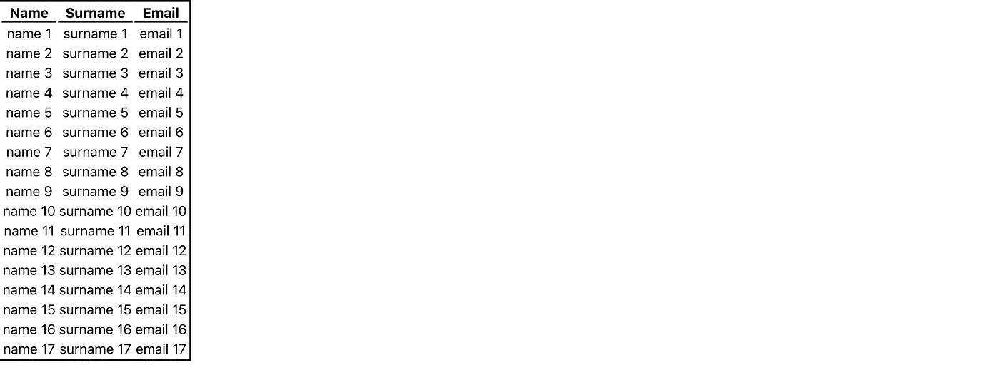

# 模仿 API 调用 React 中的快照测试

> 原文：<https://betterprogramming.pub/mocking-api-calls-for-snapshot-tests-in-react-f98664a9b06b>

## 如何有效地模拟 API 响应，以便在 React 的快照和单元测试中使用


照片由 [Artem Sapegin](https://unsplash.com/@sapegin?utm_source=medium&utm_medium=referral) 在 [Unsplash](https://unsplash.com?utm_source=medium&utm_medium=referral) 拍摄

作为软件开发人员，很多时候，我们需要模拟数据或 API 调用，以便为我们的代码编写和运行自动化测试。这些测试可以是遵循 Given-When-Then 原则的单元测试，主要用于测试函数和类的正确功能，也可以是快照测试。

快照测试是单元测试的一个子组，它确保一个给定的组件(比如一个定制的 React 组件)在视觉外观和内容方面与一个给定的表示相匹配。

模拟数据或 API 调用响应来填充定制的 React 组件，这可能是一个真正的痛苦，因为很多时候这些调用是异步的，而大多数单元的快照测试是同步的(记住 Given-When-Then 单元测试模型)。

在本文中，我将展示我认为最有效、最不言自明的模拟 API 响应的方法，用于定制 React 组件的快照测试。

# 创建项目

由于我是 TypeScript 的忠实粉丝，我将使用 TypeScript 模板生成一个 React 项目。然而，相同的原则和模式可以在任何带有 Javascript 或 Typescript 的 React 项目中原样使用。因此，我在终端上执行的第一个命令如下:

```
create-react-app mock-api-snapshot-tests --template typescript
```

# 创建组件

为了实现更好的项目结构和更清晰的代码，我创建了一个名为`TableList`的组件，它包含一个表格，表格中有一些细节。我使用了`styled-components`库来设计我在项目中使用的任何组件的样式，您可以通过键入

```
yarn add styled-components
```

因此，首先我声明了一个样式化的组件，我们稍后将使用它来创建最终的`TableList`组件，然后，我们继续进行`TableList`的实际实现，这可以在下面的代码片段中看到:

# 设置与 API 的通信

我们使用 [https://mockapi.io](https://mockapi.io) 建立了一个模拟 API，它有一个 GET 端点，返回用户的对象，每个对象有三个字段(名字、姓氏和电子邮件),以满足项目的需要。

然后我们安装 axios，这是一个使 React 的 API 调用更容易的库。

```
yarn add axios
```

回到`App.tsx`文件，我们项目的主文件，我们导入 axios，然后在`useEffect()`钩子中调用 API 的 GET 端点。每次组件渲染时都会运行此效果。

设置一个空数组作为`useEffect()`钩子的第二个参数非常重要。否则，该组件将无限地重新呈现，GET 请求将触发多次，从而导致来自 API 的限速错误响应。

`App.tsx`文件的片段如下所示:

现在，如果您通过在项目的根目录中键入`yarn start`来运行项目，将会出现一个简单的表格，并且一旦 API 调用有了有效的响应，就会显示数据。



React 应用程序的屏幕截图

# 配置测试

在继续编写实际的测试之前，我们必须执行一点配置。

首先，我们添加以下依赖项:

`yarn add --dev jest jest-styled-components @types/react-test-renderer ts-jest enzyme-to-json enzyme`

然后，我们应该在项目的`package.json`文件中添加以下字段:

这种配置确保任何快照都将被正确地序列化为 JSON 格式。除此之外，在`package.json`的“脚本>测试”字段中，我们应该将值替换为“jest”。

然后我们应该在 src 目录下添加一个名为 **jest.setup.ts** 的新文件。该文件应该如下所示:

然后，我们将项目的`tsconfig.json`文件设置为如下:

最后，我们为 babel 添加一个名为`babel.config.js`的配置文件。

# 编写快照测试

现在是时候为 A `pp.tsx`组件编写一个快照测试了。快照测试确保组件看起来像它应该的样子，并且在视觉外观方面没有发生重大变化。

然而，由于各种原因，我们不希望每次快照测试运行时都调用真正的 API 端点。因此，我们必须在网络级别模拟 API 响应。

首先，我们创建一个名为`__tests__`的新目录，并在其中创建一个名为`App.test.tsx`的新文件

该文件的代码如下所示:

在前两行，我们声明了所有需要的依赖项。在第 4-13 行，我们声明了我们希望在 API 调用中作为响应传递的模拟数据。

然后，在第 15-19 行，我们声明了 axios 库的模拟 get 函数。这意味着当测试运行时，`axios.get()`将在第 17 行使用第一次调用的模拟实现(这就是`mockImplementationOnce`函数所做的)。

最后，在第 21–29 行，进行了实际的测试。这个部分呈现了`App` 组件，它应该与快照相匹配。这里需要注意的是，呈现发生在 act 包装器内部。这是至关重要的，因为，在渲染期间，有一个状态的变化。所以在 act 包装器中这样做是强制性的，否则，测试将会失败。

# 运行测试

现在，我们只需在项目的根目录中输入`yarn test`就可以运行测试了。

如果一切设置正确，我们应该在终端中看到以下输出:


成功的快照测试

结果通知我们已经写入了新的快照，并且测试已经通过。因此，下次我们运行测试时，它将检查新呈现的组件是否与生成的快照匹配。

# 就这样

希望你觉得有趣，在以后的项目中有用！你可以在这个 [GitHub 库](https://github.com/petrosDemetrakopoulos/react-mock-api-snapshot-test)上找到完整的项目。

[](https://petrosdemetrakopoulos.medium.com/membership) [## 通过我的推荐链接加入 Medium-Petros Demetrakopoulos

### 阅读 Petros Demetrakopoulos(以及媒体上成千上万的其他作家)的每一个故事。您的会员费直接…

petrosdemetrakopoulos.medium.com](https://petrosdemetrakopoulos.medium.com/membership)