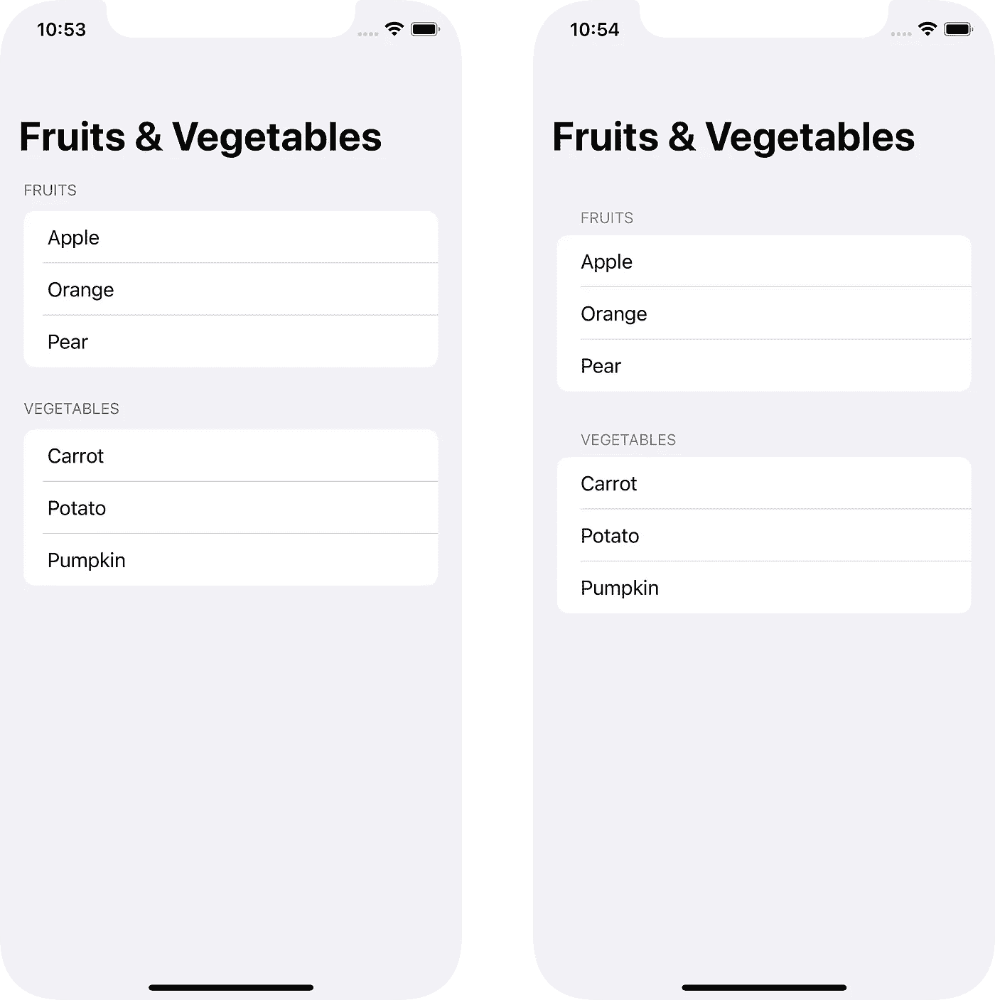
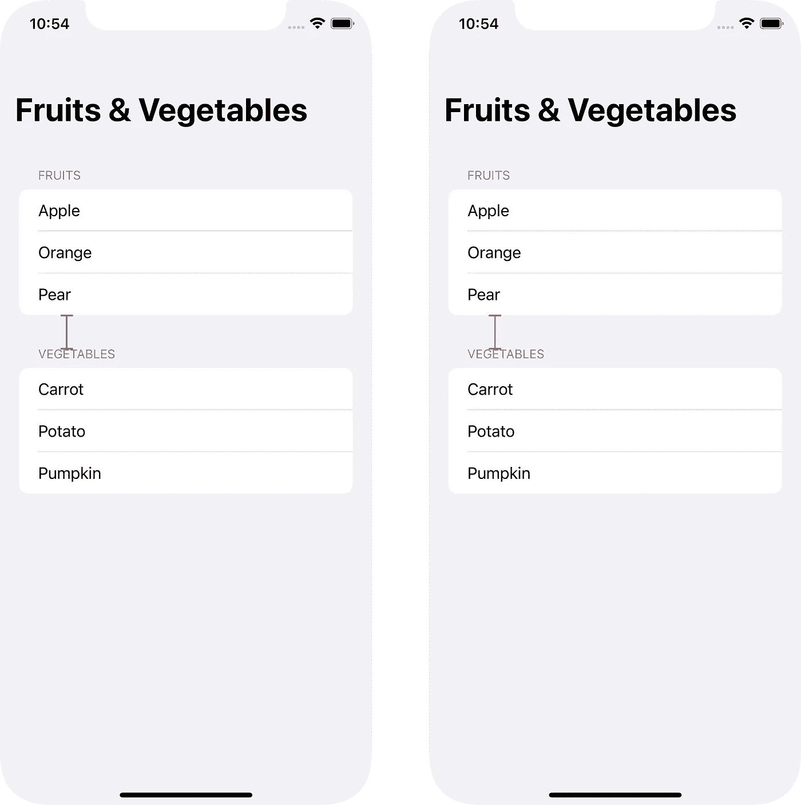

# 模仿 iOS 15 部分标题

> 原文：<https://betterprogramming.pub/mocking-ios-15-section-headers-ef6ff33750e9>

## 如何伪造 iOS 15 的默认列表区标题样式


马克西姆·伊利亚霍夫在 [Unsplash](https://unsplash.com?utm_source=medium&utm_medium=referral) 上拍摄的照片

随着 iOS 15 的发布，你可能已经注意到了列表头样式的细微变化。现在，它在该部分的上方和下方有了更多的填充。你可以在下面看到一个对比。

## **iOS 14 列表对比 iOS 15 列表**



如果你*不*喜欢这个变化，你可以通过改变`UITableView`上的`sectionHeaderTopPadding`属性来改变标题顶部填充，或者如果你像我一样转移到 SwiftUI，那么你可以使用如下外观修饰符:

```
UITableView.appearance().sectionHeaderTopPadding = 0
```

如果你想在你的应用程序中使用列表，这是非常好的。你得到了一个(可以说)很好的列表 UI 调整，基本上是免费的。但是我最近在尝试复制这种新风格时遇到了一个有趣的问题。

## **复制 iOS 节头**

你会问为什么要复制它？当我在做我的最新项目(Flora — [在这里查看](https://twitter.com/floraios))时，我也需要在我的应用程序中使用网格。我有一个`ScrollView`,里面有一个`LazyVGrid`,里面有一堆需要按类别分成几个部分的单元格。

没有列表的上下文，部分标题默认为完全不同的字体大小和粗细。保持与第一个例子相同的列表内容，你可以看到“水果”和“蔬菜”标题现在默认为与常规`Text`视图相同的默认文本。


我希望在两个`List`视图以及任何`ScrollView`或`LazyVGrid`视图中保持一致的标题样式。由于用户可能已经熟悉了 iOS 风格的标题，我认为最好尝试和模仿 iOS 风格的标题。

## **…但是有一个问题**

但是说起来容易做起来难，因为苹果的文档包括 SwiftUI 和 UIKit `List` / `UITableView`视图并没有透露任何关于默认填充、字体或颜色的有用信息。

根据苹果文档，`sectionHeaderTopPadding`的默认值是`[UITableViewAutomaticDimensio](https://developer.apple.com/documentation/uikit/uitableviewautomaticdimension?language=objc)n`。[苹果文档](https://developer.apple.com/documentation/uikit/uitableview/3750914-sectionheadertoppadding)
但是这对我们没有帮助，因为无论是官方文档还是头文件都没有给我们任何有用的信息。它必须在运行时根据视图的上下文来确定。也没有提到标题的默认字体大小、字体粗细或字体颜色。

由于没有默认值的官方来源，我们不得不求助于试错法。首先我在 SwiftUI 中创建了一个常规的旧列表，在模拟器上运行它，并截图。现在我们有了一个基线来比较我们自己的实现。

首先，我从标题文本顶部和上面部分底部之间的距离开始，以像素为单位(见下文)。

然后我开始测试文本上方的填充值，一边测试一边截图，直到我得到的结果彼此相差几个像素。那时，我知道我找到了或多或少与苹果的实现相匹配的价值。

字体颜色非常清晰`Color.secondary`，看起来非常匹配。然后对于字体大小，更多的尝试，和错误。看起来最匹配的字体是 13 磅大小和`.regular`字体粗细。



# **实施**

将这些放在一起，我们可以创建一个模仿苹果实现的通用视图。

这是我通过反复试验找到的所有值

*   字体颜色:`**Color.secondary**`
*   字体大小:`**13 Points**`
*   字体粗细:`**.regular**`
*   前导填充(从列表行左侧开始填充):`**14**`
*   顶部填充:`**12**`
*   底部填充:`**8**`

将所有这些值放入一个很好的通用视图中，我们最终会得到这样的结果:

然后，您可以在自己的`ScrollView`中使用这个视图，如下所示:

```
Section(header: MockedSectionHeader(header: "Fruits")) {
    Text("Apple")
    Text("Orange")
    Text("Pear")
}
```

你可能需要在你使用的`LazyVGrid`或`ScrollView`的侧面添加填充来匹配`List`的侧面填充，但是现在我们已经尽可能的匹配了 iOS 的标题样式。

这在我自己的项目中很有用，所以如果你有同样的问题，希望我已经帮你节省了一些谷歌搜索和修补的时间。

感谢阅读。