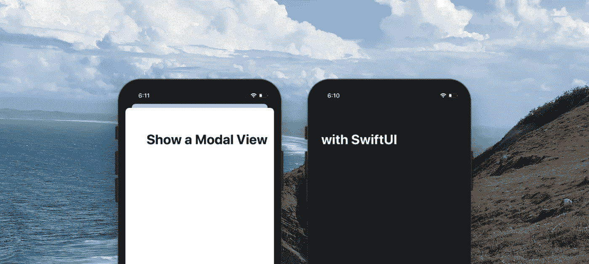
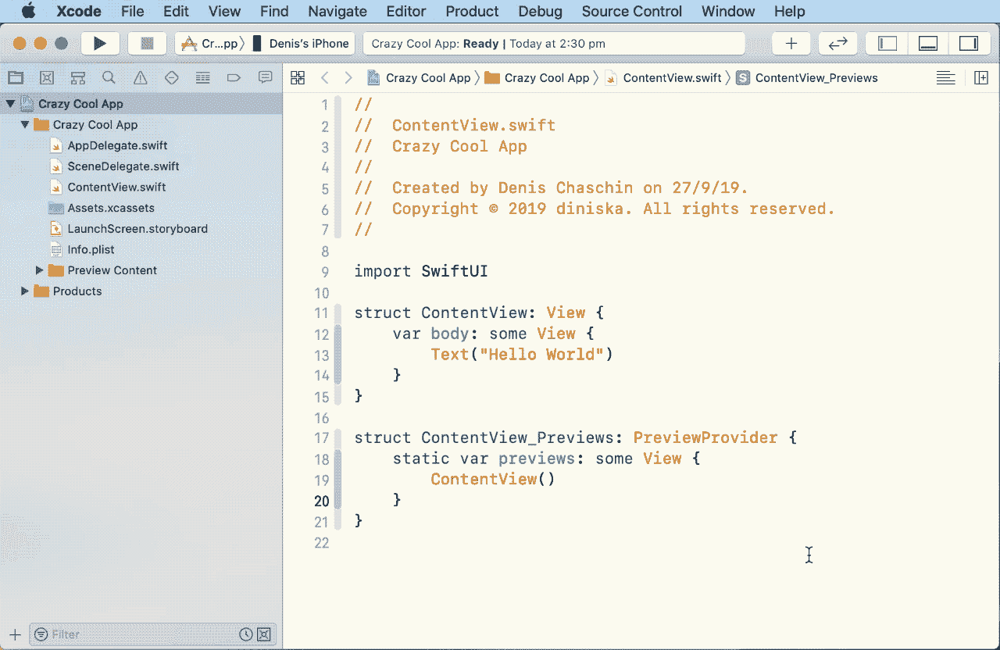
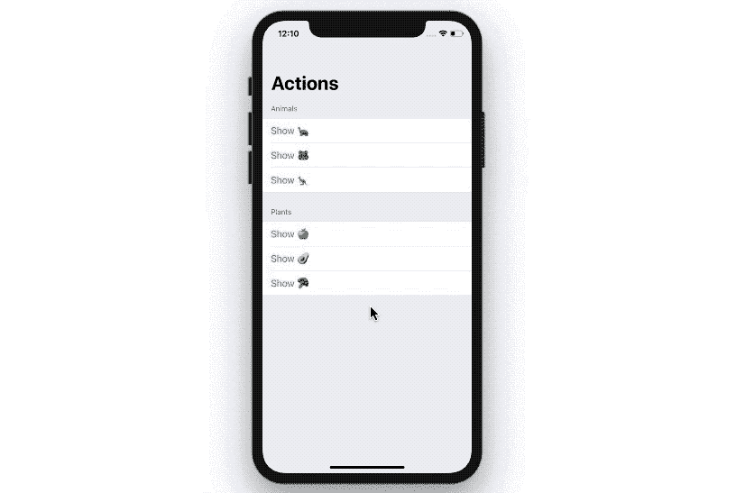
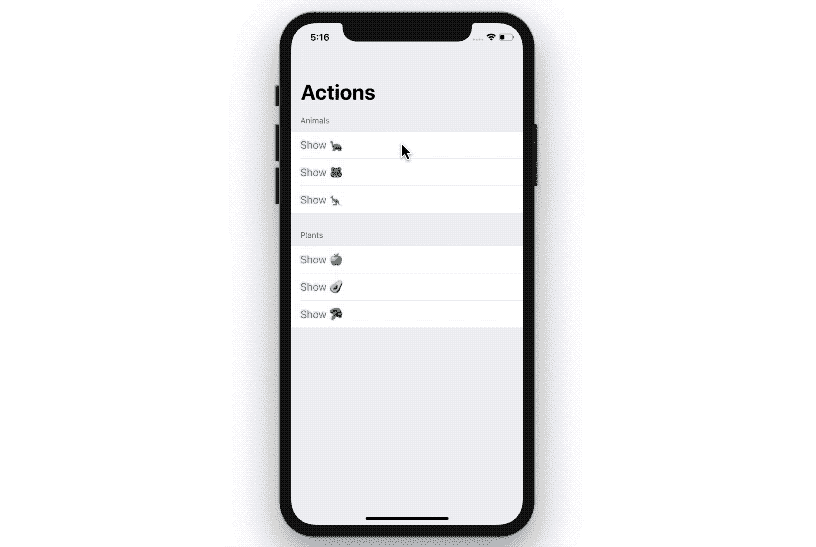

# 使用 SwiftUI 显示模式视图

> 原文：<https://betterprogramming.pub/modal-view-in-swiftui-3f9faf910249>

## 如何用 SwiftUI 呈现标准的 iOS 模态视图？

SwiftUI 是一个新的框架，使应用程序开发快如闪电。它是由苹果公司在今年 6 月的 WWDC 2019 上推出的。

我很确定这将在 SwiftUI 的新版本中有所改变，但现在，这里有一个开源包，供每个人方便地呈现模态视图。该库可以作为 Swift 包添加到项目中，并从更新中受益，或者如果该功能已经覆盖了您项目的所有边缘情况，则只需复制文件。

## 步骤 1:将 [ModalView](https://github.com/diniska/modal-view) 库作为 Swift 包添加到 Xcode 中

使用 Swift Package Manager 添加 SwiftUI 模式视图

下面是链接:[https://github.com/diniska/modal-view](https://github.com/diniska/modal-view)

 [## 迪尼斯卡/莫代尔景观

### 在 SwiftUI 中显示模态视图的良好抽象，无需额外的状态管理和绑定

github.com](https://github.com/diniska/modal-view) 

在库中，我们使用与现有导航 API 的类比:

*   `ModalPresenter`类似于`NavigationView`
*   `ModalLink`类似于`NavigationLink`

因此，模态 API 对于每个已经处理过导航的人来说都是熟悉的。

## 步骤 2:类似于 NavigationView 创建 ModalPresenter

让我们把`ModalPresenter`添加到靠近我们视图根的某个地方。

它不必是根——只要确保它不在一个`List`、`Form`或类似的动态创建子视图的视图中。

## 步骤 3:类似于 NavigationLink 添加 ModalLink

我们正在包装想要用`NavigationLink`触发模态视图的`Text`。

给你:

带有 ModalPresenter 和 ModalLink 的 SwiftUI 模式视图

在复杂的层次结构中，比如带有按钮的导航视图，这是`ModalPresenter`视图与默认 API 相比的亮点。

在 Swift UI 中显示表单视图中的模式视图

使用导航视图、窗体和节实现复杂的层次结构

简而言之，这很方便。现在让我们看看如果没有这个库，我们将如何实现它，看看它会给我们的`List`和`Form`视图带来什么隐藏的结果。

# 如果不使用 Modal View 库，如何显示模式视图？

默认的方法是使用`[sheet](https://developer.apple.com/documentation/swiftui/view/3352792-sheet)` API。一个工作表需要绑定到一个布尔值，该值控制对话框是显示还是隐藏。

此外，不要忘记切换按钮点击的状态。在一个简单的例子中，结果看起来像这样。

很好，是吧？难的部分在物品清单上。让我们试试:

你可能已经明白了。

代码更长也更不安全，因为仅仅因为复制粘贴，很容易在一个地方写`isPresented5`而在另一个地方写`isPresented6`。

不过，这不是一个大问题。一个大问题是，这里的每个按钮只能工作一次。不要问我为什么。

使用 SwiftUI 表和表单。按钮只在第一次使用时有效。

总之，就我个人而言，我现在会在我的项目中使用新的 ModalView 库，因为这个框架提供了一个更简单的 API，并使代码编写体验更快。

如果您知道其他边缘案例，欢迎在[包回购](https://github.com/diniska/modal-view)中提出请求和问题。

享受您的 SwiftUI 体验——全世界都迫不及待地想看到您的新应用。