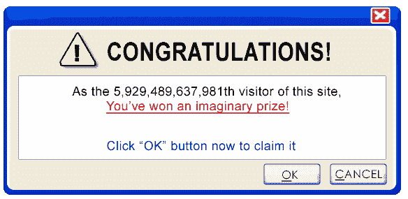
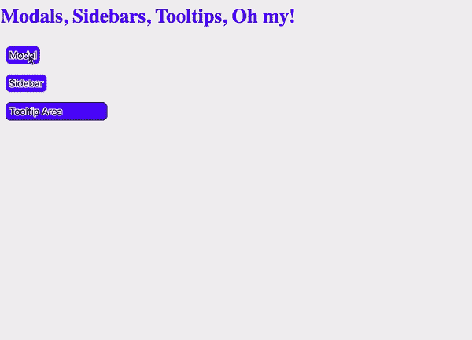
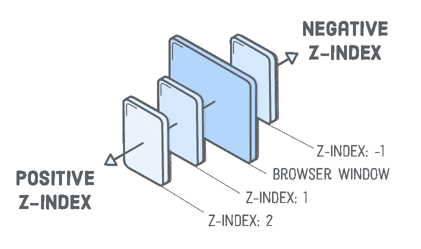
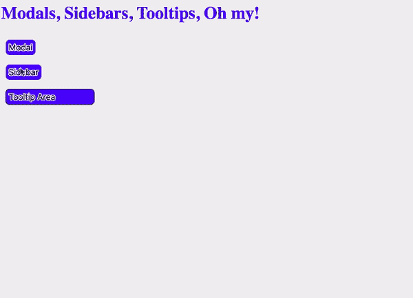
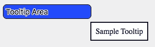
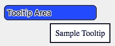
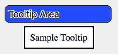

# 模态、边栏和工具提示。我的天啊。

> 原文：<https://betterprogramming.pub/modals-sidebars-tooltips-oh-my-36573209282c>

## *用 JavaScript 和 CSS 显示 DOM 附加信息的 3 种方法*

我所有弹出窗口的灵感

随着我的项目变得越来越大越来越复杂，我一直在思考如何设计显示的数据。

我应该如何向用户显示这些信息？这些信息最初需要对用户可见吗？我可以用哪些创造性的方法来使用空间，使页面不混乱？

因此，我开始使用并最终理解了那些吸引用户眼球并仅在需要时传达信息的可切换元素。这篇博客将向您展示如何创建和使用其中的三种替代显示方法:模态、侧边栏和工具提示。

每个选项的例子都将使用普通的 JavaScript 编写，但是我也在我的 GitHub [repo](https://github.com/Guillamoure/modal-sidebar-tooltip-oh-my) 中使用 React 做同样的事情。上面是我的初始 HTML 代码，用来触发模式、侧边栏和工具提示。我将介绍每一节中所需的 JavaScript 和 CSS。

# 情态动词

在我看来，模态是向用户显示附加信息的一种常见且时尚的方式。

模式是显示在当前页面顶部的对话框或弹出窗口；它们是 HTML 元素，独立于 DOM 的其他部分。模态的常见用法是注册和登录提示、弹出窗口以及链接到另一个网站的通知。

我第一次使用 modal 是通过预制的 JavaScript 库，如 [Semantic-UI](https://semantic-ui.com/modules/modal.html) 或 [Bootstrap](https://getbootstrap.com/docs/4.4/components/modal/) ，但我想探索如何自己构建一个。

我认为在这里讨论的三个选项中，模态是最容易自己设计的。只是涉及到对`position: absolute`和`z-index`的理解。

模态 GIF

我在“模态”按钮上有一个事件监听器；当单击它时，该事件创建两个新元素，并将它们附加到 DOM 上:模态本身和半透明背景。

背景是可选的，但我使用它是因为它通过使背景变暗给了模态更多的焦点。

模态元素与标准 DOM 元素的不同之处在于，它被放置在页面的中央，位于所有其他元素之上，并且可以向用户显示额外的信息。造成这种效果的关键因素都在于 CSS。

`Position: absolute`从嵌套的树形结构中移除 DOM 元素，并允许将该元素放置在页面上的任何位置。

我用它从页面的顶部创建了 30%的模态文档，从页面的左侧创建了 40%的模态文档；基本上位于页面中央。背景也有一个`position: absolute`，可以填充整个窗口的高度和宽度。

另一个技巧是使用`[z-index](https://www.w3schools.com/cssref/pr_pos_z-index.asp)`将背景置于所有其他元素之上！

来源:[https://spyrestudios . com/what-is-z-index-and-how-it-work/](https://spyrestudios.com/what-is-z-index-and-how-does-it-work/)

`Z-index`允许你将元素定位在其他元素之上或之下。窗口的`z-index`是 0，所以所有元素的默认值都是 0。

如果你给一个元素一个大于 1 的`z-index`,它将被放置在其他元素之上，通常会遮住它们。一个小于 1 的`z-index`将被放置在其他元素的下方，在某些情况下作为背景。

半透明背景的`z-index`是 1，所以它遮住了页面上的所有其他元素。模态的`z-index`是 2，所以它位于背景之上，将用户吸引到这个明亮的新信息。

为了关闭模态，整个文档上都有一个事件侦听器。如果事件的目标是背景(它应该是除了模态的一切的目标)，回调函数从 DOM 中删除模态和背景。

如果您决定在背景元素而不是文档上使用事件侦听器，您仍然需要使用条件来确保事件的目标不是模态的。否则，如果您单击模态，事件将被触发，并且模态和背景将被移除。

# 边栏

在我看来，侧边栏可以比模态显示更多的信息，因为它们在页面上占据了很大的空间。

我的侧边栏示例不会模糊 DOM，因此用户可以立刻看到原始信息和附加信息。我的侧边栏示例也来自右侧，带有一个动画，吸引用户的眼球。

你当然不需要有一个动画，你可以让你的侧边栏从底部，一个角落，或者从顶部出现！DOM 是你的牡蛎！

我为侧边栏示例选择的设计使用了`z-index`，就像模态一样，但是也使用了 CSS 动画！

侧栏 GIF

当单击侧边栏按钮时，侧边栏元素会从页面的右侧滑入。

简单的追加，但是让它引人注目的部分还是在 CSS 中。

`#sidebar` ID 赋予元素结构特征，比如它来自哪里(`position: absolute; right: 0;`)以及它位于页面上其他元素之上(`z-index: 1;`)。然而，类给出了元素动画！

当元素被赋予`.slide-in`类时，它被赋予一个动画。

在接下来的 0.8 秒内，元素从离开页面(从页面右侧页面总宽度的 60%开始)移动到在页面上(在其右边框结束于页面总宽度的 0%)。

我们将这个`.slide-in`类与`#sidebar` ID 分开的原因是，当我们移除侧边栏时，我们想要一个退出动画！

我们在之前的 JS 代码中添加了两个新功能:如果我们再次点击侧边栏按钮(当侧边栏在 DOM 上时)或者如果我们单击侧边栏，就会调用`removeSidebar`函数。

不过，这里写了一些有趣的代码。为什么我们要重写侧边栏？为什么我们有一个`[setTimeout](https://www.w3schools.com/jsref/met_win_settimeout.asp)`函数在 775 毫秒后触发回调？！

为了获得侧边栏的退出动画，我们需要改变类！`.slide-in`类授予侧边栏一个入口动画，但是通过将类切换到`.slide-out`，我们得到了一个不同的动画。

`.slide-out`类使用 CSS 动画将元素移出页面，方式与`.slide-in`类相同。我在函数上加了一个`setTimeout`来从 DOM 中移除侧边栏元素的原因是为了给动画留出完成的时间。

我发现如果我给`setTimeout`精确的 800 毫秒，这是`.slide-out`动画的持续时间，有时元素会在 remove 函数被调用之前迅速恢复到原来的位置。所以，我去掉了几毫秒来考虑竞争条件。

# 工具提示

自定义工具提示是最难实现的。至少达到了我想要的显示精度。工具提示是一个小弹出元素，它出现在另一个元素附近或部分覆盖另一个元素，通常是在鼠标经过事件之后。

要让一个基本的工具提示工作，唯一需要的是使用`[mouse-enter](https://developer.mozilla.org/en-US/docs/Web/API/Element/mouseenter_event)` 或`[mouse-over](https://developer.mozilla.org/en-US/docs/Web/API/Element/mouseover_event)`事件来触发事件，以及使用`[mouse-leave](https://developer.mozilla.org/en-US/docs/Web/API/Element/mouseleave_event)`或`[mouse-out](https://developer.mozilla.org/en-US/docs/Web/API/Element/mouseout_event)` 事件来移除元素。

我的工具提示中棘手的部分是工具提示和小箭头的确切位置。两者都是美学上的选择，没有必要，但我喜欢这个结果。

工具提示 GIF

当用户的光标进入工具提示区域时，触发一个事件来创建工具提示元素，当光标离开工具提示区域时，触发一个事件来移除工具提示元素。

简单的添加和删除。这是`#tooltip` ID 的 CSS。

你可能会说，非常简单的造型！你可能会问，如何让工具提示准确地出现在原来的位置？特别是因为您只是将 tooltip 元素附加到主体，而不是在工具提示区域上或工具提示区域内，您可能会注意到！

思维巧妙！我希望工具提示是相对于悬停区域的一个特定点:就在下方，相对于目标区域精确居中。这个计算并不奇怪，但确实需要一段时间来计算。

我首先需要挖掘事件，找到悬停在工具提示区域的确切位置。`offsetTop`告诉我元素从页面顶端到元素顶端有多远。`offsetLeft`类似地告诉我元素从页面的左边到元素的左边有多远。

我将元素的高度(`clientHeight`)添加到`offsetHeight`中，以到达元素的底部边缘，然后我将工具提示放在它下方八个像素处。

同样，我将元素的宽度(`clientWidth`)添加到`offsetLeft`中，以获得元素的右边缘。

嗯，好吧，但不是我想要的…

然而，仅使用这些属性将从底部八个像素开始我的工具提示元素，并一直到工具提示区域元素的右边缘。

为了到达工具提示区域底部的中心，我将元素的`clientWidth`除以 2，以到达中心。

如此接近！

又一个问题。这放置了工具提示区域的开始，左侧，从我想要的中心点开始。我希望工具提示的中心在那个点上，而不是最左边！

我抓取工具提示元素本身，找到它的`clientWidth`，减去一半，将工具提示的宽度向左移动一半。

而且完美！居中。

现在它居中了，我想向用户展示一下我的数学技巧:“看，我把它居中了！”

通过遵循 Arjun Khara 关于如何使用箭头和指针[创建轮廓 Div 框(透明)的教程，使用 CSS](https://www.youtube.com/watch?v=pgMIp4ghGr0) 并调整值，我能够在工具提示的顶部添加一个插入符号，宣布“嘿，我相对于*这个*元素居中！”

# 资源

以上只是对实现模态、侧边栏和工具提示的一种方式的解释。

下面是一个代码笔，用来测试我的三个弹出选项。这里有一个到我的 GitHub 库的链接，带有普通的 JS 代码，还有一个在 React 中如何做的例子！(在 React 版本中，如果窗口宽度改变，也有代码改变活动工具提示[的居中。)](https://www.hawatel.com/blog/handle-window-resize-in-react/)

来源:[https://codepen.io/guillamoure/pen/XWmrNRw](https://codepen.io/guillamoure/pen/XWmrNRw)

 [## 模态、弹出、弹出框和灯箱有什么区别？

### 所有这些 UI 组件都是容器/窗口，显示在您当前正在查看/交互的内容之上…

ux.stackexchange.com](https://ux.stackexchange.com/questions/90336/whats-the-difference-between-a-modal-popup-popover-and-lightbox) 

*   [GitHub repo](https://github.com/Guillamoure/modal-sidebar-tooltip-oh-my) 带有普通 JS 和 React 版本。
*   [报道比赛情况的博客](https://medium.com/@mackenziepech/knock-knock-race-condition-whos-there-a11d15c4544d)(在侧栏部分简单提及)。
*   [关于情态动词的 W3Schools](https://www.w3schools.com/howto/howto_css_modals.asp)
*   [W3Schools on tooltips](https://www.w3schools.com/css/css_tooltip.asp)