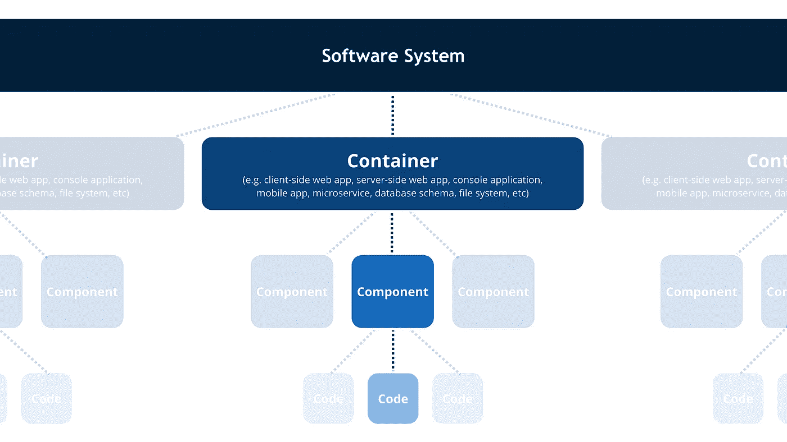
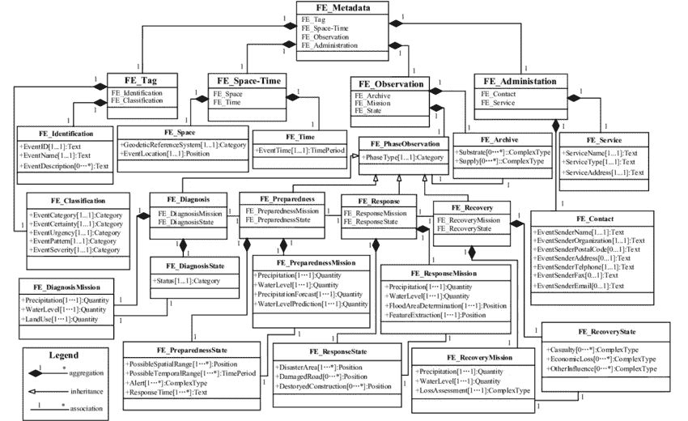
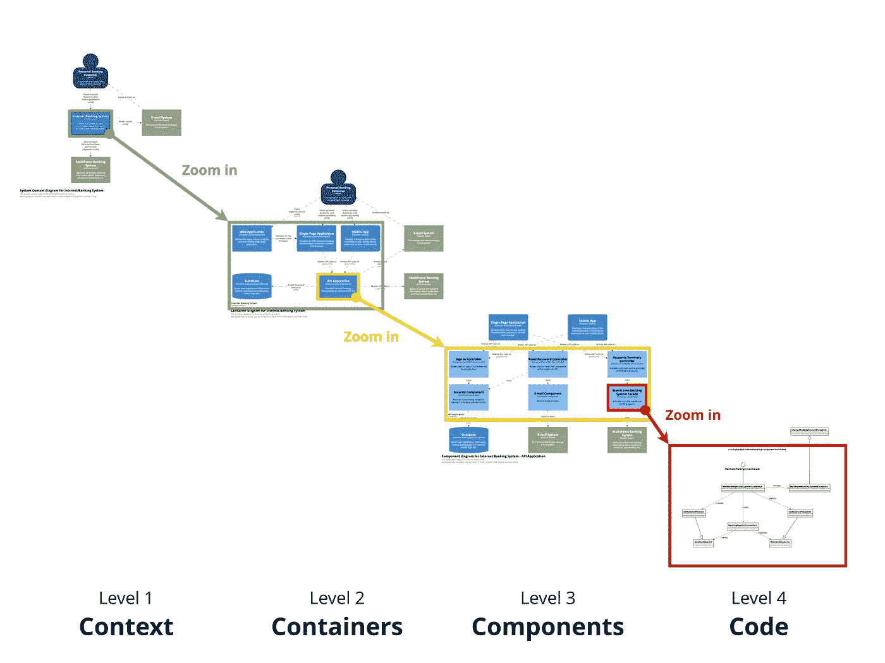
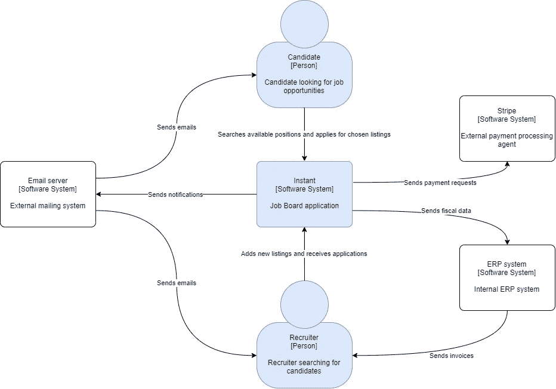
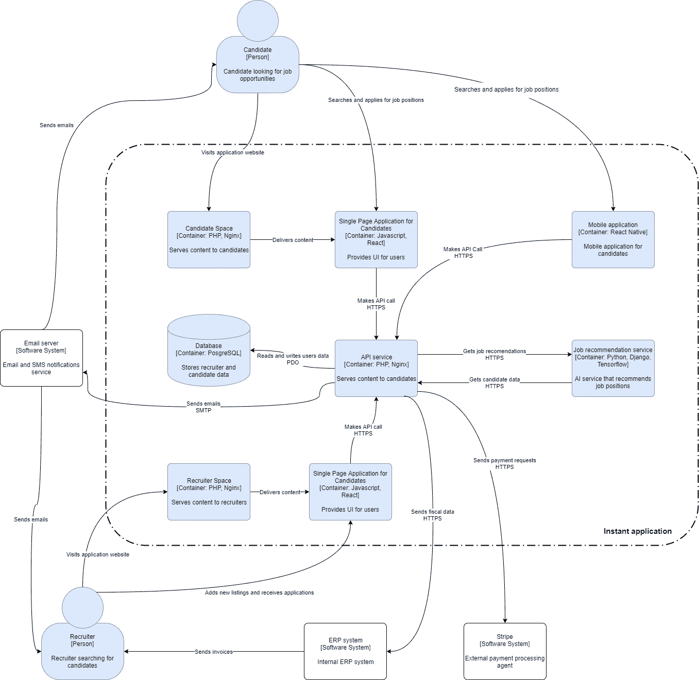
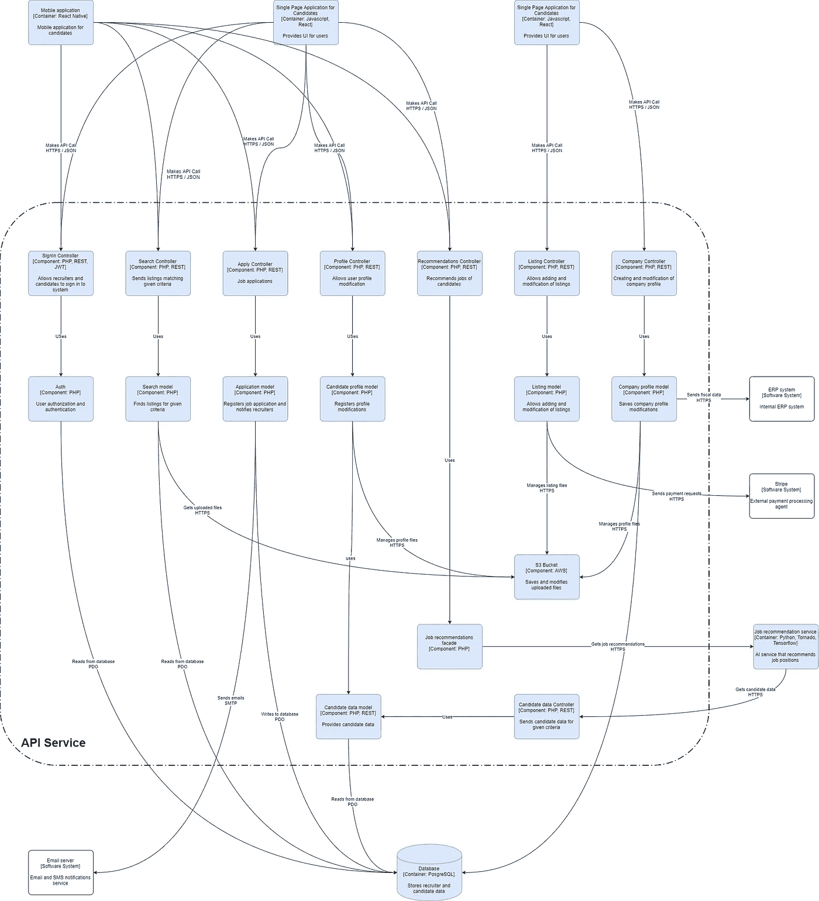

# 用 C4 建模软件体系结构

> 原文：<https://betterprogramming.pub/modeling-software-architecture-with-c4-243eb1f240c7>

## 学习如何以生动和可用的方式描述软件架构

来源:https://c4model.com/

新概念用在现实生活的例子中更容易理解。我们将开发一个全新的工作板应用程序，同时，看看 [C4](https://c4model.com/) 如何帮助描述和定义架构。

我们的应用程序被称为 *Instant* ，因为它允许用户通过一个简单的移动应用程序在几秒钟内申请一份工作。我们有几个开发团队在做这个项目，并希望让它的架构尽可能地具有表现力，并让所有公司成员都能理解。

Instant 会扰乱市场，我们希望每个人都明白它是如何工作的，以便他们能够向我们的客户解释。我们的应用程序正在快速发展，所以我们需要一些易于维护和低门槛的东西。

很难用每个人都能理解的方式来描述这个架构。有一些标准，如 [UML](https://www.uml.org/) 或 [ArchiMate](https://www.archimatetool.com/) ，但是它们有局限性，特别是当我们想从不同的角度来看我们的应用程序时。

没有技术背景的人，或者甚至是没有受过培训的程序员，看那些图时不会感到舒服，也不会理解符号。

即使所有的图表都是最新的，并且是由优秀的专家创建的，这在现实生活中是很少见的。

UML 图并不是让架构听起来更好的工具

我们找到了一个有希望的替代品。C4 是一个帮助我们从不同角度看待应用程序的模型。我们可以放大和缩小我们感兴趣的部分。

就像在谷歌地图上一样。变焦越大，我们能看到的细节就越多。C4 使用了四种核心观点(我猜这就是这个名字的来源)。每一个都代表软件中不同的缩放级别。

来源:[https://c4model.com/](https://c4model.com/)

# 一级。系统上下文图

我们从非常高的抽象层次开始。在这里，技术细节并不重要，我们关注的是软件的系统和用户。

该系统是我们的应用程序中为客户带来价值的一个元素。该系统是一个完整的解决方案，可以独立使用。

使用软件的人也包含在图表中。

有许多方法可以创建 C4 图。我们可以使用一个叫做 [Structurizr](https://structurizr.com/) 的工具，这个工具是由方法论的作者创建的，它允许手工绘制图表，或者用 Java、C#或 TypeScript 编码。

这可能是在单独的存储库中维护和版本化架构图的一个很好的方法。我们将使用 [Draw.io](https://www.draw.io/) 和一个支持 C4 符号的自定义[插件。](https://github.com/tobiashochguertel/c4-draw.io)

有许多不同的方法来模拟这样一个应用程序，但我们想把重点放在使用 C4，而不是技术细节，所以它将被简化。

求职者和招聘人员使用我们的应用程序。我们需要继续处理招聘人员支付的款项，并使用我们的 ERP 系统开具发票。我们的应用程序还使用外部邮件系统来发送用户通知。

很容易看到关键系统和我们一起工作的人

我们现在能够很容易地看到我们正在使用哪个系统，谁是我们的主要用户。现在让我们关注核心系统的更详细的元素。

# 二级。集装箱图

容器是应用程序的大部分，可以单独部署。例如，它可以是:数据库、微服务、移动应用、Docker 容器。

它们通过 API(例如 SOAP、gRPC、REST)相互通信，并且不直接依赖。在这个层面上，我们还对每个容器用来通信的协议和它使用的技术感兴趣。

我们的应用程序的构建块现在是可见的

# 三级。构件图

组件是一组一起工作的类或函数。我们能够观察到他们的关系和职责分工。

这种低级的抽象对于程序员和架构师理解组件的细微差别和相互依赖性非常重要。在这个层面上，我们对所使用的解决方案和每个组件之间的通信方式有了更多的了解。

我们的 API 服务是用 MVC 框架实现的 PHP 模块化整体。在这样的场景中，一个组件可以是一个单独的模块，也可以是一组内聚类。

我们看到了 API 服务的技术栈和内部结构

# 四级。密码

代码是最底层的视角。代码可以是代码中的类或函数。这种观点可能只对公司的技术部门有兴趣。

没有必要将它包含在模型中，但有时会有所帮助。这种结构非常脆弱，随着时间的推移会发生很大变化。UML 是在这个层次上描述关系的最常见的工具，如果我们想这么做的话，它会是一个很好的选择。

由于我们正在运营一家初创公司，并且不断地修改我们的代码库，所以我们不会在这个层面上对我们的应用程序进行建模。如果需要的话，这种低级图表也可以通过使用一些外部工具或 IDE 自动生成。

# 结论

C4 是一个非常灵活的框架，可以根据我们的需要进行不同的使用。它有很多优点，但也有一些缺点。

## C4 的优势

*   不难维护(比大多数解决方案更容易)。
*   从不同的角度展示观点。
*   在组织层面上可能是有帮助的(不仅仅是对技术人员)。
*   删除不明确的符号。
*   有些零件可以自动生成。

## C4 的缺点

*   静态可视化。我们不知道每种关系发生的时间和频率。
*   低级抽象非常脆弱，需要定期更新。

# 资源

*   [C4 官网](https://c4model.com/)
*   [“用 C4 模型可视化软件架构”，西蒙·布朗](https://www.youtube.com/watch?v=x2-rSnhpw0g)
*   [结构化器](https://www.structurizr.com/)
*   [Draw.io 插件](https://github.com/tobiashochguertel/c4-draw.io)