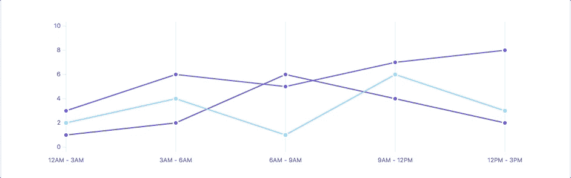
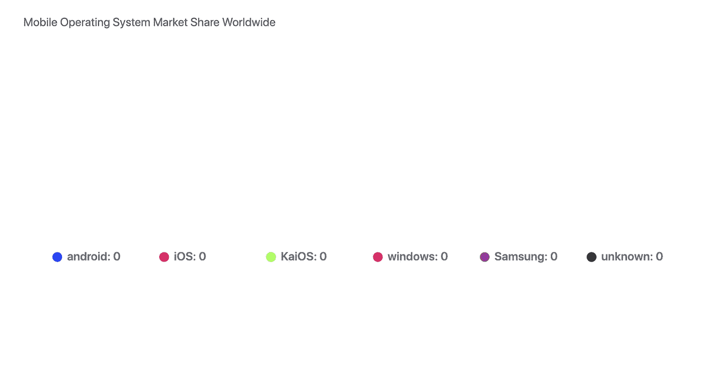
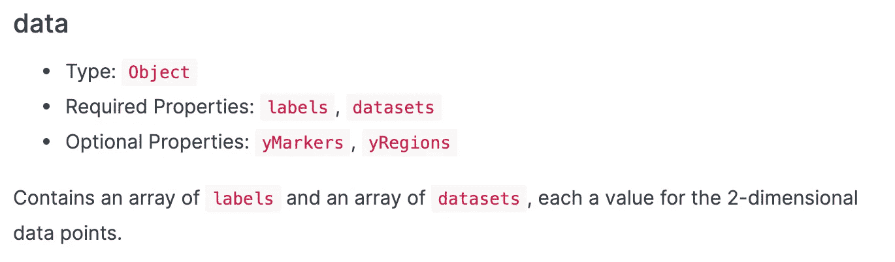
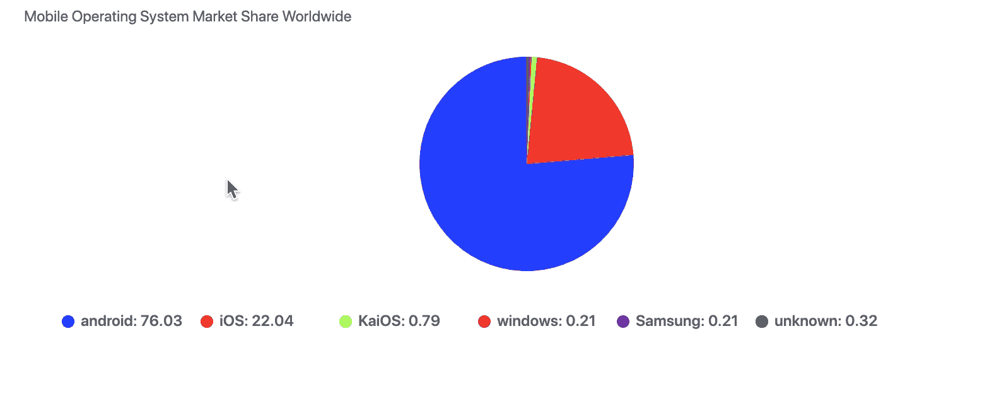
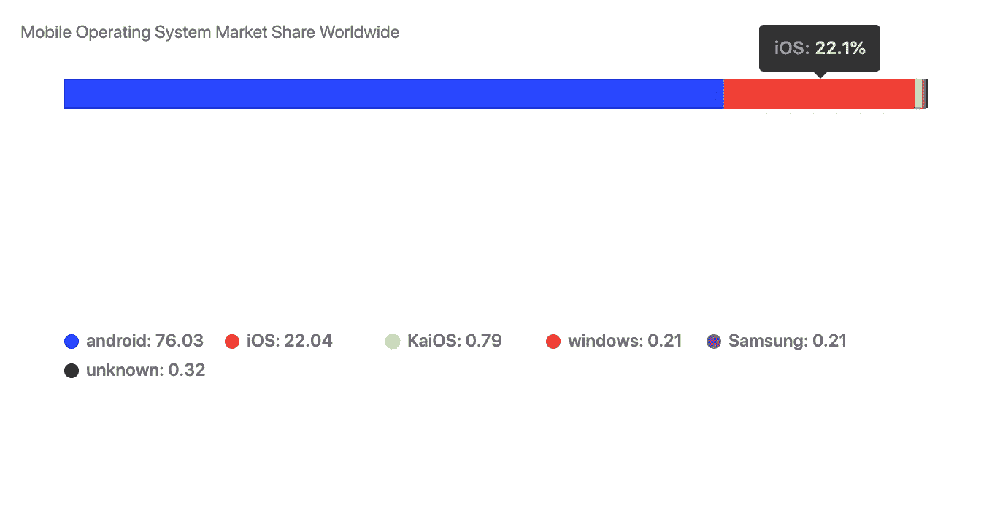
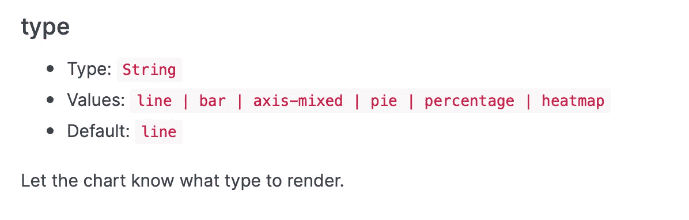
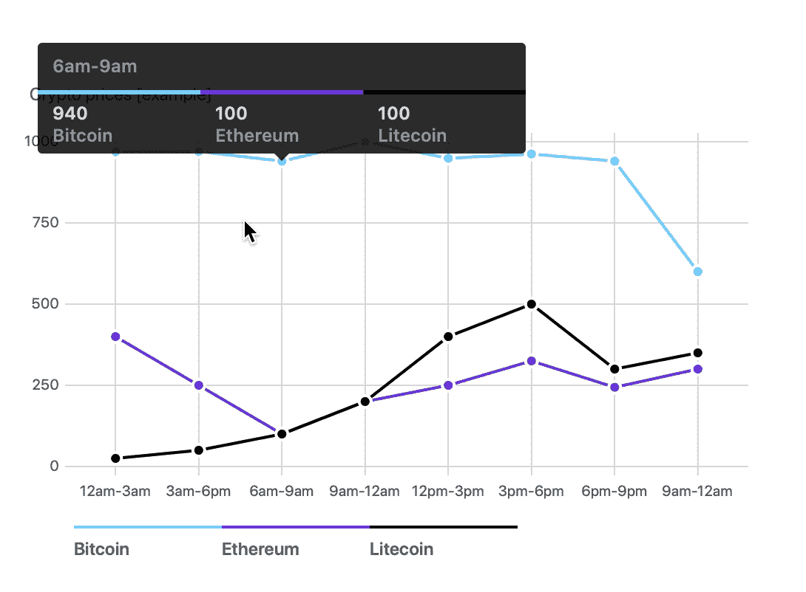

# 带有 Frappe 图表的现代和简单图表

> 原文：<https://betterprogramming.pub/modern-and-simple-charts-with-frappe-charts-c1b16244f8c>

## 简单、响应迅速的现代 SVG 图表，零依赖性



Frappe 图表演示—[https://frappe.io/charts](https://frappe.io/charts)

[Frappe Charts](https://frappe.io/charts) 提供 GitHub 启发的、现代的、直观的、反应灵敏的图表，没有依赖性。在过去的几个月里，我一直在关注这个项目的发展，我认为这是一个伟大的项目。

看在过去的份上，我们将在本指南中使用普通的 JavaScript。

# 装置

通过 [npm](https://www.npmjs.com/get-npm) 安装:

```
npm install frappe-charts
```

并在您的项目中包括:

让我们从一个简单的饼图示例开始。我们希望向用户展示移动操作系统市场的全球份额。

为此，我们需要一个`div`元素和一个`pie.js` JavaScript 文件。

接下来，让我们创建一个新的 Frappe 图表实例，并将其绑定到我们的`div`。

这为我们的饼图创建了基本布局。



没有数据的饼图

为什么我们的饼图是空白的？简单，我们还没有添加任何数据。让我们添加数据。

# 添加数据



数据属性—[https://frappe.io/charts/docs/reference/configuration#data](https://frappe.io/charts/docs/reference/configuration#data)

注意我们添加值的`dataset`属性。每个值通过索引与名称相关联。一旦我们添加了这些值，我们应该会看到一个漂亮的饼图。



展示全球移动操作系统市场份额的饼图

Android 以超过 2/3 的总份额统治着市场。我在一定程度上相信自由市场；让最好的产品胜出，但我们应该总是能够在产品之间进行选择，以避免单寡头或双寡头的局面。

回到我们的图表，如果我们将类型属性改为`percentage`，会发生什么？

```
type: "percentage",
```



展示全球移动操作系统市场份额的百分比图表

我们得到了整个电话市场的直观表示。这很容易配置！type 属性允许我们使用`line`、`bar`、`axis-mixed`、`pie`、`percentage`或`heatmap`图表。



Frappe 图表类型属性—[https://frappe.io/charts/docs/reference/configuration#type](https://frappe.io/charts/docs/reference/configuration#type)

到目前为止，我们知道了饼状图和百分比图。让我们也来看看其他图表。

# 加密货币图表

假设我们从 API 中获取加密货币的价格。下一个合乎逻辑的步骤是以令人愉快的方式展示这些数字。Frappe 图表让我们相对容易地做到这一点。

首先，我们为我们的一天创建标签，因此用户知道价格的时间。

接下来，我们将值传递给我们的数据，就像我们为饼图定义值一样。把这些数字想象成价格。最后，将图表类型配置为`axis-mixed`



加密货币价格图表(虚拟数据)

相当整洁！我对这个项目的未来感到兴奋。如果你想了解 Frappe 图表的全部功能，请点击这里的[文档](https://frappe.io/charts/docs/basic/trends_regions)。

如果你很想深入了解数据可视化，我推荐《[Web 交互式数据可视化:D3 设计简介](https://amzn.to/2SS9hLD)》一书，因为这是一本非常实用和有用的数据可视化指南。

# 查看下面的源代码

[](https://github.com/indreklasn/frappe-charts-example) [## indreklasn/fra PPE-图表-示例

### 用 CodeSandbox 创建。在 GitHub 上创建一个帐户，为 indreklasn/fra PPE-charts-example 开发做出贡献。

github.com](https://github.com/indreklasn/frappe-charts-example) 

感谢阅读！

[](https://medium.com/better-programming/visualize-your-data-with-hand-drawn-charts-with-the-roughviz-charting-library-a3a9f3ee4f84) [## 用手绘图表可视化您的数据

### 使用 roughViz JavaScript 库在浏览器中创建酷酷的图表

medium.com](https://medium.com/better-programming/visualize-your-data-with-hand-drawn-charts-with-the-roughviz-charting-library-a3a9f3ee4f84)