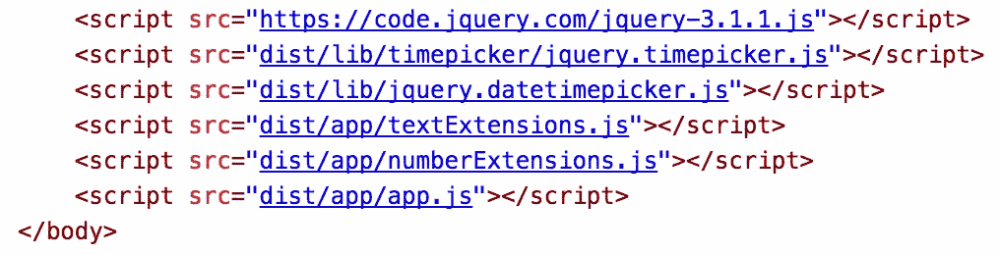

# JavaScript 与 Webpack 捆绑的现代方法

> 原文：<https://betterprogramming.pub/modern-approach-of-javascript-bundling-with-webpack-3b7b3e5f4e7>


布林教区在 [Unsplash](https://unsplash.com/search/photos/pebbles?utm_source=unsplash&utm_medium=referral&utm_content=creditCopyText) 上拍摄的照片

作为一名前端开发人员，我曾在各种电子商务网站上工作过。一开始，我使用单独的脚本标签包含了每个 JavaScript 文件。但是在经历了一些关于前端性能的惨痛教训后，我开始合并并最小化网站的脚本。还采用从 CDN 服务器引用供应商和框架脚本作为惯例。

我必须承认，在一段时间内，这种方法效果很好。但是，当我从纯粹的前端开发人员转型为全栈式开发人员，并学习 C#和 PHP 后端开发的优点时——特别是如何将依赖关系包含在后端代码中——我开始更多地面对这种方法的缺点。我特别不喜欢的一点是幕后的魔术。当您在标记中包含一些库——jQuery 作为单独

# 过时的方式



一种过时的 JavaScript 文件包含方法

上图展示了*自动特效*的效果。但正如我们所知，这并不神奇。这是我们用来引用使我们的网站工作所必需的依赖关系的方法。

在我看来，这种方法有两个主要缺陷。首先，全局名称空间被许多全局变量污染了。从第三方库开始，如 jQuery、Angular、Lodash 和其他第三方插件，到我们自己的实用程序、助手和服务脚本，因为它们是全局添加的。在这里，加载和执行的顺序很重要。

其次，我们对主脚本隐藏了依赖关系。我们必须假设之前已经加载了必要的脚本，并且我们可以安全地使用它们的 API。有时，我们必须切换上下文以确保这些脚本包含在内并可供我们使用，或者我们在标记文件中添加额外的脚本。最后，要查看应用程序、网站或视图是否正常工作，我们必须启动它，并验证所有内容都正确加载和运行。

# 更现代的方法

随着 web 应用和现代前端框架的兴起，JavaScript 开发过程最终开始转变。我们已经看到我们开发代码的方式发生了巨大的变化。其中一个过程，静态文件捆绑，展示了其中的一些变化。

使用服务器端技术完成的任务将从后端框架中移除。我们现在使用基于现代前端技术的工具。例如，可以使用微软捆绑所有项目的 JavaScript。AspNet 版本 5 之前的 AspNet.Optimization 包

```
// App_Start\BundleConfig.cs
public static void RegisterBundles(BundleCollection bundles)
{
  bundles.Add(new ScriptBundle("~/Scripts/scripts.js").Include(
    "~/Scripts/lib/jquery-3.1.1.js",
    "~/Scripts/lib/timepicker/jquery.timepicker.js",
    "~/Scripts/lib/jquery.datetimepicker.js",
    "~/Scripts/textExtensions.js",
    "~/Scripts/numberExtensions.js",
    "~/Scripts/app.js"));
}<!-- And then you just render the bundle in _Layout.cshtml -->
  @Scripts.Render(“~/Scripts/scripts.js”)
</body>
```

你可以在 ASP.NET 5 中使用来自 Microsoft . aspnet . MVC . tag helpers 的<environment>标签做同样的事情</environment>

```
<!-- _Layout.cshtml -->
<environment names="Development">
    <script src="~/Scripts/lib/jquery-3.1.1.js"></script>
    <script src="~/Scripts/lib/timepicker/jquery.timepicker.js"></script>
    <script src="~/Scripts/lib/jquery.datetimepicker.js"></script>
    <script src="~/Scripts/textExtensions.js"></script>
    <script src="~/Scripts/numberExtensions.js"></script>
    <script src="~/Scripts/app.js"></script>
</environment>
<environment names="Staging,Production">
    <script src="~/Scripts/scripts.js" asp-append-version="true"></script>
</environment>
```

在上面的例子中，我们可以看到一个特定的后端框架如何处理捆绑。但是最终，所有可以用 JavaScript 完成的事情都会用 JavaScript 来完成。因为已经有很多工具可以实现这一点，所以让我们来看看其中的一个——web pack。这是目前非常流行的工具之一。

## 网络包

[](https://webpack.js.org/)

用于脚本捆绑和更多信息的 Webpack 网站

Webpack 是一个现代的静态文件捆绑工具。在 JavaScript 文件捆绑的情况下，它有助于消除我们的标记中对排序的<脚本>标签的隐式依赖。我们没有包含许多单独的脚本，而是包含了使用相同<脚本>标签的单个或几个包。

为此，我们应该首先创建这些包。为了创建包，我们需要配置 Webpack。当然，Webpack 应该安装在机器上——例如通过命令`npm install webpack --save-dev`。

最起码，Webpack 需要的只是一个入口点和输出。然后，只需执行以下命令就可以调用它:

```
./node_modules/.bin/webpack app/entry.js dist/output.js
```

在这种情况下，Webpack 将加载 entry.js，并在其中查找`import`或`require`关键字，以确定它是否应该加载更多的依赖项。如果找到依赖项，它将递归地加载它们，并将它们包含在输出文件中。

## JavaScript 模块

如前一节所述，脚本文件可以包含由`import`或`require`引用的依赖项。

```
// CommonJS
require ('lodash')
console.log(_);// ECMA6
import 'lodash'
console.log(_);
// Notice currently you need to transpile ECMA6 import using for example Babel to make it run in browsers
```

这类似于在。NET 框架，方法是使用:

```
using Microsoft.AspNetCore.Authorization;
using Microsoft.AspNetCore.Identity;
```

或者像 Symfony 2 框架一样:

```
**use** Symfony\Component\HttpFoundation\Request;
**use** Symfony\Component\HttpFoundation\Response;
```

这只是为了指出一个事实，即人们可以使用 JavaScript 文件中引用依赖项的特性。使用默认的 Webpack 配置，它将捆绑一个与当前浏览器不兼容的输出脚本。正如注释中提到的，我们需要处理包含导入或需求的脚本文件。这可以使用 Babel JavaScript transformer 来完成，它的任务是将 ECMA6 中编写的 JavaScript 翻译成 ECMA5 JavaScript。你可以在 [Mozzila 开发者网络](https://developer.mozilla.org/en-US/)网站上找到更多关于 JavaScript [导入](https://developer.mozilla.org/en-US/docs/Web/JavaScript/Reference/Statements/import)和[导出](https://developer.mozilla.org/en-US/docs/Web/JavaScript/Reference/Statements/export)的信息。

## 以 Webpack 的方式捆绑 JavaScript

通过提供条目文件和输出路径，您可以使用 CLI 命令捆绑您的 JavaScript。Webpack 将自动解析来自`import`和`require`的所有依赖项，并将它们与您的应用程序脚本捆绑成一个输出。

但这只是它能做到的最低限度。为了扩展功能，我们可以创建一个 Webpack 配置文件，并配置 bundler 在处理 JavaScript 时执行的各种任务。

## 配置

首先，我们需要创建一个`webpack.config.js`文件，并需要来自 node_modules 的 Webpack。

```
// webpack.config.js
var webpack = require('webpack');module.exports = {
 **entry: {
        entry: __dirname + '/entry.js'
    },
    output: {
        filename: '[name].bundle.js'
    }**
}
```

这里，我们已经提供了**条目**文件作为`entry.js`，并在执行 Webpack 的当前目录的路径前加上前缀。还提供了放置捆绑 JavaScript 内容的**输出**路径。注意文件的`[name]`前缀。这将指示 Webpack 以`.bundle.js`结尾连接条目文件名。现在通过执行 CLI 命令，

```
./node_modules/.bin/webpack
```

它将在当前模块的目录下创建一个`entry.bundle.js`文件。

## 装载机

正如我之前写的，如果你在脚本中使用`**import**`引用 JavaScript 依赖，你必须使用 Babel 将它从 ECMA6 转换到 ECMA5。Webpack 可以通过利用其加载器特性来动态完成这项工作。为了让它工作，我们必须首先安装必要的节点模块`**npm install babel-core babel-loader babel-preset-es2015**`并用模块部分更新 webpack.config.js。

```
// webpack.config.js
var webpack = require('webpack')module.exports = {
    entry: {
        entry: __dirname + '/entry.js'
    },
    output: {
        filename: '[name].bundle.js'
    },
 **module: {
        loaders: [
            {
                test: /\.js$/,
                loader: 'babel-loader',
                exclude: /node_modules/,
                query: {
                    presets: ['es2015']
                }
            }
        ]
    },**
}
```

在本模块部分，我们可以设置许多在处理时应用于 JavaScript 的加载器。请注意，我们已经将其设置为所有文件都以*结尾。js，不包括 node_modules，应该通过 babel-loader 来处理。因此，它将生成 ECMA5 兼容代码作为其输出。因此，现在，例如，如果我们在 entry.js 中添加对 helloWorld.js 的依赖，Webpack 将能够生成工作代码。

```
// helloWorld.js
export const helloWorld = 'Hello world from imported JS!';// entry.js
import {helloWorld} from './helloWorld'console.log(helloWorld); // Will print 'Hello world from imported JS!' in browser's console
```

## 插件

所以我们已经看到**条目**、**输出、**和**模块**配置在运行。但是还有一个关于基本配置的部分值得一看——它的插件。简单地说，插件对于捆绑的 JavaScript 就像加载器对于单个 JavaScript 依赖一样。插件允许我们在捆绑包上执行各种任务。例如，将重复的代码块提取到单独的文件中，或者修改输出。

```
// webpack.config.js
var webpack = require('webpack')module.exports = {
    entry: {
        entry: __dirname + '/entry.js'
    },
    output: {
        filename: '[name].bundle.js'
    },
    module: {
        loaders: [
            {
                test: /\.js$/,
                loader: 'babel-loader',
                exclude: /node_modules/,
                query: {
                    presets: ['es2015']
                }
            }
        ]
    },
 **plugins: [
        new webpack.optimize.UglifyJsPlugin()
    ]**
}
```

正如您所看到的，我们在 Webpack 配置中增加了一个新的部分`plugins`。它可以包含许多要在捆绑的 JavaScript 上执行的插件。就其本身而言，Webpack 提供了一个有用的[插件列表](https://webpack.js.org/plugins/)。但是，您也可以根据自己的具体要求构建自己的定制列表。

# 结论

这篇文章提供了一个简短的介绍和如何开始使用网络包的例子。从而改进 JavaScript 开发过程，并获得对脚本所依赖的依赖关系的更多控制。在您离开之前，这里有一个关于切换到 Webpack 的优点和缺点的简短总结。

**Cons:**

*   当一个功能已经存在于框架中时，需要安装一个额外的工具
*   开发人员必须定义配置中的所有入口点，每个页面或视图一个入口点
*   对于应用程序和第三方插件，JavaScript 必须是模块化的

**优势:**

*   对依赖关系的更多控制，因为视图只导入功能所需的脚本
*   现代 JavaScript 的使用— ES6 特性
*   Webpack 可以在编译时分析 JavaScript 的内容，从而为优化提供更多信息
*   引用类类似于在 C#或 PHP 中进行引用

我希望你会发现这很有用，如果你已经注意到了一些缺点，不要犹豫，让我知道。

谢谢你的阅读！如果您有任何意见，我将非常感谢您在意见部分的反馈。祝你玩得开心！