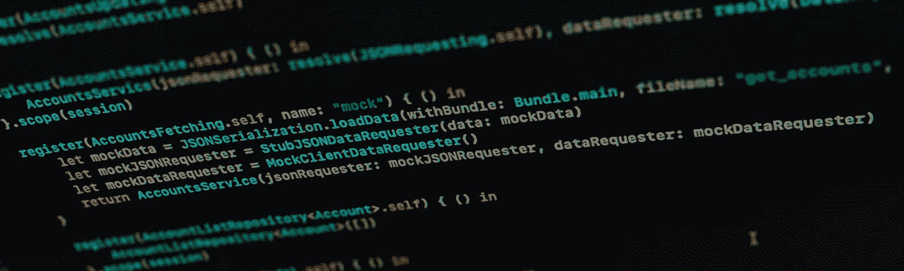
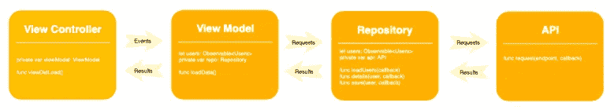
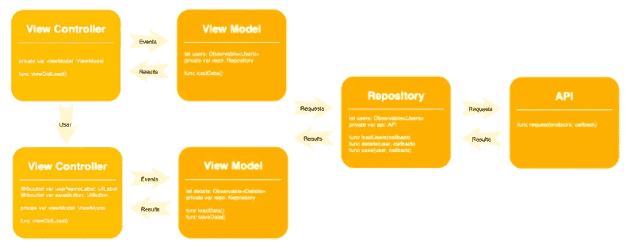

# Swift 中的现代依赖注入

> 原文：<https://betterprogramming.pub/modern-dependency-injection-in-swift-952286b308be>

## 在 iOS 应用程序中充分利用依赖注入系统的技巧、技术和策略



MVVM。MVP。毒蛇。干净。在现代的 iOS 应用程序中，我们经常使用特定的架构或设计模式来将我们的软件分解成易于阅读和理解并且易于测试的独立组件。

但是将应用程序分解成单独的组件会产生问题。我们如何将我们的应用程序重新组装起来呢？


ViewController *x* 是如何发现 ViewModel *m* 的，就此而言，ViewModel *m* 又是如何获得完成工作所需的一切的呢？

这个问题有几种可能的解决方案，但是今天我们将研究一些基于依赖注入和使用专用依赖注入系统的高级技术。

您可能已经以某种方式、形式或形式在做这件事，但是在本文中，我们将深入探讨一些我希望在第一个应用程序中使用依赖注入系统之前就已经知道的技术。

我们将使用[解析器](https://github.com/hmlongco/Resolver)来演示这些技术，这是一个现代的依赖注入系统。但是不用担心。我们将要讨论的技巧和策略可以用于其他 DI 系统——从 Dip 到 Swinject。

本文并不打算成为依赖注入或依赖注入系统的完整指南。如果您以前从未使用过，或者如果您只是想温习一下基础知识，那么在继续下一步之前，您可能希望阅读“[依赖注入的简明介绍](https://github.com/hmlongco/Resolver/blob/master/Documentation/Introduction.md)”。

文章末尾列出了其他资源。

# 注入服务，而不是数据

首先要弄清楚的一件事是，依赖注入的唯一关注点在于构造服务图。用英语来说，这意味着依赖注入系统创建并连接管理应用程序数据的服务和对象。

**它既不注入也不管理数据本身**

这种区别很微妙但很重要。再看一下我们的初始对象图，其中视图控制器与视图模型通信，视图模型与数据存储库通信，存储库向 API 发出请求。



依赖注入系统的职责是创建视图模型、存储库实例和 API 实例，然后将这些组件连接到视图控制器。

一旦这个过程完成，依赖注入系统的工作就完成了，这些组件就可以自由地在它们之间来回传递消息和数据。

或者换句话说，依赖注入注入代码:*服务*或*组件*，它们具有对象所依赖的*行为*。(因此有了依赖注入这个术语。)

*数据——*结构和其他值参数——通常*没有*相关联的行为。数据在*运行时*被创建和操作，并使用对象的方法和函数从一个对象传递到相关对象。

数据*从未*注入。

如果这还不清楚，我强烈推荐阅读《依赖注入:原则、实践和模式》一书的合著者之一史蒂文·范·杜森的《T21 依赖注入代码气味:将运行时数据注入组件》。文章代码是用 C#写的，但是概念足够简单。

准备好了吗？让我们看一个例子。

## 用户列表示例

假设我们正在呈现一个用户列表。视图控制器从视图模型中获取数据，并在表格视图中显示这些数据。该用户列表来自拥有用户数据的存储库。反过来，存储库与 API 通信以请求和更新数据。

然而我们的`UserListViewController`，并不关心幕后发生的事情。它只是向注入系统请求一个`UserListViewModel`，注入系统创建并交付这个 T1 以供使用。

```
class UserListViewController: UIViewController { @Injected private var viewModel: UserListViewModel override func viewDidLoad() {
        super.viewDidLoad()
        setupViewModelSubscriptions()
        viewModel.loadData()
    } func setupViewModelSubscriptions() {
        ...
    }   
}
```

## 用户详细信息示例

现在，假设从列表中选择了一个用户，我们希望看到一些细节。在这种情况下，用户数据被传递到我们在`prepareForSegue`的新视图控制器。

```
override func prepare(for segue: UIStoryboardSegue, sender: Any?) {
    super.prepare(for: segue, sender: sender)
    if let vc = segue.destination as? UserDetailsViewController {
        vc.user = viewModel.selectedUser()
    }
}
```

但是我们的新视图控制器也需要它自己的视图模型，以及它自己对共享存储库和 API 层的访问。你猜怎么着？依赖注入系统也提供这些服务。

这给了我们一个类似于下图的对象图。



这意味着我们的`UserDetailsViewController`的相关代码可能如下所示:

```
class UserDetailsViewController: UIViewController { var user: User? @Injected private var viewModel: UserDetailsViewModel override func viewDidLoad() {
        super.viewDidLoad()
        setupViewModelSubscriptions()
        viewModel.loadDetails(for: user)
    } func setupViewModelSubscriptions() {
        ...
    }   
}
```

注意，我们的用户数据是由前面的视图控制器*、*传递到我们的细节视图控制器中的，但是我们的`UserDetailsViewModel`是由依赖注入系统创建和注入的。

当被要求在对`viewModel.loadDetails(for: user` *)* 的调用中加载该信息时，`UserDetailsViewModel`本身仅了解所选用户。

一般来说，您不会在`UserListViewController`中向依赖注入系统注册所选用户，然后在`UserDetailsViewModel` *中注入该用户。*

注入服务，而不是数据。

一旦理解了这种区别，应用程序中各种对象和服务的角色将会更加清晰，您将能够充分利用您的依赖注入系统。

# 注释

执行依赖注入有五种主要方式:

1.  [接口注射](https://github.com/hmlongco/Resolver/blob/master/Documentation/Injection.md#interface)
2.  [属性注入](https://github.com/hmlongco/Resolver/blob/master/Documentation/Injection.md#property)
3.  [构造函数注入](https://github.com/hmlongco/Resolver/blob/master/Documentation/Injection.md#constructor)
4.  [方法注射](https://github.com/hmlongco/Resolver/blob/master/Documentation/Injection.md#method)
5.  [服务定位器](https://github.com/hmlongco/Resolver/blob/master/Documentation/Injection.md#locator)

这些名称和数字来自控制反转设计模式。更详细的讨论，请看马丁·福勒的经典文章。

构造函数注入是实现依赖注入容器时最常用的技术，但这可能会在复杂的视图模型中导致大量讨厌的样板初始化代码:

```
class MyViewModel { var userStateMachine: UserStateMachine
    var keyValueStore: KeyValueStore
    var bundle: BundleProviding
    var touchIdService: TouchIDManaging
    var status: SystemStatusProviding? init(userStateMachine: UserStateMachine,
         bundle: BundleProviding,
         touchID: TouchIDManaging,
         status: SystemStatusProviding?,
         keyValueStore: KeyValueStore) { self.userStateMachine = userStateMachine
        self.bundle = bundle
        self.touchIdService = touchID
        self.status = status
        self.keyValueStore = keyValueStore }
    ...
}
```

…以及我们的注册功能:

```
register { 
    MyViewModel(
        userStateMachine: resolve(),
        bundle: resolve(),
        touchID: resolve(),
        status: resolve()?,
        keyValueStore: resolve()
    )
}
```

为了缓解这一问题，最新版本的 Resolver 增加了第六种方法，Swift 5.1 使之成为可能

**注意:**本文假设您理解对象注册过程，并且上面注册函数中显示的自动[类型推断](https://github.com/hmlongco/Resolver/blob/develop/Documentation/Types.md)行为是有意义的。如果没有，那么在继续下一步之前，请阅读“[依赖注入的简明介绍](https://github.com/hmlongco/Resolver/blob/master/Documentation/Introduction.md)”。

## 方法 6:注释

注释使用注释或其他元数据来指示需要依赖注入。注释在 Android 上的 Dagger 2 等工具中很常见，从 Swift 5.1 开始，我们现在可以使用属性包装器在 iOS 上执行我们自己版本的注释。

有了注释属性包装器，上面的`MyViewModel`代码现在可以用更简洁的方式编写:

```
class MyViewModel {
    @Injected var userStateMachine: UserStateMachine
    @Injected var keyValueStore: KeyValueStore
    @Injected var bundle: BundleProviding
    @Injected var touchIdService: TouchIDManaging
    @Injected var status: SystemStatusProviding?
    ...
}
```

我们的初始化函数和所有相关的样板代码都不见了，我们的注册函数也只剩下一行代码。

```
register { MyViewModel() }
```

如果这看起来很熟悉，可能是因为我们在例子中使用了注释模式。

```
class UserDetailsViewController: UIViewController {
    @Injected private var viewModel: UserDetailsViewModel
}
```

`@Injected`属性包装器是特定于 Resolver 的，但是人们可以很容易地在任何 DI 系统周围制作这样的包装器。要深入了解这是如何实现的，请阅读我的文章“ [Swift 5.1 将依赖注入提升到下一个层次](https://medium.com/better-programming/taking-swift-dependency-injection-to-the-next-level-b71114c6a9c6)”

还要注意，与 SwiftUI 和 Combine 不同，属性包装器不需要 iOS 13，因此在早期版本的 iOS 中使用是安全的。

# 领域

范围用于控制给定对象实例的生命周期。它们是您的依赖注入工具包中非常强大的工具，Resolver 内置了其中的五个:

*   `Application`
*   `Cached`
*   `Graph`(默认)
*   `Shared`
*   `Unique`

除了`unique`之外，所有的作用域基本上都是缓存，这些缓存用于跟踪它们创建的对象。

多久了？那要看范围了。

## 适用范围

例如，在应用程序范围内创建一个对象，实际上就创建了一个单例。

依赖注入系统第一次解析应用程序范围内的对象时，它被返回，但是对该对象的引用也被保存在缓存中。下一次我们试图解析相同的对象签名时，将返回对原始对象的引用。

在 Resolver 中的对象注册过程中，您可以使用`scope` 构建器属性来指示所创建的对象应该被放置在特定的范围内。

```
register { MyWebService() }.scope(application)
```

您可以在类上使用静态共享变量来实现这一点，但这将打开一个完整的蠕虫罐，包括违反单一责任原则、使您的代码依赖于全局状态、将您的代码与静态共享变量紧密耦合，等等。

关于为什么自己创建和使用单例是个坏主意，请阅读 Vojtech Ruzicka 的“[单例模式陷阱](https://www.vojtechruzicka.com/singleton-pattern-pitfalls/)”。

然而，使用带注释的依赖注入，您只需标记想要注入的对象，系统会处理其余的。

```
class UserDetailsViewModel {
    @Injected private var service: MyWebService
}
```

在这种情况下，使用`MyWebService`的视图模型不知道它是单例的，也不应该关心。从它的角度来看，`MyWebService` 与它需要的任何其他服务没有什么不同，它以同样的方式获得它。

## 在依赖注入中实施单例

如果出于某种原因，您需要的不仅仅是单例行为，并且希望绝对确保其他人不能创建`MyWebService`的实例，那么只需将以下内容添加到您的`MyWebService.swift`文件中:

```
public struct MyWebService {
    fileprivate init() { }
    ...
}extension Resolver {
    static func registerMyWebService() { 
        register { MyWebService() }.scope(application) 
    }
}
```

从您为解析器创建的应用程序的 [registerAllServices](https://github.com/hmlongco/Resolver/blob/develop/Documentation/Registration.md) 函数中调用`registerMyWebService`。现在，您的应用程序获得对您的 singleton 的访问的唯一方法是从注入系统请求它，注入系统将确保创建并返回一个且只有一个副本。

## 缓存范围

与应用程序范围一样，该范围存储对已解析实例的强引用。创建后，每个后续的解析该对象类型的调用都将返回相同的实例。

```
register { MyViewModel() }.scope(cached)
```

与应用程序作用域不同，缓存的作用域可以被重置，释放它们的缓存对象。一旦重置，我们基本上是从零开始，任何后续的解析请求都将创建一个新的实例，该实例将再次被缓存。

```
Resolver.cached.reset()
```

您还可以将自己的自定义缓存添加到 Resolver 中，并像内置在系统中一样使用它们。

```
Resolver.session = ResolverScopeCache()
register { MySessionManager() }.scope(session)
```

例如，如果您需要一个会话级的作用域来缓存特定的信息，直到用户注销，这是非常有用的。

## 独特的范围

我在上面提到过`unique`范围是独一无二的——的确如此。解析一个唯一的依赖项，解析器每次都会为所请求的对象创建一个新的实例。

```
register { MyViewModel() }.scope(unique)
```

奇怪的是，每次简单地创建一个新对象并不是默认范围。

## 图表范围

`graph`是默认范围，当在对象注册期间没有指定附加范围时会出现这种情况。在 DI 中，`graph`将重用在给定的解析周期中解析的任何对象实例。

再翻译一下，假设 *a* 依赖于 *b* 和 *c* 并且 *b* 和 *c* 都依赖于 *d.* 那么我们做如下:

```
@Injected private var a: A
```

解析器将尝试解析 *a* ，在这个过程中，它发现 *a* 需要一个 *b* 并且 *b* 需要一个 *d* 。它每样做一个，然后把它们连在一起。

然后解析器发现 *a* 也需要一个 *c* 并且 *c* 也需要一个 *d* 。解析器知道它已经做了一个 *d，*所以它给出了一个对 *c.* 的现有引用的副本。现在 *a* 有了它的 *b* 和 *c* ，这两个引用了 *d* 的同一个实例。最后，我们归还我们的*一个*，准备使用。

在这种情况下，`graph`取决于您可能希望 *b* 和 *c* 共享 *d* 的想法，因为它们都是在同一个解析周期中生成的，因此看起来彼此关联。

如果您不想要这种行为，您可以将*d’*s 的依赖项标记为 unique。如果您不想要这种行为，您可以简单地将 Resolver 的默认范围更改为`unique`。

```
Resolver.defaultScope = Resolver.unique
```

现在来看看我们的另一个电动工具。

## 共享范围

此范围存储对已解析实例的弱引用。

```
register { MyViewModel() }.scope(shared)
```

虽然存在对已解析实例的强引用，但任何后续的解析调用都将返回同一个实例。

然而，一旦所有的强引用被释放，缓存的实例也被释放，下一次调用解析服务将产生一个新的实例。

这在主/细节视图控制器的情况下很有用，在这种情况下，`MasterViewController`和`DetailViewController`可能想要共享特定视图模型的同一个实例，或者，他们的视图模型可能需要共享一些公共的状态。

事实上，我们在上面的 user-list/user-details 示例中看到了这一点，其中两个视图模型都需要访问当前用户存储库中的信息。


…存储库和相关的 API 是这样注册的:

```
register { UserRepository() as UserRepositoryType }.scope(shared)
register { UserService() as UserServiceType }
```

因此，当我们的细节视图控制器被推送时，并且当它的视图模型请求一个`UserRepositiory`、*、*时，它获得一个对已经创建并提供给列表视图控制器的视图模型的存储库的引用。

这允许两个视图模型共享同一个存储库，因此共享相同的同步状态和数据。

现在再看一下上面的注册码。到目前为止，`.scope(shared)`方法应该是有意义的，但是`as`类型的添加可能看起来有点奇怪。为什么要将对象注册为不同的类型？

这是一个很好的问题，它的答案将我们带到了下一个话题。

# 面向协议的编程

协议定义了适合特定任务或功能的方法和属性。有了它，我们就定义了这些特性的接口。

实现实现接口的对象，并且可以将该对象传递给任何其他想要使用该接口的对象。而传递对象是依赖注入的核心和灵魂。

## 模仿*用户存储库*

我们可以用协议做的一件大事就是用它们来模拟测试数据。在我们的第一个例子中，我们展示了一个依赖于一个`UserListViewModel`的`UserListViewController`。反过来，这种视图模型依赖于`UserRepository`来实际管理其数据。

```
class UserListViewModel {
    @Injected var repository: UserRepositoryType
    ...
}
```

但是请注意，我们的变量类型实际上是`UserRepositoryType`，一个看起来像这样的协议。

```
protocol UserRepositoryType {
    var users: CurrentValueSubject<[User], Never> { get }
    var error: CurrentValueSubject<String?, Never> { get }
    func load()
    func save(user: User)
}
```

我们的标准`UserRepository`使用 API 层来处理数据请求，但是使用我们的协议，我们也可以创建一个模拟版本来返回测试数据:

```
class MockUserRepository: UserRepositoryType {
    let users = CurrentValueSubject<[User], Never>([])
    let error = CurrentValueSubject<String?, Never>(nil) func load() {
        DispatchQueue.main.asyncAfter(deadline: .now() + 0.2) {
        self.users.send([User(name: "Michael Long")])
        }
    } func save(user: User) {
        DispatchQueue.main.asyncAfter(deadline: .now() + 0.2) {
        var list = self.users.value
        if let index = list.firstIndex(where: {$0.id == user.id}) {
            list[index] = user
        } else {
            list.append(user)
        }
        self.users.send(list)
        }
    }
}
```

注意，当我们有新数据或错误时，我们使用组合发布器来通知，我们甚至使用延迟调度队列来模拟数据请求中的延迟。

所以我们有我们的协议，我们的模拟数据，我们也有一个想要使用它的对象。我们如何使用依赖注入来连接东西？

## 注入模拟数据

事实上，在为运行您的应用程序进行数据模拟以及对视图模型和其他对象进行单元测试时，有许多方法可以使用 Resolver 将模拟对象替换为真实对象。这里有一个最简单的。

```
extension Resolver: ResolverRegistering {
    static public func registerAllServices() {
        #if MOCK
        register { MockUserRepository() as UserRepositoryType }
            .scope(shared)
        #else
        register { UserRepository() as UserRepositoryType }
            .scope(shared)
        #endif
    }
}
```

在我们的注册文件中，我们将检查一个由当前 Xcode 方案控制的编译器变量。如果`MOCK`为真，我们将`MockUserRepository`注册为`UserRepositoryType`。如果为假，我们将`UserRepository`注册为`UserRepositoryType`。

当我们构建 app 时，正确的注册码被编译，当 app 运行时，我们的`UserViewModel`会得到相应的资源库。

## 用命名服务模仿

让我们尝试另一种方法。考虑下面一组服务注册。

```
register { 
    let mode = Bundle.main.infoDictionary!["mode"] as! String
    return resolve(name: mode) as UserRepositoryType
}
register(name: "data") { 
    UserRepository() as UserRepositoryType
}
register(name: "mock") { 
    MockUserRepository() as UserRepositoryType
}
```

我们已经注册了`XYZServiceType`三次:一次没有名字，一次有名字`data`，然后又一次有名字`mock`。

让我们来看看客户是如何使用它的。

```
@Injected var service: XYZServiceType
```

客户端只是向解析器请求一个`XYZServiceType`的服务。由于未指定名称，解析程序将尝试使用未命名的服务注册来解析服务。

该注册函数从应用程序的`info.plist`中获取一个字符串，然后递归地要求 Resolver 解析另一个具有相同类型但也具有检索到的名称的实例。

因此，根据应用程序的编译方式和应用程序 plist 中模式值的设置方式，一个版本将获得实际数据，而另一个版本将获得模拟数据。

只要两个服务都符合`XYZServiceType`协议，客户端就不会在意。

也不应该。

# 完成块

依赖注入是软件开发工具箱中的一个强大工具，我希望这篇文章仅仅展示了在您自己的应用程序中成功使用它的几种方法。

当然，还有更多，其中最大的一个是依赖注入不仅可以帮助您简化应用程序代码，还可以帮助您简化单元测试和集成测试代码。

# 工厂

请注意，截至 2022 年 6 月，我推荐使用 Factory，这是我新的编译时安全依赖注入系统，也是 Resolver 的替代品。

你可以在 Medium 上阅读[Factory:Swift Dependency Injection](https://medium.com/better-programming/factory-swift-dependency-injection-14da9b2b5d09)，该项目可在 GitHub [这里](https://github.com/hmlongco/Factory)获得。

不要担心，您在这里读到的所有内容在使用 Factory 时都是一样的。

## 额外资源

*   [Swift 依赖注入系列](https://medium.com/p/365ce5038ef7/edit)。
*   [工厂:Swift 依赖注入](https://medium.com/better-programming/factory-swift-dependency-injection-14da9b2b5d09)
*   [Resolver:一个 Swift 超轻依赖注入框架](https://github.com/hmlongco/Resolver)
*   [“依赖注入的简明介绍](https://github.com/hmlongco/Resolver/blob/master/Documentation/Introduction.md)”
*   [“Swift 5.1 将依赖注入提升到了一个新的高度](https://medium.com/better-programming/taking-swift-dependency-injection-to-the-next-level-b71114c6a9c6)
*   [“控制容器的反转和依赖注入模式](https://martinfowler.com/articles/injection.html)