# 最好的前端黑客备忘单—都在一个地方

> 原文：<https://betterprogramming.pub/modern-frontend-hacking-cheatsheets-df9c2566c72a>

马库斯·斯皮斯克在 [Unsplash](https://unsplash.com/search/photos/hacking?utm_source=unsplash&utm_medium=referral&utm_content=creditCopyText) 上的照片

要记住所有的 API 是相当不可能的。这就是小抄的用武之地！以下是我收集到的最好的前端备忘单。

[成为媒介会员直接支持我的工作](https://trevorlasn.medium.com/membership)。提前感谢！

# Javascript ES2015 功能

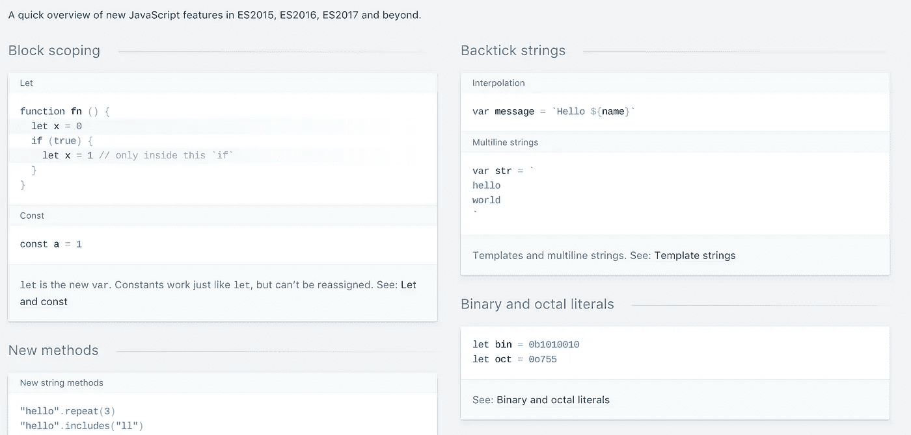

[https://devhints.io/es6](https://devhints.io/es6)

# Java Script 语言

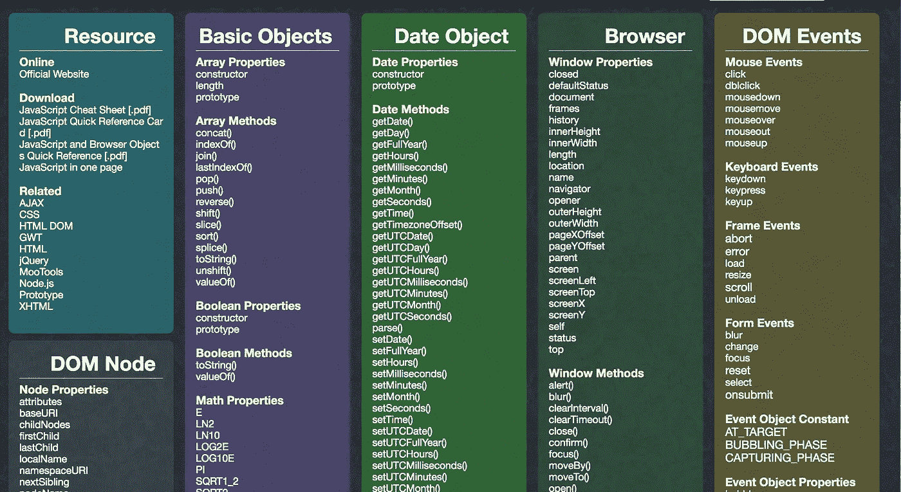

[http://overapi.com/javascript](http://overapi.com/javascript)

# JavaScript 正则表达式

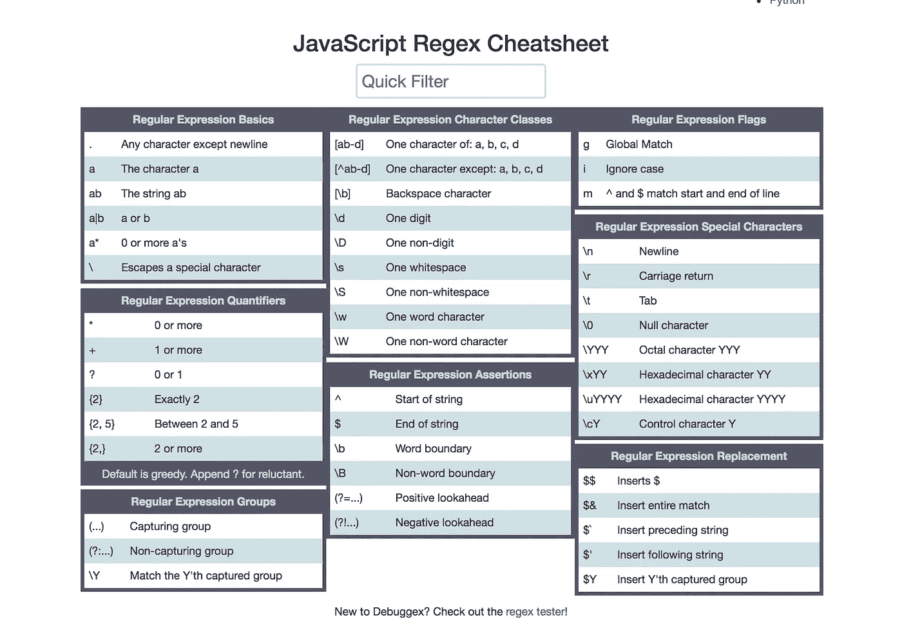

[https://www.debuggex.com/cheatsheet/regex/javascript](https://www.debuggex.com/cheatsheet/regex/javascript)

# 反应

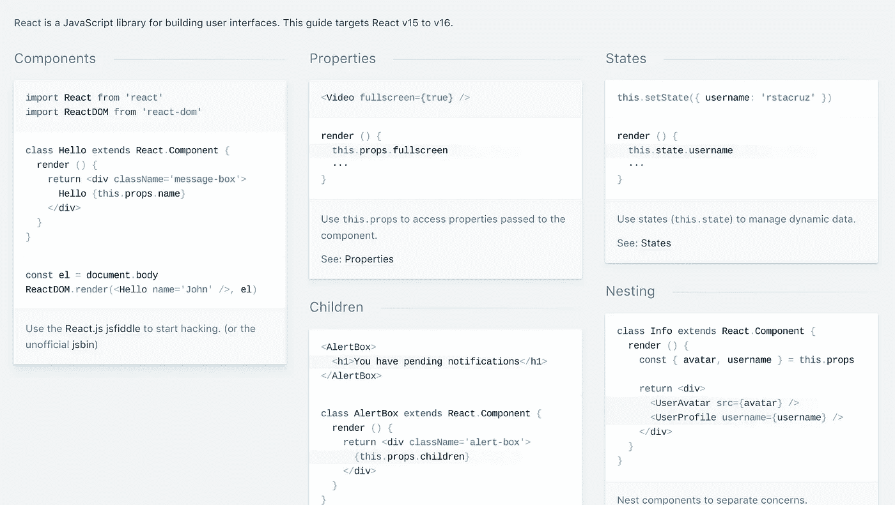

[https://devhints.io/react](https://devhints.io/react)

# Redux

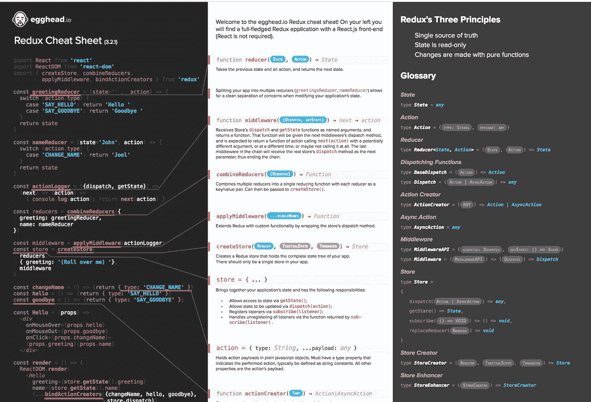

[https://github . com/linkmesrl/react-journey-2016/blob/master/resources/egghead-redux-cheat-sheet-3-2-1 . pdf](https://github.com/linkmesrl/react-journey-2016/blob/master/resources/egghead-redux-cheat-sheet-3-2-1.pdf)

# vue . j

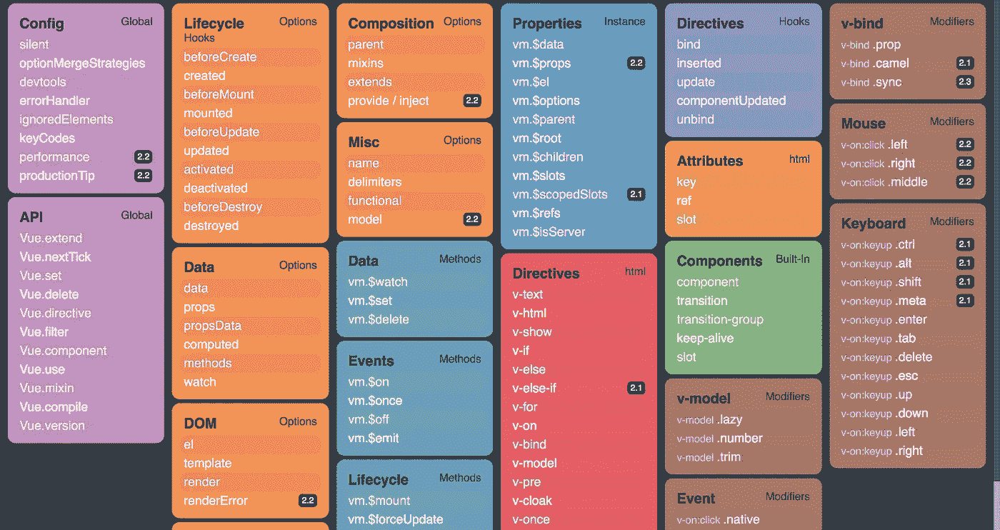

[https://vuejs-tips.github.io/cheatsheet/](https://vuejs-tips.github.io/cheatsheet/)

# Vuex

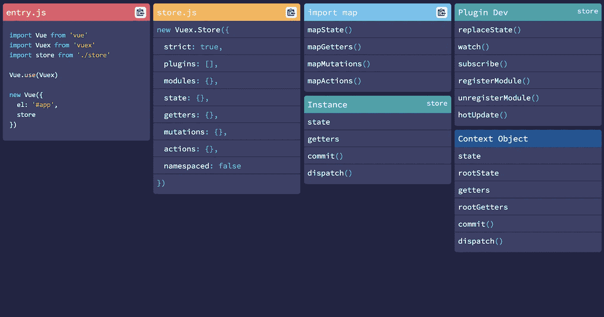

[https://vuejs-tips.github.io/vuex-cheatsheet/](https://vuejs-tips.github.io/vuex-cheatsheet/)

# 角度 4

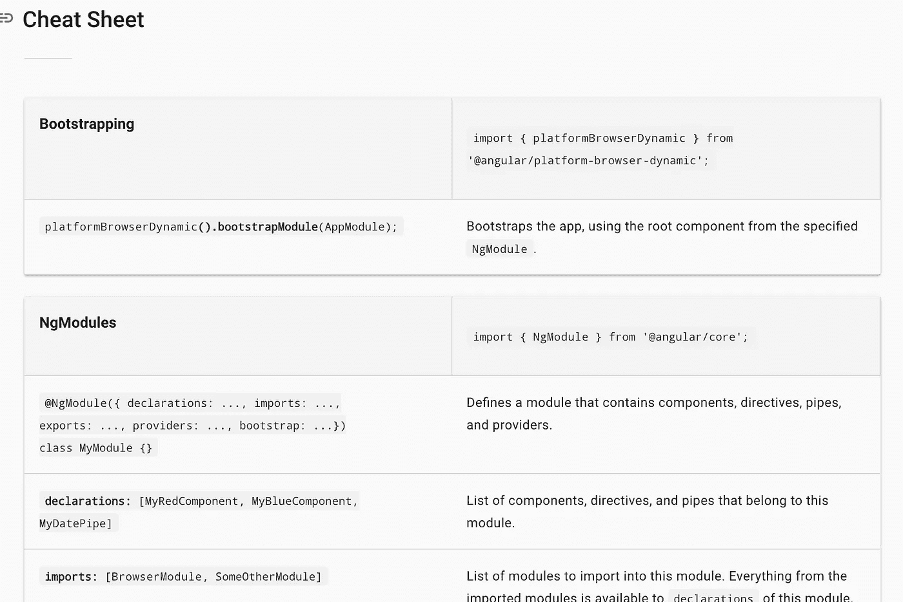

[https://angular.io/guide/cheatsheet](https://angular.io/guide/cheatsheet)

# Flexbox

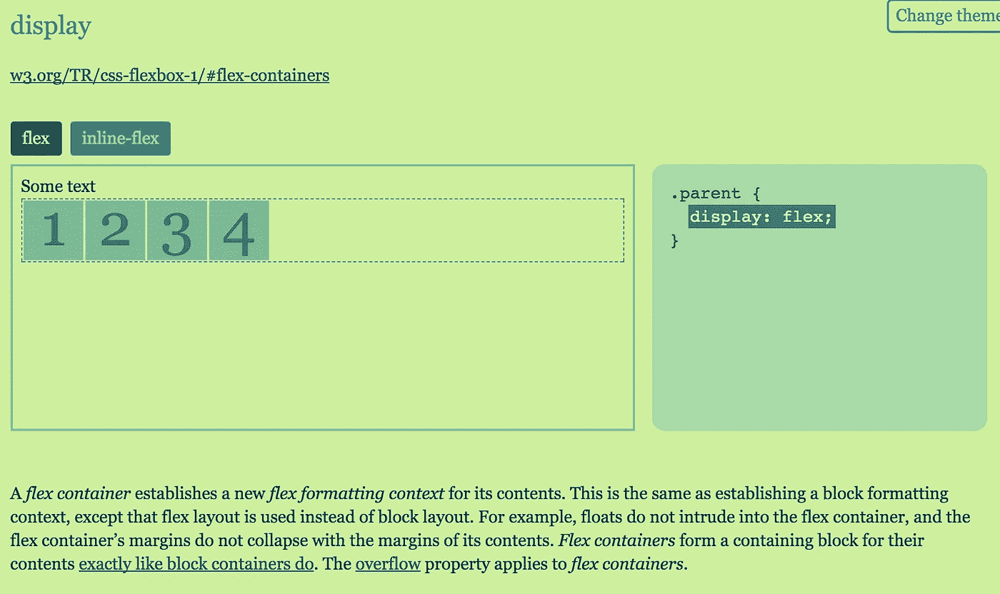

[https://yoksel.github.io/flex-cheatsheet/](https://yoksel.github.io/flex-cheatsheet/)

# SCSS

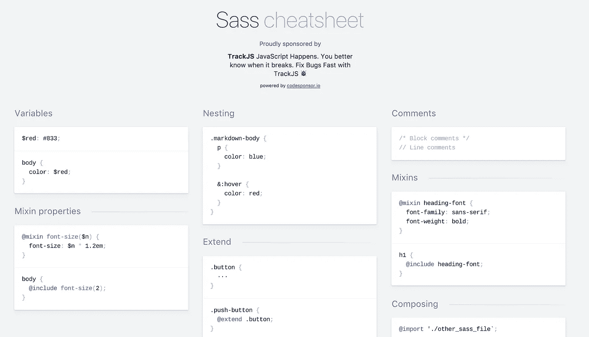

[https://devhints.io/sass](https://devhints.io/sass)

# 唱针

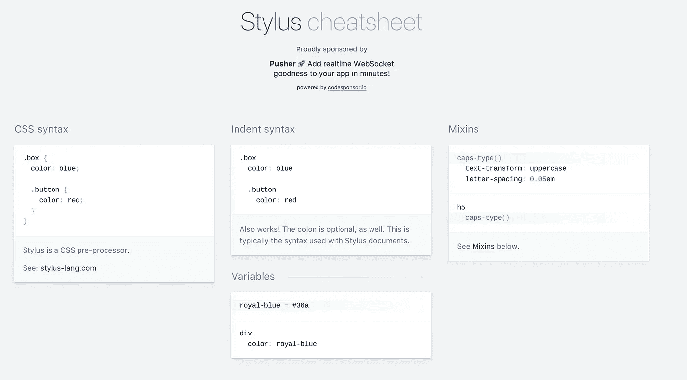

[https://devhints.io/stylus](https://devhints.io/stylus)

# GraphQL

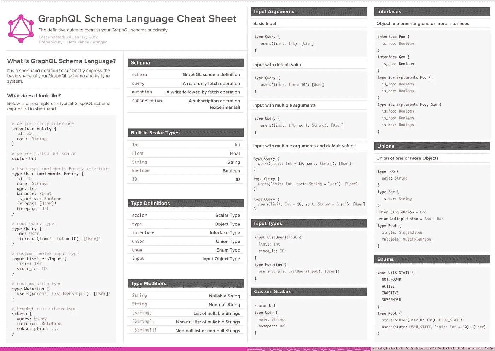

[https://raw . githubusercontent . com/sog ko/graph QL-速记-符号-备忘单/master/graph QL-速记-符号-备忘单. png](https://raw.githubusercontent.com/sogko/graphql-shorthand-notation-cheat-sheet/master/graphql-shorthand-notation-cheat-sheet.png)

错过了你最喜欢的小抄？请在评论里告诉我！

了解我最新内容的最好方式是通过我的 [**简讯**](https://wholesomedev.substack.com/welcome) 。成为第一个得到通知的人。

我的[简讯](https://wholesomedev.substack.com/welcome)。成为第一个得到通知的人。

感谢阅读，保持敬畏！❤