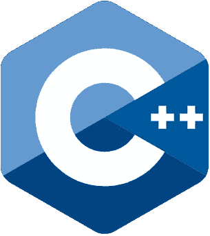
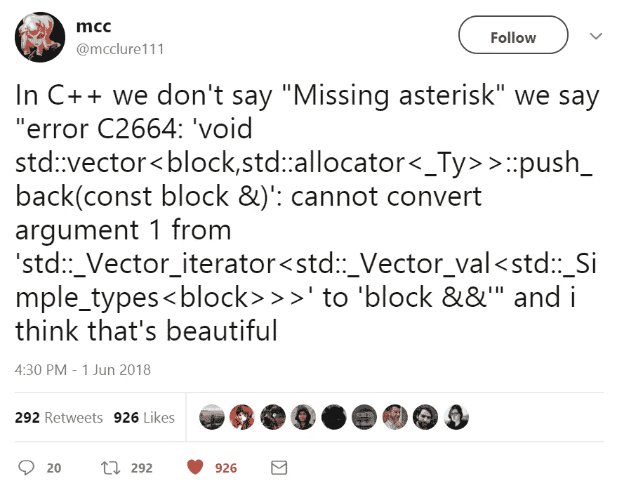
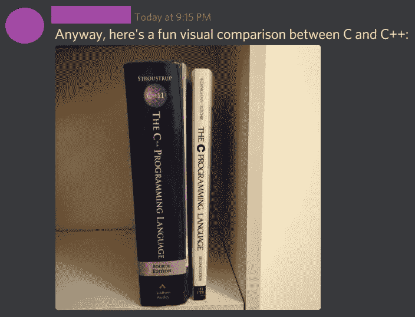
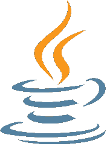
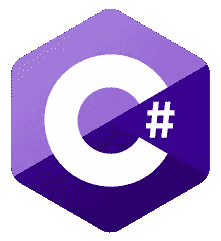
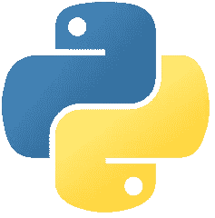
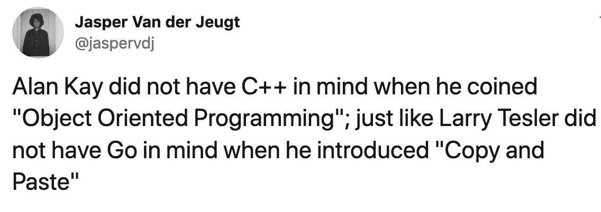
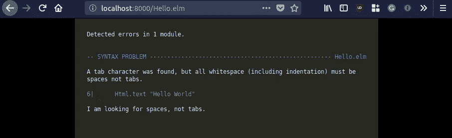

# 这些现代编程语言会让你痛苦

> 原文：<https://betterprogramming.pub/modern-languages-suck-ad21cbc8a57c>

## 欢迎来到现代编程语言的终极评级


特定编程语言的优缺点是什么？对于我的任务来说，X 是一种好的语言吗？谷歌“最佳编程语言”会给你一个“Python、Java、JavaScript、C#、C++、PHP”的标准列表，还有一个模糊的利弊列表。看到这样的文章让我畏缩——它们的作者一定是彻头彻尾的懒惰、缺乏经验和想象力。让我们深入探究一下，看看什么是真正糟糕的，什么不是。

在本文中，我将尝试对流行的(和不太流行的)现代编程语言给出一个客观的、希望没有偏见的概述，从最差到最好排序。

请记住，没有一种完美的编程语言。有些最适合后端/ API 开发，有些非常适合系统编程。

我将介绍世界上最常见的两个语系:源于 C 语言的[语言](https://en.wikipedia.org/wiki/List_of_C-family_programming_languages)和源于 ML 语言的[语言](https://en.wikipedia.org/wiki/ML_(programming_language))。

编程语言只是开发者工具箱中的工具。为这项工作选择合适的工具很重要。我真的希望这个指南能帮助你选择最适合你的任务的编程语言。做出正确的选择可能会为您节省几个月(甚至几年)的开发时间。

# 什么样的语言特征真正重要？


大多数其他类似的文章都是基于像*和 ***收入潜力*** 这样的因素进行比较。受欢迎程度很少是一个好的衡量标准，尤其是在软件领域(尽管一个大的社区生态系统有所帮助)。取而代之的是，我会考虑一种特定语言的长处和短处。*

*我会竖起大拇指👍(即+1)，不赞成👎，或者一个 ok👌(不好也不坏)表情符号表示特定语言特征的分数。*

*现在，我们将如何衡量？换句话说，除了语言流行度之外，真正重要的是什么？*

# *类型系统*

*许多人相信类型系统。这就是为什么像 TypeScript 这样的语言近年来越来越受欢迎。我倾向于同意类型系统消除了程序中的大量错误，使重构更容易。然而，拥有类型系统只是故事的一部分。*

*如果一门语言有类型系统，那么拥有*类型推理*也是非常有用的。最好的类型系统能够推断出大多数类型，而不需要显式地标注函数签名。不幸的是，大多数编程语言只提供基本的类型推理。*

*对于一个类型系统来说，支持代数数据类型也是很好的(稍后会详细介绍)。*

*最强大的类型系统支持更高级的类型，这是泛型之上的一个抽象层次，允许我们在更高的抽象层次上编程。*

*我们还必须记住，人们倾向于把太多的重要性放在类型系统上。有些事情远比静态类型重要，类型系统的存在与否不应该是选择语言的唯一因素。*

# *学习努力*

*我们可能有完美的编程语言，但是如果新开发人员的入职可能需要几个月甚至几年(前期投资)，这又有什么用呢？另一方面，有些编程范例需要数年才能熟练掌握。*

*一门好的语言应该让初学者容易理解，而不应该花很多年去掌握。*

**

# *无效的*

> *我称之为我的十亿美元错误。这是 1965 年零引用的发明。当时我正在用一种 [*面向对象的*](https://suzdalnitski.com/oop-will-make-you-suffer-846d072b4dce) *语言设计第一个综合型的引用系统。我的目标是确保所有引用的使用都是绝对安全的，由编译器自动执行检查。但是我无法抗拒放入空引用的诱惑，仅仅是因为它太容易实现了。这导致了数不清的错误、漏洞和系统崩溃，在过去的四十年里，这可能造成了数十亿美元的痛苦和损失。**
> 
> *-东尼·霍尔，空引用的发明者*

*为什么空引用不好？空引用破坏了类型系统。当 null 是默认值时，我们就不能再依赖编译器来检查代码的有效性了。任何可空值都是一个等待爆炸的炸弹。如果我们试图使用我们不认为可能为空的值，但它实际上是空的，该怎么办？我们得到一个运行时异常。*

*我们必须依靠*手动运行时检查*来确保我们处理的值不为空。即使在静态类型的语言中，空引用也带走了类型系统的许多好处。*

*这种运行时检查(有时称为空值保护)实际上是糟糕的语言设计的变通办法。他们在我们的代码中散布样板文件。最糟糕的是，不能保证我们不会忘记检查 null。*

*在好的语言中，应该在编译时对值的存在与否进行类型检查。*

*鼓励使用其他机制处理缺失数据的语言将排名更高。*

# *错误处理*

**捕捉*异常不是处理错误的好方法。抛出异常是没问题的，但是只有在*异常*的情况下，当程序无法恢复，并且不得不崩溃的时候。就像 nulls 一样，异常会破坏类型系统。*

*当异常被用作错误处理的主要方式时，不可能知道一个函数是会返回一个期望值还是会崩溃。抛出异常的函数也不可能被编写。*

*显然，仅仅因为我们无法获取一些数据而导致整个应用程序崩溃是不合适的。然而，比我们愿意承认的更多的时候，这就是发生的事情。*

*一种选择是手动检查引发的异常，但是这种方法很脆弱(我们可能会忘记检查异常),并且增加了很多噪音:*

*现在有更好的错误处理机制。可能的错误应该在编译时进行类型检查。默认情况下不使用异常的语言排名会更高。*

# *并发*

*我们已经到了摩尔定律的尽头:处理器不会再快了。我们生活在多核 CPU 时代。任何现代应用都必须利用多核优势。*

*不幸的是，今天使用的大多数编程语言都是在单核计算时代设计的，根本不具备在多核上有效运行的特性。*

*有助于并发性的库是后来才想到的，它们只是给最初不是为并发性设计的语言添加了创可贴。这不算是好的开发者体验。在现代语言中，并发支持必须是内置的(想想 Go/Erlang/Elixir)。*

**

# *不变*

> **我认为大型的* [*面向对象的*](https://suzdalnitski.com/oop-will-make-you-suffer-846d072b4dce) *程序在构建这种包含可变对象的大型对象图时，会越来越复杂。你知道，试着理解并记住当你调用一个方法时会发生什么，副作用会是什么。**
> 
> **——*[*Rich Hickey*](http://www.se-radio.net/2010/03/episode-158-rich-hickey-on-clojure/)*，Clojure 的创建者。**

*用不变的值编程现在变得越来越流行。甚至像`React`这样的现代 UI 库也是为了使用不可变的值。对不可变数据值有一流支持的语言排名会更高。仅仅因为不变性从我们的代码中消除了一整类错误。*

*什么是[不可变状态](https://suzdalnitski.com/terrible-coding-mistake-aa1fbebd83b4)？简单来说，就是数据不变。就像大多数编程语言中的字符串一样。例如，将字符串大写永远不会改变原始字符串，而是总是返回一个新的字符串。*

*不变性进一步发展了这一思想，确保没有任何东西被改变。总是返回一个新数组，而不是改变原来的数组。更新用户名？将返回一个新的用户对象，其名称已更新，原始对象保持不变。*

*有了不可变状态，没有什么是共享的，因此我们不再需要担心线程安全的复杂性。不变性使我们的代码易于并行化。*

*不改变任何状态的函数被称为纯函数，并且非常容易测试和推理。当使用纯函数时，我们永远不必担心函数之外的任何事情。只专注于你正在处理的这一个功能，忘掉其他的一切。你可以想象开发变得有多容易(与 OOP 相比，OOP 需要记住整个对象图)。*

# *生态系统/工具*

*一种语言可能不太好，但它可能有一个大的生态系统，这使它具有吸引力。使用好的库可以节省几个月甚至几年的开发时间。*

*我们已经在 JavaScript 和 Python 这样的语言中看到了这种情况。*

# *速度*

*语言 ***编译*** 有多快？程序启动有多快？它们的运行时性能如何？所有这些事情都很重要，都会被列入排名。*

# *年龄*

*虽然有一些例外，但一般来说，新的语言会比旧的语言更好。原因很简单，因为新的语言会从前辈的错误中吸取教训。*

# *C++*

****

*让我们从最坏的最坏的，可能是计算机科学最大的错误之一，C++开始我们的评级。是的，C++并不被认为是一种闪亮的现代编程语言。但它至今仍被广泛使用，不得不被列入清单。*

*语系: **C.***

**

## *👎语言特征*

**

> **C++是一种可怕的语言……而将你的项目限制为 C 意味着人们不会用任何白痴的"* [*对象模型*](https://suzdalnitski.com/oop-will-make-you-suffer-846d072b4dce)*" C&@ p .
> ——Linus Torvalds，Linux 的创造者。**

*C++充斥着各种功能。它试图做任何事情，而不擅长任何特定的事情。C++有`goto`、指针、引用、OOP、操作符重载和许多其他非生产性的特性。*

*C++为什么这么差？在我看来，最大的原因是它的年龄。C++是很久以前，1979 年设计的。当时的设计师缺乏经验，不知道应该关注什么。添加的功能在当时看起来可能是个好主意。这种语言非常受欢迎，这意味着添加了更多的特性来支持各种用例(创建了更多的特性)。*

## *👎速度*

*C++因其缓慢的编译时间而臭名昭著。它明显比 Java 慢，虽然没有 Scala 差。*

*不过，运行时性能和启动时间都很好。*

## *👎生态系统/工具*

**

*上述推文提出了一个很好的观点。C++编译器的错误信息对初学者来说不是很友好。通常情况下，找出错误的确切原因需要一些时间。*

## *👎👎碎片帐集*

> **我曾希望一个可以随意启用的垃圾收集器会成为 C++0x 的一部分，但是技术问题太多了……**
> 
> *-比雅尼·斯特劳斯特鲁普，C++的创造者*

*C++从来没有加入垃圾收集。手动内存管理极易出错。开发人员不得不担心手动释放和分配内存。我将永远不会怀念我使用非垃圾收集语言的日子，如今在垃圾收集语言中，无数的 bug 都可以很容易地被阻止。*

## *👎面向对象编程的一次失败尝试*

> *我发明了术语[面向对象](https://suzdalnitski.com/oop-will-make-you-suffer-846d072b4dce)，我可以告诉你，我脑子里没有 C++。*
> 
> *——艾伦·凯，面向对象编程的发明者。*

*出现于 60 年代后期，当 C++的工作开始时，OOP 是一项很酷的新技术。不幸的是，C++在实现 OOP 的过程中犯了一些关键性的错误(不像 Smalltalk 这样的语言)，这使得一个非常好的想法变成了一场噩梦。*

*与 Java 相比，C++的一个优点是 C++中的 OOP 至少是可选的。*

## *👎👎学习努力*

**

*关于 [Reddit](https://www.reddit.com/r/ProgrammerHumor/comments/k09yty/my_friend_sent_me_this_thought_it_belonged_here/) 的 Mercurial_Rhombus*

*C++是一种复杂的低级语言，没有自动内存管理。由于其功能膨胀，初学者不得不花大量时间学习语言。*

## *👎并发*

*C++是在单核计算时代设计的，只有在过去十年中添加的基本并发机制。*

## *👎错误处理*

*捕捉/抛出错误是首选的错误处理机制。*

## *👎不变*

*没有对不可变数据结构的内置支持。*

## *👎无效的*

*在 C++中，所有引用都可以为空。*

## *👎转到*

*C++可能是唯一仍然支持 goto 语句的现代编程语言。在过去，它是错误的主要原因，但是 C++已经决定把这个可怕的过去的遗迹放进去。毕竟，功能越多越好，对吗？*

**

## *裁决*

**

*C++原本打算成为一个更好的 C 版本，但未能实现。*

*C++最好的用途大概是系统编程。然而，考虑到现有的更好和更现代的选择(Rust 和 Go)，C++甚至不应该用于此。我不认为 C++有任何优点，尽管证明我错了。*

*C++，你该走了。*

# *Java 语言(一种计算机语言，尤用于创建网站)*

****

> *Java 是自 MS-DOS 以来计算机领域最令人苦恼的事情。*
> 
> **——艾伦·凯，美国* [*发明家*](http://www.cc.gatech.edu/fac/mark.guzdial/squeak/oopsla.html)*[*面向对象编程*](https://suzdalnitski.com/oop-will-make-you-suffer-846d072b4dce) *。***

**Java 于 1995 年首次出现，比 C++年轻 16 岁。Java 是一种简单得多的语言，这可能是它受欢迎的原因之一。**

**语系: **C** 。**

## **👍碎片帐集**

**与 C++相比，Java 提供的最大好处之一是垃圾收集，它本身就消除了一大类错误。**

## **👍生态系统**

**Java 已经存在很长时间了，它有一个巨大的后端开发生态系统，这大大减少了开发工作。**

## **👎面向对象语言**

**我不会在这里深入探讨 OOP 的缺点，更详细的分析你可以阅读我的另一篇文章[面向对象编程——万亿美元的灾难](https://medium.com/better-programming/object-oriented-programming-the-trillion-dollar-disaster-92a4b666c7c7)。**

**相反，我将简单地引用计算机科学中一些最杰出的人的话，来了解他们对 OOP 的看法:**

> **很抱歉，我很久以前就为这个主题创造了“对象”这个术语，因为它让许多人关注次要的概念。最大的想法是信息传递。面向对象程序设计的发明者艾伦·凯**

**Alan Kay 是对的，主流 OOP 语言关注的是错误的东西——类和对象——而忽略了消息传递。幸运的是，有一些现代语言确实正确地理解了这一点(例如 Erlang/Elixir)。**

> ***有了面向对象的编程语言，计算机软件变得更加冗长，可读性更差，描述性更差，并且更难修改和维护。***
> 
> ***—* [*理查德·曼斯菲尔德*](http://www.4js.com/files/documents/products/genero/WhitePaperHasOOPFailed.pdf)**

**任何使用过面向对象语言(如 Java 或 C#)的人，如果有使用非面向对象语言的经验，可能都会有同感。**

## **👌速度**

**显然，Java 运行在 Java 虚拟机之上，而 Java 虚拟机以启动速度慢而臭名昭著。我见过在 JVM 上运行的程序需要 30 秒甚至更长时间才能启动，这对于现代的云原生程序来说是不可接受的。**

**较大项目的编译速度很慢，极大地影响了开发人员的生产力(尽管没有 Scala 那么糟糕)。**

**从好的方面来看，JVM 的运行时性能非常好。**

## **👎学习努力**

**虽然 Java 是一种相当简单的语言，但它对面向对象编程的关注让它变得很难。人们可以很容易地编写一个简单的程序。然而，知道如何编写可靠且可维护的面向对象代码可能需要十年以上的时间。**

## **👎并发**

**Java 是在单核计算时代设计的，像 C++一样，只有基本的并发支持。**

## **👎无效的**

**在 Java 中，所有的引用都是可空的。**

## **👎错误处理**

**捕捉/抛出错误是首选的错误处理机制。**

## **👎不变**

**没有对[不可变](https://suzdalnitski.com/terrible-coding-mistake-aa1fbebd83b4)数据结构的内置支持。**

## **裁决**

****

**Java 出现的时候是一种体面的语言。与 Scala 不同，它一直专注于 OOP，这太糟糕了。这种语言非常冗长，并且有很多样板代码。**

**Java 退休的时候到了。**

# **C#**

********

**从根本上说，C#和 Java 之间没有什么区别(因为早期版本的 C#实际上是 Java 的微软实现)。**

**C#与 Java 有着相同的缺点。C#在 2000 年首次出现，比 Java 小 5 岁，并且从 Java 的错误中学到了一些东西。**

**语系: **C** 。**

## **👌句法**

**C#语法一直比 Java 领先一点。C#比 Java 更少受到样板代码的困扰。虽然作为一种面向对象的语言，C#更为冗长。很高兴看到 C#语法在每个版本中都得到了改进，增加了一些特性，如表达式体函数成员、模式匹配、元组等等。**

## **👎面向对象语言**

**就像 Java 一样，C#主要关注面向对象。再说一次，我不打算在这里花太多的时间试图让你相信 OOP 的缺点，我将简单地引用计算机科学中几个比较突出的人的话。**

> ***我认为复用性的不足在于* [*面向对象语言*](https://suzdalnitski.com/oop-will-make-you-suffer-846d072b4dce) *，而不在于函数式语言。因为面向对象语言的问题是它们有所有这些隐含的环境。你想要一个香蕉，但你得到的是一只大猩猩拿着香蕉和整个丛林。***
> 
> ***—二郎的创造者乔·阿姆斯特朗***

**我不得不同意乔·阿姆斯特朗的观点，与函数式(甚至命令式)代码相比，重用面向对象的代码非常困难。**

> **[面向对象的](https://suzdalnitski.com/oop-will-make-you-suffer-846d072b4dce)程序被提供作为正确程序的替代方案……
> ——Edsger w . Dijkstra，计算机科学的先驱**

**在我的职业生涯中，我接触过 OOP 和非 OOP 语言，我不得不承认 OOP 代码比非 OOP 代码更难理解。**

## **👎多范式？**

**C#号称是多范式语言。特别是 C#声称支持函数式编程。我不同意，对于一门语言来说，仅仅支持一级函数是不够的。**

**一门语言应该具备哪些功能特征？至少，内置了对[不可变](https://suzdalnitski.com/terrible-coding-mistake-aa1fbebd83b4)数据结构、模式匹配、函数组合管道操作符、代数数据类型的支持。**

## **👎并发**

**C#创建于单核计算时代，和 Java 一样只有最基本的并发支持。**

## **👎无效的**

**在 C#中，所有引用都可以为空。**

## **👎错误处理**

**捕捉/抛出错误是首选的错误处理机制。**

## **👎不变**

**没有对不可变数据结构的内置支持。**

****

## **裁决**

****

**我职业生涯的很大一部分时间都在使用 C#，并且总是对这种语言感到沮丧。就像 Java 一样，我建议寻找更现代的替代品。它是相同的 Java，只是语法更现代一点。**

**不幸的是，C#一点都不“犀利”。**

# **计算机编程语言**

********

**Python 于 1991 年首次出现，是一门古老的语言。与 JavaScript 一起，Python 是世界上最流行的语言之一。**

**语系: **C** 。**

## **👍生态系统**

**Python 几乎为所有东西都提供了一个库。与 JavaScript 不同，Python 不能用于前端 web 开发。然而，它很容易用大量的数据科学库来弥补这一点。**

## **👍学习努力**

**Python 是一种非常简单的语言，初学者可以在几周内学会。**

## **👎类型系统**

**Python 是动态类型化的，关于类型系统就不多说了。**

## **👎速度**

**Python 是一种解释型语言，就运行时性能而言，它是最慢的编程语言之一。在运行时性能至关重要的情况下，使用 Cython 而不是普通 Python 可能是一个好的解决方案。**

**与本地语言相比，Python 启动起来也相当慢。**

## **👎工具作业**

**在使用 Python 和其他现代语言之后，很难不对 Python 的依赖性管理感到失望。有 pip，pipenv，virtualenv，`pip freeze`等。相比之下，JavaScript 中的 NPM 是你唯一需要的工具。**

## **👎并发**

**Python 不是在 mind 中创建的，只有基本的并发支持。**

## **👎无效的**

**在 Python 中，所有引用都是可空的。**

## **👎错误处理**

**捕捉/抛出错误是首选的错误处理机制。**

## **👎不变**

**没有对不可变的 T2 数据结构的内置支持。**

## **裁决**

****

**Python 对函数式编程没有合适的支持，真的很不幸。函数式编程非常适合数据科学试图解决的问题。即使对于像 web 抓取这样非常复杂的任务，函数式语言(比如 Elixir)也更适合。**

**我不建议在大型项目中使用 Python，因为这种语言并没有考虑到严肃的软件工程。**

**Python 不应该用于数据科学之外的任何领域，因为没有其他替代方法可用。 [Julia](https://en.wikipedia.org/wiki/Julia_(programming_language)) 似乎是 Python 在数据科学领域的一个很好的现代替代品，尽管它的生态系统远没有 Python 的成熟。**

# **以打字打的文件**

********

**TypeScript 是一种编译成 js 的语言。它的主要目标是通过在 JavaScript 中添加静态类型来制作“更好的 JavaScript”。就像 JavaScript 一样，TypeScript 正被用于前端和后端开发。**

**TypeScript 是由安德斯·海尔斯伯格设计的，他也是设计 C#的人。TypeScript 代码感觉非常 C-sharpy，基本上可以认为是浏览器的 C#。**

**语系: **C** 。**

## **👎JavaScript 的超集**

**是的，作为 JavaScript 的超集对 TypeScript 的采用帮助很大。毕竟，很多人已经知道 JavaScript 了。**

**然而，作为 JavaScript 的超集更多的是一个缺点。这意味着 TypeScript 承载了所有的 JavaScript 包袱。它受限于 JavaScript 中所有糟糕的设计决策。**

**比如你们有多少人喜欢`this`这个关键词？可能没有人，但 TypeScript 已有意决定保持这一点。**

**类型系统有时表现得很奇怪怎么样？**

```
**[] == ![];    // -> true
NaN === NaN;  // -> false**
```

**换句话说，TypeScript 具有 JavaScript 的所有缺点。成为一种坏语言的超集不会变成好语言。**

## **👍生态系统**

**TypeScript 可以访问整个 JavaScript 生态系统，这是非常庞大的。巨大的收益。使用 Node Package Manager 是一件非常愉快的事情，尤其是与 Python 等其他语言相比。**

**缺点是并不是所有的 JavaScript 库都有可用的 TypeScript 声明。想想 Ramda，Immutable.js。**

## **👌类型系统**

**我对 TypeScript 中的类型系统不太激动，还可以。**

**好的一面是，它甚至支持代数数据类型(有区别的联合):**

**让我们看一下 ReasonML 中实现的相同代码:**

**TypeScript 语法不如函数式语言好。在 TypeScript 2.0 中，有区别的联合是后来才添加的。在`switch`中，我们在容易出错的字符串上进行匹配，如果我们错过了一个案例，编译器不会警告我们。**

**TypeScript 仅提供基本的类型推断。此外，当使用 TypeScript 时，您会发现使用`any`比您希望的更频繁。**

## **👌无效的**

**TypeScript 2.0 增加了对不可空类型的支持，可以选择使用`--strictNullChecks`编译器标志来启用它。但是……用不可空类型编程不是默认的，在 TypeScript 中也不被认为是惯用的。**

## **👎错误处理**

**在 TypeScript 中，通过抛出/捕获异常来处理错误。**

## **👎新的 JS 特性**

**JavaScript 比 TypeScript 更快获得对新功能的支持。甚至可以使用 Babel 在 JavaScript 中启用实验性的特性，这对于 TypeScript 是做不到的。**

## **👎不变**

**在 TypeScript 中处理不可变的数据结构要比在 JavaScript 中糟糕得多。虽然 JavaScript 开发人员可以使用有助于不变性的库，但 TypeScript 开发人员通常不得不依赖于本机数组/对象传播运算符(写入时复制):**

**不幸的是，本机扩展操作符不执行深度复制，并且手动扩展深度对象很麻烦。复制大型数组/对象对性能也没有好处。**

**TypeScript 中的`readonly`关键字很好，它使得属性不可变。然而，离支持合适的不可变数据结构还有很长的路要走。**

**JavaScript 有很好的库来处理不可变数据(比如 Rambda/Immutable.js)。然而，让这样的库与 TypeScript 类型系统一起工作可能会很棘手。**

## **👎TypeScript & React——地狱里的一对？**

> **在 JavaScript[和 TypeScript]中处理不可变数据比在为其设计的语言中更困难，比如 [Clojure](https://clojure.org/) 。**
> 
> **-直接来自 [React 文档](https://reactjs.org/docs/update.html)**

**继续前面的缺点，如果你正在做前端 web 开发，那么你有可能使用 React。**

**React 不是为 TypeScript 设计的。React 最初是为函数式语言设计的(稍后会详细介绍)。编程范式之间存在冲突——type script 是 OOP 优先，而 React 是函数优先。**

**React 期望它的 props(即函数参数)是不可变的，而 TypeScript 对[不可变的](https://suzdalnitski.com/terrible-coding-mistake-aa1fbebd83b4)数据结构没有合适的内置支持。**

**与 JavaScript 相比，TypeScript 为 React 开发提供的唯一真正的好处是不必担心 PropTypes。**

## **TypeScript 还是 Hypescript？**

**TypeScript 只是炒作吗？这由你决定。我觉得是。它最大的好处是可以访问整个 JavaScript 生态系统。**

**那么，为什么 HypeScript 如此受欢迎呢？Java 和 C#流行的原因是一样的——得到了拥有巨额营销预算的数十亿公司的支持。**

## **裁决**

****

**虽然 TypeScript 通常被认为是“更好的 JavaScript”，但我对它的评价低于 JavaScript。它比 JavaScript 提供的好处被高估了，特别是对于使用 React 的前端 web 开发。**

**TypeScript 保留了 JavaScript 所有不好的部分，实际上继承了几十年来 JavaScript 中糟糕的设计决策，这确实是失败的。**

# **去**

********

**Go 旨在帮助提高多核处理器和大型代码库时代的编程效率。Go 的设计者主要是因为他们都不喜欢当时在谷歌广泛使用的 C++。**

**语系: **C** 。**

## **👍并发**

**并发性是 Go 的“杀手锏”特性，Go 是为并发性而从头开始构建的。就像 Erlang/Elixir 一样，Go 遵循并发的邮箱模型。不幸的是，Go 中的 goroutines 不提供 Erlang/Elixir 进程所具有的容错特性。换句话说，goroutine 中的异常会导致整个程序停止运行，而 Elixir 进程中的异常只会导致那个进程停止运行。**

## **👍 👍速度**

**谷歌创造 Go 的主要原因之一是编译速度。甚至有一个笑话说，谷歌在等待他们的 C++代码编译时创建了 Go。**

**围棋是一种快速语言。围棋程序的启动时间非常快。Go 编译成原生代码，所以它的运行速度也很惊人。**

## **👍学习努力**

**Go 是一门简单的语言，有以前编程经验的人大概一个月左右就能学会。**

## **👍错误处理**

**Go 不支持异常。相反，Go 让开发人员显式地处理可能的错误。与 Rust 类似，Go 返回两个值——调用的结果和潜在的错误。如果一切顺利，那么误差将为零:**

## **👍没有面向对象的编程**

**虽然有些人可能不同意，但我个人认为缺乏 OOP 特性是一个很大的优势。**

**重复 Linus Torvalds:**

> ***C++是一种可怕的[面向对象]语言……将你的项目限制为 C 意味着人们不会用任何白痴的“对象模型”C 来搞砸事情&@ p .
> ——Linus Torvalds，Linux 的创造者***

**Linus Torvalds 因公开批评 C++和 OOP 而广为人知。他 100%正确的一点是*限制了*程序员的选择。事实上，程序员的选择越少，他们的代码就越有弹性。**

**在我看来，Go 有意省略了很多 OOP 特性，以免重蹈 C++的覆辙。**

## **👌生态系统**

> **一些标准库真的很笨。它的很大一部分与 Go 自己返回带外错误的哲学不一致(例如，它们返回一个类似-1 的值作为索引，而不是`*(int, error)*`)，其他的依赖于全局状态，例如`*flag*`和`*net/http*`。**

**Go 的标准库中缺乏标准化。例如，有些库在出错时返回`(int, error)`，有些库返回值类似`-1`，而有些库依赖全局状态，例如`flag`。**

**这个生态系统没有 JavaScript 大。**

## **👎类型系统**

****

**几乎每种现代编程语言都有某种形式的泛型(包括可怕的 C#/Java，甚至 C++也有模板)。泛型允许开发者重用不同类型的函数实现。如果没有泛型，你将不得不为整数、双精度数和浮点数分别实现`add`函数，导致大量代码重复。换句话说，Go 中[缺乏泛型导致了大量的重复代码。正如一些人所说，“Go”是“去写一些样板文件”的缩写](https://www.reddit.com/r/ProgrammerHumor/comments/eho336/larry_tesler_did_not_have_go_in_mind_when_he/)**

## **👎无效的**

**不幸的是，当更安全的替代方法已经存在了几十年的时候，Go 却在语言中加入了空值。**

## **👎不变**

**Go 没有对不可变数据结构的内置支持。**

## **裁决**

****

> **围棋不是一门好语言。还不错；就是不好。我们必须小心使用不好的语言，因为如果我们不小心，我们可能会在接下来的 20 年里一直使用它们。**
> 
> **——威尔·雅戈在[为什么围棋不行](http://yager.io/programming/go.html)**

**如果你不是 Google，也没有类似 Google 的用例，那么 Go 可能不是一个好的选择。Go 是一种最适合系统编程的简单语言。对于 API 开发来说，Go 并不是一个很好的选择(因为有更好的选择，稍后会有更多的介绍)。**

**我认为总的来说，Go 比 Rust 更好(尽管类型系统更弱)。它是一种简单的语言，速度非常快，容易学习，并且具有很好的并发特性。是的，Go 成功地完成了它成为“更好的 C++”的设计目标。**

## **最佳系统语言奖**

****

****最佳系统语言**奖即将揭晓。毫无疑问，Go 是系统编程的不二之选。Go 是一种低级语言，它非常适合这个领域的事实已经被大量用它构建的成功项目所证实，比如 Kubernetes、Docker 和 Terraform。**

# **锈**

********

**Rust 是一种现代低级语言，最初是作为 C++的替代品而设计的。**

**语系: **C** 。**

## **👍速度**

**Rust 从一开始就被设计得很快。Rust 程序的编译时间比 Go 程序的编译时间长。Rust 程序的运行时性能比 Go 快一点。**

## **👍无效的**

**这是我们列表中第一种带有现代零替代的语言！Rust 没有 null 或 nil 值，Rust 开发人员使用`Option`模式代替。**

## **👍错误处理**

**Rust 采用现代的函数方法来处理错误，并使用专用的`Result`类型来表示可能失败的操作。这与上面的`Option`非常相似，然而`None`案例现在也有了价值。**

## **👎并发**

**由于缺乏垃圾收集，并发性在 Rust 中相当困难。开发人员不得不担心装箱和固定之类的事情，这通常是在垃圾收集语言中自动完成的。**

## **👎生态系统**

**截至撰写本文时，Rust 生态系统仍在开发中，还不太成熟。**

## **👎低级语言**

**作为一种低级语言，Rust 中的开发者生产力不可能像其他高级语言那样高。这也使得学习变得更加困难。**

## **裁决**

****

**Rust 非常适合系统编程。虽然比 Go 更复杂，但它提供了一个强大的类型系统，总体来说是一种更好的语言。Rust 为 nulls 提供了一种现代的替代方法和一种处理错误的现代方法。**

**为什么 Rust 的排名仍然低于 JavaScript？这是一种为系统编程设计的低级语言。Rust 不太适合后端/Web API 开发，它的生态系统不像其他语言那样发达。**

# **Java Script 语言**

********

**作为世界上最流行的编程语言，JavaScript 不需要介绍。**

**不，这不是一个错误——JavaScript 确实排在 Rust、TypeScript 和 Go 之上。让我们找出原因。**

**语系: **C** 。**

## **👍 👍生态系统**

**JavaScript 最大的好处是它的生态系统。JavaScript 正被用于你能想到的一切——前端/后端 web 开发、CLI 编程、数据科学，甚至机器学习。JavaScript 可能有一个你能想到的所有东西的库。**

## **👍学习努力**

**JavaScript(还有 Python)是最容易学习的编程语言之一。一个人可以在几周内变得高效。**

## **👎类型系统**

**就像 Python 一样，JavaScript 是动态类型化的。没什么好说的了。JavaScript 的类型系统有时会非常奇怪:**

## **👌不变**

**正如在 TypeScript 一节中已经提到的，spread 操作符可能会降低性能，甚至在复制对象时不执行深度复制。JavaScript 缺乏对不可变数据结构的内置支持，尽管有一些库可以提供帮助(Ramda/Immutable.js)。**

## **👎React 不是为 JavaScript 设计的**

**在 JavaScript 中使用 React 时，必须使用 PropTypes。然而，这也意味着必须维护 PropTypes，这可能成为一场噩梦。**

**此外，如果不小心的话，可能会引入微妙的性能问题:**

**这种看似无辜的代码可能成为性能噩梦，因为在 JavaScript `[] != []`中。上面的代码将导致`HugeList`在每次更新时重新呈现，即使`options`的值没有改变。这样的问题会越来越多，直到 UI 最终变得无法使用。**

## **👎`this`关键字**

**JavaScript 最大的反特性可能是`this`关键字。它的行为一贯不一致。它很挑剔，在不同的上下文中可能意味着完全不同的东西。它的行为甚至取决于谁调用了给定的函数。使用这个关键字经常会导致难以调试的微妙而奇怪的错误。**

## **👌并发**

**JavaScript 支持使用事件循环的单线程并发。这消除了对线程同步机制(如锁定)的需要。尽管 JavaScript 并没有考虑到并发性，但是与大多数其他语言相比，使用并发代码要容易得多。**

## **👍新的 JS 特性**

**JavaScript 比 TypeScript 更快获得对新功能的支持。通过使用 Babel，甚至可以在 JavaScript 中启用实验性功能。**

## **👎错误处理**

**捕捉/抛出错误是首选的错误处理机制。**

## **裁决**

****

**JavaScript 不是一种设计良好的语言。JavaScript 的初始版本是在十天内完成的(尽管未来的版本已经解决了它的许多缺点)。**

**尽管有缺点，JavaScript 对于全栈 web 开发来说是一个不错的选择。有了适当的纪律和林挺，JavaScript 可以成为一门好语言。**

# **函数式编程==安心**

****

**照片由[安特·汉默斯米特](https://unsplash.com/@ante_kante?utm_source=unsplash&utm_medium=referral&utm_content=creditCopyText)在 [Unsplash](https://unsplash.com/?utm_source=unsplash&utm_medium=referral&utm_content=creditCopyText) 上拍摄**

**在继续我们的排名之前，我们先绕个小弯。为什么要用函数式编程呢？因为函数式编程让我们*安心。***

**是的，函数式编程可能听起来很可怕，但实际上，没什么可怕的。简单地说，函数式语言做出了许多*正确的设计决策*，而其他人却做出了错误的决策。在大多数情况下，函数式语言都有合适的特性:强大的类型系统，支持代数数据类型，没有空值，没有错误处理异常，内置的不可变数据结构，模式匹配和函数组合操作符。**

**函数式编程语言有哪些共同的优势让它们在我们的排名中如此靠前？**

## **纯函数编程**

**与命令式(主流语言)不同，函数式编程语言鼓励用*纯*函数编程。**

**什么是纯函数？这个想法非常简单——给定相同的输入，一个纯函数将总是返回相同的输出。例如，`2 + 2`将始终返回`4`，这意味着加法运算符`+`是一个纯函数。**

**纯函数不允许与外界交互(进行 API 调用，甚至写入控制台)。他们甚至不允许改变状态。这与 OOP 所采用的方法正好相反，在 OOP 中，任何方法都可以随意改变其他对象的状态。**

**很容易区分纯函数和不纯函数——函数是不带参数，还是不返回值？那么它就是一个不纯函数。**

**下面是几个不纯函数的例子:**

**和几个纯函数:**

**这种方法似乎非常有限，需要一些时间来适应。一开始我确实很困惑！**

**纯函数有什么好处？这很容易测试(不需要模拟和存根)。关于纯函数的推理很容易——不像在 OOP 中，不需要记住整个应用程序的状态。你只需要担心你正在工作的当前函数。**

**纯函数很容易组合。纯函数非常适合并发，因为函数之间不共享状态。重构纯粹的函数是纯粹的快乐——只是复制和粘贴，不需要复杂的 IDE 工具。**

**简而言之，纯函数将快乐带回到编程中。**

**函数式编程鼓励使用纯函数——当 90%以上的代码库由纯函数组成时，这很好。一些语言将这一点发挥到了极致，完全禁止非纯函数(这并不总是一个好主意)。**

## **不可变数据结构**

****

**下面所有的函数式语言都内置了对[不可变](https://suzdalnitski.com/terrible-coding-mistake-aa1fbebd83b4)数据结构的支持。数据结构也是*持久的*。这仅仅意味着，无论何时进行更改，我们都不必创建整个结构的深层副本。想象一下，一次又一次地复制超过 100，000 个项目的数组，一定很慢，对吗？**

**持久性数据结构只是重用对旧数据结构的引用，同时添加所需的更改，而不是创建副本。**

## **代数数据类型**

****

**ADT 是一种建模应用程序状态的强大方法。人们可以认为他们是服用了类固醇的 Enums。我们指定了可能组成我们的类型的“子类型”,以及它的构造函数参数:**

**上面的“形状”类型可以是`Square`、`Rectangle`或`Circle`。`Square`构造函数采用单个`int`参数(宽度)，`Rectangle`采用两个`int`参数(宽度和高度)，`Circle`采用单个`int`参数(其半径)。**

**下面是用 Java 实现的类似代码:**

**我不知道你怎么想，但是我肯定会选择前一个版本——在函数式语言中使用 ADT。**

## **模式匹配**

****

**所有的函数式语言都非常支持模式匹配。一般来说，模式匹配允许编写非常有表现力的代码。**

**这里有一个关于`option(bool)`类型的模式匹配的例子:**

**下面是相同的代码，没有模式匹配:**

**毫无疑问，模式匹配版的表现力强多了，也干净多了。**

**模式匹配还提供编译时穷举保证，这意味着我们不会忘记检查可能的情况。在非功能性语言中没有这样的保证。**

## **无效的**

****

**函数式编程语言通常避免使用空引用。而是使用`Option`模式(类似于 Rust):**

## **错误处理**

****

**函数式语言通常不鼓励使用异常。相反，使用`Result`模式(再次类似于 Rust):**

**关于函数式错误处理的介绍，请务必阅读 OCaml 中的[可组合错误处理。](https://keleshev.com/composable-error-handling-in-ocaml)**

## **管道转发操作员**

****

**如果没有管道转发操作符，函数调用往往会变得嵌套很深，从而降低可读性:**

**函数式语言有一个特殊的管道操作符，使这项任务变得容易得多:**

# **哈斯克尔**

********

**Haskell 完全可以被称为所有函数式编程语言的“母亲”。Haskell 已经 30 岁了——甚至比 Java 还老。函数式编程中许多最好的想法都起源于 Haskell。**

**语系: **ML** 。**

## **👍 👍类型系统**

**没有比 Haskell 更强大的类型系统了。显然，Haskell 支持代数数据类型，但它也支持 typeclasses。它的类型检查器能够推断出几乎任何东西。**

## **👎👎学习努力**

**哦天啊！众所周知，为了高效地使用 Haskell，首先必须精通范畴理论(我不是在开玩笑)。OOP 需要多年的经验才能写出像样的代码，而 Haskell 需要在学习上投入大量的精力，才能有所作为。**

**用 Haskell 编写一个简单的“hello world”程序也需要理解单子(尤其是 IO 单子)。**

## **👎👎社区**

> **根据我的经验，Haskell 社区更加学术化。Haskell libraries 邮件列表上最近的一篇文章是这样开始的:**
> 
> **“在一次私人交流中有人向我指出，元组函数\x->(x，x)实际上是双应用和一些相关结构单向对角化的特例。”**
> 
> **它收到了 39 个相当热情的回复。**
> 
> **——momentoftop 上[黑客新闻](https://news.ycombinator.com/item?id=24978238)**

**上面的引用很好地总结了 Haskell 社区。Haskell 社区对学术讨论(和范畴理论)比对解决现实世界的问题更感兴趣。**

## **👎功能纯度**

**正如我们已经了解到的，纯函数是惊人的。副作用(如与外界交互，包括状态突变)是导致程序大量错误的原因。作为一种纯粹的*函数式语言，Haskell 完全不允许它们。这意味着函数永远不能改变任何值，甚至不允许与外界交互(甚至像日志这样的事情在技术上也是不允许的)。***

**当然，Haskell 提供了与外界交互的工作区。你可能会问，它是如何工作的？我们提供一套*指令* (IO 单子)。这样的指令可能会说，“读取键盘输入，然后在某个函数中使用该输入，然后将结果打印到控制台。”然后语言运行时接受这样的指令并为我们执行它们。我们从不执行与外界直接交互的代码。**

> **不惜一切代价避免成功！**
> 
> **—哈斯克尔的非官方座右铭。**

**在实践中，这种对功能纯度的关注显著增加了抽象的数量，这增加了复杂性，并且因此*降低了开发人员的生产力*。**

## **👍无效的**

**就像 Rust 一样，Haskell 没有空引用。它使用选项模式来表示可能不存在的值。**

## **👍错误处理**

**虽然有些函数可能会抛出错误，但惯用的 Haskell 代码使用的模式类似于 Rust 中的`Result`类型。**

## **👍不变**

**Haskell 对不可变的 T2 数据结构有一流的支持。**

## **👍模式匹配**

**Haskell 有很好的模式匹配支持。**

## **👎生态系统**

**标准库很乱，特别是默认的 prelude(核心库)。默认情况下，Haskell 使用抛出异常的函数，而不是返回*选项* 值(函数式编程的黄金标准)。更糟糕的是，Haskell 有两个包管理器——Cabal 和 Stack。**

## ****判决结果****

****

> *****硬核*** *函数式编程永远不会成为主流——它需要深入理解许多高度抽象的概念。***
> 
> **— David Bryant Copeland 在[软件设计的四个更好的规则](https://naildrivin5.com/blog/2019/07/25/four-better-rules-for-software-design.html#conceptual-overhead-creates-confusion-and-complexity)**

**我真的很想喜欢哈斯克尔。不幸的是，哈斯克尔很可能永远被局限在学术界。这是一门很好的语言，我只希望它更实用。**

# **OCaml**

********

**OCaml 是一种函数式编程语言。OCaml 代表 Object [Caml](https://en.wikipedia.org/wiki/Caml) ，然而，具有讽刺意味的是，你将[很少发现有人使用 OCaml 中的对象。](https://stackoverflow.com/questions/10779283/when-should-objects-be-used-in-ocaml)**

**OCaml 几乎和 Java 一样古老，名字中的“对象”部分大概反映了那个时代对“对象”的大肆宣传。OCaml 只是从 Caml 停止的地方继续。**

**语系: **ML** 。**

## **👍 👍类型系统**

**OCaml 的类型系统几乎和 Haskell 一样好。最大的缺点是缺少 typeclasses，但是它支持函子(高阶模块)。**

**OCaml 是静态类型的——它的类型推断几乎和 Haskell 一样好。**

## **👎👎生态系统**

**OCaml 社区很小，这意味着您不会找到用于常见用例的高质量库。例如，OCaml 缺乏一个像样的 web 框架。**

**与其他语言相比，OCaml 库的文档相当糟糕。**

## **👎工具作业**

**明面上一塌糊涂。有三个包管理器——Opam、Dune 和 Esy。**

**OCaml 以非常糟糕的编译器错误消息而闻名。虽然这不是一个交易破坏者，但这有点令人沮丧，并且会影响开发人员的生产力。**

## **👎学习资源**

**学习 OCaml 的最佳途径是[真实世界 OCaml](https://www.amazon.com/Real-World-OCaml-Functional-programming/dp/144932391X) 。这本书自 2013 年以来就没有更新过，许多例子都已经过时了。用现代工具是不可能照本宣科的。**

**语言教程通常非常糟糕(与其他语言相比)。它们大多是学术课程的课堂笔记。**

## **👎并发**

**“多核即将到来，Now™️”总结了 OCaml 中的并发性。OCaml 开发人员多年来一直在等待合适的多核支持，看起来它不会在不久的将来被添加到语言中。OCaml 似乎是唯一缺乏适当多核支持的函数式语言。**

## **👍无效的**

**OCaml 没有空引用，使用 Option 模式来表示可能不存在的值。**

## **👍错误处理**

**惯用的 OCaml 代码使用`Result`类型模式。**

## **👍不变**

**OCaml 对不可变的 T4 数据结构有一流的支持。**

## **👍模式匹配**

**OCaml 有很好的模式匹配支持。**

## **裁决**

****

**OCaml 是一种很好的函数式语言。它的主要缺点是较差的并发支持和一个小社区(因此是一个小的生态系统和缺乏学习资源)。**

**鉴于它的缺点，我不建议在生产中使用 OCaml。**

*   **[离开 OCaml](https://blog.darklang.com/leaving-ocaml/)**

# **斯卡拉**

********

**Scala 是为数不多的真正多范例语言之一，对面向对象和函数式编程都有很好的支持。**

**语系: **C** 。**

## **👍生态系统**

**Scala 运行在 Java 虚拟机之上，这意味着它可以访问庞大的 Java 库生态系统。这对于从事后端工作的开发人员来说是一个真正的福音。**

## **👍类型系统**

**Scala 可能是唯一一种类型化的函数式语言，它的类型系统不健全，也缺乏正确的类型推断。Scala 中的类型系统不如其他函数式语言。**

**好的一面是，Scala 支持更高级的类型和类型类。**

**尽管有它的缺点，类型系统仍然是非常好的，因此竖起大拇指。**

## **👎简洁/可读性**

**虽然 Scala 代码非常简洁，尤其是与 Java 相比，但是代码可读性不强。**

**Scala 是少数几个真正属于 C 语言家族的函数式语言之一。c 系列语言旨在用于命令式编程，而 ML 系列语言旨在用于函数式编程。因此，在 Scala 中用类似 C 的语法进行函数式编程有时会让人感觉很奇怪。**

**Scala 中没有合适的代数数据类型语法，这对可读性有负面影响:**

**合理的 ADTs:**

**就可读性而言，ML 语言中的 ADTs 是明显的赢家。**

## **👎 👎速度**

**就编译速度而言，Scala 可能是最糟糕的编程语言之一。一个简单的“hello world”程序在旧的硬件上编译可能需要 10 秒钟。Scala 编译器不是并发的(使用单核编译代码)，这对编译速度没有帮助。**

**Scala 运行在 Java 虚拟机之上，这意味着程序启动的时间会更长。**

## **👎学习努力**

**Scala 有很多特性，这就增加了学习的难度。就像 C++一样，这种语言充斥着各种功能。**

**Scala 是最难的函数式语言之一(仅次于 Haskell)。事实上，它的可学性差是公司离开 Scala 的首要决定因素。**

## **👍不变**

**Scala 拥有对[不可变](https://suzdalnitski.com/terrible-coding-mistake-aa1fbebd83b4)数据结构的一流支持(使用*用例类*)。**

## **👌无效的**

**缺点是，Scala 支持空引用。好的一面是，处理潜在缺失值的惯用方式是使用`Option`模式(就像其他函数式语言一样)。**

## **👍错误处理**

**就像在其他函数式语言中一样，Scala 习惯使用`Result`模式进行错误处理。**

## **👌并发**

**Scala 运行在 JVM 之上，而 JVM 并不是真正为并发性而构建的。从好的方面来看， [Akka](https://en.wikipedia.org/wiki/Akka_(toolkit)) 工具包非常成熟，在 JVM 上提供了类似 Erlang 的并发性。**

## **👍模式匹配**

**Scala 有很好的模式匹配支持。**

## **裁决**

****

**我真的很想喜欢 Scala，但是我就是不能。Scala 试图做的太多了。它的设计者不得不做出许多权衡来支持 OOP 和 FP。正如俄罗斯谚语所说，“追逐两只兔子的人一只也抓不到”。**

# **榆树**

********

**Elm 是一种编译成 js 的函数式语言，主要用于前端 web 开发。**

**Elm 的独特之处在于它承诺永远不会出现运行时异常。用 Elm 编写的应用程序非常健壮。**

**语系: **ML** 。**

****

## **👍非常好的错误信息**

**Elm 编译器提供了一些我所见过的最好的错误信息，这使得这种语言甚至对于完全的初学者来说也更容易理解。**

## **👍错误处理**

**Elm 没有运行时错误。该语言不支持异常，句号。Elm 是一种纯函数式语言，没有运行时异常。这意味着，如果您的代码库是 100% Elm，那么您将永远不会看到运行时错误。使用 Elm 唯一会遇到运行时错误的时候是在与外部 JavaScript 代码交互的时候。**

**Elm 如何处理错误？就像许多其他函数式语言一样，使用`Result`数据类型。**

## **👎功能纯度**

**就像 Haskell 一样，Elm 是一种纯函数式语言。**

**Elm 是通过消除所有的运行时异常让您更有效率，还是通过强制在任何地方都保持函数的纯洁性让您效率更低？根据我的经验，Elm 中任何重大的重构都是一场噩梦，因为涉及到大量的“管道工程”。**

**你自己决定吧，但是我会否定榆树的这个特点。**

## **👎过于固执己见**

****

**在 [Reddit 上发微博](https://www.reddit.com/r/ProgrammerHumor/comments/8we9zh/im_learning_elm_and_it_immediately_declared_war/)**

**榆树是一种固执己见的语言。以至于使用制表符被认为是一种语法错误。**

**Elm 对“永不出错”的关注正在扼杀这种语言。最新版本(0.19)引入了一个突破性的变化，这使得与 JavaScript 库的互操作几乎不可能。当然，目的是让人们在 Elm 中编写自己的库来帮助生态系统成长。然而，很少有公司有资源来重新实施 Elm 中的所有内容。这使得许多人永远离开了榆树。**

**Elm 的设计者似乎过于关注功能的纯粹性，将“永不出错”的理念发挥到了极致。**

## **👎没有反应**

**Elm 使用自己的虚拟 DOM，不像 ReasonML 这样的语言，它不使用 React。这意味着开发人员无法访问庞大的 React 库和组件生态系统。**

## **👎 👎语言发展**

**可悲的是，Elm 的新版本(0.19.1)已经发布一年多了。开发过程毫无透明度，任何人都无法参与开发。随着每个主要版本的发布，Elm 都引入了突破性的变化，这使得一些人无法使用这种语言。我们已经有一年多没有听到它的创造者的任何消息了。我们甚至不知道他是否还在 Elm 全职工作。这种语言现在可能已经消亡了。**

## **👍模式匹配**

**Elm 有很好的模式匹配支持。**

## **👍不变**

**Elm 对[不可变](https://suzdalnitski.com/terrible-coding-mistake-aa1fbebd83b4)数据结构有一流的支持。**

## **👍无效的**

**Elm 不支持可空引用，就像其他函数式语言一样，它使用了`Option`模式。**

## **裁决**

****

**Elm 是一种优秀的语言。可惜，它似乎没有未来。但是这可能是进入函数式编程的一个好方法。**

*   **查尔斯·斯卡法尼的《榆树的最大问题》**
*   **[为什么我要离开卢克·普兰特的榆树](https://lukeplant.me.uk/blog/posts/why-im-leaving-elm/)**

# **F#**

********

**F#可以总结为. NET 的 OCaml，它的语法和 OCaml 非常相似，只有一些小的区别。F#于 2005 年首次出现，是一种非常成熟的语言，拥有出色的工具和丰富的生态系统。**

**语系: **ML** 。**

## **👍 👍类型系统**

**类型系统唯一的缺点是缺少更高级的类型。尽管类型系统非常可靠，编译器仍然能够推断出几乎所有的东西。F#对 ADT 有适当的支持。**

## **👍功能性但不纯粹**

**与 Haskell/Elm 不同，F#非常实用，并且不强制函数的纯洁性。**

## **👍学习资源**

**F#有一些真正[好的学习资源](https://fsharpforfunandprofit.com/)，可能与 Elixir 不相上下。**

## **👍学习努力**

**F#是最容易掌握的函数式语言之一。**

## **👌生态系统**

**F#社区相当小，不像像 Elixir 这样的语言，它没有同样好的库。**

## **👍C#互操作**

**从好的方面来说，F#可以访问整个。NET/C#生态系统。与现有 C#代码的互操作真的很好。**

## **👌并发**

**F#运行在 CLR 之上，CLR 没有 Elixir 从 Erlang VM 中享受到的那种卓越的并发支持(稍后将详细介绍)。**

## **👍无效的**

**F#代码中通常不使用空值。它使用选项模式来表示可能不存在的值。**

## **👍错误处理**

**惯用的 F#代码使用`Result`模式进行错误处理。**

## **👍不变**

**F#对[不可变](https://suzdalnitski.com/terrible-coding-mistake-aa1fbebd83b4)数据结构有一流的支持。**

## **👍模式匹配**

**F#有很好的模式匹配支持。**

## **裁决**

****

**F#是一种非常可靠的编程语言，具有非常好的类型系统。对于 Web API 开发来说，它几乎和 Elixir 一样好(稍后将详细介绍)。但是，F#的问题不在于它有什么，而在于它没有什么。与 Elixir 相比，它的并发特性、丰富的生态系统和令人惊叹的社区，超过了 F#提供的任何静态类型的好处。**

*   **黑暗的新后台将会在 F#**

## **奖金；奖品**

****

**F#获得两项大奖。**

**F#获得**fin tech**最佳语言奖。众所周知，金融是 F#最大的应用之一。**

**F#还获得了**最佳企业软件语言**奖。其丰富的类型系统允许对复杂的业务逻辑进行建模。[领域建模功能化](https://pragprog.com/titles/swdddf/domain-modeling-made-functional/)是一本强烈推荐阅读的书。**

# **原因**

********

**ReasonML 是一种函数式编译成 js 语言，主要用于前端 web 开发。**

**ReasonML 不是一种新的语言，它是 OCaml(一种古老而久经考验的编程语言)的新语法。脸书支持我。**

**通过利用 JavaScript 生态系统，ReasonML 没有 OCaml 的缺点。**

**语系: **ML** 。**

## **👍不是 JavaScript 的超集**

**ReasonML 的语法类似于 JavaScript，这使得任何有 JavaScript 经验的人都更容易理解它。然而，与 TypeScript 不同，ReasonML 甚至没有试图成为 JavaScript 的超集(正如我们已经了解到的，这是一件好事)。与 TypeScript 不同，ReasonML 不必继承 JavaScript 几十年来做出的糟糕设计决策。**

## **👍学习努力**

**由于 ReasonML 甚至没有试图成为 JavaScript 的超集，所以它使该语言比 JavaScript 简单得多。具有 JavaScript 函数式编程经验的人可以在大约一周内学会 ReasonML。**

**ReasonML 确实是最简单的编程语言之一。**

## **👍功能性的，但不纯粹**

**与 Elm 不同，ReasonML 甚至没有试图成为一种纯粹的函数式语言，也没有“永远没有运行时错误”的目标。这意味着 ReasonML 非常务实，专注于开发人员的生产力和快速实现结果。**

## **👍 👍类型系统**

**ReasonML 确实是 OCaml，这意味着它的类型系统几乎和 Haskell 的一样好。最大的缺点是缺少 typeclasses，但是它支持函子(高阶模块)。**

**ReasonML 是静态类型的，它的类型推断几乎和 Haskell 一样好。**

## **👍 👍生态系统**

**就像 TypeScript 一样，ReasonML 可以访问整个 JavaScript 生态系统。**

## **👍JavaScript/TypeScript 互操作**

**ReasonML 编译成普通 JavaScript。因此，可以在同一个项目中同时使用 ReasonML 和 JavaScript/TypeScript。**

## **👍理性和反应——天作之合**

**如果你正在做前端 web 开发，那么你很可能正在使用 React。您知道 React 最初是用 OCaml 编写的，后来才被移植到 JavaScript 来帮助采用吗？**

**因为 ReasonML 是静态类型的，所以不需要担心 PropTypes。**

**还记得 JavaScript 一节中那个看似无辜的例子吗？它可能会导致性能灾难。**

**ReasonML 对[不可变](https://suzdalnitski.com/terrible-coding-mistake-aa1fbebd83b4)数据结构有适当的支持，这样的代码不会产生性能问题:**

**与 JavaScript 不同，ReasonML 没有任何不必要的重新渲染——开箱即可获得出色的 React 性能！**

## **👎工具作业**

**ReasonML 不像 TypeScript 那样成熟，工具上可能会有一些问题。比如官方推荐的 VSCode 扩展 [reason-language-server](https://github.com/jaredly/reason-language-server) 目前已经坏了。然而，[还有其他的选择](https://github.com/ocamllabs/vscode-ocaml-platform)存在。**

**ReasonML 在幕后使用 OCaml 编译器，而 OCaml 以非常糟糕的编译器错误消息而闻名。虽然这不是一个交易破坏者，但这有点令人沮丧，并且会影响开发人员的生产力。**

**我希望随着语言变得更加成熟，工具会有所改进。**

## **👍无效的**

**ReasonML 没有空引用，并使用 Option 模式来表示可能不存在的值。**

## **👍不变**

**ReasonML 对[不可变](https://suzdalnitski.com/terrible-coding-mistake-aa1fbebd83b4)数据结构有一流的支持。**

## **👍模式匹配**

**ReasonML 有很好的模式匹配支持。**

## **裁决**

****

**ReasonML 可能是 TypeScript 一直想要的，但是失败了。ReasonML 向 JavaScript 添加了静态类型，同时删除了所有不好的特性(并添加了真正重要的现代特性)。**

## ****最佳前端语言奖****

****

**ReasonML 获得了最佳前端语言奖。毫无疑问，ReasonML 是前端 web 开发的最佳选择。**

# **长生不老药**

********

**Elixir 可能是世界上最流行的函数式编程语言。就像 ReasonML 一样，Elixir 其实并不是一门新语言。相反，Elixir 建立在 Erlang 三十多年的成功之上。**

**仙丹是围棋的功能表兄弟。就像 Go 一样，Elixir 是为并发性而从头设计的，以利用多个处理器内核。**

**与其他一些函数式语言不同，Elixir 非常实用。它专注于获得结果。你不会在 Elixir 社区找到长时间的学术讨论。 [Elixir 论坛](http://elixirforum.com)充满了实际问题的解决方案，社区对初学者非常友好。**

**语系: **ML** 。**

## **👍 👍生态系统**

**真正让仙丹大放异彩的是它的生态系统。在大多数其他语言中，有语言和生态系统——两个独立的东西。在 Elixir 中，生态系统中的核心框架由核心 Elixir 团队开发。灵药的创造者 José Valim 也是灵药生态系统中超级酷的图书馆 [Phoenix](https://github.com/phoenixframework/phoenix) 和 [Ecto](https://github.com/elixir-ecto/ecto) 的主要贡献者。**

**在大多数其他语言中，有许多不同的库专注于同一任务——许多不同的 web 服务器、许多不同的 ORM 等等。在 Elixir 中，开发工作实际上集中在核心的几个库上，这导致了出色的库质量。**

**Elixir 库的文档非常好，有大量的例子。与其他一些语言不同，标准库也有很好的文档。**

## **👍凤凰框架**

**凤凰框架的口号是“凤凰就是感觉对”。与其他语言的框架不同，Phoenix 内置了很多功能。开箱即用，它支持 WebSockets、路由、HTML 模板语言、国际化、JSON 编码器/解码器、无缝 ORM 集成(Ecto)、会话、SPA 工具包等等。**

**Phoenix framework 以其出色的性能而闻名，能够在一台机器上同时处理[百万个连接](https://www.phoenixframework.org/blog/the-road-to-2-million-websocket-connections)。**

## **👍全栈药剂**

**Phoenix framework 最近引入了 [LiveView](https://elixirschool.com/blog/phoenix-live-view/) ，它允许在 Elixir 中构建丰富的实时 web 界面(想想单页面应用程序)。不需要 JavaScript，没有反应！**

**LiveView 甚至负责同步客户端和服务器状态，这意味着我们不必担心开发和维护 REST/GraphQL API。**

## **👍数据处理**

**对于许多与数据处理相关的任务，Elixir 可以成为 Python 的可靠替代品。用 Python 和 Elixir 构建了 web scraper 之后，Elixir 为这项任务提供了更好的语言和生态系统。**

**像[百老汇](https://github.com/dashbitco/broadway)这样的工具允许在 Elixir 中建立数据接收/数据处理管道。**

## **👌类型系统**

**在我看来，缺乏适当的静态类型是 Elixir 的最大缺点。虽然 Elixir 不是静态类型的，但是编译器(以及[透析器](http://erlang.org/doc/apps/dialyzer/dialyzer_chapter.html#:~:text=Dialyzer%20is%20a%20static%20analysis,entire%20(sets%20of)%20applications.))会在编译时报告很多错误。这大大超过了动态类型语言(如 JavaScript、Python 和 Clojure)。**

## **👍速度**

**Elixir 编译器是多线程的，提供极快的编译速度。与 Java 虚拟机不同，Erlang VM 启动速度很快。对于 Elixir 的用例，运行时性能非常好。**

## **👍👍可靠性**

**Elixir 构建在 Erlang 之上，Erlang 被用来构建世界上最可靠的软件已经超过 30 年了。在 Erlang VM 上运行的一些程序已经能够达到 99.9999999%的可靠性。世界上没有其他平台可以拥有同样的可靠性。**

## **👍 👍并发**

**大多数其他编程语言都不是为并发性而设计的。这意味着编写利用多线程/处理器内核的代码绝非易事。其他编程语言利用执行并行代码的线程(和线程读取/写入的共享内存)。这种方法通常容易出错，容易出现死锁，并导致复杂性呈指数级增长。**

**Elixir 建立在 Erlang 之上，Erlang 以其强大的并发特性而闻名，它采用了一种完全不同的并发方法，称为[角色模型](https://www.brianstorti.com/the-actor-model/)。在这个模型中，**流程(参与者)之间没有共享**。每个进程维护自己的内部状态，不同进程之间唯一的通信方式是通过**发送消息**。**

**顺便说一下，actor 模型实际上是它的创造者 Alan Kay 最初打算的面向对象程序设计(OOP ),其中没有共享，对象只通过传递消息进行通信。**

**让我们快速比较一下仙丹和它的近亲围棋。与 Go 不同，Elixir 完全是为了容错而设计的。每当 goroutine 崩溃时，**整个 Go 程序就会停止**。在 Elixir 中，每当一个进程死亡时，**只有那个进程死亡**，而不会影响程序的其余部分。更好的是，失败的进程将由它的管理程序自动重启。这允许失败的进程重试已经失败的操作。**

**Elixir 进程也是非常轻量级的，可以很容易地在一台机器上运行成千上万个进程。**

## **👍 👍缩放比例**

**再来和围棋做一个对比。Go 和 Elixir 中的并发性利用了并发进程之间的消息传递。Go 程序在第一台机器上会运行得更快，因为 Go 编译成本机代码。**

**然而，一旦你开始超越第一台机器，围棋程序就开始输了。为什么？因为 Elixir 从一开始就被设计成可以在多台机器上运行。Elixir 运行于其上的 Erlang VM 在分发和扩展方面确实大放异彩。它无缝地处理了许多繁琐的事情，比如集群、RPC 功能和网络。**

**从某种意义上说，在微服务成为一种东西的几十年前，Erlang VM 就在做微服务。每个进程都可以被看作是一个微服务——就像微服务一样，进程是相互独立的。跨多台机器运行的流程并不少见，这种语言内置了通信机制。**

**没有 Kubernetes 复杂性的微服务？检查。这就是长生不老药的真正设计目的。**

## **👍错误处理**

**Elixir 采用了一种非常独特的错误处理方法。虽然纯函数式语言(Haskell/Elm)被设计成最小化错误的概率，但是 Elixir 假设*错误将不可避免地发生*。**

**抛出异常在 Elixir 中是没问题的，而捕捉异常通常是不鼓励的。相反，进程管理器将自动*重启失败的进程*以保持程序运行。**

## **👌学习努力**

**灵丹妙药是一种简单的语言，人们可以在一两个月内[学会](https://pragprog.com/titles/elixir16/programming-elixir-1-6/)。让学习变得有些困难的是 OTP。**

**OTP 是仙丹的杀手锏。OTP 是来自 Erlang 的一组工具和库，Elixir 就是在这些工具和库的基础上构建的。它是显著简化构建并发和分布式程序的秘方。**

**虽然长生不老药本身很简单，但是要让一个人明白 OTP 需要一些时间——对我来说确实如此。**

## **👍学习资源**

**作为最流行的函数式编程语言，Elixir 拥有丰富的学习资源。关于实用程序员[和](https://pragprog.com/categories/elixir-phoenix-and-otp/)有十几本神奇的灵丹妙药。学习资源几乎总是对初学者非常友好。**

## **👍模式匹配**

**Elixir 有很好的模式匹配支持。**

## **👎计算数字**

**Elixir 不能很好地处理计算密集型任务。对于这样的任务，应该选择编译到本地的语言(Go/Rust 是很好的选择)。**

## **好吧，Erlang 是怎么回事？**

**对于所有的意图和目的，仙丹和 Erlang 在引擎盖下是相同的。Erlang 是一种功能强大的语言，语法怪异。可以认为 Elixir 是 Erlang 更好、更现代的语法(以及非常好的生态系统和社区)。**

## **裁决**

****

**Elixir 可能是所有函数式语言中最成熟的。它还运行在为函数式编程而设计的虚拟机之上。它完全是为并发性而设计的，非常适合现代多核处理器时代。**

**观看简短的[长生不老药纪录片](https://www.youtube.com/watch?v=lxYFOM3UJzo)了解更多信息。**

## **奖金；奖品**

****

**长生不老药获得两项大奖。**

**它的弹性、功能优先的方法和令人惊叹的生态系统使它成为构建 Web APIs 的最佳语言。**

**OTP 和 actor 模型使得 Elixir 成为构建并发和分布式软件的最佳语言**。与它的命令式表亲 Go 不同，用 Elixir 编写的软件可以水平扩展到数千个服务器，并且具有开箱即用的容错能力。****

# **为什么不使用合适的工具呢？**

****

**[Haupes 公司](https://unsplash.com/@haupes?utm_source=unsplash&utm_medium=referral&utm_content=creditCopyText)在 [Unsplash](https://unsplash.com/s/photos/tool?utm_source=unsplash&utm_medium=referral&utm_content=creditCopyText) 上的照片**

**你会用螺丝刀钉钉子吗？大概不会。因此，我们可能不应该试图将一种编程语言用于所有事情——每种语言都有它的位置。**

**Go 是系统编程的最佳语言。用于前端开发的最佳选择无疑是 ReasonML，它符合一门优秀编程语言的大部分要求。Web API 开发的绝对赢家是 Elixir，它唯一的缺点是缺乏静态类型系统(这被一个伟大的生态系统、社区、可靠性和并发特性所抵消)。对于任何种类的并发/分布式软件来说，最好的选择还是仙丹。**

**如果你从事数据科学，那么，不幸的是，唯一合理的选择是 Python。**

**我真的希望这篇文章是有用的。比较编程语言不是一件容易的事情，但是我尽力了。**

**你有什么想法和体会？我错过了什么重要的事情吗？某些语言的排名应该更低还是更高？请在评论中告诉我。**

# **下一步是什么？**

*   **[以下是如何不在编程上吃亏的方法](https://suzdalnitski.com/terrible-coding-mistake-aa1fbebd83b4)**
*   **[面向对象编程——万亿美元的灾难](/object-oriented-programming-the-trillion-dollar-disaster-92a4b666c7c7)**
*   **[面向对象编程是计算机科学最大的错误](https://suzdalnitski.com/oop-will-make-you-suffer-846d072b4dce)**
*   **[函数式编程？别烦了，这是个愚蠢的玩具](/fp-toy-7f52ea0a947e)(讽刺)**
*   **[OOP 为什么这么浪费？](https://suzdalnitski.com/oop-design-patterns-bd2c4fb3014c)**