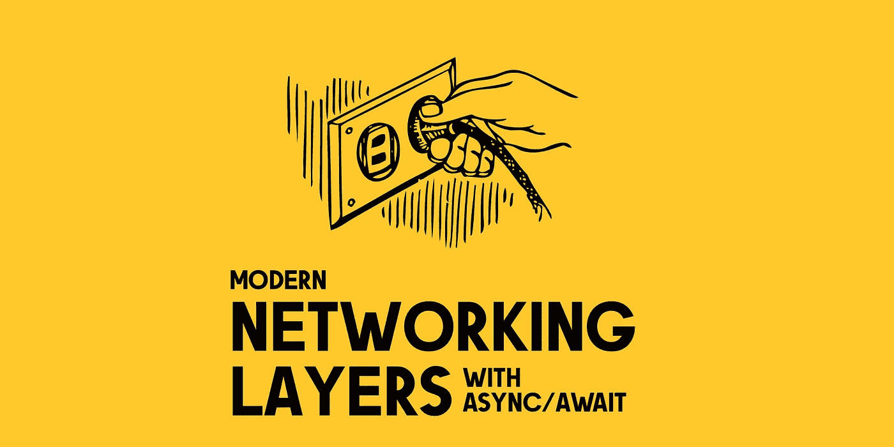

# iOS 中使用 Async/Await 的现代网络层

> 原文：<https://betterprogramming.pub/modern-networking-layers-in-ios-using-async-await-ab98a4b5802c>



## *重新审视利用 Swift 并发模型的网络主题*

我必须承认:制作网络层对我来说一直是一个令人兴奋的话题。自从 2007 年初 iOS 编程的第一天开始，每个新项目都代表了一个新的机会来完善甚至打破我迄今为止使用的整个方法。我最后一次尝试就这个话题[写点东西是在 2017 年](https://danielemargutti.medium.com/network-layers-in-swift-updated-version-539d9c636b8)，我认为这是改用 Swift 语言后的一个里程碑。

从那以后已经很久了；这种语言像系统框架一样发展，最近，随着新的 [Swift 并发模型](https://docs.swift.org/swift-book/LanguageGuide/Concurrency.html)的引入，我决定更进一步，更新我的网络层方法。这个新版本经历了彻底的重新设计，允许你用一行代码写一个[请求:](https://github.com/immobiliare/RealHTTP)

这时候你可能在想:*我为什么要做我的客户端而不是依赖 Alamofire？你说得对。新的实现不可避免地是不成熟的，并且在一定时间内会成为问题的根源。尽管如此，您有机会创建一个与您的软件的微调集成，并避免第三方依赖。此外，你可以利用苹果的新技术，比如 [URLSession](https://developer.apple.com/documentation/foundation/urlsession) 、 [Codable](https://developer.apple.com/documentation/swift/codable) 、 [Async/Await](https://developer.apple.com/videos/play/wwdc2021/10132/) 、&、 Actors 。
可以在 GitHub 上找到代码；该项目名为 [RealHTTP](https://github.com/immobiliare/RealHTTP) 。*

# 客户

让我们从定义一个表示客户端的类型开始。客户机(以前称为`[HTTPClient](https://github.com/immobiliare/RealHTTP/blob/main/Sources/RealHTTP/Client/HTTPClient/HTTPClient.swift)`)是一种结构，它带有 cookies、头、安全选项、验证器规则、超时以及一组请求之间可能共有的所有其他共享设置。当您在客户端中运行请求时，所有这些属性都自动来自客户端，除非您在单个请求中对其进行自定义。

例如，当您执行一个 auth 调用并接收一个 JWT 令牌时，您可能希望在客户端级别设置凭证，因此任何其他请求都会包含这些数据。验证器也会发生同样的情况:为了避免复制数据验证的逻辑，您可能希望创建一个新的验证器，并让客户机为它获取的每个请求执行它。客户端也是实现基本`URLSession`实现中没有的重试机制的绝佳候选。

# 请求

可以想象，一个请求(以前的`[HTTPRequest](https://github.com/immobiliare/RealHTTP/blob/main/Sources/RealHTTP/Client/HTTPRequest/HTTPRequest.swift)`)封装了一个对端点的调用。

如果你已经阅读了关于这个主题的其他文章，你可能会发现一个常见的选择是使用 [Swift 的通用](https://docs.swift.org/swift-book/LanguageGuide/Generics.html)来处理请求的输出。
类似于:`struct HTTPRequest<Response>`。

它允许您将输出对象类型与请求本身紧密地联系起来。虽然这是对这个奇妙构造的巧妙使用，但我发现它使请求变得有点限制性。从实际的角度来看，你可能需要使用[类型擦除](https://fabernovel.github.io/2020-06-03/approaches-to-type-erasure-in-swift)来处理上下文之外的对象。此外，从概念上讲，我更喜欢将请求阶段(fetch ~>get raw data ~>object decode)分开并易于识别。

出于这些原因，我选择避免泛型，从请求中返回原始响应(`HTTPResponse`);因此，该对象将包含所有允许轻松解码的函数(我们将在下面看一下)。

# 配置请求

正如我们所说的，请求必须允许我们轻松地设置调用的所有相关属性，尤其是“HTTP 方法”、“路径”、“查询变量”和“主体”。Swift 开发者最爱什么？类型安全。

我用两种方式完成了它:使用配置对象而不是文字和协议来提供可扩展的配置以及一组预制的构建器函数。

这是请求配置的一个示例:

类型安全的一个典型例子是成为枚举的 HTTP 方法；还包括使用自定义`HTTPHeader`对象管理的标题，因此您可以编写如下内容:

它支持类型安全密钥声明和自定义文本。

使用协议的最好例子是请求的主体设置。虽然它最终是一个二进制流，但我决定创建一个结构来保存数据内容，并添加一组实用方法来创建最常见的主体结构(`HTTPBody`):多部分表单、JSON 编码的对象、输入流、URL 编码的主体等。

结果是:

*   可扩展接口:您可以为自己的数据结构创建自定义主体容器，并直接设置它们。只要让它符合`HTTPSerializableBody`协议，允许在需要时对数据流进行自动序列化。
*   易于使用的 API 集:您可以直接从`HTTPBody`结构提供的静态方法中创建所有这些容器

下面是一个多部分表单的示例:

用 JSON 编码的对象生成主体也只需要一行代码:

当一个请求被传递给客户机时，相关的`URLSessionTask`被自动创建(在另一个线程中),因此标准的`URLSession`流被执行。底层逻辑仍然使用`URLSessionDelegate`(以及家族的其他委托)；你可以在`[HTTPDataLoader](https://github.com/immobiliare/RealHTTP/blob/main/Sources/RealHTTP/Client/Internal/HTTPDataLoader/HTTPDataLoader.swift)`课上找到更多。

# 执行请求

`HTTPClient`充分利用 async/await，从服务器返回原始响应。运行一个请求很简单:只需调用它的`fetch()`函数。它接受一个可选的客户端参数；如果没有设置，则使用默认的 singleton `HTTPClient`实例(这意味着 cookies、头文件和其他配置设置都与这个共享实例相关)。

因此，请求被添加到目的地客户端，并且根据配置，将被异步执行。数据流的序列化和反序列化都在另一个`[Task](https://developer.apple.com/videos/play/wwdc2021/10194/)`(为了简单起见，另一个线程)中进行。这允许我们减少在`HTTPClient`上完成的工作量。

# 回应

请求的响应类型为`[HTTPResponse](https://github.com/immobiliare/RealHTTP/blob/main/Sources/RealHTTP/Client/HTTPResponse/HTTPResponse.swift)`；这个对象封装了关于操作的所有东西，包括原始数据、状态代码、可选错误(从服务器接收或由响应验证器生成)以及对集成调试有效的度量数据。

下一步是将原始响应转换成有效的对象(有/没有 DAO)。`decode()`函数允许您传递期望的输出对象类。通常，它是一个`Codable`对象，但启用自定义对象解码也是必不可少的，因此您也可以使用任何符合`HTTPDecodableResponse`协议的对象。这个协议只是定义了一个静态函数:`static func decode(_ response: HTTPResponse) throws -> Self?`。

实现自定义的`decode()`函数，你可以做任何你想做的事情来获得预期的输出。比如我是 [SwiftyJSON](https://github.com/SwiftyJSON/SwiftyJSON) 的坚定粉丝。它最初可能看起来比“Codable”更冗长，但它也提供了更多的灵活性，更好的故障处理，以及更透明的转换过程。

由于大多数情况下，您可能只想以输出解码对象结束，`fetch()`操作还提供了可选的解码参数，因此您可以在单次传递中进行 fetch &解码，而无需传递原始响应。

这个可选的`fetch()`函数将获取和解码结合在一个函数中；当您不需要获得响应的内部细节，而只需要获得解码的对象时，您可能会发现这很有帮助。

# 验证/修改响应

使用定制客户机而不是共享客户机是为了定制与端点通信背后的逻辑。例如，我们将与两个具有不同逻辑的不同端点进行通信(哦，天哪，遗留环境……)。这意味着结果和错误被不同地处理。

例如，旧的遗留系统远远不是一个类似 REST 的系统，它把错误放在请求的主体中；新的一个使用闪亮的 HTTP 状态代码。

为了处理这些和更复杂的情况，我们引入了响应验证器的概念，它与 [Express 的验证器](https://express-validator.github.io/docs/)非常相似。基本上，验证器由一个协议和一个提供请求及其原始响应的函数定义，允许您决定下一步。

您可以拒绝响应并抛出错误、接受响应或修改响应、立即重试或在执行替代请求后重试(这是需要在对原始请求进行进一步尝试之前刷新的过期 JWT 令牌的示例)。

验证器在响应发送到应用程序级别之前按顺序执行。您可以为客户端分配多个验证器，并且所有这些验证器都可以与最终输出一致。这是标准`[HTTPResponseValidator](https://github.com/immobiliare/RealHTTP/blob/main/Sources/RealHTTP/Client/Internal/HTTPResponseValidator/HTTPValidator.swift)`的简化版本:

[https://gist . github . com/mal commac/decbd 7a 0 c 57218 DAE 2c 5b 9 af6 B4 af246](https://gist.github.com/malcommac/decbd7a0c57218dae2c5b9af6b4af246)

您可以用不同的行为来扩展/配置它。此外，`[HTTPAltResponseValidator](https://github.com/immobiliare/RealHTTP/blob/main/Sources/RealHTTP/Client/Internal/HTTPResponseValidator/HTTPAltRequestValidator.swift)`是实现重试/呼叫后逻辑的正确验证器。验证器可以返回由`[HTTPResponseValidatorResult](https://github.com/immobiliare/RealHTTP/blob/main/Sources/RealHTTP/Client/Internal/HTTPResponseValidator/HTTPValidator.swift#L38)`定义的以下操作之一:

*   `nextValidator`:只需将手柄传递给下一个验证器
*   `failChain`:停止链并返回该请求的错误
*   `retry`:用策略重试起源请求

# 重试策略

Alamofire 的优势之一是适应和重试请求的基础设施。用回调来重新实现它并不容易，但是用异步/等待来实现就容易多了。我们想实现两种重试策略:一种是简单的延迟重试，另一种是更复杂的执行原始请求后的备用调用重试。

重试策略在由名为`[HTTPDataLoader](https://github.com/immobiliare/RealHTTP/tree/main/Sources/RealHTTP/Client/Internal/HTTPDataLoader)`的自定义内部对象管理的`URLSessionDelegate`中处理。

下面是一个过于简化的逻辑版本，你可以在这里[找到](https://github.com/immobiliare/RealHTTP/blob/main/Sources/RealHTTP/Client/Internal/HTTPDataLoader/HTTPDataLoader.swift#L66)(以及注释):

*如果您正在考虑使用自动重试来解决连接问题，请考虑改用*[*waitsForConnectivity*](https://developer.apple.com/documentation/foundation/urlsessionconfiguration/2908812-waitsforconnectivity)*。如果请求确实因为网络问题而失败，通常最好向用户传达一个错误。使用*[*NWPathMonitor*](https://developer.apple.com/documentation/network/nwpathmonitor)*您仍然可以监控到您的服务器的连接并自动重试。*

# 排除故障

调试很重要；与后端团队交换网络呼叫的标准方式是 cURL。它不需要介绍。`HTTPRequest`和`HTTPResponse`都有一个[扩展](https://github.com/immobiliare/RealHTTP/blob/main/Sources/RealHTTP/Client/Internal/Other%20Structures/cURLHelper.swift)，为底层`URLRequest`生成一个卷曲命令。

理想情况下，您应该在请求/响应时调用`cURLDescription`，您将自动获得所有信息，包括父节点的`HTTPClient`设置。

# 其他功能

这篇文章会很长。我们没有讨论像 [SSL 锁定](https://github.com/immobiliare/RealHTTP/blob/main/Documentation/5.Security_Options.md#security-options)、[大文件下载/恢复](https://github.com/immobiliare/RealHTTP/blob/main/Documentation/4.Handle_LargeData_Requests.md#handle-large-data-request)、[请求模仿](https://github.com/immobiliare/RealHTTP/blob/main/Documentation/7.Stubber.md#http-stubber)和 HTTP 缓存这样的主题。所有这些特性目前都已经在 GitHub 项目中实现，所以如果你感兴趣的话，可以直接查看源代码。顺便说一下，我重用了您在上面看到的相同方法。

# 组装 API

现在，我们已经创建了一个现代化的轻量级网络基础设施。

*但是我们的 API 实现呢？*

对于较小的应用程序，直接使用`HTTPClient`而不创建 API 定义是可以接受的。但是通常在某个地方定义可用的 API 是一个好主意，这样可以减少代码中的混乱，并避免由于重复而可能出现的错误。

*就我个人而言，我不喜欢* [*的 Moya 方式*](https://github.com/Moya/Moya/blob/master/docs/Examples/Basic.md) ，*的方式，在那里你将 API 建模为一个 enum，每个属性都有一个单独的开关。我认为这通常令人困惑，因为您将配置请求的所有属性分散和混合在一个文件中。最终，它很难阅读和修改，当你添加一个新的端点时，你应该在这一大块代码中上下移动。*

我的方法是让一个对象能够配置一个有效的`HTTPRequest`准备好传递给一个`HTTPClient`。对于这个例子，我们将使用[movie db API](https://developers.themoviedb.org/3/search/search-movies)🍿(您应该注册一个免费帐户以获得有效的 API 密钥)。

现在让我们使用我们构建的网络层作为一个实际的例子。为了简单起见，我们将考虑两个 API:一个用于获取即将上映/热门/顶级电影，另一个用于搜索。

首先，我们想通过 enum 使用 namespacing 来创建一个容器，在这里我们将为一个特定的上下文放置所有的资源，在我们的例子中是`Rankings`和`Movies`。

资源描述远程服务提供的特定服务；它接受几个输入参数，并使用它们来生成一个准备执行的有效的`HTTPRequest`。`APIResourceConvertible`协议描述了这一过程:

`Search`是一个在 MovieDB 中搜索电影的资源。它可以用一个必需的参数(`query`字符串)和另外两个可选参数(释放)`year`和`includeAdults`过滤器初始化。

`request()`函数根据 MovieDB API 文档生成一个有效的请求。我们可以为每部电影重复这一步，创建一个`Lists`资源，以获得`upcoming`、`popular`和`topRated`电影的排名列表。我们将把它放入名称空间`Rankings`:

`MoviesPage`表示一个`Codable`对象，它反映了 MovieDB 每次调用的结果:使用这种方法，我们有三个好处:

*   API 调用根据它们的上下文组织在名称空间中
*   每个资源都描述了一种创建远程请求的类型安全方法
*   每个资源都包含生成有效 HTTP 请求的所有逻辑

最后一件事:我们应该被允许使用一个`HTTPClient`来执行一个`APIResourceConvertible`调用，并返回一个类型安全的对象，如前所述。这非常简单，如下图所示:

最后，我们将创建我们的`HTTPClient`:

我们可以执行我们的调用:

你可以在这里找到这个[例子的完整源代码。](https://gist.github.com/malcommac/cfb475d7bd10c07ccda5401d652b53e4)

## 结论

现在，我们有了一个基于 async/await 的易于使用的现代网络层，我们可以对其进行定制。我们完全控制了它的功能，并且完全了解它的机制。

完整的网络库是在 MIT 许可下发布的，它叫做[real http](https://github.com/immobiliare/RealHTTP)；我们在维护和发展它。如果你喜欢这篇文章，请考虑为这个项目添加一个明星或者为它的发展做出贡献。

[](https://github.com/immobiliare/RealHTTP) [## GitHub - immobiliare/RealHTTP:🌀为 Swift 构建的带有异步/等待的 Web API 客户端和存根

### RealHTTP 是一个轻量级但功能强大的基于 async/await 的客户端 HTTP 库，由 Swift 开发。这个的目标是…

github.com](https://github.com/immobiliare/RealHTTP) 

```
**Want to Connect?**Check out [my offnotes newsletter](https://www.offnotes.org) here.
```