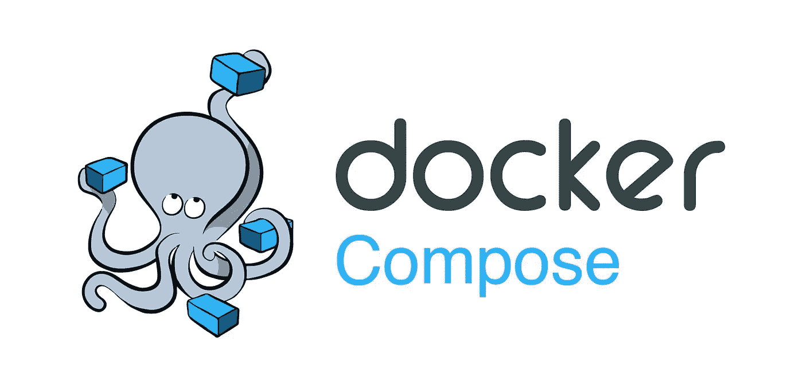

# 将您的 Go 单元和集成测试容器化

> 原文：<https://betterprogramming.pub/modern-rest-api-with-go-and-postgresql-7c916ce2816a>

## 用 Go 构建现代 REST API 第 5 部分

本文是系列文章的第五篇，也是最后一篇，涵盖了逐步实现现代 REST API 微服务的所有方面:

1.  [使用 sqlc 定义 SQL 优先数据模型](https://medium.com/@bquenin/modern-rest-api-with-go-and-postgresql-c765d571b9e7)
2.  [用 Gin 实现 REST API](https://medium.com/@bquenin/modern-rest-api-with-go-and-postgresql-39b0e966534a)
3.  [配置毒蛇](https://medium.com/@bquenin/modern-rest-api-with-go-and-postgresql-1d48767a813)
4.  [在容器中构建和运行](https://medium.com/@bquenin/modern-rest-api-with-go-and-postgresql-e0070aa1b383)
5.  **集装箱测试**

该系列的所有代码都可以在[这里](https://github.com/bquenin/modern-go-rest-api-tutorial)获得。

# 我们应该实现什么样的测试？

既然我们已经构建了 API 微服务，我们希望实施测试来确保它正常工作。我们有一个两层的服务设计:数据库层和它上面的 HTTP API。那么我们要如何测试它呢？

我们可以通过测试每一个生成的 SQL 查询来进行全面的单元测试，并通过模拟实际数据库来确保它的行为符合预期。然后，我们将通过模拟数据库层和测试每个 API 处理程序来测试 HTTP API。这是一种常见的方法，很有意义。

另一种方法是进行集成测试。集成测试的想法是只使用应用程序的公共 API 来测试应用程序。因此，在我们的案例中，我们将:

1.  启动数据库和微服务，就像上一篇文章中的生产堆栈一样，
2.  然后我们将实现一个 REST API 测试客户端，它将调用微服务 API 来测试所有提供的方法。

这也通常用于测试基于微服务的架构，并确保整个应用程序或其子系统的行为符合预期。

然而，这两种方法都存在一些挑战。一方面，进行全面的单元测试需要编写大量的测试代码，在我们的例子中，测试数据库层就是测试 Postgres SQL 驱动程序和 sqlc 生成的代码。本着同样的精神，独立测试 HTTP 层，需要模仿数据库层，这需要维护大量的代码。

另一方面，仅依赖于 API 的集成测试很好，但是我们可以实现的检查仅限于 API 公开公开的内容。我们不想实现一个用于测试目的的私有 API！

## 两全其美？

因此，在本文中，我们将取两者之长，实现介于单元测试和集成测试之间的东西:

*   为了避免嘲弄数据库，我们将启动一个容器化的数据库来支持我们的测试，
*   我们不会将客户端和服务器解耦来实现细粒度的检查，而是绕过网络层，直接在服务器上执行请求。

请注意，这是一种非常固执己见的方法。它的效率很高，一定会为你节省很多时间。

# 套件下的分组测试

为了编写我们的测试，我们将使用[stretchr/evidence](https://github.com/stretchr/testify)库将我们的测试分组到[测试套件](https://github.com/stretchr/testify#suite-package)下。使用套件允许我们在整个套件和每个测试之前执行初始化步骤:

**SetupSuite** 方法在整个 Suite 执行之前执行一次。我们设置服务器的方式与设置主函数的方式相同。这里唯一的区别是我们不启动服务器。其他一切都是相同的:我们使用相同的配置机制，以相同的方式实例化数据库连接，并注册相同的处理程序。

在套件的每个测试之前，执行 **SetupTest** 方法。在我们的例子中，我们截断了作者数据库，重新开始。

# 实施测试

测试创建

我们使用`httptest`标准测试库来测试我们的 API。这个库可以测试任何 HTTP 应用程序，尤其是 REST APIs。它能够“记录”请求和响应。

我们构建 HTTP 请求并解析 HTTP 响应，就像为真实的服务器一样。唯一的区别是我们通过直接调用路由器的`ServeHTTP`方法绕过了网络栈。除此之外，我们测试代码的方式与在生产中执行的方式相同。

调用服务器后，我们通过断言每个字段都有预期值来验证响应。

TestFullUpdate

在上面的测试中，我们想要测试更新处理程序，但是要更新一个作者，我们首先需要创建一个。因为我们没有将客户机和服务器分开，所以我们可以很容易地在数据库中创建所需的作者，如上所示。

# 在容器中运行测试

我们还将使用 Docker Compose 来运行容器化测试，就像我们在上一篇文章中所做的那样。为了实现这一目标，我们将:

1.  构建一个包含测试的映像
2.  运行这个测试容器映像作为我们测试堆栈的一部分

## 构建测试容器

第一步是构建一个测试容器。请注意**在此步骤**中不执行测试。我们只是构建一个容器，其中包含将在下一步中执行的测试代码:

我们将源代码复制到容器中，并指定容器启动时要执行的命令。这个命令就是简单的" **go test。/…** "来执行所有的测试。

## 运行测试堆栈

既然我们已经准备好了测试容器，我们必须定义我们的测试堆栈。我们将使用与生产堆栈相同的堆栈，只是我们将运行测试本身，而不是运行微服务:

Docker 编写测试堆栈

测试的构建部分告诉 Docker Compose 在启动堆栈之前构建容器。我们也正在配置我们的测试来使用容器化的数据库。

我们可以更新 Makefile 来添加一个测试目标:

Makefile 测试目标

Compose 命令具有以下参数:

*   `--build`强制构建测试容器映像
*   `--abort-on-container-exit`当容器退出时，强制堆栈停止。它允许在我们的测试容器运行完测试后停止堆栈。测试容器的退出状态被传播到撰写命令，即，如果测试失败，撰写命令也失败。这在 CI/CD 管道中运行测试时很有帮助。
*   `--force-recreate`强制重新创建容器，即使它们的配置和图像没有改变。
*   `--remove-orphans`删除合成文件中未定义的服务容器。

# 结论

这个关于使用 Go 的现代 REST API 的系列到此结束。祝贺你走到了这一步！我希望你和我一样喜欢它，并发现它很有帮助！玩得开心！