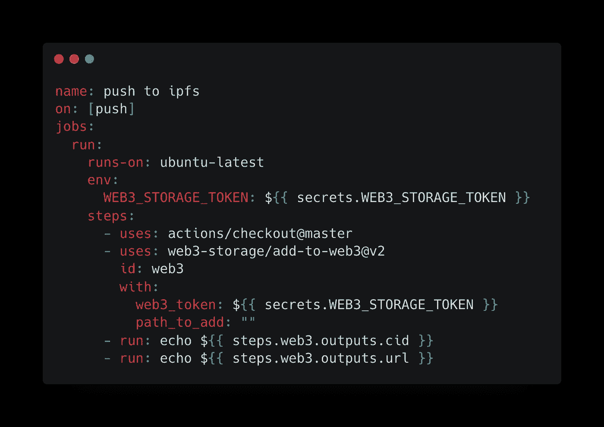
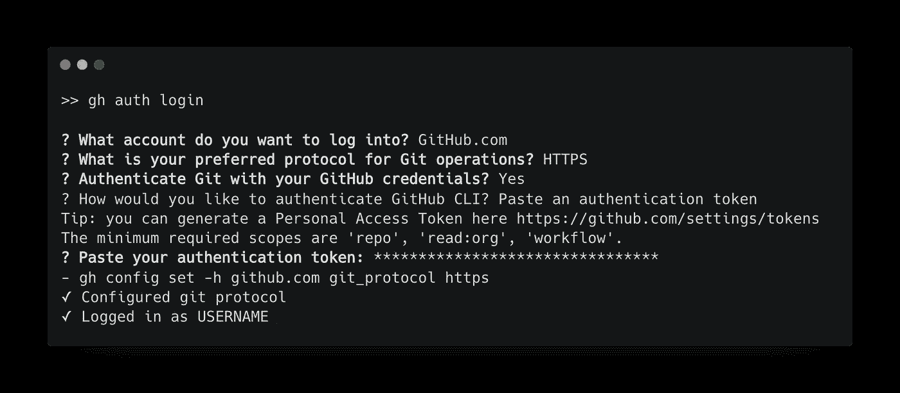
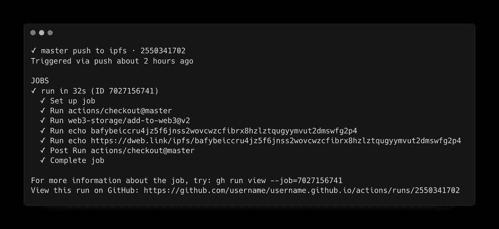
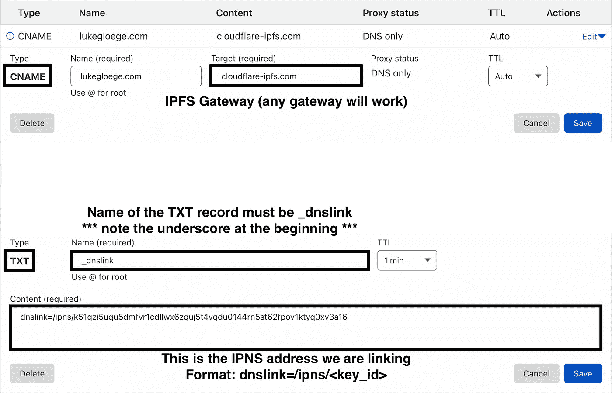
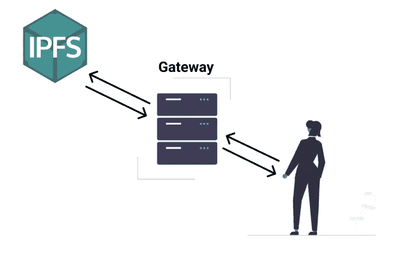

# IPFS 网站的现代托管方式

> 原文：<https://betterprogramming.pub/modern-way-to-host-a-site-on-ipfs-7941b65d27c3>

## 使用 web3.storage、GitHub Actions 和 IPNS


卡特琳娜·林皮索妮的“简介”(来源[https://undraw.co/illustrations](https://undraw.co/illustrations))

这篇文章是我的“IPFS 网站托管指南”的更新版本

[](/a-guide-to-hosting-websites-on-ipfs-d2efad40ed3) [## IPFS 网站托管指南

### 如何在行星间文件系统上托管站点

better 编程. pub](/a-guide-to-hosting-websites-on-ipfs-d2efad40ed3) 

自从那篇文章发表以来，我已经简化了我的方法，将更新我的网站的过程浓缩为三个命令:

1.  `git push`
2.  `gh run view -v`
3.  `w3 name publish <KEY_ID> <CID>`

这种设置的神奇之处在于:

1.  使用 GitHub 动作通过 [web3.storage](https://web3.storage/) 将站点推送到 [IPFS](https://ipfs.io)
2.  使用 [IPNS](https://docs.ipfs.io/concepts/ipns/) 避免手动更改 [DNS 链接](https://docs.ipfs.io/concepts/dnslink/#publish-content-path)。

建立这个工作流有很多步骤，但是能够只用几个终端命令来更新您的分散站点是值得的。

# 设置 web3.storage

为了使向 IPFS 推送内容更容易，我们将使用 [web3.storage](https://web3.storage/) ，它是由 IPFS 和 [Filecoin](https://filecoin.io) 背后的同一个团队创建的。

Web3.storage 允许你上传无限量的数据到 IPFS，它会帮你把数据固定到多台服务器上，这太棒了！

转到 [https://web3.storage](https://web3.storage/) 创建一个帐户:


作者截图(来源:【https://web3.storage/pricing/】T21)

# 创建 web3.storage API 令牌

为了从命令行和 GitHub 动作将内容推送到 web3.storage，我们需要一个 [API 令牌](https://web3.storage/docs/#get-an-api-token)。

1.  登录您的 [web3.storage 帐户](https://web3.storage/account/)
2.  点击顶部的帐户，然后创建 API 令牌
3.  输入令牌的描述性名称，然后单击创建
4.  您可以单击复制将新的 API 令牌复制到剪贴板。

*不要与任何人共享您的 API 密钥，它是您的帐户专用的。您还应该在某个地方记下令牌字段，并安全地存储它。*

# 安装 w3 命令行界面

`[w3](https://github.com/web3-storage/web3.storage/tree/main/packages/w3#readme)` [命令行界面](https://github.com/web3-storage/web3.storage/tree/main/packages/w3#readme) (CLI)允许我们从终端与 web3.storage 交互。这是一个基于节点的 CLI，所以您首先必须在您的机器上安装`node`

如果你使用的是 Mac，你可以通过[自制软件](https://brew.sh/)轻松安装`node`

```
brew install node
```

这将包括节点包管理器(npm)，我们将使用它来安装`[w3](https://github.com/web3-storage/web3.storage/tree/main/packages/w3#readme)` CLI。

```
npm install -g @web3-storage/w3
```

现在，让我们使用以下命令进行测试，以确保 w3 已安装:

```
w3 --help
```

这将显示所有可用的命令。


作者图片(使用[https://carbon.now.sh/](https://carbon.now.sh/)创建)

现在我们知道 CLI 已经安装，运行`token`命令将 CLI 连接到 web3.storage

```
w3 token
```

然后会提示您粘贴 API 令牌。

这是在上一节中创建的 web3.storage API 令牌。

`⁂ API token saved`表示 CLI 已成功链接

# 将文件放在 web3.storage 上

如果你回头看看`w3`中可用的命令，你会看到一个叫做`put`的命令。

你可能已经猜到了，这就是我们在 IPFS 上“放置”内容的方式。

```
w3 put <path>
```

举个简单的例子，创建一个包含如下消息的文本文件:

```
echo "Hello web3.storage" > hello.txt
```

现在让我们使用`put`命令将文件推送到 IPFS:

```
w3 put hello.txt --name hello
```

> `--name hello`告诉命令在 web3.storage 中命名文件`hello`。

输出[内容标识符](https://web3.storage/docs/concepts/content-addressing/) (CID)以及公共网关链接。

```
[https://dweb.link/ipfs/bafybeifzoby6p5khannw2wmdn3sbi3626zxatkzjhvqvp26bg7uo6gxxc4](https://dweb.link/ipfs/bafybeifzoby6p5khannw2wmdn3sbi3626zxatkzjhvqvp26bg7uo6gxxc4)
```

如果您完全按照上述步骤操作，那么您的 CID 应该与我的一致。请记住，CID 是唯一标识内容的散列。


作者图片(使用 https://carbon.now.sh/的[创建)](https://carbon.now.sh/)

我们可以用完全相同的方式上传文件夹。只需向`put`命令提供您想要上传的目录的路径。

在这篇文章的后面，我们将使用一个 GitHub 动作来自动化这个 put 步骤。

# 创建 IPNS 地址

cid 是不可变的，不能更改。星际名称系统(IPNS)用可变名称解决了这个问题，可变名称是一个公钥的[散列](http://docs.ipfs.io.ipns.localhost:48084/concepts/hashing/)。您可以将 IPNS 地址视为指向 CID 的指针。

您可以使用以下命令使用`w3`创建一个 IPNS 地址:

```
w3 name create
```

你的地址会显示出来，但是你可以用`w3 name list`来显示名字。然而，我还是会把地址写下来，存放在某个地方。

要将 CID 链接到 IPNS 地址，我们使用`publish`命令，如下所示:

```
w3 name publish <key_id> <cid>
```

> `<key_id>`是你的 IPNS 地址(T5 显示的内容)，而`<cid>`是我们链接到的地址

现在，不要担心将任何 CID 链接到您的 IPNS 地址。我们以后再做。

# 设置 GitHub Repo / GitHub 操作

创建一个 GitHub repo 来存储您的网站代码。如果这是一个人的网页，我建议命名为 repo `<account_name>.github.io`，这样你也可以使用 [GitHub Pages](https://pages.github.com/) 。

根据您的回购设置，让我们添加一个[操作](https://github.com/web3-storage/add-to-web3)，每次我们使用`git push`时，它都会将回购推送到 web3.storage

将下面的代码片段放在 repo 的`.github/workflows/web3_storage.yaml`中:



由“git push”触发的 GitHub 动作将整个库发送到 IPFS，代码在这里可用[](https://github.com/lgloege/lgloege.github.io/blob/master/.github/workflows/web3_storage.yaml)**(使用[https://carbon.now.sh/](https://carbon.now.sh/)创建)**

**行`${{ secrets.WEB3_STORAGE_TOKEN }}`读取您的 API 令牌，这就是动作如何知道推送到您的帐户。**

**通过以下步骤将 API 令牌存储在 GitHub 中:**

1.  **登录您的 [GitHub 账户](https://github.com/login)**
2.  **转到设置**
3.  **然后是秘密**
4.  **单击操作，然后单击新建存储库密码**
5.  **您的令牌必须命名为`WEB3_STORAGE_TOKEN`**
6.  **将我们之前创建的 web3.storage API 令牌复制到该字段中**

**现在，每次你运行`git push`操作都会被触发，你的回购将被上传到 IPFS。如果你尝试这样做，你应该有一个绿色的✅，表示没有错误。**

**单击复选标记查看操作的详细信息。这将显示 CID 和网关 URL(这就是操作中最后两行所做的)。**

# **使用 GitHub CLI**

**您可以使用 GitHub CLI 在终端中查看 CID。这需要安装另一个命令行工具，并将其链接到您的 GitHub 帐户。**

**GitHub CLI 不是设置的一部分，但它可以让您在终端中查看操作的输出。**

**在 Mac 上，我们可以用 homebrew 安装`gh` CLI，如下所示:**

```
brew install gh
```

***参见* [*文档*](https://cli.github.com/manual/installation) *了解如何在不同的操作系统上安装。***

**转到[https://github.com/settings/tokens](https://github.com/settings/tokens)创建访问令牌。您可以在[文档](https://docs.github.com/en/authentication/keeping-your-account-and-data-secure/creating-a-personal-access-token)中找到详细步骤。注意，这个令牌不同于我们之前创建的 web3.storage 令牌。这是为了让 GitHub CLI 可以与您的 GitHub 帐户通信。**

**拥有访问令牌后，运行以下命令:**

```
gh auth login
```

**您将被提示输入您的 GitHub 认证令牌**

****

**作者图片(使用[https://carbon.now.sh/](https://carbon.now.sh/)创建)**

**我们可以使用`gh`命令来查看关于我们运行的操作的信息:**

```
gh run view -v
```

***您必须从具有 git 远程设置的目录中运行该命令，否则您将收到错误:“无法确定基本存储库:未找到 git 远程”***

**这里的`-v`标志启用详细输出。否则，你会看到一条信息，说“要了解更多关于工作的信息，请尝试:gh run view …”**

**选择您想要查看的工作流，输出将在分页工具中打开。**

****

**作者图片(使用 https://carbon.now.sh/的[创建)](https://carbon.now.sh/)**

**这显示了 GitHub 操作的输出，特别是 CID。**

***如果您喜欢从网页上复制 CID，您可以使用* `*gh repo view username/repo --web*` *打开回购。***

**现在我们知道了我们的 CID，让我们链接到我们之前创建的 IPNS 地址。**

# **把刑事调查局和 IPNS 联系起来**

**要将 CID 链接到 IPNS 地址，请使用以下命令:**

```
w3 name publish <key_id> <cid>
```

> **注意，`<key_id>`是 IPNS 地址，`<cid>`是最后一段的 CID**

**这样做的好处是 IPNS 地址是可变的。这意味着在我们更新网站后，我们可以让地址指向更新后的 CID。**

**最后，让我们用我们的 IPNS 地址建立一个 DNSLink。**

# **设置 DNS 链接**

**您必须通过 DNS 提供商购买一个自定义域。我使用了 [Cloudflare](https://www.cloudflare.com/) ，但是任何提供者都应该工作。**

**这里的想法是让我们的自定义域从网关 URL 检索内容，但我们必须告诉它要检索的 IPNS 地址。**

## ****使用 Cloudflare 的 DNS 链接指令****

1.  **登录 Cloudflare**
2.  **单击您的活动网站，然后单击左侧栏中的 DNS。**
3.  **在 DNS 管理部分，增加一条`TXT`和`CNAME`记录。**
4.  **将`TXT`记录名称设置为`_dnslink.yourwebsite.com`(注意:确保用您自己的域名替换 yourwebsite.com)**
5.  **将`TXT`记录内容设置为`dnslink=/ipns/<key_id>`(注意:`<key_id>`是您的 IPNS 地址**
6.  **将`CNAME`记录设置到任何 IPFS 网关(例如`gateway.ipfs.io`)**

**例如，下面是我的`TXT`和`CNAME`记录的截图:**

****

**作者图片**

***使用可变 IPNS 地址，DNS 链接只需完成一次。***

# **这里发生了什么**

**我们刚刚做的是将我们的域名(托管在一个中央服务器上)链接到一个网关服务器。该网关服务器(也是集中式服务器)从 IPFS 网络(是分散式的)获取我们所请求的内容。**

**这样，你的网站就伪托管在 IPFS 上了。网关服务器是集中式的，如果该服务器关闭，您的网站将处于非活动状态。**

**但是，您网站的内容仍然在 IPFS 网络上。这种网关服务器方法是我们可以让我们的分散式网站与不了解 IPFS 的浏览器通信的方法之一。网关是解决这个问题的权宜之计。**

****

**IPFS 网关工作原理示意图。请求通过中央网关服务器路由，然后 IPFS 上的内容被检索并发送给用户。(图片来源:作者修改过的 [UnDraw](https://undraw.co/) 图片)**

# **最后的想法**

**我想我已经尽可能地提炼出了这个过程。这种方法消除了在 DNS 链路中更新 cid 的需要，并且只需三个命令就可以从命令行完成所有工作**

## ****更新网站的三个命令****

1.  **`git push`:更新回购，将网站推送到 IPFS**
2.  **`gh run view -h`:这是查看我们的 CID**
3.  **`w3 name publish <key_id> <cid>`:这更新了 IPNS 链接**

**该方法需要一些时间来建立，但我认为这是值得的努力。**

**如果有人有办法改善这个工作流程，我愿意接受建议。**

# **首字母缩略词**

*   **星际文件系统(IPFS)**
*   **星际命名系统(IPNS)**
*   **内容标识符(CID)**
*   **域名系统(DNS)**
*   **命令行界面(CLI)**