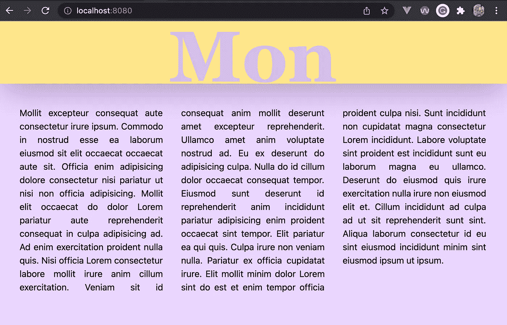
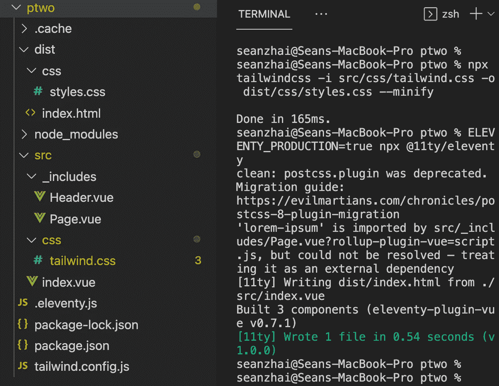

# 现代网络开发:如何保持流畅状态

> 原文：<https://betterprogramming.pub/modern-web-development-how-to-stay-in-flow-state-7ca82e6e4524>

## 寻找工具和工作流以获得更好的开发体验


征途(Thatgamecompany 开发的游戏)|图片来源:hyperxgaming.com

Jenova Chen 表示，gamecompany 的热门游戏《T0 之旅》的游戏性是基于让玩家处于心流状态的想法而设计的。他在南加州大学的[艺术硕士论文](http://jenovachen.com/flowingames/Flow_in_games_final.pdf)中解释了为什么心流在游戏中很重要。写于 2006 年，今天读起来并不过时。我发现它的原则很有启发性，可以应用到 web 开发中，在 web 开发中，流畅的状态意味着卓越的开发者体验和超高的生产力。

对于 web 开发人员来说，工具和工作流的选择尤为关键。一个不太合适的框架会导致开发人员的质量差和沮丧，阻止他们进入心流状态。

根据陈的研究，一种心流状态需要以下几点:

*   一种控制感。它的反对，失去控制，会导致灾难。
*   显著的进步。对改进给予积极的反馈，并提供清晰的解释，以便及时调整，避免失败。
*   避免被打断。除非有充分的理由，否则不要切换任务/工具。

让我们看看这些是如何应用于现代 web 开发的。

# 是什么让网络变得现代

现代不一定是新的。例如，现代艺术开始于 19 世纪，结束于 20 世纪 70 年代；纽约的古根海姆是一座标志性的现代建筑，但它建于 1959 年；说到网络，modern 主要和 Jamstack 联系在一起，这是现在正在发生的事情。

2016 年，Mathias Biillman 推出了“JAMstack”，指的是 JavaScript、API 和标记。它概念化了一个强调简单和效率的革命性网络架构。为了便于输入，这个名字演变成了 Jamstack。

# 行业工具:Jamstack

我用来实现 Jamstack 的工具如下:

*   用于 JavaScript 框架的 **Vue**
*   **CSS(层叠样式表)框架的顺风**
*   **十一(11ty)** 适用于 SSG(静态现场发电机)

当我们一起做一个案例研究时，我将演示如何集成这些工具以获得流畅的开发者体验。

假设 JavaScript 和 CSS 不需要解释可能是安全的。先说站点生成器。

## 静态站点生成器

1993 年，Tim Berbers-Lee 编写了 HTML 的第一个版本。在早期，所有的网页内容都是静态的。发明服务器端脚本语言(如 Perl、PHP 和 Python)是为了满足我们对动态内容的需求。动态脚本的缺点是等待服务器响应的潜在延迟。草率的表演成了互联网的常态，人们甚至把等待的时间当成了娱乐。

[](https://medium.muz.li/top-30-most-captivating-preloaders-for-your-website-95ed1beff99d) [## 你的网站前 30 名最迷人的预加载程序

### 现代高速互联网真的把我们惯坏了。如今，如果一个网站的加载时间超过 4 秒，我们…

medium.muz.li](https://medium.muz.li/top-30-most-captivating-preloaders-for-your-website-95ed1beff99d) 

我们都有比看纺车更好的事情要做。(完全没必要打开上面的链接，但讽刺并不总是很明显。)静态站点生成器(SSG)的想法是提前准备好 HTML，所以没有来自 web 服务器的延迟。SSG 使用预定义的模板自动创建数据驱动的内容。

## 十一(十一)

取决于服务器站点技术，需要许多不同的 SSG，因为每种语言都需要一个翻译器——Gatsby 用于 JavaScript 的 React，Nuxt 用于 Vue，Hugo 用于 go 用户。

在流行的 SSG 中，一个新人 Eleventy 因其框架无关的解决方案而脱颖而出。扎克·莱泽曼创立了简单哲学。它被设计成一个支持多种模板语言的零配置平台。开发者社区称赞它简单易学、功能强大且极其灵活。

扎克·莱泽曼的现场编码会议

我附上了扎克现场编码会议的视频。它有点长，不是专门在十一月，所以你有空的时候看。扎克用他独特的幽默感传递了非常有用的信息。

# Web 开发的流程状态

当你为网络编程时，你是否发现更难进入状态？web 开发是否感觉比另一种编程语言(C#或 Python)更混乱？

我觉得可能和切换任务有关。典型的 web 开发工作流涉及 HTML、JavaScript 或 CSS 之间频繁的上下文切换。我们的大脑做内容切换很慢；相比之下，使用 C#或 Python 等编程语言的开发人员可以保持在相同的环境中，并加快速度。

巴赫:马友友的无伴奏大提琴组曲

让我们看看 Vue、Tailwind 和 Eleventy(11ty)的集成如何创建一个高效的环境。请注意以下几点:

*   Eleventy 带有一个可以自动重新加载的开发服务器，因此任何代码更改都会立即产生结果。
*   Vue 是一个强大的 JavaScript 框架，也是这个设置中 11ty 的模板语言。
*   Tailwind 是一个实用优先的 CSS 框架，支持在 Vue 的模板中直接进行样式设计。

# 个案研究

## 集成概述

由于我们的最终目标是生成 HTML，我们的开发环境由 11ty 控制。Vue 负责内容构成，Tailwind 对 Vue 组件进行风格化。逻辑上，我们应该先把 Vue 纳入 11ty。

幸运的是，vue 有一个十一插件，十一插件 Vue。事实上，Vue 的创建者 Zach Leatherman 编写了这个插件，这给了我们足够的信心来使用它。设置这个插件的步骤包括所有需要的东西，从在 npm 中初始化你的项目，安装 11ty，到配置插件。太好了。

下一步是添加 Tailwind CSS。Tailwind 的功能不像许多其他 CSS 框架。这需要一些特别的注意，我们可以在谈到那部分的时候再谈细节。

让我们开始吧。

# 项目设置

## 安装:Eleventy + Vue 插件

创建一个目录作为您的项目根目录(在我的例子中是`ptwo`),在这个目录下初始化 npm 包。然后，安装 11ty 和 vue-plugin。

```
mkdir ptwo
cd ptwo
npm init -y
npm install @11ty/eleventy @11ty/eleventy-plugin-vue --save
```

项目根目录下的`.eleventy.js`是第十一项配置。创建这个文件来通知 Eleventy 加载 Vue 插件并配置源代码的目录。

## 顺风和 Hello World

创建`src`目录，并在目录中创建一个`index.vue`。文件`index.vue`主要包含 HTML 样板代码。唯一值得一提的是添加顺风 CDN 的那一行。如前所述，Tailwind 3.0 使用实时编译器，不能作为常规 CSS 文件交付。这就是为什么它在`<script>`里面而不是通常的`<link rel=”stylesheet”>`。

现在，我们准备运行 11 号。

```
npx @11ty/eleventy --serve
```

这个命令将 HTML 构建到`dist`目录中，并启动一个 web 服务器。在`localhost:8080`上打开你的浏览器，瞧，这就是我们的 Hello World。

# 一个小项目:独白


项目文件结构|图片来源:Sean Zhai

让我们做一个更像真实网站的项目，所以我们将有两个部分:一个标题和一个页面，每个都作为 Vue 组件实现。目录结构显示为快照。我们使用一个 JavaScript 模块 *lorem-ipsum* 来生成随机文本，这就是我们独白的内容。

我们需要安装模块。

```
npm install lorem-ipsum --save
```

Header.vue 显示星期几。顺风是描述性的，感觉很自然。

Page.vue 创建自适应多栏布局。所有顺风代码都在第二行。用少量代码就取得了相当大的成就。

Index.vue 需要调用这两个组件，组成页面。其余部分与 Hello World 示例中的代码相同。

这个网站看起来像这样。



每日独白(一个展示 11ty、Vue 和顺风的小项目)| Sean Zhai

# 为生产而制造

信不信由你，到目前为止，我们还没有安装顺风。我们所做的只是充分利用了 Tailwind CDN 的 JIT 版本。当设计完成后，它只使用了 Tailwind 通过树摇动过程提供的所有样式表的一部分，优化的 CSS 非常小。

## 安装和配置顺风

```
npm install -D tailwindcss
npx tailwindcss init
```

第二个命令生成了`tailwind.config.js`文件。我们需要通过填充`content`来告诉 Tailwind 要处理哪些文件。

```
module.exports = {
  **content: ["./src/**/*"]**,
  theme: {
    extend: {},
  },
  plugins: [],
}
```

我们还需要提供一个标准的`tailwind.css`文件。让我们在`src`下创建一个目录`css`来保持有序。

## 构建并发布

要构建 Tailwind，运行下面的代码来读取我们刚刚制作的`tailwind.css`，并将优化后的结果写成`./dist/css`下的`styles.css`。

```
npx tailwindcss -i src/css/tailwind.css -o dist/css/styles.css --minify
```

接下来，编辑 index.vue，将调用 Tailwind CDN 的行替换为加载 styles.css 的链接。

```
<!-- ... index.vue ... --><head>
  <meta charset="utf-8">
  <title>Project ptwo</title>
  <!--<script src="https://cdn.tailwindcss.com"></script>-->
  **<link rel="stylesheet" href="/css/styles.css">**
</head>
```

生产用 11ty。

```
ELEVENTY_PRODUCTION=true npx @11ty/eleventy
```

让我们在`package.json`文件中配置 npm 脚本，因为我们将来会需要这些命令。

准备就绪后，您可以运行:

```
npm run build:tailwind
npm run build:eleventy
```

瞧，`dist`下的结果是生产就绪。



独白项目中使用的所有文件| Sean Zhai

*Tailwind CDN 从 3.0 开始优化很大，对于轻流量站点可能还行(甚至官方不推荐。)顺风生产构建非常小，所以如果性能很重要，你应该总是这样做。*

# 开源代码库

这个项目在 Github 上。请随意查看。

[](https://github.com/hszhai/vue-tailwind-11ty-monologue.git) [## GitHub-hs Zhai/vue-tail wind-11ty-独白

github.com](https://github.com/hszhai/vue-tailwind-11ty-monologue.git) 

# 一些有用的参考资料

[](https://henry.codes/writing/how-to-use-vue-to-template-your-eleventy-projects/) [## 如何使用 Vue 模板化你的 11 个项目

### 如果你喜欢使用 Eleventy，但是想在你的模板中利用 Vue 语法，这里有一个关于如何做的指南。

亨利.代码](https://henry.codes/writing/how-to-use-vue-to-template-your-eleventy-projects/) [](https://adamwathan.me/css-utility-classes-and-separation-of-concerns/) [## CSS 实用程序类和“关注点分离”在过去的几年里，我编写 CSS 的方式已经从“语义”方法转变为更像…

### 在过去的几年里，我写 CSS 的方式已经从“语义”方法转变为更像…

adamwathan.me](https://adamwathan.me/css-utility-classes-and-separation-of-concerns/) 

# 结论

> “我写作是为了理解应该理解的东西。”—埃利·威塞尔

*免责声明:我们不断需要为网站构建新的东西，我们有自己的偏好和网站开发的方法。我想通过这篇文章分享我在工具和工作流方面的发现。我决不试图全面地调查网络技术。*

*我只讨论最优秀的极少数工具。我不自称没有偏见，我的选择偏向于开发者的体验，而不是其他的技术措施。作为一个开发者，做一个网站应该是一个愉快的旅程，最起码不要苦不堪言。*