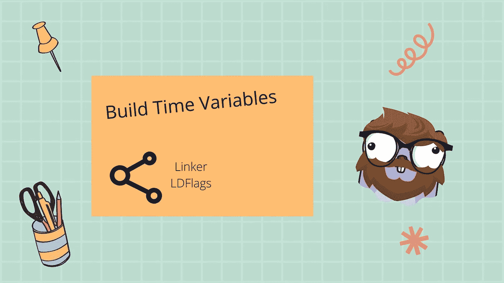

# 在构建期间修改 Go 二进制文件中的变量

> 原文：<https://betterprogramming.pub/modify-variables-in-go-binary-during-build-51b61cee86a8>

## 您可以在构建期间使用 build 命令设置变量值，例如版本号、客户机 id。



图片由珀西·博尔梅尔提供。Gopher 由拓也·上田提供，原始 Go Gopher 由勒内·弗伦奇提供(CC BY 3.0)

您是否曾经使用过硬编码的版本号，或者尝试过将配置传递给表示软件版本的二进制文件？

我试过了，而且很有效，但是很容易出错。很容易忘记更改配置等，或者跨多个合并请求维护版本。

我终于找到了一个很好的解决方案，我们可以在编译期间通过添加编译标志来修改二进制文件中的变量。这允许我们设置 CI/CD 来传递 git commit 作为版本等等，或者让不同的版本基于部署指定 runner ID。

使用这种方法可以更容易地维护和控制特定的值，因为我们可以很容易地将它们放在 CI/CD 中。我们可以通过利用链接器标志来做到这一点。

如果你更愿意看视频教程，可以看下面。

本教程的视频

## 链接器& Ldflags

`go build`工具允许我们将选项传递给[链接器](https://en.wikipedia.org/wiki/Linker_(computing))，它是负责组装二进制文件的组件。

我们可以通过使用构建工具的`--ldflags`标志将选项传递给链接器。有很多选项可以传递，但是在本文中，我们将只关注其中的一个。`--ldflags`接受一串配置，因此输入将被`""`括起来。

您可以通过运行带有`--help`选项的构建来查看所有选项。

```
go build --ldflags="--help"
```

生成工具中可用的所有链接器选项

我们感兴趣使用的选项是`-X`选项。这是帮助打印中的定义。

```
-X definition        add string value definition of the form importpath.name=value
```

正如您所看到的，我们可以使用`-X`标志，通过使用导入路径(您用来导入包的路径)和使用`.variableName`使用它的名称，然后使用我们想要的值，来定位我们想要修改的变量。

让我们用一个简单的示例项目来尝试一下。

## -X，设置变量值

首先创建一个新项目，我使用模块名`programmingpercy.tech/buildflags`。这一点很重要，因为它稍后将被用作导入路径。

```
mkdir buildflags
go mod init programmingpercy.tech/buildflags
touch main.go 
```

我们将用一个简单的函数填充`main.go`,打印版本和客户名称。

main.go —打印变量值的简单程序。

您可以尝试通过构建和运行程序来查看输出。

```
go build -o main && ./main
// Outputs
2022/03/08 19:23:28 Starting runner client-1.0.0 version 0.0.1
```

让我们尝试重新构建二进制文件，但这次我们将使用`--ldflags`并应用`-X`命令将 runner 设置为`client-2.0.0`。我们工作的包是`main`，所以这将是导入路径。

```
go build -o main --ldflags="-X 'main.runner=client-2.0.0'"
```

尝试再次运行程序，并查看输出，更改跑步者名称。

```
./main
// Outputs
2022/03/08 19:27:21 Starting runner client-2.0.0 version 0.0.1
```

你可以修改多个标志，你需要做的就是在命令中添加一个新的`-X`标志。

```
go build -o main --ldflags="-X 'main.runner=client-2.0.0' -X 'main.version=0.0.2'"
```

你应该试着运行二进制，不出意外，版本也变了。

更好的是，如果你愿意的话，你也可以将目标指向子包。为此，创建一个名为`version`的子文件夹，并添加一个名为`version.go`的文件，该文件包含变量`Version`而不是`main.go`。

version/version.go —我们将要修改的子包

确保我们更新`main.go`以使用令人惊叹的新版本包。

> 实际上，我并不推荐你有一个版本包，但是你应该明白

main.go —现在使用构建包的主包。

现在我们可以尝试重建二进制文件，并确保使用`-X`标志更新版本号。这一次，您可以传递完整的导入路径，即模块名称。

```
go build -o main --ldflags="-X 'programmingpercy.tech/buildflags/version.Version=0.0.2' -X 'main.runner=client-1.0.1'"
```

运行该二进制文件时，您应该会看到值发生了变化。

## 将 Git 提交标记添加为版本

一件很酷的事情是，现在我们可以在构建期间修改值，您可以通过使用 git commit 等来自动化版本处理。

在项目的文件夹中，我们将初始化一个 git 存储库并提交当前文件，这样我们就可以获得一个提交散列。

```
git init
git add .
git commit -m "test"
```

要打印一个简短的提交散列，可以使用下面的 git 命令。

```
git rev-parse --short HEAD
```

我们可以简单地将其注入到`-X`标志中，并设置该输出的值。

```
go build -o main --ldflags="-X 'programmingpercy.tech/buildflags/version.Version=$(git rev-parse --short HEAD)' -X 'main.runner=client-1.0.1'"
```

现在，用这个二进制文件运行程序会打印出以下结果

```
2022/03/08 20:54:35 Starting runner client-1.0.1 version f525917
```

## 结论

我们用的例子很简单，但是你可以用它做很多事情。我已经看到了被注入的版本、特性标志等等。对于客户机之间应该不同的特性标志，一个简单的解决方案是为启用的函数传递一个真值。这可能是最容易使用的特征标志解决方案，不需要框架来管理它。

根据我的看法，拥有这些标志的最佳位置是在 CI/CD 中，以控制不同的发布、版本和客户机 id。

我希望你觉得这很有趣，我发现当我学习这个的时候它非常有用。

你已经在使用 ldflags 了吗，如果是，是为了什么？以及你能想到的用例有哪些？我很想听听你对这些旗帜的看法。