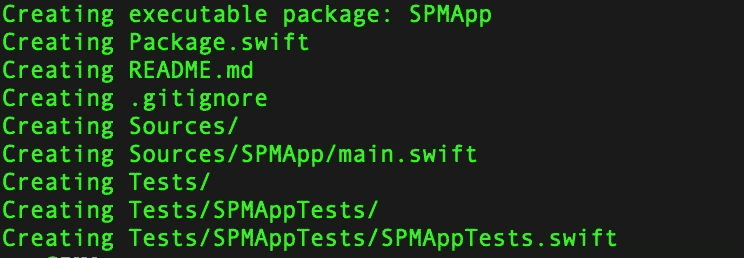
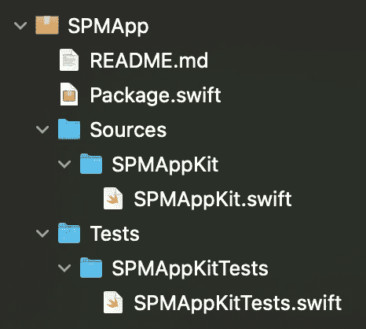
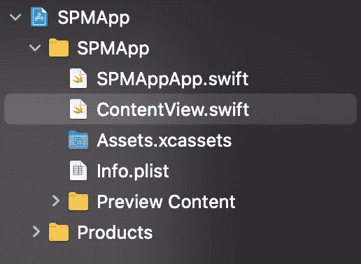
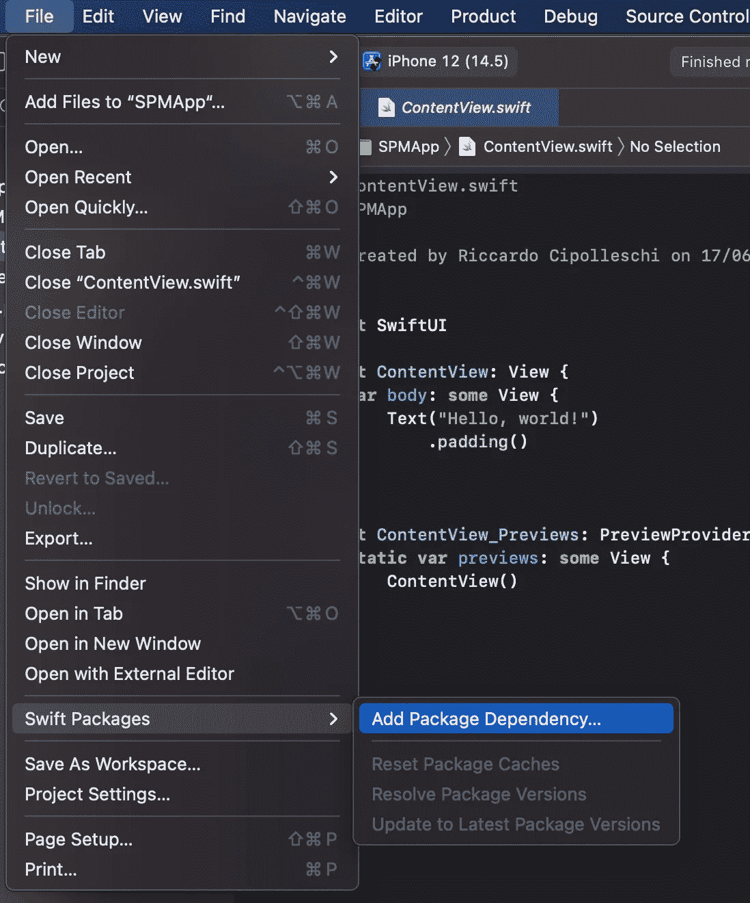
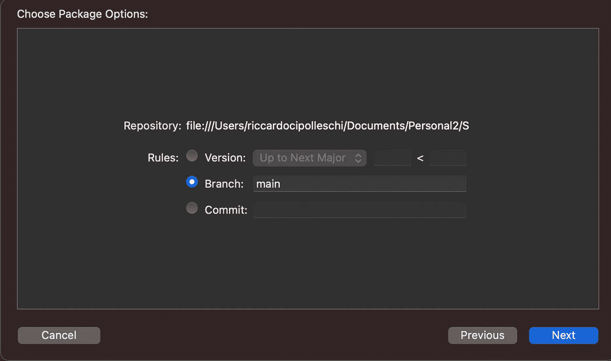
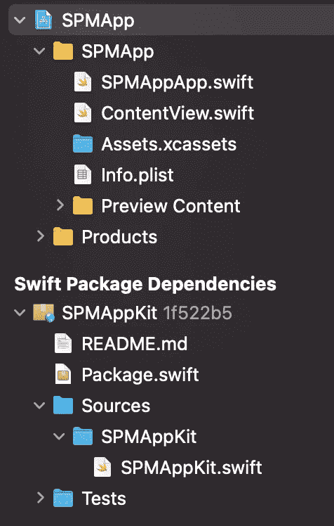
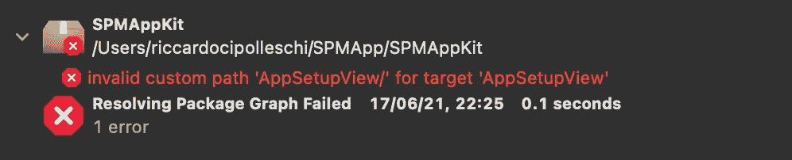
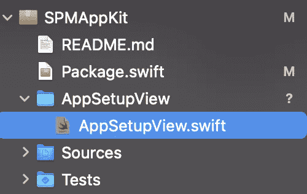
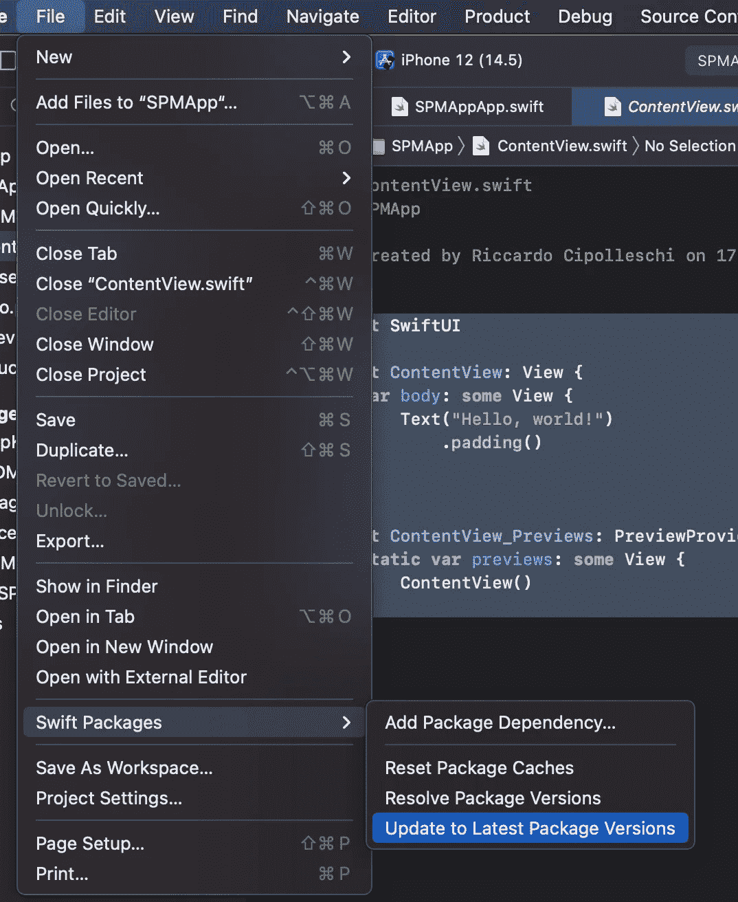
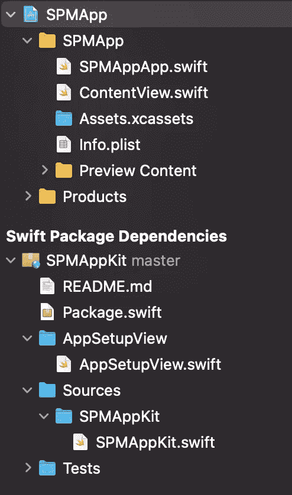

# 使用 SPM 模块化 iOS 应用程序

> 原文：<https://betterprogramming.pub/modularize-an-ios-app-with-spm-c3f51f03bb0b>

## 如何使用 Swift Package Manager 为您的应用程序定义模块


照片由 [Raagesh C](https://unsplash.com/@raagesh?utm_source=medium&utm_medium=referral) 在 [Unsplash](https://unsplash.com?utm_source=medium&utm_medium=referral) 上拍摄

回到 2018 年，WWDC 期间，苹果公布了 [Swift 包管理器](https://developer.apple.com/videos/play/wwdc2018/411/) (SPM 或 SwiftPM)。SPM 的目标是允许开发人员定义可以跨不同应用程序和平台重用的模块。举例来说，一个软件包可以被定义为既适用于 iOS 又适用于 macOS，因此它的特性可以在这些平台上的工具和应用程序之间共享。

一开始，包管理器非常有限:例如，它不支持特定于模块的资源。在接下来的几年里，SPM 有了很大的改进。它现在允许开发者定义[可执行文件](https://github.com/apple/swift-package-manager/blob/main/Documentation/Usage.md#creating-an-executable-package)而不是包和库。它支持[资源](https://github.com/apple/swift-package-manager/blob/main/Documentation/Resources.md)以便我们可以，例如，直接在 UI 模块中添加图像并重用它们。最近，它还替换了 Xcodeproj 文件:Xcode 现在能够从`Package.swift`定义开始动态创建项目了！

它仍然有一些限制:例如，它不能自动处理 iOS 应用程序。然而，有一种方法可以让它工作，今天我想和你一起探索如何用 SPM 创建一个模块化的 iOS 应用程序。

# 开始

使用 SPM 创建模块化应用程序的第一步是为项目创建一个文件夹。打开终端并运行以下命令:

```
mkdir SPMApp
cd SPMApp
mkdir SPMAppKit
cd SPMAppKit
swift package init --name SPMAppKit
```

这些命令创建了一个名为`SPMApp`的文件夹和另一个名为 `SPMAppKit`的文件夹，并将我们移入其中。我们需要这个嵌套来保持项目的整洁。在本文的后面，我们将为 iOS 应用程序创建一个文件夹，因为 SPM 不允许直接创建 iOS 应用程序。整个应用程序代码将留在`SPMAppKit`包中；`SPMApp`将作为包裹的容器。最后，通过最后一个命令，它创建了一个名为`SPMAppKit`的包。

输出应该如下所示:



SPM 正在创建`Package.swift`文件，这是我们的项目定义文件。然后它创建一个标准的`README.md`,只包含一个标题、一个默认描述和一个预定义的`.gitignore`,这样我们就可以立即将项目添加到 Git 存储库中。

更有趣的是，它为我们的代码创建了一个默认的文件夹结构。它创建了一个名为`SPMAppKit`的主模块，在`Sources`文件夹中包含了它的所有源代码，还创建了一个名为`SPMAppKitTests`的测试模块，在`Tests`文件夹下包含了一个单元测试的模板。

如果我们键入以下内容，Xcode 应该会打开我们的项目:

```
open Package.swift
```

在项目导航器中，您应该可以看到我上面描述的结构。看起来是这样的:



## 检查包裹

我们的目标是创建一个 iOS 应用程序，但 SPM 目前不支持。这就是为什么我们称我们的包为`SPMAppKit`:它生成一个包含应用程序所需的一切的库，但它不能是应用程序。

为了用 SPM 创建我们需要的所有模块，我们需要修改我们的`Package.swift`文件。初始文件如下所示:

文件结构非常简单。它指定了包的名称和产生的内容:一个名为`SPMAppKit`的库，它依赖于一个同名的目标。然后是外部依赖列表，目前是空列表。最后，它定义了我们项目的当前目标树(模块`SPMAppKit`和相应的测试模块)。

每个目标都可能依赖于其他目标或外部依赖性。例如，`SPMAppTests`需要访问`SMPApp`模块来运行测试，因此它依赖于那个模块。

没有定义`platforms`属性。SPM 假设我们需要一个没有版本限制的多平台库。这暂时没问题:如果我们需要添加它们，我们可以随时定制`Package.swift`文件。

我们现在可以从目标列表中选择一部 iPhone，如下图所示，然后按`⌘ + b`来构建目标。通过按下`⌘ + u`，我们可以在模拟器上构建并运行测试。

# 将包链接到应用程序

这一步可能会延迟到开发过程的最后。然而，我们都希望确保我们在朝着正确的方向努力。

这是一个完美的时刻，让我们看看如何创建一个 iOS 应用程序并访问新创建的包。

## 创建 Xcode 应用程序

作为第一步，让我们创建一个新的 iOS 应用程序。让我们从 Xcode 开始:

1.  按`⌘ + ⇧ + N`创建一个新项目。
2.  从顶部的选项卡中选择`iOS`，从预定义的模板中选择`App`。
3.  将我们的应用命名为`SPMApp`，使用`SwiftUI`作为界面。
4.  将我们的应用程序保存在我们之前创建的`SPMApp`文件夹中。

Xcode 为我们创建了一个可以运行的项目。结构大概是这样的。



## 为包创建 Git repo

现在是将包链接到应用程序的时候了。SPM 生来就与`git`一起工作，以便能够获取软件包的正确版本。SPM 也支持本地存储库:没有必要仅仅为了测试而在线托管一个未完成的包。

让我们再次打开终端并导航到`SPMAppKit`文件夹。在那里，我们可以运行以下命令:

```
git init
git add .
git commit -m "initial commit"
```

这些命令创建一个空的 Git 存储库，跟踪文件夹中的所有文件(记住 SPM 还为我们创建了一个默认的`.gitignore`！)并提交存储库中的工作。

## 在应用程序中导入包

我们现在可以切换回我们的 iOS 应用程序。我们可以利用 IDE 与 SPM 的集成来向我们的项目添加一个包。为此，我们可以点击文件> Swift 软件包>添加软件包依赖性...菜单，然后按照提示进行操作。



该选项会弹出一个对话框，要求输入 URL。诀窍是使用我们的包的完全限定的 URL。我们可以通过在终端中运行`pwd`命令并在前面加上`file://`方案来实现。

所以在我的例子中，当我运行`pwd`时，我得到:

`/Users/riccardocipolleschi/Documents/Personal2/SPMApp/SPMAppKit`

本地包的正确 URL 是`file:///Users/riccardocipolleschi/Documents/Personal2/SPMApp/SPMAppKit`

一旦我们在`repository`文本字段中插入这个 URL，下一步按钮就变成可点击的了。让我们点击它，出现在这个屏幕上。



我们还没有发布我们的包，因此我们不能遵循第一条规则:还没有可用的版本。我们可以选择第二个规则，指定我们正在处理的当前分支。在我的例子中，它仍然是`main`，所以我可以在分支名称的文本字段中保留默认值。

单击 Next，我们将看到最后一个屏幕，屏幕上会询问我们要将包的产品添加到哪个目标。我们可以保留默认值，然后单击 Finish。

现在应用程序可以使用我们正在开发的包了！例如，如果我们打开`SPMAppApp.swift`文件，我们可以输入`import SPMAppKit`,应用程序应该可以完美构建。

新项目现在看起来像这样。Swift Package Dependencies 部分包含由我们的应用程序导入的所有包的代码。



# 向 SPMAppKit 添加新模块

让我们回顾一下目前的情况。我们有:

*   SPM 包
*   一款 iOS 应用

而且 app 是和套餐挂钩的，可以使用。

如果我们研究包中的代码，它没有`public`成员:应用程序可以访问模块，但是没有它可以使用的实体。

让我们通过使用 SwiftUI 添加一个`AppSetupView.swift`来解决这个问题。一个`AppSetupView`是一个视图，当应用程序启动它需要的所有资源时，它作为第一个视图被加载到应用程序中。

鉴于这是一个 UI，具有非常具体的语义和职责，我们希望在一个单独的模块中创建它。为此，我们可以修改`Package.swift`如下:

这里有两个重要的变化:

1.  `product`现在导出另一个目标，即`AppSetupView`。
2.  我们在第 28 行定义了一个新的目标，它的名字是`AppSetupView`，并且有一个指向`AppSetupView`文件夹的相对路径。

感谢`path`属性，我们可以在磁盘和项目中保持一个整洁的文件夹结构。然而，SPM 现在正在通过 Xcode 进行投诉。



我们在定义文件中定义了一个新的模块，但是 Xcode 找不到对应的文件和文件夹。要解决这个问题，让我们创建它们。让我们从`SPMAppKit`文件夹中运行以下命令:

```
mkdir AppSetupView
cd AppSetupView
touch AppSetupView.swift
```

这将创建一个新文件夹，它位于`Package.swift`文件中指定的同一路径。它将我们移入其中，并创建一个名为`AppSetupView.swift`的新的空文件。

如果我们现在检查 Xcode，错误应该会得到解决，新文件夹应该会自动添加到我们的工作区。



**注意:**我们需要在每次创建新模块时创建适当的文件夹和第一个空文件，以满足 SPM 的要求，但是我们只需要为每个模块创建一次。通过使用`⌘ + N`快捷方式并选择正确的目标成员，我们总是可以以标准的方式向现有模块添加新文件。

现在我们可以创建 SwiftUI 视图了。让我们通过添加以下代码来修改空文件:

该文件创建一个新的 SwiftUI 视图，在屏幕中间显示一个`loading...`文本。视图是`public`以及它的`init`，这样我们可以在另一个模块中创建它。

我们不想在发布库时发布预览版代码；因此，我们在 SwiftUI 预览的代码周围包装了一个`#if DEBUG`编译条件。这也会让我们的库在发布的时候变小！

但是，Xcode 还在抱怨。SwiftUI 是一些非常具体的 macOS 和 iOS 版本提供的功能，但我们没有在我们的`Package.swift`中指定它们。让我们通过如下修改`Package.swift`来修复这个错误:

在第 3 行，我们添加了所需的平台和一些合适的版本。

我们现在可以键入`⌘+b`并看到项目正在构建。我们甚至可以使用预览来查看它在屏幕上是如何呈现的。在我们可以在应用程序中使用这个视图之前，我们还缺少一个步骤:我们需要将这些更改提交到本地包存储库中。让我们运行以下命令:

```
git add -A
git commit -m "feat: add AppSetupView module"
```

## 使用 AppSetupView

让我们回到我们的应用程序，插入新的视图。作为第一件事，我们需要将我们对`SPMAppKit`包所做的新改变引入到项目中。

我们可以通过使用“文件”>“Swift 软件包”菜单中的“更新至最新软件包版本”选项来实现。



该命令为我们获取项目中包含的所有 Swift 包中的所有变更。事实上，新的项目结构如下所示:



您可以看到 Swift Package Dependencies 部分现在包含了`AppSetupView`模块。

最后一步是修改`SPMAppApp.swift`文件以使用新的`AppSetupView`。让我们将代码修改如下:

如您所见，我们正在导入新的`AppSetupView`模块，并在`WindowGroup`中创建视图。现在让我们按`⌘+r`来运行应用程序:我们应该看到新的应用程序设置视图出现了。

# 结论

在今天的文章中，我们谈到了几个概念。我们看到了如何创建 SPM 包，如何将其集成到应用程序中，以及如何在同一个包中创建不同的模块。

这种方法的真正优势在于，应用程序的全部代码实际上都可以在 SPM 环境中开发，只有在最后或需要演示时才集成到真正的应用程序中。单个模块的构建时间非常快。Xcode 只能重建那些实际上已经改变的模块。因此，我们不必每次模块改变时都等待应用程序的完全重建。

除此之外，我们可以使用 SwiftUI 预览快速检查 UI 的外观(甚至可以使用 UIKit 进行预览)，应用程序的逻辑可以隔离在特定的模块中，这些模块可以单独测试。